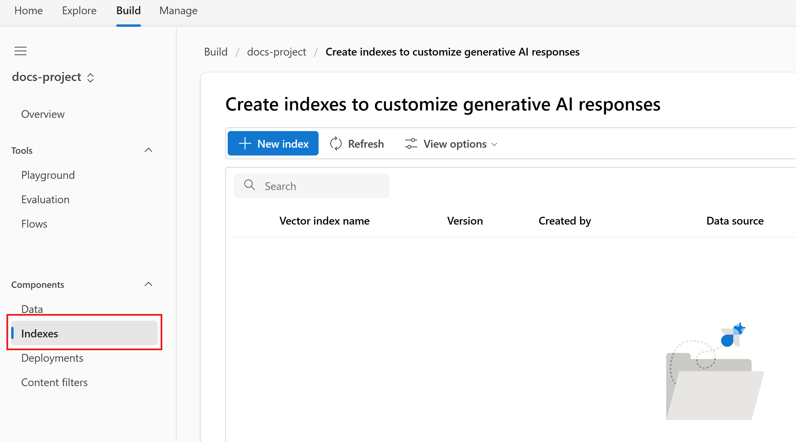
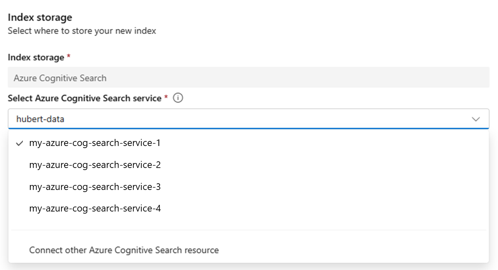
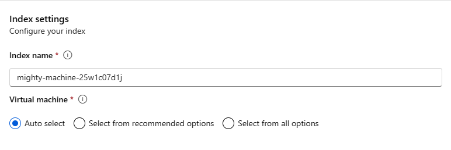
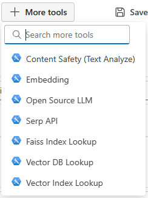

# How to create a vector index

In this article, you learn how to create and use a vector index for performing [Retrieval Augmented Generation (RAG)](../concepts/retrieval-augmented-generation.md).

## Pre-requisites

1. An Azure AI project - Go to the AI Studio homepage at [aka.ms/azureaistudio](https://aka.ms/azureaistudio) -> Select Projects and select **+ Project** and fill out all of the required fields.
1. Azure AI Search service to store your index as per instructions [here](https://review.learn.microsoft.com/azure/search/search-create-service-portal) - this step is not required if you are using a FAISS index.
1. If you wish to use Azure AI Search, ensure you have created a connection to the Azure AI Search in the Connections Page of your project.

## Create an index

### Create index using AI Studio Wizard

1. If you do not have a project already, first create a project.
1. Navigate to the project details page
1. In the project details page, select **Indexes** under Components

1. In the indexes page select **+ Add index**

1. Choose your **Source data**. You can choose source data from a list of your recent data sources, a storage URL on the cloud or even upload files and folders from the local machine
   1. You can also add a connection to another data source by clicking on + **Add connection**

1. Click **Next** after choosing source data
1. Choose the **Index Storage** - the location where you want your index to be stored
1. If you already have a connection created for an Azure AI Search service, you can choose that from the dropdown.
  
    1. If you do not have an existing connection choose **Connect other Azure AI Search service**
    1. Select the subscription and the service you wish to use.
    
1. Click **Next** after choosing index storage
1. Configure your **Search Settings**
    1. The search type will default to *Hybrid + Semantic* which is a combination of keyword search, vector search and semantic search to give the best possible search results.
    1. For, the hybrid option to work, you need an embedding model. Choose the Azure OpenAI Resource which has the embedding model
    1. Click the acknowledgement to deploy an embedding model if it does ot already exist in your resource
    
1. Use the pre-filled name or type your own name for New Vector index name
1. Click **Next** after configuring search settings
1. In the **Index settings**
    1. Enter a name for your index or use the auto-populated name
    1. Choose the compute where you want to run the jobs to create the index. You can
        1. Auto select to allow Azure AI to choose an appropriate VM size which is available
        1. Choose a VM size from a list of recommended options
        1. Choose a VM size from a list of all possible options
    
1. Click **Next** after configuring index settings
1. Review the details you have entered and click **Create**
1. You will be taken to the index details page where you can see the status of your index creation

### Use an index in prompt flow

1. Open your AI Studio project
1. In Flows, create a new Flow or open an existing flow 
1. On the top menu of the flow designer, select More tools, and then select Vector index Lookup

1. Provide a name for your step and click Add
1. The Vector index Lookup tool is added to the canvas. If you don't see the tool immediately, scroll to the bottom of the canvas
1. Enter the path to your vector index, along with the query that you want to perform against the index.

## Next steps

- [Learn about vector stores](../concepts/vector-stores.md)
