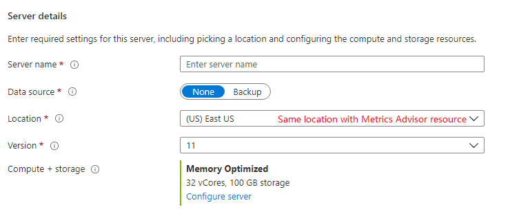

# Metrics Advisor service encryption of data at rest

[!INCLUDE [Deprecation announcement](includes/deprecation.md)]

Metrics Advisor service automatically encrypts your data when it's persisted to the cloud. The Metrics Advisor service encryption protects your data and helps you to meet your organizational security and compliance commitments.

[!INCLUDE [cognitive-services-about-encryption](../../ai-services/includes/cognitive-services-about-encryption.md)]

Metrics Advisor supports CMK and double encryption by using BYOS (bring your own storage). 

## Steps to create a Metrics Advisor with BYOS

### Step 1. Create an Azure Database for PostgreSQL and set admin

- Create an Azure Database for PostgreSQL

    Sign in to the Azure portal and create a resource of the Azure Database for PostgreSQL. Couple of things to notice:

    1. Please select the **'Single Server'** deployment option. 
    2. When choosing 'Datasource', please specify as **'None'**.
    3. For the 'Location', please make sure to create within the **same location** as Metrics Advisor resource.
    4. 'Version' should be set to **11**. 
    5. 'Compute + storage' should choose a 'Memory Optimized' SKU with at least **32 vCores**.
    
    

- Set Active Directory Admin for newly created PG

    After successfully creating your Azure Database for PostgreSQL. Go to the resource page of the newly created Azure PG resource. Select 'Active Directory admin' tab and set yourself as the Admin.


### Step 2. Create a Metrics Advisor resource and enable Managed Identity

- Create a Metrics Advisor resource in the Azure portal

    Go to Azure portal again and search 'Metrics Advisor'. When creating Metrics Advisor, do remember the following:

    1. Choose the **same 'region'** as your created Azure Database for PostgreSQL. 
    2. Mark 'Bring your own storage' as **'Yes'** and select the Azure Database for PostgreSQL you just created in the dropdown list.

- Enable the Managed Identity for Metrics Advisor

    After creating the Metrics Advisor resource, select 'Identity' and set 'Status' to **'On'** to enable Managed Identity.

- Get Application ID of Managed Identity

    Go to Microsoft Entra ID, and select 'Enterprise applications'. Change 'Application type' to **'Managed Identity'**, copy resource name of Metrics Advisor, and search. Then you're able to view the 'Application ID' from the query result, copy it.

### Step 3. Grant Metrics Advisor access permission to your Azure Database for PostgreSQL

- Grant **'Owner'** role for the Managed Identity on your Azure Database for PostgreSQL

- Set firewall rules

    1. Set 'Allow access to Azure services' as 'Yes'. 
    2. Add your clientIP address to sign in to Azure Database for PostgreSQL.

- Get the access-token for your account with resource type 'https://server-name.database.windows.net'. The access token is the password you need to sign in to the Azure Database for PostgreSQL by your account. An example using `az` client:

   ```
   az login
   az account get-access-token --resource https://server-name.database.windows.net
   ```

- After getting the token, use it to sign in to your Azure Database for PostgreSQL. Replace the 'servername' as the one that you can find in the 'overview' of your Azure Database for PostgreSQL.

   ```
   export PGPASSWORD=<access-token>
   psql -h <servername> -U <adminaccount@servername> -d postgres
   ```

- After sign in, execute the following commands to grant Metrics Advisor access permission to Azure Database for PostgreSQL. Replace the 'appid' with the one that you get in Step 2.

   ```
   SET aad_validate_oids_in_tenant = off;
   CREATE ROLE metricsadvisor WITH LOGIN PASSWORD '<appid>' IN ROLE azure_ad_user;
   ALTER ROLE metricsadvisor CREATEDB;
   GRANT azure_pg_admin TO metricsadvisor;
   ```

By completing all the above steps, you've successfully created a Metrics Advisor resource with CMK supported. Wait for a couple of minutes until your Metrics Advisor is accessible.

## Next steps

* [Learn more about Azure Key Vault](../../key-vault/general/overview.md)
