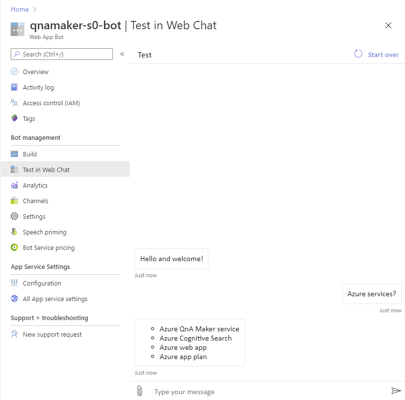
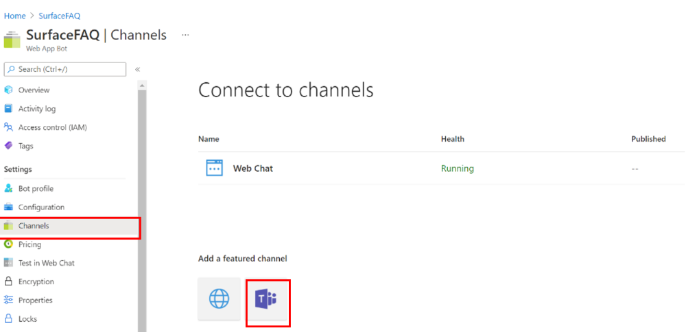

# Tutorial: Create a FAQ bot with Azure AI Bot Service
Create an FAQ Bot with QnA Maker and Azure [Bot Service](https://azure.microsoft.com/services/bot-service/) with no code.

In this tutorial, you learn how to:

<!-- green checkmark -->
> [!div class="checklist"]
> * Link a QnA Maker knowledge base to an Azure AI Bot Service
> * Deploy the Bot
> * Chat with the Bot in web chat
> * Light up the Bot in the supported channels

[!INCLUDE [Custom question answering](../includes/new-version.md)]

## Create and publish a knowledge base

Follow the [quickstart](../Quickstarts/create-publish-knowledge-base.md) to create a knowledge base. Once the knowledge base has been successfully published, you will reach the below page.

> [!div class="mx-imgBorder"]
> 

## Create a bot

After publishing, you can create a bot from the **Publish** page:

* You can create several bots quickly, all pointing to the same knowledge base for different regions or pricing plans for the individual bots.
* If you want only one bot for the knowledge base, use the **View all your bots on the Azure portal** link to view a list of your current bots.

When you make changes to the knowledge base and republish, you don't need to take further action with the bot. It's already configured to work with the knowledge base, and works with all future changes to the knowledge base. Every time you publish a knowledge base, all the bots connected to it are automatically updated.

1. In the QnA Maker portal, on the **Publish** page, select **Create bot**. This button appears only after you've published the knowledge base.

    > [!div class="mx-imgBorder"]
    > 

1. A new browser tab opens for the Azure portal, with the Azure AI Bot Service's creation page. Configure the Azure AI Bot Service. The bot and QnA Maker can share the web app service plan, but can't share the web app. This means the **app name** for the bot must be different from the app name for the QnA Maker service.

    * **Do**
        * Change bot handle - if it is not unique.
        * Select SDK Language. Once the bot is created, you can download the code to your local development environment and continue the development process.
    * **Don't**
        * Change the following settings in the Azure portal when creating the bot. They are pre-populated for your existing knowledge base:
           * QnA Auth Key
           * App service plan and location

1. After the bot is created, open the **Bot service** resource.
1. Under **Bot Management**, select **Test in Web Chat**.
1. At the chat prompt of **Type your message**, enter:

    `Azure services?`

    The chat bot responds with an answer from your knowledge base.

    > [!div class="mx-imgBorder"]
    > 

1. Light up the Bot in additional [supported channels](/azure/bot-service/bot-service-manage-channels).
    
## Integrate the bot with channels

Click on **Channels** in the Bot service resource that you have created. You can light up the Bot in additional [supported channels](/azure/bot-service/bot-service-manage-channels).

   >[!div class="mx-imgBorder"]
   >
