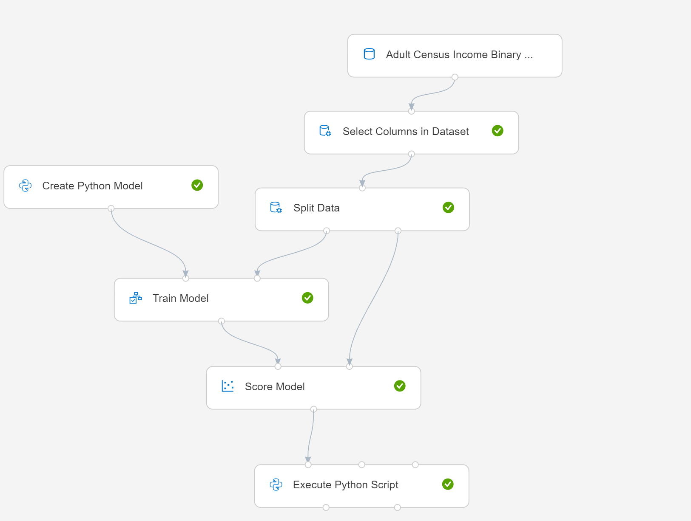

# Create Python Model module

This article describes a module in Azure Machine Learning designer (preview).

Learn how to use the Create Python Model module to create an untrained model from a Python script. You can base the model on any learner that's included in a Python package in the Azure Machine Learning designer environment. 

After you create the model, you can use [Train Model](train-model.md) to train the model on a dataset, like any other learner in Azure Machine Learning. The trained model can be passed to [Score Model](score-model.md) to make predictions. You can then save the trained model and publish the scoring workflow as a web service.

> [!WARNING]
> Currently, it's not possible to pass the scored results of a Python model to [Evaluate Model](evaluate-model.md). If you need to evaluate a model, you can write a custom Python script and run it by using the [Execute Python Script](execute-python-script.md) module.  


## Configure the module

Use of this module requires intermediate or expert knowledge of Python. The module supports use of any learner that's included in the Python packages already installed in Azure Machine Learning. See the preinstalled Python package list in [Execute Python Script](execute-python-script.md).

> [!NOTE]
> Please be very careful when writing your script and makes sure there is no syntax error, such as using a un-declared object or a un-imported module. Also pay extra attentions to the pre-installed modules list in [Execute Python Script](execute-python-script.md). To import modules which are not listed, please install the corresponding packages in your script such as
> ```Python
> import os
> os.system(f"pip install scikit-misc")
> ```
  
This article shows how to use **Create Python Model** with a simple pipeline. Here's a diagram of the pipeline:



1. Select **Create Python Model**, and edit the script to implement your modeling or data management process. You can base the model on any learner that's included in a Python package in the Azure Machine Learning environment.

> [!NOTE]
> Please pay extra attention to the comments in sample code of the script and make sure your script strictly follows the requirement, including the class name, methods as well as method signature. Violation will lead to exceptions. 

   The following sample code of the two-class Naive Bayes classifier uses the popular *sklearn* package:

   ```Python

   # The script MUST define a class named AzureMLModel.
   # This class MUST at least define the following three methods:
       # __init__: in which self.model must be assigned,
       # train: which trains self.model, the two input arguments must be pandas DataFrame,
       # predict: which generates prediction result, the input argument and the prediction result MUST be pandas DataFrame.
   # The signatures (method names and argument names) of all these methods MUST be exactly the same as the following example.


   import pandas as pd
   from sklearn.naive_bayes import GaussianNB


   class AzureMLModel:
       def __init__(self):
           self.model = GaussianNB()
           self.feature_column_names = list()

       def train(self, df_train, df_label):
           self.feature_column_names = df_train.columns.tolist()
           self.model.fit(df_train, df_label)

       def predict(self, df):
           return pd.DataFrame(
               {'Scored Labels': self.model.predict(df[self.feature_column_names]), 
                'probabilities': self.model.predict_proba(df[self.feature_column_names])[:, 1]}
           )


   ```

1. Connect the **Create Python Model** module that you just created to **Train Model** and **Score Model**.

1. If you need to evaluate the model, add an [Execute Python Script](execute-python-script.md) module and edit the Python script.

   The following script is sample evaluation code:

   ```Python


   # The script MUST contain a function named azureml_main
   # which is the entry point for this module.

   # imports up here can be used to 
   import pandas as pd

   # The entry point function can contain up to two input arguments:
   #   Param<dataframe1>: a pandas.DataFrame
   #   Param<dataframe2>: a pandas.DataFrame
   def azureml_main(dataframe1 = None, dataframe2 = None):
    
       from sklearn.metrics import accuracy_score, precision_score, recall_score, roc_auc_score, roc_curve
       import pandas as pd
       import numpy as np
    
       scores = dataframe1.ix[:, ("income", "Scored Labels", "probabilities")]
       ytrue = np.array([0 if val == '<=50K' else 1 for val in scores["income"]])
       ypred = np.array([0 if val == '<=50K' else 1 for val in scores["Scored Labels"]])    
       probabilities = scores["probabilities"]
    
       accuracy, precision, recall, auc = \
       accuracy_score(ytrue, ypred),\
       precision_score(ytrue, ypred),\
       recall_score(ytrue, ypred),\
       roc_auc_score(ytrue, probabilities)
    
       metrics = pd.DataFrame();
       metrics["Metric"] = ["Accuracy", "Precision", "Recall", "AUC"];
       metrics["Value"] = [accuracy, precision, recall, auc]
    
       return metrics,

   ```

## Next steps

See the [set of modules available](module-reference.md) to Azure Machine Learning. 