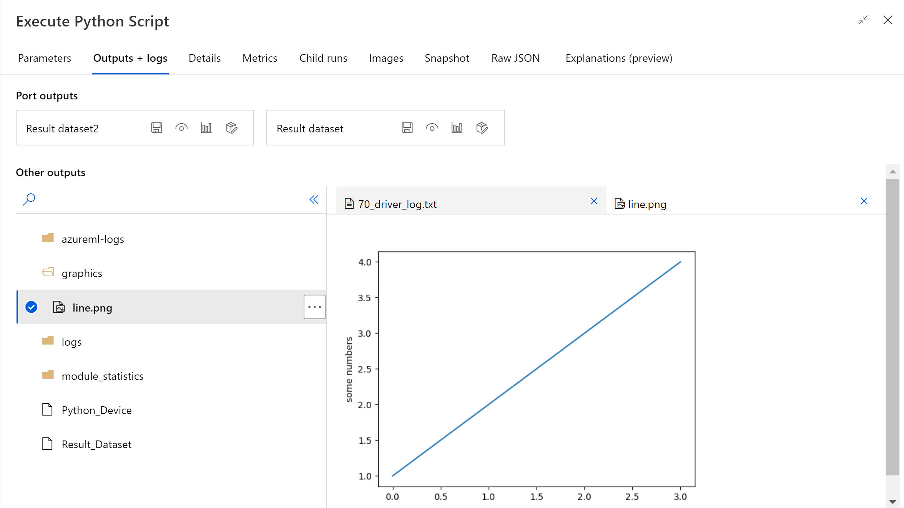
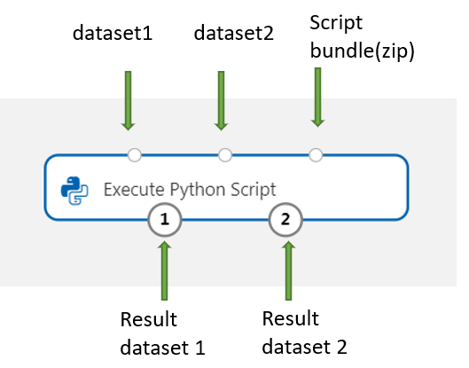

# Execute Python Script module

This article describes the Execute Python Script module in Azure Machine Learning designer.

Use this module to run Python code. For more information about the architecture and design principles of Python, see [how run Python code in Azure Machine Learning designer](../how-to-designer-python.md).

With Python, you can perform tasks that existing modules don't support, such as:

+ Visualizing data by using `matplotlib`.
+ Using Python libraries to enumerate datasets and models in your workspace.
+ Reading, loading, and manipulating data from sources that the [Import Data](./import-data.md) module doesn't support.
+ Run your own deep learning code. 

## Supported Python packages

Azure Machine Learning uses the Anaconda distribution of Python, which includes many common utilities for data processing. We will update the Anaconda version automatically. The current version is:
 -  Anaconda 4.5+ distribution for Python 3.6 

For a complete list, see the section [Preinstalled Python packages](#preinstalled-python-packages).

To install packages that aren't in the preinstalled list (for example, *scikit-misc*), add the following code to your script: 

```python
import os
os.system(f"pip install scikit-misc")
```

Use the following code to install packages for better performance, especially for inference:
```python
import importlib.util
package_name = 'scikit-misc'
spec = importlib.util.find_spec(package_name)
if spec is None:
    import os
    os.system(f"pip install scikit-misc")
```

> [!NOTE]
> If your pipeline contains multiple Execute Python Script modules that need packages that aren't in the preinstalled list, install the packages in each module.

## Upload files
The Execute Python Script module supports uploading files by using the [Azure Machine Learning Python SDK](python/api/azureml-core/azureml.core.run(class)?view=azure-ml-py&preserve-view=true#upload-file-name--path-or-stream-).

The following example shows how to upload an image file in the Execute Python Script module:

```Python

# The script MUST contain a function named azureml_main,
# which is the entry point for this module.

# Imports up here can be used to
import pandas as pd

# The entry point function must have two input arguments:
#   Param<dataframe1>: a pandas.DataFrame
#   Param<dataframe2>: a pandas.DataFrame
def azureml_main(dataframe1 = None, dataframe2 = None):

    # Execution logic goes here
    print(f'Input pandas.DataFrame #1: {dataframe1}')

    from matplotlib import pyplot as plt
    plt.plot([1, 2, 3, 4])
    plt.ylabel('some numbers')
    img_file = "line.png"
    plt.savefig(img_file)

    from azureml.core import Run
    run = Run.get_context(allow_offline=True)
    run.upload_file(f"graphics/{img_file}", img_file)

    # Return value must be of a sequence of pandas.DataFrame
    # For example:
    #   -  Single return value: return dataframe1,
    #   -  Two return values: return dataframe1, dataframe2
    return dataframe1,
}
```

After the pipeline run is finished, you can preview the image in the right panel of the module.

> [!div class="mx-imgBorder"]
> 

## How to configure Execute Python Script

The Execute Python Script module contains sample Python code that you can use as a starting point. To configure the Execute Python Script module, provide a set of inputs and Python code to run in the **Python script** text box.

1. Add the **Execute Python Script** module to your pipeline.

2. Add and connect on **Dataset1** any datasets from the designer that you want to use for input. Reference this dataset in your Python script as **DataFrame1**.

    Use of a dataset is optional. Use it if you want to generate data by using Python, or use Python code to import the data directly into the module.

    This module supports the addition of a second dataset on **Dataset2**. Reference the second dataset in your Python script as **DataFrame2**.

    Datasets stored in Azure Machine Learning are automatically converted to pandas data frames when loaded with this module.

    

4. To include new Python packages or code, add the zipped file that contains these custom resources on **Script bundle**. The input to **Script bundle** must be a zipped file uploaded to your workspace as a file type dataset. You can upload the dataset on the **Datasets** asset page. You can drag the dataset module from the **My datasets** list in the left module tree on the designer authoring page. 

    Any file contained in the uploaded zipped archive can be used during pipeline execution. If the archive includes a directory structure, the structure is preserved, but you must prepend a directory called **src** to the path.

5. In the **Python script** text box, type or paste valid Python script.

    > [!NOTE]
    >  Be careful when writing your script. Make sure there are no syntax errors, such as using undeclared variables or unimported modules or functions. Pay extra attention to the preinstalled module list. To import modules that aren't listed, install the corresponding packages in your script, such as:
    >  ``` Python
    > import os
    > os.system(f"pip install scikit-misc")
    > ```
    
    The **Python script** text box is prepopulated with some instructions in comments, and sample code for data access and output. You must edit or replace this code. Follow Python conventions for indentation and casing:

    + The script must contain a function named `azureml_main` as the entry point for this module.
    + The entry point function must have two input arguments, `Param<dataframe1>` and `Param<dataframe2>`, even when these arguments aren't used in your script.
    + Zipped files connected to the third input port are unzipped and stored in the directory `.\Script Bundle`, which is also added to the Python `sys.path`. 

    If your .zip file contains `mymodule.py`, import it by using `import mymodule`.

    Two datasets can be returned to the designer, which must be a sequence of type `pandas.DataFrame`. You can create other outputs in your Python code and write them directly to Azure storage.

6. Submit the pipeline, or select the module and select **Run selected** to run just the Python script.

    All of the data and code is loaded into a virtual machine, and run using the specified Python environment.

## Results

The results of any computations by the embedded Python code must be provided as `pandas.DataFrame`, which is automatically converted to the Azure Machine Learning dataset format. You can then use the results with other modules in the pipeline.

The module returns two datasets:  
  
+ **Results Dataset 1**, defined by the first returned pandas data frame in a Python script.

+ **Result Dataset 2**, defined by the second returned pandas data frame in a Python script.

## Preinstalled Python packages
The preinstalled packages are:
-    adal==1.2.2
-    applicationinsights==0.11.9
-    attrs==19.3.0
-    azure-common==1.1.25
-    azure-core==1.3.0
-    azure-graphrbac==0.61.1
-    azure-identity==1.3.0
-    azure-mgmt-authorization==0.60.0
-    azure-mgmt-containerregistry==2.8.0
-    azure-mgmt-keyvault==2.2.0
-    azure-mgmt-resource==8.0.1
-    azure-mgmt-storage==8.0.0
-    azure-storage-blob==1.5.0
-    azure-storage-common==1.4.2
-    azureml-core==1.1.5.5
-    azureml-dataprep-native==14.1.0
-    azureml-dataprep==1.3.5
-    azureml-defaults==1.1.5.1
-    azureml-designer-classic-modules==0.0.118
-    azureml-designer-core==0.0.31
-    azureml-designer-internal==0.0.18
-    azureml-model-management-sdk==1.0.1b6.post1
-    azureml-pipeline-core==1.1.5
-    azureml-telemetry==1.1.5.3
-    backports.tempfile==1.0
-    backports.weakref==1.0.post1
-    boto3==1.12.29
-    botocore==1.15.29
-    cachetools==4.0.0
-    certifi==2019.11.28
-    cffi==1.12.3
-    chardet==3.0.4
-    click==7.1.1
-    cloudpickle==1.3.0
-    configparser==3.7.4
-    contextlib2==0.6.0.post1
-    cryptography==2.8
-    cycler==0.10.0
-    dill==0.3.1.1
-    distro==1.4.0
-    docker==4.2.0
-    docutils==0.15.2
-    dotnetcore2==2.1.13
-    flask==1.0.3
-    fusepy==3.0.1
-    gensim==3.8.1
-    google-api-core==1.16.0
-    google-auth==1.12.0
-    google-cloud-core==1.3.0
-    google-cloud-storage==1.26.0
-    google-resumable-media==0.5.0
-    googleapis-common-protos==1.51.0
-    gunicorn==19.9.0
-    idna==2.9
-    imbalanced-learn==0.4.3
-    isodate==0.6.0
-    itsdangerous==1.1.0
-    jeepney==0.4.3
-    jinja2==2.11.1
-    jmespath==0.9.5
-    joblib==0.14.0
-    json-logging-py==0.2
-    jsonpickle==1.3
-    jsonschema==3.0.1
-    kiwisolver==1.1.0
-    liac-arff==2.4.0
-    lightgbm==2.2.3
-    markupsafe==1.1.1
-    matplotlib==3.1.3
-    more-itertools==6.0.0
-    msal-extensions==0.1.3
-    msal==1.1.0
-    msrest==0.6.11
-    msrestazure==0.6.3
-    ndg-httpsclient==0.5.1
-    nimbusml==1.6.1
-    numpy==1.18.2
-    oauthlib==3.1.0
-    pandas==0.25.3
-    pathspec==0.7.0
-    pip==20.0.2
-    portalocker==1.6.0
-    protobuf==3.11.3
-    pyarrow==0.16.0
-    pyasn1-modules==0.2.8
-    pyasn1==0.4.8
-    pycparser==2.20
-    pycryptodomex==3.7.3
-    pyjwt==1.7.1
-    pyopenssl==19.1.0
-    pyparsing==2.4.6
-    pyrsistent==0.16.0
-    python-dateutil==2.8.1
-    pytz==2019.3
-    requests-oauthlib==1.3.0
-    requests==2.23.0
-    rsa==4.0
-    ruamel.yaml==0.15.89
-    s3transfer==0.3.3
-    scikit-learn==0.22.2
-    scipy==1.4.1
-    secretstorage==3.1.2
-    setuptools==46.1.1.post20200323
-    six==1.14.0
-    smart-open==1.10.0
-    urllib3==1.25.8
-    websocket-client==0.57.0
-    werkzeug==0.16.1
-    wheel==0.34.2

## Next steps

See the [set of modules available](module-reference.md) to Azure Machine Learning. 
