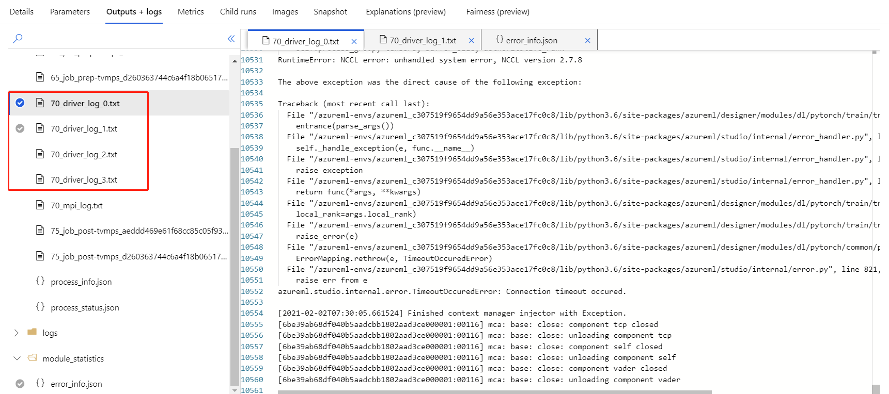
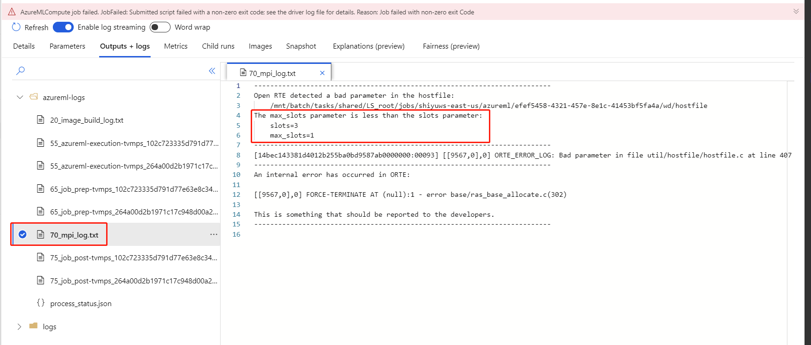

# Train Wide & Deep Recommender
This article describes how to use the **Train Wide & Deep Recommender** module in Azure Machine Learning designer, to train a recommendation model. This module is based on Wide & Deep learning, which is proposed by Google.

The **Train Wide & Deep Recommender** module reads a dataset of user-item-rating triples and, optionally, some user and item features. It returns a trained Wide & Deep recommender.  You can then use the trained model to generate rating predictions or recommendations by using the [Score Wide and Deep Recommender](score-wide-and-deep-recommender.md) module.  

<!-- Currently, **Train Wide & Deep Recommender** module supports both single node and distributed training. -->

## More about recommendation models and the Wide & Deep recommender  

The main aim of a recommendation system is to recommend one or more *items* to *users* of the system. Examples of an item could be a movie, restaurant, book, or song. A user could be a person, group of persons, or other entity with item preferences.  

There are two principal approaches to recommender systems. 

+ The first is the **content-based** approach, which makes use of features for both users and items. Users may be described by properties such as age and gender, and items may be described by properties such as author and manufacturer. Typical examples of content-based recommendation systems can be found on social matchmaking sites. 
+ The second approach is **collaborative filtering**, which uses only identifiers of the users and the items and obtains implicit information about these entities from a (sparse) matrix of ratings given by the users to the items. We can learn about a user from the items they have rated and from other users who have rated the same items.  

The Wide & Deep recommender combines these approaches, using collaborative filtering with a content-based approach. It is therefore considered a **hybrid recommender**. 

How this works: When a user is relatively new to the system, predictions are improved by making use of the feature information about the user, thus addressing the well-known "cold-start" problem. However, once you have collected a sufficient number of ratings from a particular user, it is possible to make fully personalized predictions for them based on their specific ratings rather than on their features alone. Hence, there is a smooth transition from content-based recommendations to recommendations based on collaborative filtering. Even if user or item features are not available, Wide & Deep recommender will still work in its collaborative filtering mode.  

More details on the Wide & Deep recommender and the underlying probabilistic algorithm can be found in the relevant research paper: [Wide & Deep Learning for Recommender Systems](https://arxiv.org/pdf/1606.07792.pdf).  

## How to configure Train Wide & Deep Recommender  

+ [Prepare the training data](#prepare-data)
+ [Train the model](#train-the-model)

### Prepare data

Before trying to use the module, make sure your data is in the expected format for the recommendation model. A training data set of **user-item-rating triples** is required, but you can also include user features and item features (if available), in separate datasets.

#### Required dataset of user-item-ratings

The input data used for training must contain the right type of data in the correct format: 

+ The first column must contain user identifiers.
+ The second column must contain item identifiers.
+ The third column contains the rating for the user-item pair. Rating values must be numeric type. 

For example, a typical set of user-item-ratings might look like this:

|UserId|MovieId|Rating|
|------------|-------------|------------|
|1|68646|10|
|223|31381|10|

#### User features dataset (optional)

The dataset of **user features** must contain identifiers for users, and use the same identifiers that were provided in the first column of the users-items-ratings dataset. The remaining columns can contain any number of features that describe the users.  

For an example, a typical set of user features might look like this: 

|UserId|Age|Gender|Interest|Location|
|------------|--------------|-----------------------|---------------|------------|
|1|25|male| Drama    |Europe|
|223|40|female|Romance|Asia|

#### Item features dataset (optional)

The dataset of item features must contain item identifiers in its first column. The remaining columns can contain any number of descriptive features for the items.  

For an example, a typical set of item features might look like this:  

|MovieId|Title|Original Language|Genres|Year|
|-------------|-------------|-------------------|-----------|---------------|
|68646|The Godfather|English|Drama|1972|
|31381|Gone with the Wind|English|History|1939|

### Train the model

1.  Add the **Train Wide and Deep Recommender** module to your experiment in the designer, and connect it to the training dataset.  
  
2. If you have a separate dataset of either user features and/or item features, connect them to the **Train Wide and Deep Recommender** module.  
  
    - **User features dataset**: Connect the dataset that describes users to the second input.
    - **Item features dataset**: Connect the dataset that describes items to the third input.  
    
3.  **Epochs**: indicate how many times the algorithm should process the whole training data. 

    The higher this number, the more adequate the training; however, training costs more time and may cause overfitting.

4. **Batch size**: type the number of training examples utilized in one training step. 

     This hyperparameter can influence the training speed. A higher batch size leads to a less time cost epoch, but may increase the convergence time. And if batch is too large to fit GPU/CPU, a memory error may raised.

5.  **Wide part optimizer**: select one optimizer to apply gradients to the wide part of the model.

6.  **Wide optimizer learning rate**: enter a number between 0.0 and 2.0 that defines the learning rate of wide part optimizer.

    This hyperparameter determines the step size at each training step while moving toward a minimum of loss function. A large learning rate may cause learning jump over the minima, while a too small learning rate may cause convergence problem.

7.  **Crossed feature dimension**: type the dimension by entering the desired user IDs and item ID features. 

    The Wide & Deep recommender performs cross-product transformation over user ID and item ID features by default. The crossed result will be hashed according to this number to ensure the dimension.

8.  **Deep part optimizer**: select one optimizer to apply gradients to the deep part of the model.

9.  **Deep optimizer learning rate**: enter a number between 0.0 and 2.0 that defines the learning rate of deep part optimizer.

10.  **User embedding dimension**: type an integer to specify the dimension of user ID embedding.

     The Wide & Deep recommender creates the shared user ID embeddings and item ID embeddings for both wide part and deep part.

11.  **Item embedding dimension**: type an integer to specify the dimension of item ID embedding.

12.  **Categorical features embedding dimension**: enter an integer to specify the dimensions of categorical feature embeddings.

     In deep component of Wide & Deep recommender, an embedding vector is learnt for each categorical feature. And these embedding vectors share the same dimension.

13.  **Hidden units**: type the number of hidden nodes of deep component. The nodes number in each layer is separated by commas. For example, by type "1000,500,100", you specify the deep component has three layers, with the first layer to the last respectively has 1000 nodes, 500 nodes, and 100 nodes.

14.  **Activation function**: select one activation function applied to each layer, the default is ReLU.

15.  **Dropout**: enter a number between 0.0 and 1.0 to determine the probability the outputs will be dropped in each layer during training.

     Dropout is a regularization method to prevent neural networks from overfitting. One common decision for this value is to start with 0.5, which seems to be close to optimal for a wide range of networks and tasks.

16.  **Batch Normalization**: select this option to use batch normalization after each hidden layer in the deep component.

     Batch normalization is a technique to fight internal covariate shift problem during networks training. In general, it can help to improve the speed, performance and stability of the networks. 

17.  Run the pipeline.

<!-- ## Distributed training

In distributed training the workload to train a model is split up and shared among multiple mini processors, called worker nodes. These worker nodes work in parallel to speed up model training. Currently the designer support distributed training for **Train Wide & Deep Recommender** module.

### How to enable distributed training

To enable distributed training for **Train Wide & Deep Recommender** module, you can set in **Run settings** in the right pane of the module. Only **[AML Compute cluster](https://docs.microsoft.com/azure/machine-learning/how-to-create-attach-compute-cluster?tabs=python)** is supported for distributed training.

1. Select the module and open the right panel. Expand the **Run settings** section.

    

1. Make sure you have select AML compute for the compute target.

1. In **Resource layout** section, you need to set the following values:

    - **Node count**: Number of nodes in the compute target used for training. It should be **less than or equal to** the **Maximum number of nodes** your compute cluster. By default it is 1, which means single node job.

    - **Process count per node**: Number of processes triggered per node. It should be **less than or equal to** the **Processing Unit** of your compute. By default it is 1, which means single node job.

    You can check the **Maximum number of nodes** and **Processing Unit** of your compute by clicking the compute name into the compute detail page.

    

You can learn more about distributed training in Azure Machine Learning [here](https://docs.microsoft.com/azure/machine-learning/concept-distributed-training).

### Troubleshooting for distributed training

If you enable distributed training for this module, there will be driver logs for each process. `70_driver_log_0` is for master process. You can check driver logs for error details of each process under **Outputs+logs** tab in the right pane.

 

If the module enabled distributed training fails without any `70_driver` logs, you can check `70_mpi_log` for error details.

The following example shows a common error that is **Process count per node** is larger than **Processing Unit** of the compute.

## Results

After pipeline run is completed, to use the model for scoring, connect the [Train Wide and Deep Recommender](train-wide-and-deep-recommender.md) to [Score Wide and Deep Recommender](score-wide-and-deep-recommender.md), to predict values for new input examples.
 -->

##  Technical notes

The Wide & Deep jointly trains wide linear models and deep neural networks to combine the strengths of memorization and generalization. The wide component accepts a set of raw features and feature transformations to memorize feature interactions. And with less feature engineering, the deep component generalizes to unseen feature combinations through low-dimensional dense feature embeddings. 

In the implementation of Wide & Deep recommender, the module uses a default model structure. The wide component takes user embeddings, item embeddings, and the cross-product transformation of user IDs and item IDs as input. For the deep part of the model, an embedding vector is learnt for each categorical feature. Together with other numeric feature vectors, these vectors are then fed into the deep feed-forward neural network. The wide part and deep part are combined by summing up their final output log odds as the prediction, which finally goes to one common loss function for joint training.

## Next steps

See the [set of modules available](module-reference.md) of Azure Machine Learning. 
