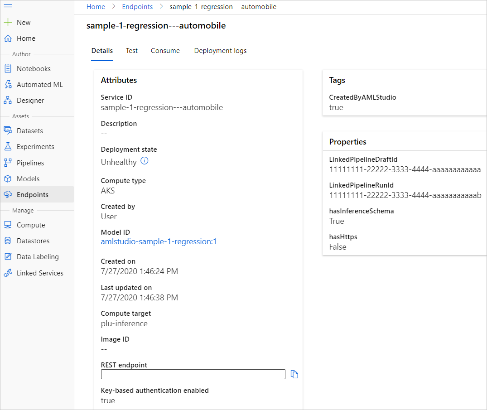

# Migrate to Azure Machine Learning from Studio (classic)

In this article, you learn about:
- The Studio (classic) retirement road map
- How to migrate Studio (classic) assets to Azure Machine Learning

## Retirement road map

Azure Machine Learning Studio (classic) will retire on Aug 30, 2024. We encourage users to migrate to Azure Machine Learning for a modernized data science platform.

To understand the benefits, see [ML Studio (classic) vs Azure Machine Learning](../overview-what-is-machine-learning-studio.md#ml-studio-classic-vs-azure-machine-learning).

 - **Current customers** can create new experiments and run existing Studio (classic) assets like experiments and web services until the retirement date.

- **New resources** like Studio (classic) workspaces and web service plans cannot be created after Nov 31, 2021. If you plan to use a workspace or web service plan during the 3-year deprecation period, you must create it before Nov 31, 2021.

- **Free-tier workspaces** are unaffected by retirement and can continue to be created and used without SLA commitments.

## Migration overview

At this time, to migrate resources from Studio (classic) to Azure Machine Learning, you must manually rebuild your experiments.

To rebuild your Studio (classic) experiments and web services you must:

1. [Create an Azure Machine Learning workspace](../how-to-manage-workspace.md#create-a-workspace).

1. [Rebuild the training experiment using drag-and-drop modules](migrate-rebuild-experiment.md).
    - Recreate the dataset in Azure Machine Learning.
    - Use the [module-mapping table](migrate-reference.md#studio-classic-and-designer-module-mapping) to select replacement modules.
        
1. [Rebuild the web service](migrate-rebuild-web-service.md).

1. [Integrate the web service with client apps](migrate-rebuild-integrate-with-client-app.md).
    - Configure applications to use the new Azure Machine Learning endpoint.

## Example migration

See a simple experiment migration to compare some of the differences between Studio (classic) and Azure Machine Learning. We use the Automobile price prediction sample included in both services.

### Datasets

In Studio (classic), **datasets** were saved in your workspace and could only be used by Studio (classic).

In Azure Machine Learning, **datasets** are registered to the workspace and can be used across all of Azure Machine Learning. For more information on the benefits of Azure Machine Learning datasets, see [Secure data access](../concept-data.md#reference-data-in-storage-with-datasets).

### Pipeline

In Studio (classic), **experiments** contained the processing logic for your work. You created experiments with drag-and-drop modules.

In Azure Machine Learning, **pipelines** contain the processing logic for your work. You can create pipelines with either drag-and-drop modules or by writing code.

### Web service endpoint

In Studio (classic), the **REQUEST/RESPOND API** was used for real-time prediction. The **BATCH EXECUTION API** was used for batch prediction or retraining.

In Azure Machine Learning, **real-time endpoints** are used for real-time prediction. **Pipeline endpoints** are used for  batch prediction or retraining.

## Next steps

See detailed steps on how to complete each step of the migration:

1. [Create an Azure Machine Learning workspace](../how-to-manage-workspace.md#create-a-workspace).
1. [Rebuild the training pipeline](migrate-rebuild-experiment.md).
1. [Rebuild the web service](migrate-rebuild-web-service.md).
1. [Integrate web service with client app](migrate-rebuild-integrate-with-client-app.md).

