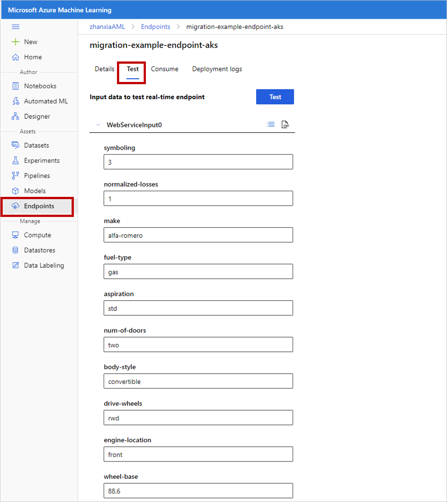
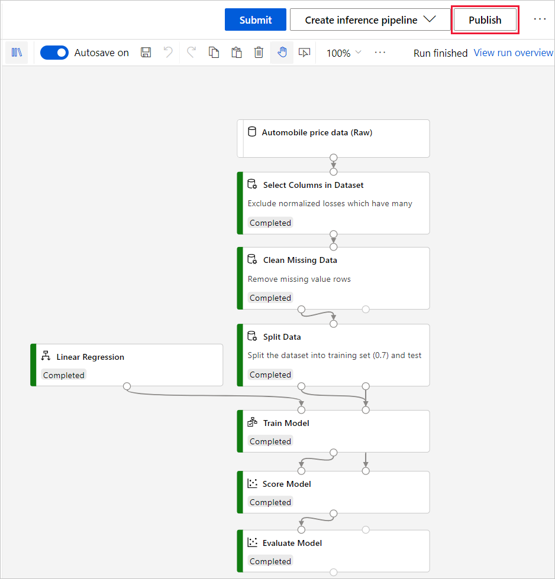

# Rebuild a Studio (classic) web service in Azure Machine Learning

In this article, you learn how to rebuild a Studio (classic) web service as a **pipeline endpoint** in Azure Machine Learning.

Use Azure Machine Learning pipeline endpoints to make predictions, retrain models, or run any generic pipeline. The REST endpoint lets you run pipelines from any platform. 

This article is part of the Studio (classic) to Azure Machine Learning migration series. For more information on migrating to Azure Machine Learning, see the [migration overview article](migrate-overview.md).

## Prerequisites

- An Azure account with an active subscription. [Create an account for free](https://azure.microsoft.com/free/?WT.mc_id=A261C142F).
- An Azure Machine Learning workspace. [Create an Azure Machine Learning workspace](../how-to-manage-workspace.md#create-a-workspace).
- An Azure Machine Learning training pipeline. For more information, see [Rebuild a Studio (classic) experiment in Azure Machine Learning](migrate-rebuild-experiment.md).

## Real-time endpoint vs pipeline endpoint

Studio (classic) web services have been replaced by **endpoints** in Azure Machine Learning. The following table shows the mapping between web service types and their endpoint replacements. Use this table to decide what kind of Azure Machine Learning endpoint you should use.

|Studio (classic) web service| Azure Machine Learning replacement
|---|---|
|Request/respond web service (real-time prediction)|Real-time endpoint|
|Batch web service (batch prediction)|Pipeline endpoint|
|Retraining web service (retraining)|Pipeline endpoint| 

## Deploy a real-time endpoint

After you create a training pipeline, you're ready to deploy it as a real-time endpoint.

In Studio (classic), you use a **REQUEST/RESPOND web service** to deploy a model for real-time predictions. In Azure Machine Learning, you use a **real-time endpoint**.

There are multiple ways to deploy a model in Azure Machine Learning. One of the simplest ways is to use the designer to automate the deployment process. Use the following steps to deploy a model as a real-time endpoint:

1. Run your completed training pipeline at least once.
1. After the run completes, at the top of the canvas, select **Create inference pipeline** > **Real-time inference pipeline**.

    
        
    The designer converts the training pipeline into a real-time inference pipeline. This conversion is the same as the conversion that occurs in Studio (classic) when you create a web service. 

    In the designer, this step also registers the trained model to your Azure Machine Learning workspace.

1. Select **Submit** to run the real-time inference pipeline, and verify that it runs successfully.

1. After you verify the inference pipeline, select **Deploy**.

1. Enter a name for your endpoint and a compute type.

    The following table describes your deployment compute options in the designer:

    | Compute target | Used for | Description | Creation |
    | ----- |  ----- | ----- | -----  |
    |[Azure Kubernetes Service (AKS)](../how-to-deploy-azure-kubernetes-service.md) |Real-time inference|Large-scale, production deployments. Fast response time and service autoscaling.| User-created. For more information, see [Create compute targets](../how-to-create-attach-compute-studio.md#inference-clusters). |
    |[Azure Container Instances ](../how-to-deploy-azure-container-instance.md)|Testing or development | Small-scale, CPU-based workloads that require less than 48 GB of RAM.| Automatically created by Azure Machine Learning.

### Test the real-time endpoint

After deployment completes, you can see more details and test your endpoint:

1. Go the **Endpoints** tab.
1. Select you endpoint.
1. Select the **Test** tab.
    
    

## Publish a pipeline endpoint for batch prediction or retraining

You can also use your training pipeline to create a **pipeline endpoint** instead of a real-time endpoint.

Pipeline endpoints replace Studio (classic) **batch execution endpoints**  and **retraining web services**.

In Azure Machine Learning, you use **pipeline endpoints** to perform either batch prediction or retraining, depending on how you configure your endpoint. You can call pipeline endpoints from any HTTP library.

### Publish a pipeline endpoint for batch prediction

Publishing a pipeline endpoint for batch prediction is similar to the real-time endpoint process. Similar to the real-time endpoint, you must already have a training pipeline draft. For more information on building a training pipeline, see [Rebuild a Studio (classic) experiment](migrate-rebuild-experiment.md).

Use the following steps to publish a pipeline endpoint for batch prediction:

1. Run your completed training pipeline at least once.

1. After the run completes, at the top of the canvas, select **Create inference pipeline** > **Batch inference pipeline**.

    
        
    The designer converts the training pipeline into a batch inference pipeline. This conversion is the same as the conversion that occurs in Studio (classic) when you create a web service. 

    In the designer, this step also registers the trained model to your Azure Machine Learning workspace.

1. Select **Submit** to run the batch inference pipeline and verify that it successfully completes.

1. After you verify the inference pipeline, select **Publish**.
 
1. Create a new pipeline endpoint or select an existing one.
    
    A new pipeline endpoint creates a new REST endpoint for your pipeline. 

    If you select an existing pipeline endpoint, you don't overwrite the existing pipeline. Instead, Azure Machine Learning versions each pipeline in a pipeline endpoint. You can specify which version to run in your REST call. You must also set a default pipeline if the REST call doesn't specify a version.

 ### Publish a pipeline endpoint for retraining

To publish a pipeline endpoint for retraining, you must already have a pipeline draft that trains a model. For more information on building a training pipeline, see [Rebuild a Studio (classic) experiment](migrate-rebuild-experiment.md).

Use the following steps to publish a training pipeline draft as a retraining pipeline endpoint:

1. Run your training pipeline at least once.
1. After the run completes, select the dataset module.
1. In the module details pane, select **Set as pipeline parameter**.
1. Provide a descriptive name like "InputDataset".    

    

    This creates a pipeline parameter for your input dataset. When you call your pipeline endpoint for training, you can specify a new dataset to retrain the model.

1. Select **Publish**.

## Call your pipeline endpoint from the studio

After you create your batch inference or retraining pipeline endpoint, you can call your endpoint directly from your browser.

1. Go to the **Pipelines** tab, and select **Pipeline endpoints**.
1. Select the pipeline endpoint you want to run.
1. Select **Submit**.

    You can specify any pipeline parameters after you select **Submit**.

## Next steps

In this article, you learned how to rebuild a Studio (classic) web service in Azure Machine Learning. The next step is to [integrate your web service with client apps](migrate-rebuild-integrate-with-client-app.md).

See the other articles in the Studio (classic) migration series:

1. [Migration overview](migrate-overview.md).
1. [Migrate dataset](migrate-register-datasets.md).
1. [Rebuild a Studio (classic) training pipeline](migrate-rebuild-experiment.md).
1. **Rebuild a Studio (classic) web service**.
1. [Integrate an Azure Machine Learning web service with client apps](migrate-rebuild-integrate-with-client-app.md).
1. [Migration reference](migrate-execute-r-script.md).
