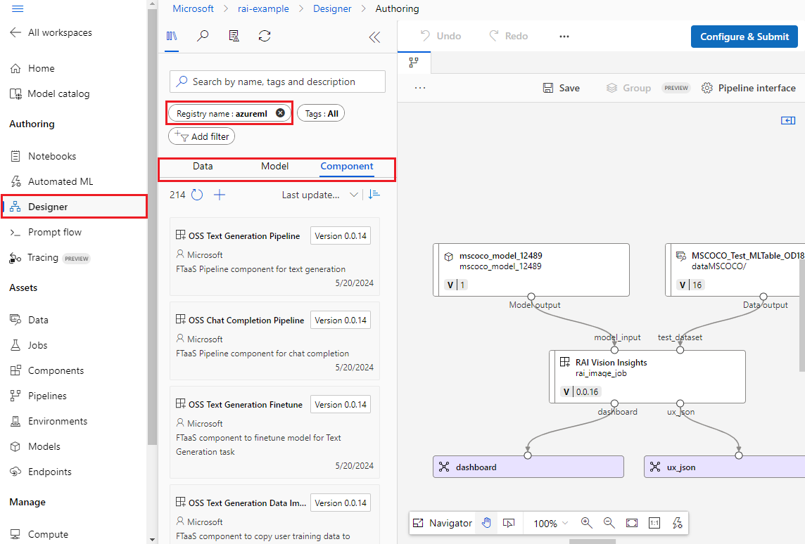
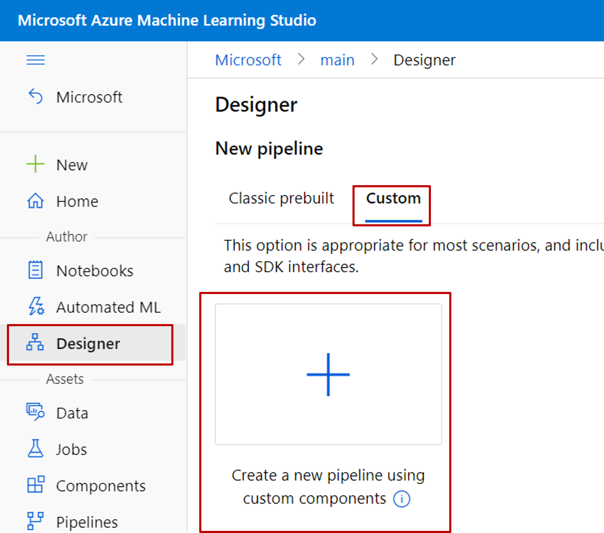
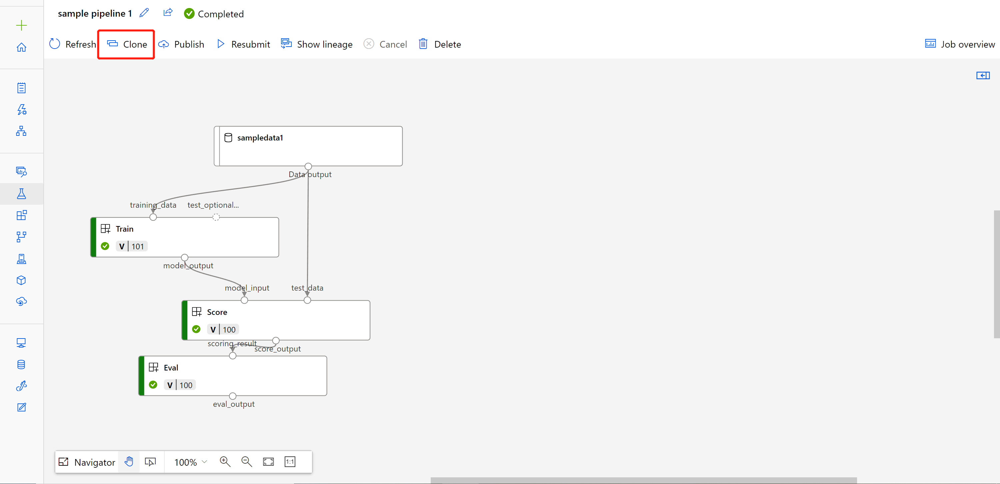
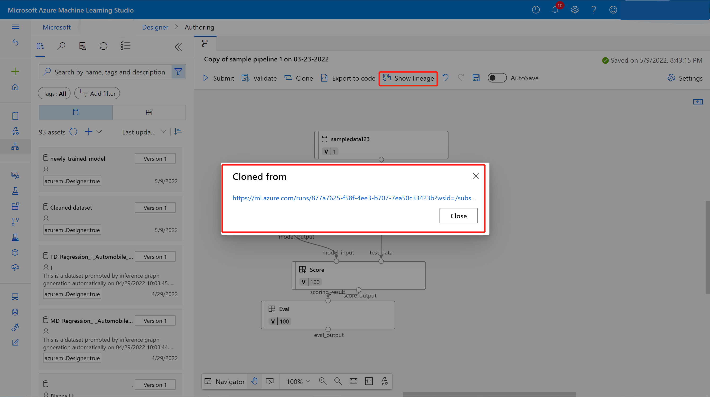

# What is Azure Machine Learning designer? 

Azure Machine Learning designer is a drag-and-drop UI interface to build pipeline in Azure Machine Learning. 

As shown in below GIF, you can build a pipeline visually by drag and drop your building blocks and connect them. 

>[!Note]
> Designer supports two types of components, classic prebuilt components（v1） and custom components(v2). These two types of components are NOT compatible. 
>
>Classic prebuilt components provide prebuilt components majorly for data processing and traditional machine learning tasks like regression and classification. This type of component continues to be supported but will not have any new components added. 
>
>Custom components allow you to wrap your own code as a component. It supports sharing components across workspaces and seamless authoring across Studio, CLI v2, and SDK v2 interfaces. 
>
>For new projects, we highly suggest you use custom component, which is compatible with AzureML V2 and will keep receiving new updates. 
>
>This article applies to custom components.

## Assets 

The building blocks of pipeline are called assets in Azure Machine Learning, which includes: 
 - [Data](./concept-data.md)
 - Model 
 - [Component](./concept-component.md) 

Designer has an asset library on the left side, where you can access all the assets you need to create your pipeline. It shows you the assets you created in your workspace, and the assets shared in [registry](./how-to-share-models-pipelines-across-workspaces-with-registries.md) that you have permission to use.

To see assets from a specific registry, click the Registry name filter above the asset library. The assets you created in your current workspace are in the registry = workspace. The assets provided by Azure Machine Learning are in the registry = azureml.

Designer only shows the assets that you created and named in your workspace. You won't see any unnamed assets in the list. To learn how to create data and component assets, read these articles:

- [How to create data asset](./how-to-create-data-assets.md)
- [How to create component](./how-to-create-component-pipelines-ui.md#register-component-in-your-workspace)

## Pipeline

Designer is a tool that lets you create pipelines with your assets in a visual way. When you use designer, you'll encounter two concepts related to pipelines: pipeline draft and pipeline jobs. 

### Pipeline draft

As you edit a pipeline in the designer, your progress is saved as a **pipeline draft**. You can edit a pipeline draft at any point by adding or removing components, configuring compute targets, creating parameters, and so on.

A valid pipeline draft has these characteristics:

* Data assets can only connect to components.
* Components can only connect to either data assets or other components.
* All required input ports for components must have some connection to the data flow.
* All required parameters for each component must be set.

When you're ready to run your pipeline draft, you submit a pipeline job.

### Pipeline job

Each time you run a pipeline, the configuration of the pipeline and its results are stored in your workspace as a **pipeline job**. You can go back to any pipeline job to inspect it for troubleshooting or auditing. **Clone** a pipeline job creates a new pipeline draft for you to continue editing.

## Approaches to build pipeline in designer

### Create new pipeline from scratch

You can create a new pipeline and build from scratch. Remember to select the **Custom component** option when you create the pipeline in designer. 

### Clone an existing pipeline job 

If you would like to work based on an existing pipeline job in the workspace, you can easily clone it into a new pipeline draft to continue editing.

After cloning, you can also know which pipeline job it's cloned from by selecting **Show lineage**.

You can edit your pipeline and then submit again. After submitting, you can see the lineage between the job you submit and the original job by selecting **Show lineage** in the job detail page.

