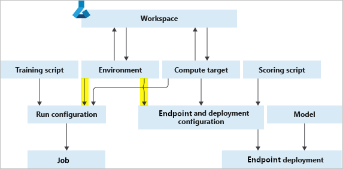

# What are Azure Machine Learning environments?
[!INCLUDE [applies-to-skus](../../includes/aml-applies-to-basic-enterprise-sku.md)]

Machine Learning environments specify the Python packages, environment variables, and software settings around your training and scoring scripts. They also specify run times (Python, Spark, or Docker). They are managed and versioned entities within your Azure Machine Learning workspace that enable reproducible, auditable, and portable machine learning workflows across a variety of compute targets.

You can use an environment object on your local compute to:
* Develop your training script.
* Reuse that same environment on Azure Machine Learning Compute for model training at scale.
* Deploy your model with that same environment.

The following diagram illustrates that you can use a single environment object in both your run configuration for training and your inference and deployment configuration for web service deployments.

## Types of environments

Environments can broadly be divided into three categories: *curated*, *user-managed*, and *system-managed*.

Curated environments are provided by Azure Machine Learning and are available in your workspace by default. They contain collections of Python packages and settings to help you get started with various machine learning frameworks. 

In user-managed environments, you're responsible for setting up your environment and installing every package that your training script needs on the compute target. Conda doesn't check your environment or install anything for you. If you're defining your own environment, you must list `azureml-defaults` with version `>= 1.0.45` as a pip dependency. This package contains the functionality that's needed to host the model as a web service.

You use system-managed environments when you want [Conda](https://conda.io/docs/) to manage the Python environment and the script dependencies for you. The service assumes this type of environment by default, because of its usefulness on remote compute targets that are not manually configurable.

## Create and manage environments

You can create environments by:

* Defining new `Environment` objects, either by using a curated environment or by defining your own dependencies.
* Using existing `Environment` objects from your workspace. This approach allows for consistency and reproducibility with your dependencies.
* Importing from an existing Anaconda environment definition.

For specific code samples, see the "Create an environment" section of [Reuse environments for training and deployment](how-to-use-environments.md#create-an-environment). Environments are also easily managed through your workspace. They include the following functionality:

* Environments are automatically registered to your workspace when you submit an experiment. They can also be manually registered.
* You can fetch environments from your workspace to use for training or deployment, or to make edits to the environment definition.
* With versioning, you can see changes to your environments over time, which ensures reproducibility.
* You can build Docker images automatically from your environments.

For code samples, see the "Manage environments" section of [Reuse environments for training and deployment](how-to-use-environments.md#manage-environments).

## Next steps

* Learn how to [create and use environments](how-to-use-environments.md) in Azure Machine Learning.
* See the Python SDK reference documentation for the [environment class](https://docs.microsoft.com/python/api/azureml-core/azureml.core.environment(class)?view=azure-ml-py).
* See the R SDK reference documentation for [environments](https://azure.github.io/azureml-sdk-for-r/reference/index.html#section-environments).
