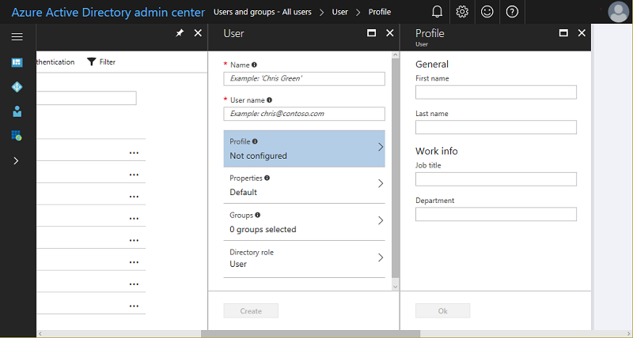

# Set up a common identity on a Data Science Virtual Machine

On a Microsoft Azure virtual machine (VM), including a Data Science Virtual Machine (DSVM), you create local user accounts while provisioning the VM. Users then authenticate to the VM by using these credentials. If you have multiple VMs that your users need to access, managing credentials can get very cumbersome. An excellent solution is to deploy common user accounts and  management through a standards-based identity provider. Through this approach, you can use a single set of credentials to access multiple resources on Azure, including multiple DSVMs.

Active Directory is a popular identity provider and is supported on Azure both as a cloud service and as an on-premises directory. You can use Azure Active Directory (Azure AD) or on-premises Active Directory to authenticate users on a standalone DSVM or a cluster of DSVMs in an Azure virtual machine scale set. You do this by joining the DSVM instances to an Active Directory domain.

If you already have Active Directory, you can use it as your common identity provider. If you don't have Active Directory, you can run a managed Active Directory instance on Azure through [Azure Active Directory Domain Services](https://docs.microsoft.com/azure/active-directory-domain-services/) (Azure AD DS).

The documentation for [Azure AD](https://docs.microsoft.com/azure/active-directory/) provides detailed [management instructions](https://docs.microsoft.com/azure/active-directory/choose-hybrid-identity-solution), including guidance about connecting Azure AD to your on-premises directory if you have one.

This article describes how to set up a fully managed Active Directory domain service on Azure by using Azure AD DS. You can then join your DSVMs to the managed Active Directory domain. This approach enables users to access a pool of DSVMs (and other Azure resources) through a common user account and credentials.

## Set up a fully managed Active Directory domain on Azure

Azure AD DS makes it simple to manage your identities by providing a fully managed service on Azure. On this Active Directory domain, you manage users and groups. To set up an Azure-hosted Active Directory domain and user accounts in your directory, follow these steps:

1. In the Azure portal, add the user to Active Directory: 

   1. Sign in to the [Azure Active Directory admin center](https://aad.portal.azure.com) by using an account that's a global admin for the directory.
    
   1. Select **Azure Active Directory** and then **Users and groups**.
    
   1. In **Users and groups**, select **All users**, and then select **New user**.
   
           The **User** pane opens:
      
      
    
   1. Enter details for the user, such as **Name** and **User name**. The domain name portion of the user name must be either the initial default domain name "[domain name].onmicrosoft.com" or a verified, non-federated [custom domain name](../../active-directory/add-custom-domain.md) such as "contoso.com."
    
   1. Copy or otherwise note the generated user password so that you can provide it to the user after this process is complete.
    
   1. Optionally, you can open and fill out the information in **Profile**, **Groups**, or **Directory role** for the user. 
    
   1. Under **User**, select **Create**.
    
   1. Securely distribute the generated password to the new user so that they can sign in.

1. Create an Azure AD DS instance. Follow the instructions in  [Enable Azure Active Directory Domain Services using the Azure portal](https://docs.microsoft.com/azure/active-directory-domain-services/active-directory-ds-getting-started) (the "Create an instance and configure basic settings" section). It's important to update the existing user passwords in Active Directory so that the password in Azure AD DS is synced. It's also important to add DNS to Azure AD DS, as described under "Complete the fields in the Basics window of the Azure portal to create an Azure AD DS instance" in that section.

1. Create a separate DSVM subnet in the virtual network created in the "Create and configure the virtual network" section of the preceding step.
1. Create one or more DSVM instances in the DSVM subnet.
1. Follow the [instructions](https://docs.microsoft.com/azure/active-directory-domain-services/active-directory-ds-join-ubuntu-linux-vm ) to add the DSVM to Active Directory. 
1. Mount an Azure Files share to host your home or notebook directory so that your workspace can be mounted on any machine. (If you need tight file-level permissions, you'll need Network File System [NFS] running on one or more VMs.)

   1. [Create an Azure Files share](../../storage/files/storage-how-to-create-file-share.md).
    
   2.  Mount this share on the Linux DSVM. When you select **Connect** for the Azure Files share in your storage account in the Azure portal, the  command to run in the bash shell on the Linux DSVM appears. The command looks like this:
   
   ```
   sudo mount -t cifs //[STORAGEACCT].file.core.windows.net/workspace [Your mount point] -o vers=3.0,username=[STORAGEACCT],password=[Access Key or SAS],dir_mode=0777,file_mode=0777,sec=ntlmssp
   ```
1. For example, assume that you mounted your Azure Files share in /data/workspace. Now, create directories for each of your users in the share: /data/workspace/user1, /data/workspace/user2, and so on. Create a `notebooks` directory in each user's workspace. 
1. Create symbolic links for `notebooks` in `$HOME/userx/notebooks/remote`.   

You now have the users in your Active Directory instance hosted in Azure. By using Active Directory credentials, users can sign in to any DSVM (SSH or JupyterHub) that's joined to Azure AD DS. Because the user workspace is on an Azure Files share, users have access to their notebooks and other work from any DSVM when they're using JupyterHub.

For autoscaling, you can use a virtual machine scale set to create a pool of VMs that are all joined to the domain in this fashion and with the shared disk mounted. Users can sign in to any available machine in the virtual machine scale set and have access to the shared disk where their notebooks are saved. 

## Next steps

* [Securely store credentials to access cloud resources](dsvm-secure-access-keys.md)


