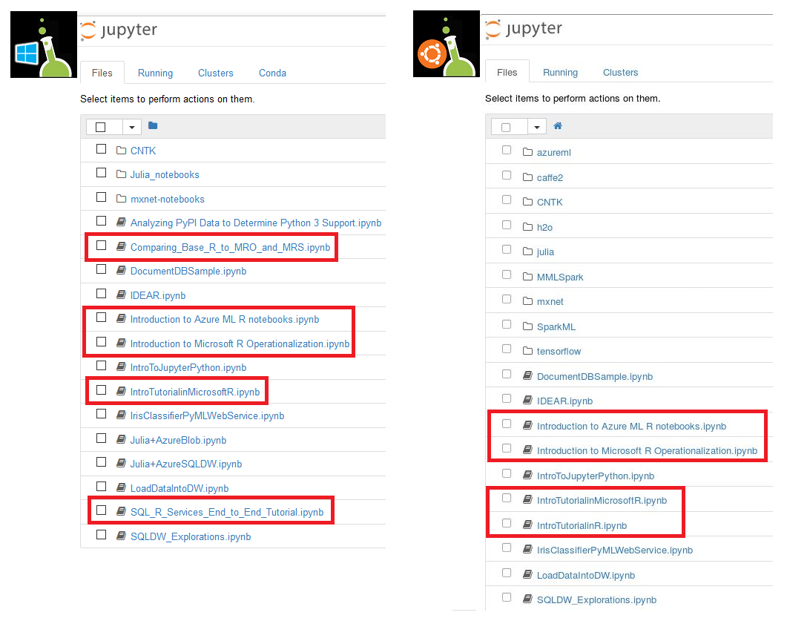
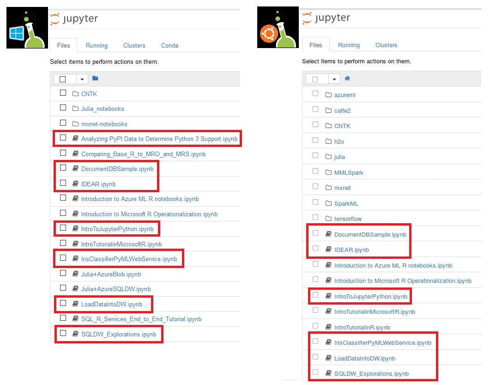
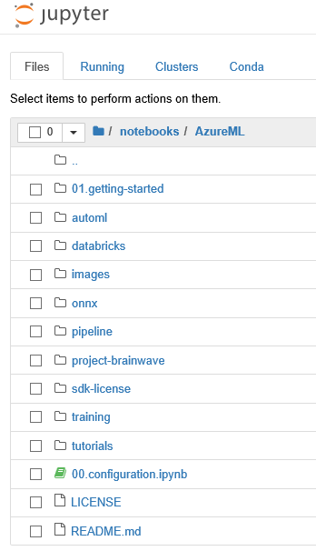
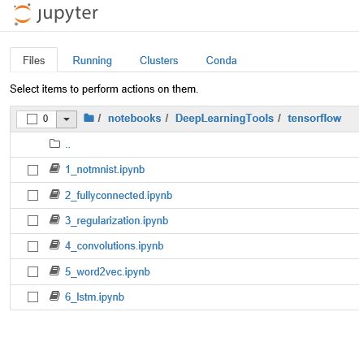
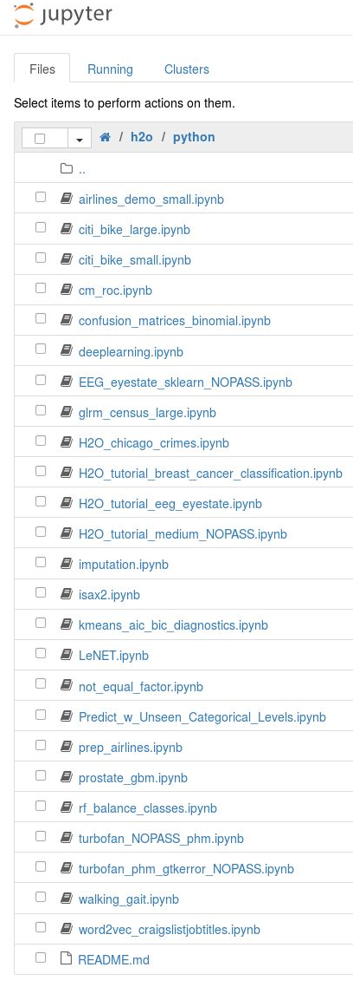
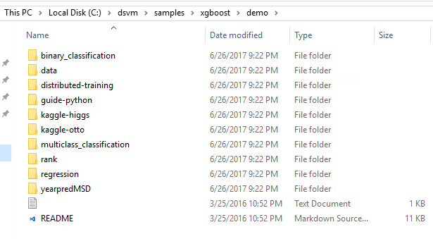

# Samples on Data Science Virtual Machines

Azure Data Science Virtual Machines (DSVMs) include a comprehensive set of sample code. These samples include Jupyter notebooks and scripts in languages like Python and R.
> [!NOTE]
> For more information on how to run Jupyter notebooks on your data science virtual machines, see the [Access Jupyter](#access-jupyter) section.

## Quick reference of samples
| Samples category | Description | Locations |
| ------------- | ------------- | ------------- |
| R language  | Samples in R illustrate scenarios such as how to connect with Azure cloud data stores and how to compare open-source R and Microsoft R. They also explain how to operationalize models on Microsoft Machine Learning Server and SQL Server.   [R language](#r-language) |  `~notebooks`     `~samples/MicrosoftR`     `~samples/RSqlDemo`     `~samples/SQLRServices`   |
| Python language  | Samples in Python explain scenarios like how to connect with Azure cloud data stores and how to work with Azure Machine Learning.    [Python language](#python-language) |  `~notebooks`   |
| Julia language  | This sample provides a detailed description of plotting and deep learning in Julia. It also explains how to call C and Python from Julia.   [Julia language](#julia-language) |  Windows:  `~notebooks/Julia_notebooks`   Linux:  `~notebooks/julia`   |
| Azure Machine Learning  | Illustrates how to build machine-learning and deep-learning models with Machine Learning. Deploy models anywhere. Use automated machine learning and intelligent hyperparameter tuning. Also use model management and distributed training.   [Machine Learning](#azureml) |  `~notebooks/AzureML`   |
| PyTorch notebooks  | Deep-learning samples that use PyTorch-based neural networks. Notebooks range from beginner to advanced scenarios.    [PyTorch notebooks](#pytorch) |  `~notebooks/Deep_learning_frameworks/pytorch`   |
| TensorFlow  |  A variety of neural network samples and techniques implemented by using the TensorFlow framework.   [TensorFlow](#tensorflow) |  `~notebooks/Deep_learning_frameworks/tensorflow`   |
| Microsoft Cognitive Toolkit     | Deep-learning samples published by the Cognitive Toolkit team at Microsoft.    [Cognitive Toolkit](#cntk) |   `~notebooks/DeepLearningTools/CNTK/Tutorials`   Linux:  `~notebooks/CNTK`   |
| Caffe2 | Deep-learning samples that use Caffe2-based neural networks. Several notebooks familiarize users with Caffe2 and how to use it effectively. Examples include image preprocessing and dataset creation. They also include regression and how to use pretrained models.   [caffe2](#caffe2) |  `~notebooks/Deep_learning_frameworks/caffe2`   |
| H2O   | Python-based samples that use H2O for real-world problem scenarios.   [H2O](#h2o) |  `~notebooks/h2o`   |
| SparkML language  | Samples that use features of the Apache Spark MLLib toolkit through pySpark and MMLSpark: Microsoft Machine Learning for Apache Spark on Apache Spark 2.x.    [SparkML language](#sparkml) |  `~notebooks/SparkML/pySpark` `~notebooks/MMLSpark`    |
| XGBoost | Standard machine-learning samples in XGBoost for scenarios like classification and regression.   [XGBoost](#xgboost) |  Windows: `\dsvm\samples\xgboost\demo`   |

 

## Access Jupyter 

To access Jupyter, select the **Jupyter** icon on the desktop or application menu. You also can access Jupyter on Linux editions of DSVMs. To access remotely from a web browser, go to `https://<Full Domain Name or IP Address of the DSVM>:8000` on Ubuntu.

To add exceptions and make Jupyter access available over a browser, see the following screenshot:

Sign in with the same password as your login for Data Science Virtual Machines:
 

**Jupyter home**
  

## R language 
  

## Python language
  

## Julia language 
  

## AzureML 
  

## PyTorch
  

## TensorFlow 
  

## CNTK 
  

## Caffe2 
  

## H2O 
  

## SparkML 
  

## XGBoost 
  

