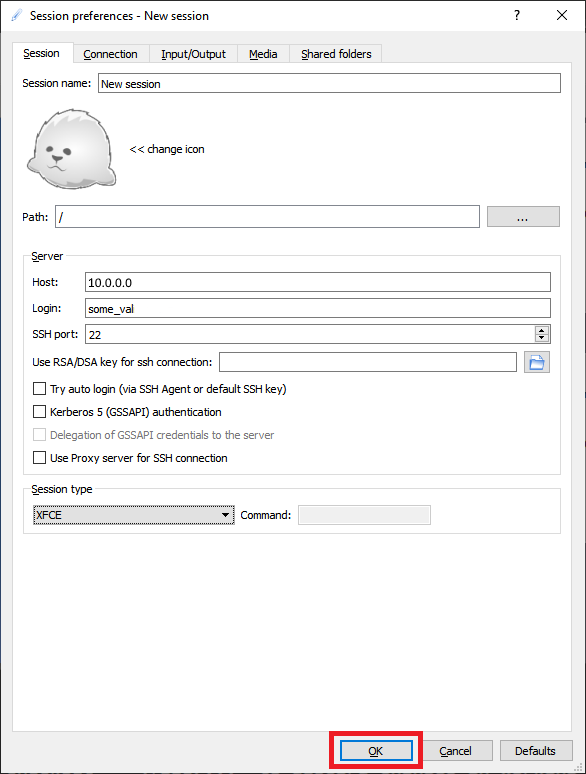
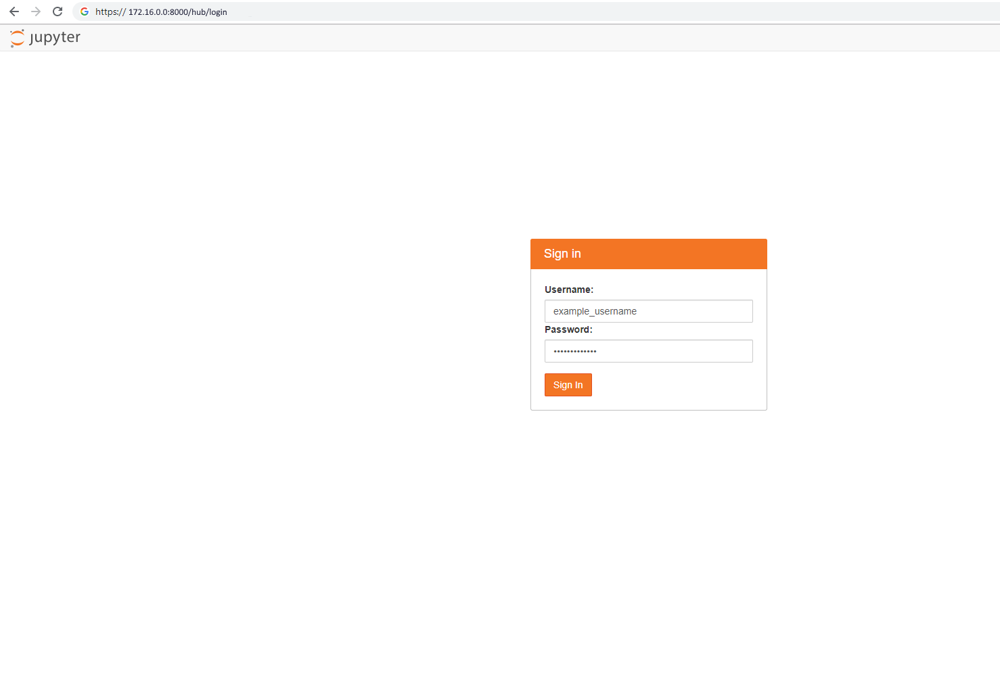

# Quickstart: Set up the Data Science Virtual Machine for Linux (Ubuntu)

Get up and running with the Ubuntu 20.04 Data Science Virtual Machine (DSVM) and the Azure DSVM for PyTorch.

## Prerequisites

You need an Azure subscription to create either an Ubuntu 20.04 Data Science Virtual Machine or an Azure DSVM for PyTorch. [Try Azure for free](https://azure.com/free).

> [!NOTE]
> Azure free accounts don't support GPU enabled virtual machine SKUs.

## Create your Data Science Virtual Machine for Linux

These steps describe how to create an instance of either the Ubuntu 20.04 Data Science Virtual Machine (DSVM) or the Azure DSVM for PyTorch:

1. Go to the [Azure portal](https://portal.azure.com). You might get a prompt to sign in to your Azure account if you haven't signed in yet
1. Find the virtual machine listing. First type in "data science virtual machine," and then select "Data Science Virtual Machine- Ubuntu 20.04" or "Azure DSVM for PyTorch"

1. At the next window, select **Create**

1. You should be redirected to the "Create a virtual machine" blade

1. Enter the following information, to configure each step of the wizard:

    1. **Basics**:

       * **Subscription**: If you have more than one subscription, select the one on which the machine will be created and billed. You must have resource creation privileges for this subscription.
       * **Resource group**: Create a new group, or use an existing one.
       * **Virtual machine name**: Enter the name of the virtual machine. This name is used in your Azure portal.
       * **Region**: Select the datacenter that's most appropriate. For fastest network access, this is the datacenter that has most of your data, or is closest to your physical location. For more information, visit [Azure Regions](https://azure.microsoft.com/global-infrastructure/regions/).
       * **Image**: Don't change the default value.
       * **Size**: This option should autopopulate with a size that is appropriate for general workloads. For more information, visit [Linux VM sizes in Azure](../../virtual-machines/sizes.md).
       * **Authentication type**: For quicker setup, select "Password."

         > [!NOTE]
         > If you plan to use JupyterHub, make sure to select "Password," because JupyterHub is *not* configured to use SSH public keys.

       * **Username**: Enter the administrator username. You use this username to log into your virtual machine. This username doesn't need to match your Azure username. Do *not* use capitalized letters.

         > [!IMPORTANT]
         > If you use capitalized letters in your username, JupyterHub will not work, and you'll encounter a 500 internal server error.

       * **Password**: Enter the password you'll use to log into your virtual machine.

   1. Select **Review + create**.
   1. **Review+create**
      * Verify that all the information you entered is correct.
      * Select **Create**.

    The provisioning process should take about 5 minutes. The Azure portal displays the status.

## How to access the Ubuntu Data Science Virtual Machine

You can access the Ubuntu DSVM in one of four ways:

  * SSH for terminal sessions
  * xrdp for graphical sessions
  * X2Go for graphical sessions
  * JupyterHub and JupyterLab for Jupyter notebooks

### SSH

If you configured your VM with SSH authentication, you can sign in with the account credentials that you created in the **Basics** section of step 3 for the text shell interface. For more information, visit [Learn more about connecting to a Linux VM](../../virtual-machines/linux-vm-connect.md).

### xrdp
xrdp is the standard tool for accessing Linux graphical sessions. While the distro doesn't include this tool by default, [these instructions](../../virtual-machines/linux/use-remote-desktop.md) explain how to install it.

### X2Go
> [!NOTE]
> In testing, the X2Go client performed better than X11 forwarding. We recommend use of the X2Go client for a graphical desktop interface.

The Linux VM is already provisioned with X2Go Server and is ready to accept client connections. To connect to the Linux VM graphical desktop, complete the following procedure on your client:

1. Download and install the X2Go client for your client platform from [X2Go](https://wiki.x2go.org/doku.php/doc:installation:x2goclient).
1. Note the public IP address of the virtual machine. In the Azure portal, open the virtual machine you created to find this information.

   

1. Run the X2Go client. If the "New Session" window doesn't automatically pop up, go to Session -> New Session.

1. On the resulting configuration window, enter these configuration parameters:
   * **Session tab**:
     * **Host**: Enter the IP address of your VM, which you noted earlier.
     * **Login**: Enter the username on the Linux VM.
     * **SSH Port**: Leave it at 22. This is the default value.
     * **Session Type**: Change the value to **XFCE**. Currently, the Linux VM supports only the XFCE desktop.
   * **Media tab**: You can turn off sound support and client printing if you don't need to use them.
   * **Shared folders**: Use this tab to add client machine directory that you would like to mount on the VM.

   
1. Select **OK**.
1. Select on the box in the right pane of the X2Go window to bring up the sign-in screen for your VM.
1. Enter the password for your VM.
1. Select **OK**.
1. You might need to give X2Go permission to bypass your firewall to finish the connection process.
1. You should now see the graphical interface for your Ubuntu DSVM.

### JupyterHub and JupyterLab

The Ubuntu DSVM runs [JupyterHub](https://github.com/jupyterhub/jupyterhub), a multiuser Jupyter server. To connect, take the following steps:

   1. Note the public IP address for your VM. To find this value, search for and select your VM in the Azure portal.
      

   1. From your local machine, open a web browser, and navigate to https:\//**your-vm-ip**:8000, replacing "**your-vm-ip**" with the IP address you noted earlier.
   1. Your browser will probably prevent you from opening the page directly. It might tell you that there's a certificate error. The DSVM provides security with a self-signed certificate. Most browsers will allow you to select through after this warning. Many browsers will continue to provide some kind of visual warning about the certificate throughout your Web session.

      >[!NOTE]
      > If you see the `ERR_EMPTY_RESPONSE` error message in your browser, make sure you access the machine by explicit use of the *HTTPS* protocol. *HTTP* or just the web address don't work for this step. If you type the web address without `https://` in the address line, most browsers will default to `http`, and the error will appear.

   1. Enter the username and password that you used to create the VM, and sign in.

      

      >[!NOTE]
      > If you receive a 500 Error at this stage, you probably used capitalized letters in your username. This is a known interaction between Jupyter Hub and the PAMAuthenticator it uses.
      > If you receive a "Can't reach this page" error, it is likely that your Network Security Group permissions need adjustment. In the Azure portal, find the Network Security Group resource within your Resource Group. To access JupyterHub from the public Internet, you must have port 8000 open. (The image shows that this VM is configured for just-in-time access, which is highly recommended. For more information, visit [Secure your management ports with just-in time access](../../security-center/security-center-just-in-time.md).)
      >
      > :::image type="content" source="./media/dsvm-ubuntu-intro/nsg-permissions.png" alt-text="Screenshot of Network Security Group configuration values." lightbox= "./media/dsvm-ubuntu-intro/nsg-permissions.png":::

   1. Browse the available sample notebooks.

JupyterLab, the next generation of Jupyter notebooks and JupyterHub, is also available. To access it, sign in to JupyterHub, and then browse to the URL https:\//your-vm-ip:8000/user/**your-username**/lab, replacing "**your-username**" with the username you chose when you configured the VM. Again, potential certificate errors might initially block you from accessing the site.

To set JupyterLab as the default notebook server, add this line to `/etc/jupyterhub/jupyterhub_config.py`:

```python
c.Spawner.default_url = '/lab'
```

## Next steps

* The [Data science on the Data Science Virtual Machine for Linux](linux-dsvm-walkthrough.md) walkthrough shows how to do several common data science tasks with the Linux DSVM provisioned here.
* Try out the tools this article describes to explore the various data science tools on the DSVM. You can also run `dsvm-more-info` on the shell within the virtual machine for a basic introduction and pointers to more information about the tools installed on the VM.
* Learn how to systematically build analytical solutions with the [Team Data Science Process](/azure/architecture/data-science-process/overview).
* Visit the [Azure AI Gallery](https://gallery.azure.ai/) for machine learning and data analytics samples that use the Azure AI services.
* Visit the appropriate [reference documentation](./reference-ubuntu-vm.md) for this virtual machine.
