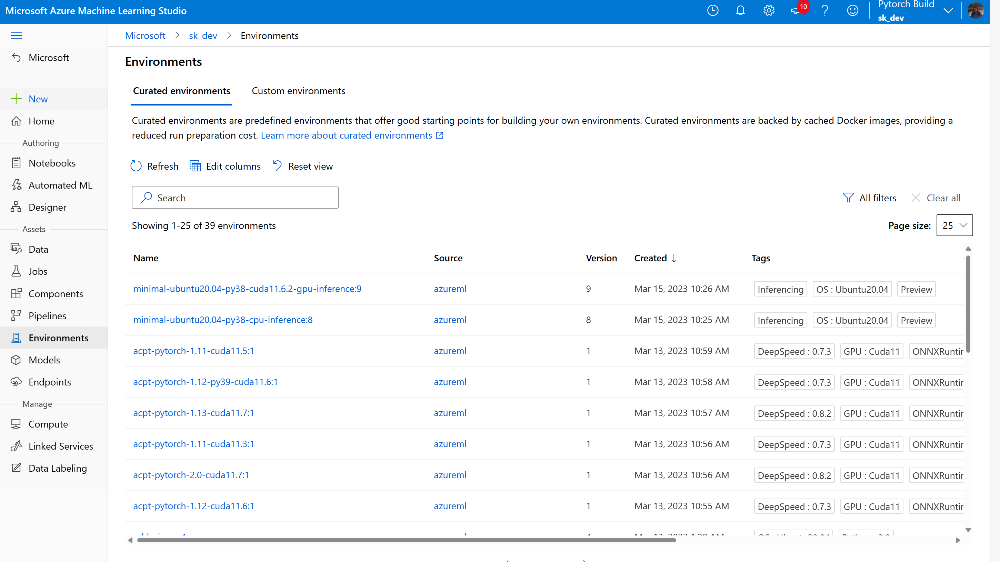
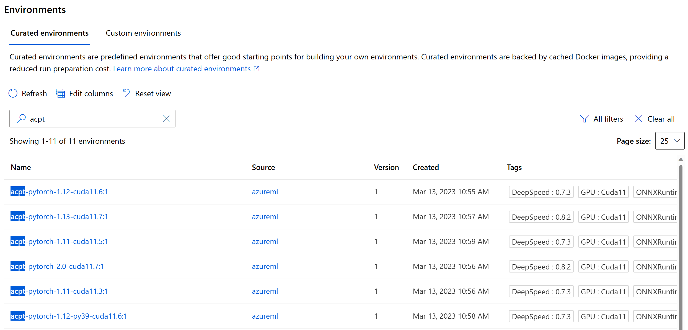
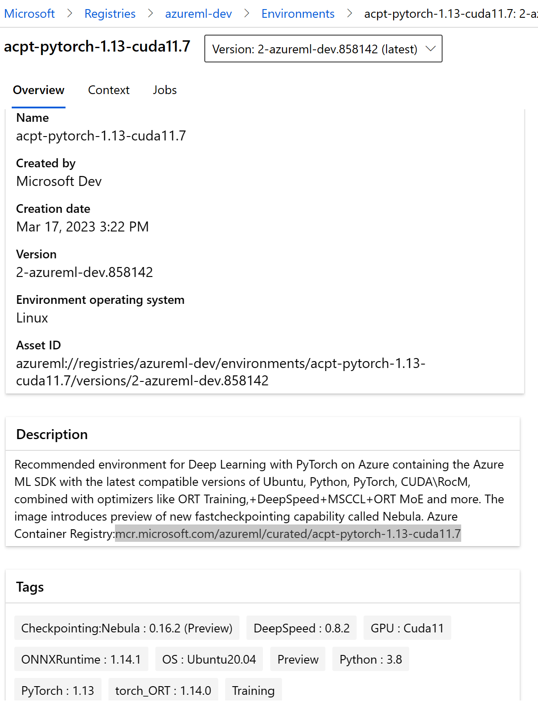
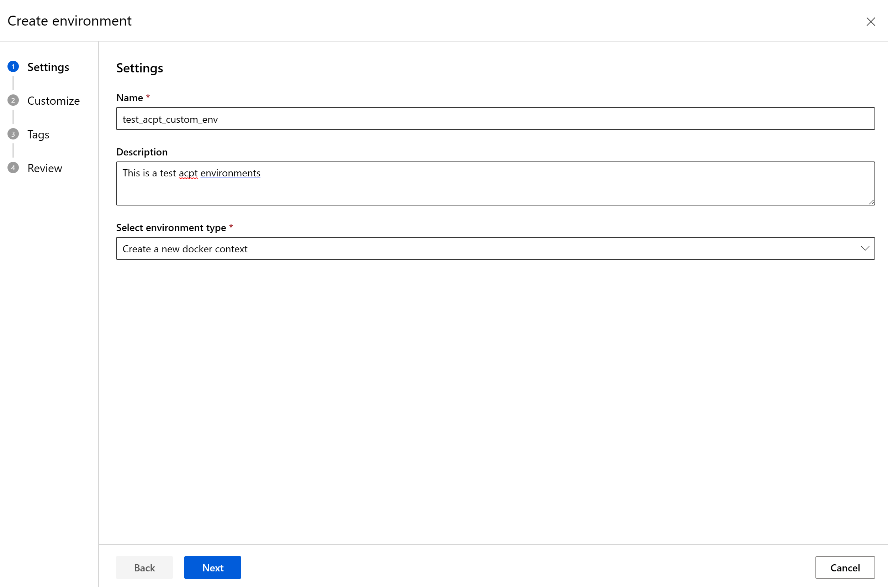
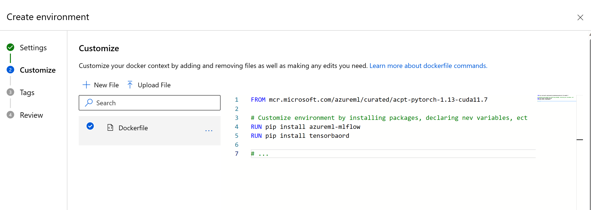

# Creating Custom Curated ACPT Environments in Azure Machine Learning Studio

In AML, you can create customized environments to run your machine learning models and reuse it in different scenarios . 

## Step 1: Navigate to Environments

In the [Azure Machine Learning Studio](https://ml.azure.com/registries/environments), navigate to the "Environments" section by clicking on the "Environments" option in the left-hand menu.

 

## Step 2: Navigate to Curated Enviroments

Navigate to curate environments and search "acpt" to list all the available ACPT curated enviroments. Clicking on the environment will show details of the environment. 

 

## Step 3: Get details of the curated enviroment

To create custom environment you will need the base docker image repository which can be found in the "Description" section as "Container Registry". Verify you have the desired environment by looking at the tags with package versions. Copy the "Container Registry" name which will be used later when you create a new custom environment

 

## Step 4: Navigate to Custom Enviroments

Go back and click on the " Custom Environments" tab.

## Step 5: Create Custom Environment 

Click on + Create.
In the "Create Environment" window, name the environment, description and select "Create a new docker context" in Select enbvironment type section

## Step 6: Configure Environment

Paste the docker image name that you copied in Step 3. Configure your environment by declaring the base image and add any env variables you want to use and the packages that you want to include.

## Step 7: Review and Create Environment

Review your environment settings, add any tags if needed and click on the "Create" button to create your custom environment.

That's it! You have now created a custom environment in Azure Machine Learning Studio and can use it to run your machine learning models.

## Next steps

* Learn more about environment objects:

    * [What are Azure Machine Learning Environments? ](concept-environments.md.md).
    * For a low-code or no-code experience: [Create your automated ML experiments in the Azure Machine Learning studio](how-to-use-automated-ml-for-ml-models.md).

* Learn more about [curated environments](concept-environments.md).

* Learn more about [training models in AML](concept-train-machine-learning-model.md).
