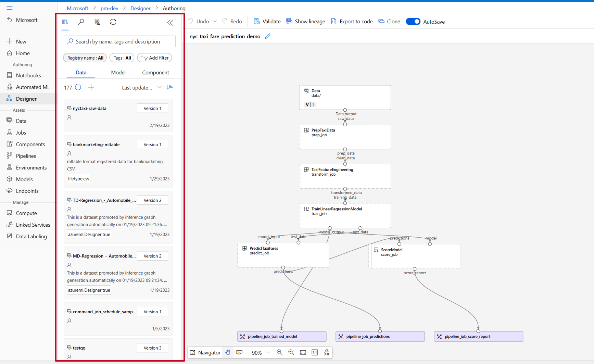
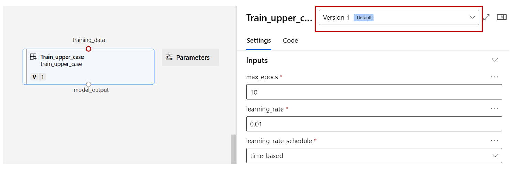

# Create and run machine learning pipelines using components with the Azure Machine Learning studio (Preview)

[!INCLUDE [cli v2](../../includes/machine-learning-cli-v2.md)]

In this article, you'll learn how to create and run [machine learning pipelines](concept-ml-pipelines.md) by using the Azure Machine Learning studio and [Components](concept-component.md). You can [create pipelines without using components](how-to-train-cli.md#build-a-training-pipeline), but components offer the greatest amount of flexibility and reuse. Azure ML Pipelines may be defined in YAML and [run from the CLI](how-to-create-component-pipelines-cli.md), [authored in Python](how-to-create-component-pipeline-python-v2.md), or composed in Azure ML Studio Designer with a drag-and-drop UI. This document focuses on the AzureML studio designer UI.

[!INCLUDE [preview disclaimer](../../includes/machine-learning-preview-generic-disclaimer.md)]

## Prerequisites

* If you don't have an Azure subscription, create a free account before you begin. Try the [free or paid version of Azure Machine Learning](https://azure.microsoft.com/free/).

* You'll need an [Azure Machine Learning workspace](how-to-manage-workspace.md) for your pipelines and associated resources

* [Install and set up the Azure CLI extension for Machine Learning](how-to-configure-cli.md)

* Clone the examples repository:

    ```azurecli-interactive
    git clone https://github.com/Azure/azureml-examples --depth 1
    cd azureml-examples/cli/jobs/pipelines-with-components/
    ```

## Register component in your workspace

After you have defined your components, you can use CLI to register to your workspace, so that you can share and resue the component within the workspace. Registered components support automatic versioning so you can update the component. The pipelines that require an older version will continue to work.  

1. From the `cli/jobs/pipelines-with-components/basics` directory of the [`azureml-examples` repository](https://github.com/Azure/azureml-examples), navigate to the `1b_e2e_registered_components` subdirectory.

1. Register the components to AzureML workspace using following commands. Learn more about [ML components](concept-component.md).

    ```CLI
    az ml component create --file train.yml
    az ml component create --file score.yml
    az ml component create --file eval.yml
    ```

1. After register component successfully, you can see your component in the studio UI.


## Create pipeline using registered component

1. Create a new pipeline in the designer. You can change the pipeline name.

1. Set the default compute target of the pipeline. 

    Next to the pipeline name, select the **Gear icon**  at the top of the canvas to open the **Settings** pane. Select the default compute target for your pipeline.

    > [!Important]
    > Attached compute is not supported, use [compute instances or clusters](concept-compute-target.md#azure-machine-learning-compute-managed) instead.

1. You can find your registered components in the previous section in the asset library.

    

    Drag the components and drop on the canvas. By default it will use the default version of the component, and you can change to other version in the right pane of component.
    
    
    
    Connect the upstream component to the downstream component.

    

1. Select submit 


### Caching & reuse  

By default, only those components whose inputs have changed are rerun if you rerun the same pipeline. You can change this behavior by setting the `is_deterministic` key of the component specification YAML to `False`. A common need for this is a component that loads data that may have been updated from a fixed location or URL. 


## Next steps

- Learn how to productionize your script to component by following [this article](TODO).
- Use [these Jupyter notebooks on GitHub](https://github.com/Azure/azureml-examples/tree/pipeline/builder_function_samples/cli/jobs/pipelines-with-components) to explore machine learning pipelines further
- Learn [how to use CLI v2 to create pipeline using components](how-to-create-component-pipelines-cli.md).
- TODO: See the SDK reference help for the [TODO: SDK document](/python/api/azureml-pipeline-core/) package and the [azureml-pipelines-steps](/python/api/azureml-pipeline-steps/) package
