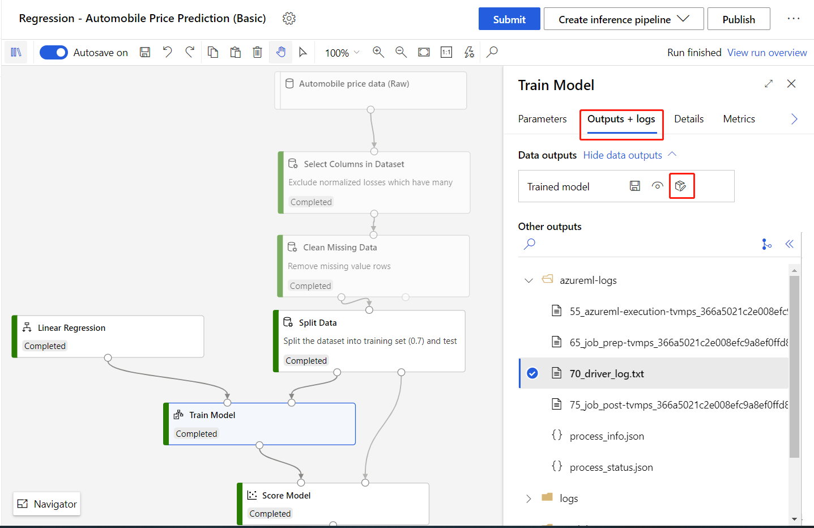
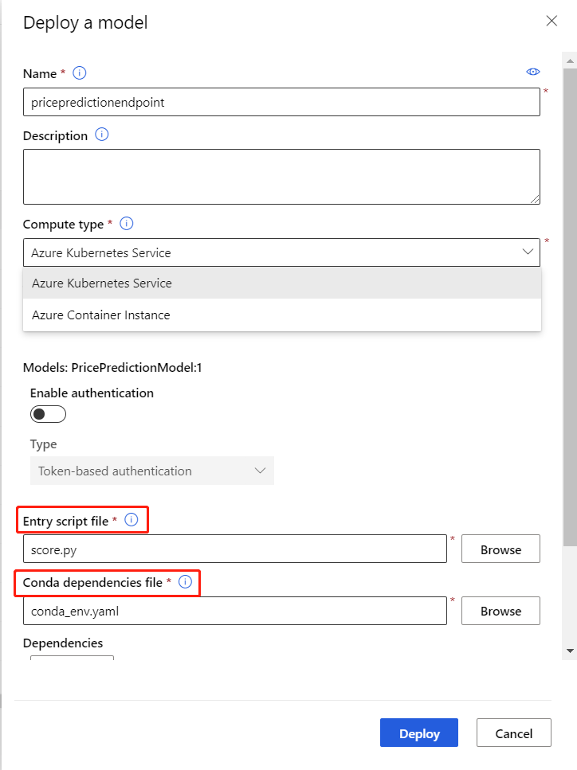

# Deploy trained models from the designer
[!INCLUDE [applies-to-skus](../../includes/aml-applies-to-basic-enterprise-sku.md)]

In this article, you will learn how to deploy a trained model from the designer as a real-time endpoint in the Azure Machine Learning studio.

The workflow consists of the following steps:

1. Register the trained model in the completed pipeline run.
1. Download entry script file and conda dependencies file for the trained model.
1. Deploy the model to a compute target.

For more information on the concepts involved in the deployment workflow, see [Manage, deploy, and monitor models with Azure Machine Learning](concept-model-management-and-deployment.md).

Models trained  in the designer can also be deployed through the SDK or CLI, see [Deploy your existing model with Azure Machine Learning](how-to-deploy-existing-model.md)

## Prerequisites

* [An Azure Machine Learning workspace](how-to-manage-workspace.md)

* A completed training pipeline containing a [Train Model module](./algorithm-module-reference/train-model.md)

## Register your model

After the training pipeline completes:

1. Select the [Train Model module](./algorithm-module-reference/train-model.md).
1. Select the **Outputs + logs** tab in the right pane.
1. Select the **Register Model** icon .

    

1. Enter a name for your model in the pop-up window, and select **Save**.

    

After registering your model, you can find it in the **Models** asset page.
    


## Download entry script file and conda dependencies file

You need the following files to deploy a model in Azure Machine Learning studio:

- An **entry script file** - loads trained model, processes input data from requests, does real-time inferences and returns the result. In designer, a `score.py` file will be automatically generated when the **Train Model** module is completed.

- A **conda dependencies file** - specifies which pip and conda packages your webservice depends on. In designer, a `conda_env.yaml` file will be automatically generated when the **Train Model** module is completed.

You can download these two files in the right pane of the **Train Model** module:

1. Select the **Train Model** module.
1. In the **Outputs + logs** tab, select the folder `trained_model_outputs`.
1. Download the `conda_env.yaml` file and `score.py` file.

    

Alternatively, you can download the files from the **Models** asset page:

1. Navigate to the **Models** asset page.
1. Select the model you want to deploy.
1. Select the **Artifacts** tab.
1. Select the `trained_model_outputs` folder.
1. Download the `conda_env.yaml` file and `score.py` file.  

    

> [!NOTE]
> The `score.py` files provide almost the same functions as the **Score Model** modules. But for some modules like **Score SVD Recommender*, **Score Wide and Deep Recommender**, and **Score Vowpal Wabbit Model** modules, user can set parameters for different score mode. Similarly, user can also change parameters in the `score.py` files to enable different score functions. See [Configure entry script file](#configure-entry-script-file) for how to set different parameters in the `score.py` files.

## Deploy your model

You're now ready to deploy your model.

1. In the **Models** asset page, select the registered model.
1. Select the **Deploy** button.
1. In the configuration menu, enter the following information:

    - Input the name of the endpoint.
    - Select to deploy the model to [Azure Kubernetes Service](how-to-deploy-azure-kubernetes-service.md) or [Azure Container Instance](how-to-deploy-azure-container-instance.md).
    - Upload the `score.py` for the **Entry script file**, and `conda_env.yml` for the **Conda dependencies file**. 
    - (Optional) In **Advanced** setting, you can set CPU/Memory reserve capacity and other parameters for deployment. These settings are important for certain models such as         PyTorch models, which consum considerable amount of momery (about 4 GB).

1. Select **Deploy** to deploy your model as a real-time endpoint.

    

## Consume the real-time endpoint

After deployment succeeds, you can find the real-time endpoint in the **Endpoints** asset page. Once there, you will find a REST endpoint, which clients can use to submit requests to the real-time endpoint. 

> [!NOTE]
> The designer also generates sample data json file for consuming, you can download `_samples.json` in the **trained_model_outputs** folder. 
> `_samples.json` is good reference for consuming, especially when input data contains too many columns.

Following is sample code to consume the real-time endpoint.

```python

import json
from pathlib import Path
from azureml.core.workspace import Workspace, Webservice
 
service_name = 'YOUR_SERVICE_NAME'
ws = Workspace.get(
    name='WORKSPACE_NAME',
    subscription_id='SUBSCRIPTION_ID',
    resource_group='RESOURCEGROUP_NAME'
)
service = Webservice(ws, service_name)
sample_file_path = '_samples.json'
 
with open(sample_file_path, 'r') as f:
    sample_data = json.load(f)
score_result = service.run(json.dumps(sample_data))
print(f'Inference result = {score_result}')
```

## Technical notes

### (Optional) Configure entry script file

This section describes how to change parameters in entry script files to enable different score functions.

Here is one example for Wide & Deep recommender. By default, the `score.py` file enables web service to predict ratings between users and items.

The codes below shows how to change code to make item recommendations, and return recommended items.

```python
import os
import json
from pathlib import Path
from collections import defaultdict
from azureml.studio.core.io.model_directory import ModelDirectory
from azureml.designer.modules.recommendation.dnn.wide_and_deep.score. \
    score_wide_and_deep_recommender import ScoreWideAndDeepRecommenderModule
from azureml.designer.serving.dagengine.utils import decode_nan
from azureml.designer.serving.dagengine.converter import create_dfd_from_dict

model_path = os.path.join(os.getenv('AZUREML_MODEL_DIR'), 'trained_model_outputs')
schema_file_path = Path(model_path) / '_schema.json'
with open(schema_file_path) as fp:
    schema_data = json.load(fp)


def init():
    global model
    model = ModelDirectory.load(load_from_dir=model_path)


def run(data):
    data = json.loads(data)
    input_entry = defaultdict(list)
    for row in data:
        for key, val in row.items():
            input_entry[key].append(decode_nan(val))

    data_frame_directory = create_dfd_from_dict(input_entry, schema_data)

    # The parameter names can be inferred from Score Wide and Deep Recommender module parameters:
    # convert the letters to lower cases and replace whitespaces to underscores.
    score_params = dict(
        trained_wide_and_deep_recommendation_model=model,
        dataset_to_score=data_frame_directory,
        training_data=None,
        user_features=None,
        item_features=None,
        ################### Note #################
        # Set 'Recommender prediction kind' parameter to enable item recommendation model
        recommender_prediction_kind='Item Recommendation',
        recommended_item_selection='From All Items',
        maximum_number_of_items_to_recommend_to_a_user=5,
        whether_to_return_the_predicted_ratings_of_the_items_along_with_the_labels='True')
    result_dfd, = ScoreWideAndDeepRecommenderModule().run(**score_params)
    result_df = result_dfd.data
    return json.dumps(result_df.to_dict("list"))
```

For **Wide & Deep recommendation** and **Vowpal Wabbit** trained model, you can configure parameters using following tips:

- The parameter names are the lowercases and underscores combination of the score module parameter names;
- Mode type parameter values are strings of the corresponding option names. Take **Recommender prediction kind** in the above codes as example, the value can be `'Rating Prediction'`or `'Item Recommendation'`, and other values are not allowed.

For **SVD recommendation** trained model, the parameter names and values maybe less obvious, and you can look up the tables below to decide how to set parameters.

| Parameter name in the score module                           | Parameter name in the entry script file |
| ------------------------------------------------------------ | --------------------------------------- |
| Recommender prediction kind                                  | prediction_kind                         |
| Recommended item selection                                   | recommended_item_selection              |
| Minimum size of the recommendation pool for a single user    | min_recommendation_pool_size            |
| Maximum number of items to recommend to a user               | max_recommended_item_count              |
| Whether to return the predicted ratings of the items along with the labels | return_ratings                          |

Following code shows how to set parameters for SVD recommender, which uses all 6 parameters to recommend rated items with predicted ratings attached.

```python
score_params = dict(
        learner=model,
        test_data=DataTable.from_dfd(data_frame_directory),
        training_data=None,
        # RecommenderPredictionKind has 2 members, 'RatingPrediction' and 'ItemRecommendation'. You
        # can specify prediction_kind parameter with one of them.
        prediction_kind=RecommenderPredictionKind.ItemRecommendation,
        # RecommendedItemSelection has 3 members, 'FromAllItems', 'FromRatedItems', 'FromUndatedItems'.
        # You can specify recommended_item_selection parameter with one of them.
        recommended_item_selection=RecommendedItemSelection.FromRatedItems,
        min_recommendation_pool_size=1,
        max_recommended_item_count=3,
        return_ratings=True,
    )
```


## Next steps

* [Train a model in the designer](tutorial-designer-automobile-price-train-score.md)
* [Troubleshoot a failed deployment](how-to-troubleshoot-deployment.md)
* [Deploy to Azure Kubernetes Service](how-to-deploy-azure-kubernetes-service.md)
* [Create client applications to consume web services](how-to-consume-web-service.md)
* [Update web service](how-to-deploy-update-web-service.md)
