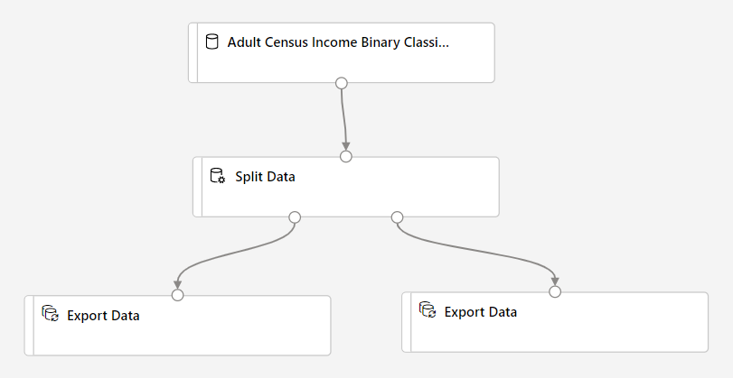
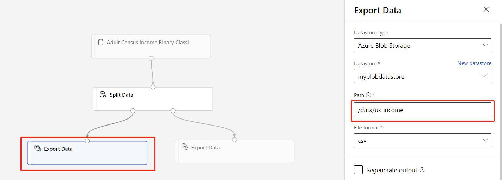

# Transform data in Azure Machine Learning designer (preview)
[!INCLUDE [applies-to-skus](../../includes/aml-applies-to-enterprise-sku.md)]

In this article, you learn how to transform and save datasets in Azure Machine Learning designer so that you can prepare your own data for machine learning.

You will use the sample [Adult Census Income Binary Classification](sample-designer-datasets.md) dataset to prepare two datasets: one dataset that includes adult census information from only the United States and another dataset that includes census information from non-US adults.

In this article, you learn how to:

1. Transform a dataset to prepare it for training.
1. Export the resulting datasets to a datastore.
1. View results.

This how-to is a prerequisite for the [how to retrain designer models](how-to-retrain-designer.md) article. In that article, you will learn how to use the transformed datasets to train multiple models with pipeline parameters.

[!INCLUDE [machine-learning-missing-ui](../../includes/machine-learning-missing-ui.md)]

## Transform a dataset

In this section, you learn how to import the sample dataset and split the data into US and non-US datasets. For more information on how to import your own data into the designer, see [how to import data](how-to-designer-import-data.md).

### Import data

Use the following steps to import the sample dataset.

1. Sign in to <a href="https://ml.azure.com?tabs=jre" target="_blank">ml.azure.com</a>, and select the workspace you want to work with.

1. Go to the designer. Select **Easy-to-use-prebuild modules** to create a new pipeline.

1. Select a default compute target to run the pipeline.

1. To the left of the pipeline canvas is a palette of datasets and modules. Select **Datasets**. Then view the **Samples** section.

1. Drag and drop the **Adult Census Income Binary classification** dataset onto the canvas.

1. Select the **Adult Census Income** dataset module.

1. In the details pane that appears to the right of the canvas, select **Outputs**.

1. Select the visualize icon .

1. Use the data preview window to explore the dataset. Take special note of the "native-country" column values.

### Split the data

In this section, you use the [Split Data module](algorithm-module-reference/split-data.md) to identify and split rows that contain "United-States" in the  "native-country" column. 

1. In the module palette to the left of the canvas, expand the **Data Transformation** section and find the **Split Data** module.

1. Drag the **Split Data** module onto the canvas, and drop the module below the dataset module.

1. Connect the dataset module to the **Split Data** module.

1. Select the **Split Data** module.

1. In the module details pane to the right of the canvas, set **Splitting mode** to **Regular Expression**.

1. Enter the **Regular Expression**: `\"native-country" United-States`.

    The **Regular expression** mode tests a single column for a value. For more information on the Split Data module, see the related [algorithm module reference page](algorithm-module-reference/split-data.md).

Your pipeline should look like this:

:::image type="content" source="./media/how-to-designer-transform-data/split-data.png"alt-text="Screenshot showing how to configure the pipeline and the Split Data module":::

## Save the datasets

Now that your pipeline is set up to split the data, you need to specify where to persist the datasets. For this example, use the **Export Data** module to save your dataset to a datastore. For more information on datastores, see [Connect to Azure storage services](how-to-access-data.md)

1. In the module palette to the left of the canvas, expand the **Data Input and Output** section and find the **Export Data** module.

1. Drag and drop two **Export Data** modules below the **Split Data** module.

1. Connect each output port of the **Split Data** module to a different **Export Data** module.

    Your pipeline should look something like this:

    .

1. Select the **Export Data** module that is connected to the *left*-most port of the **Split Data** module.

    The order of the output ports matter for the **Split Data** module. The first output port contains the rows where the regular expression is true. In this case, the first port contains rows for US-based income, and the second port contains rows for non-US based income.

1. In the module details pane to the right of the canvas, set the following options:
    
    **Datastore type**: Azure Blob Storage

    **Datastore**: Select an existing datastore or select "New datastore" to create one now.

    **Path**: `/data/us-income`

    **File format**: csv

    > [!NOTE]
    > This article assumes that you have access to a datastore registered to the current Azure Machine Learning workspace. For instructions on how to setup a datastore, see [Connect to Azure storage services]((how-to-connect-data-ui.md#create-datastores).

    If you don't have a datastore, you can create one now. For example purposes, this article will save the datasets to the default blob storage account associated with the workspace. It will save the datasets into the `azureml` container in a new folder called `data`.

1.  Select the **Export Data** module connected to the *right*-most port of the **Split Data** module.

1. In the module details pane to the right of the canvas, set the following options:
    
    **Datastore type**: Azure Blob Storage

    **Datastore**: Select the same datastore as above

    **Path**: `/data/non-us-income`

    **File format**: csv

1. Confirm the **Export Data** module connected to the left port of the **Split Data** has the **Path** `/data/us-income`.

1. Confirm the **Export Data** module connected to the right port has the **Path** `/data/non-us-income`.

    Your pipeline and settings should look like this:
    
    .

### Submit the run

Now that your pipeline is setup to split and export the data, submit a pipeline run.

1. At the top of the canvas, select **Submit**.

1. In the **Set up pipeline run** dialog, select **Create new** to create an experiment.

    Experiments logically group together related pipeline runs. If you run this pipeline in the future, you should use the same experiment for logging and tracking purposes.

1. Provide a descriptive experiment name like "split-census-data".

1. Select **Submit**.

## View results

After the pipeline finishes running, you can view your results by navigating to your blob storage in the Azure portal. You can also view the intermediary results of the **Split Data** module to confirm that your data has been split correctly.

1. Select the **Split Data** module.

1. In the module details pane to the right of the canvas, select **Outputs + logs**. 

1. Select the visualize icon  next to **Results dataset1**. 

1. Verify that the "native-country" column only contains the value "United-States".

1. Select the visualize icon  next to **Results dataset2**. 

1. Verify that the "native-country" column does not contain the value "United-States".

## Clean up resources

Skip this section if you want to continue on with part 2 of this how to, [Retrain models with Azure Machine Learning designer](how-to-retrain-designer.md).

[!INCLUDE [aml-ui-cleanup](../../includes/aml-ui-cleanup.md)]

## Next steps

In this article, you learned how to transform a dataset and save it to a registered datastore.

Continue to the next part of this how-to series with [Retrain models with Azure Machine Learning designer](how-to-retrain-designer.md) to use your transformed datasets and pipeline parameters to train machine learning models.
