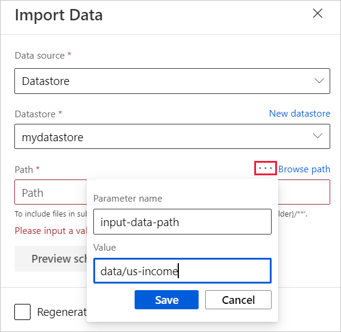

# Retrain models with Azure Machine Learning designer
[!INCLUDE [applies-to-skus](../../includes/aml-applies-to-enterprise-sku.md)]

In this how-to article, you learn how to use Azure Machine Learning designer to retrain a machine learning model. You will use published pipelines to automate your workflow and set parameters to train your model on new data. 

In this article, you learn how to:

> [!div class="checklist"]
> * Train a machine learning model.
> * Create a pipeline parameter.
> * Publish your training pipeline.
> * Retrain your model with new parameters.

## Prerequisites

* An Azure Machine Learning workspace with the Enterprise SKU.
* Complete part 1 of this how-to series, [Transform data in the designer](how-to-designer-transform-data.md).

[!INCLUDE [machine-learning-missing-ui](../../includes/machine-learning-missing-ui.md)]

This article also assumes that you have basic knowledge of building pipelines in the designer. For a guided introduction, complete the [tutorial](tutorial-designer-automobile-price-train-score.md). 

### Sample pipeline

The pipeline used in this article is an altered version of [Sample 3: Income prediction](samples-designer.md#classification). The pipeline uses the [Import Data](algorithm-module-reference/import-data.md) module instead of the sample dataset to show you how to train models using your own data.

## Create a pipeline parameter

Create pipeline parameters to dynamically set variables at runtime. For this example, you will change the training data path from a fixed value to a parameter, so that you can retrain your model on different data.

1. Select the **Import Data** module.

    > [!NOTE]
    > This example uses the Import Data module to access data in a registered datastore. However, you can follow similar steps if you use alternative data access patterns.

1. In the module detail pane, to the right of the canvas, select your data source.

1. Enter the path to your data. You can also select **Browse path** to browse your file tree. 

1. Mouseover the **Path** field, and select the ellipses above the **Path** field that appear.

    

1. Select **Add to pipeline parameter**.

1. Provide a parameter name and a default value.

   > [!NOTE]
   > You can inspect and edit your pipeline parameters by selecting the **Settings** gear icon next to the title of your pipeline draft. 

1. Select **Save**.

1. Submit the pipeline run.

## Find a trained model

The designer saves all pipeline output, including trained models, to the default workspace storage account. You can also access trained models directly in the designer:

1. Wait for the pipeline to finish running.
1. Select the **Train Model** module.
1. In the module details pane, to the right of the canvas, select **Outputs + logs**.
1. You can find your model in **Other outputs** along with run logs.
1. Alternatively, select the **View output** icon. From here, you can follow the instruction in the dialog to navigate directly to your datastore. 

## Publish a training pipeline

Publish a pipeline to a pipeline endpoint to easily reuse your pipelines in the future. A pipeline endpoint creates a REST endpoint to invoke pipeline in the future. In this example, your pipeline endpoint lets you reuse your pipeline to retrain a model on different data.

1. Select **Publish** above the designer canvas.
1. Select or create a pipeline endpoint.

   > [!NOTE]
   > You can publish multiple pipelines to a single endpoint. Each pipeline in a given endpoint is given a version number, which you can specify when you call the pipeline endpoint.

1. Select **Publish**.

## Retrain your model

Now that you have a published training pipeline, you can use it to retrain your model on new data. You can submit runs from a pipeline endpoint from the studio workspace or programmatically.

### Submit runs by using the designer

Use the following steps to submit a parameterized pipeline endpoint run from the designer:

1. Go to the **Endpoints** page in your studio workspace.
1. Select the **Pipeline endpoints** tab. Then, select your pipeline endpoint.
1. Select the **Published pipelines** tab. Then, select the pipeline version that you want to run.
1. Select **Submit**.
1. In the setup dialog box, you can specify the parameters values for the run. For this example, update the data path to train your model using a non-US dataset.

### Submit runs by using code

You can find the REST endpoint of a published pipeline in the overview panel. By calling the endpoint, you can retrain the published pipeline.

To make a REST call, you need an OAuth 2.0 bearer-type authentication header. For information about setting up authentication to your workspace and making a parameterized REST call, see [Build an Azure Machine Learning pipeline for batch scoring](tutorial-pipeline-batch-scoring-classification.md#publish-and-run-from-a-rest-endpoint).

## Next steps

In this article, you learned how to create a parameterized training pipeline endpoint using the designer.

For a complete walkthrough of how you can deploy a model to make predictions, see the [designer tutorial](tutorial-designer-automobile-price-train-score.md) to train and deploy a regression model.
