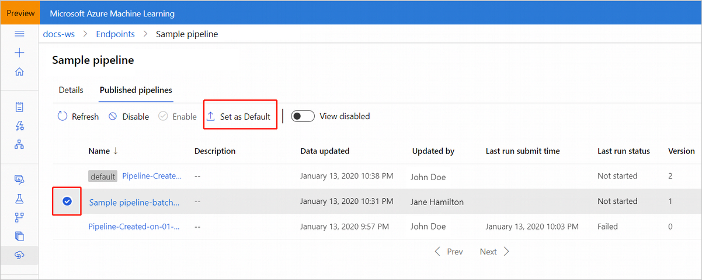

# Run batch predictions using Azure Machine Learning designer

In this article, you learn how to use the designer to create a batch prediction pipeline. Batch prediction lets you continuously score large datasets on-demand using a web service that can be triggered from any HTTP library.

In this how-to, you learn to do the following tasks:

> [!div class="checklist"]
> * Create and publish a batch inference pipeline
> * Consume a pipeline endpoint
> * Manage endpoint versions

To learn how to set up batch scoring services using the SDK, see the accompanying [how-to](how-to-run-batch-predictions.md).

## Prerequisites

This how-to assumes you already have a training pipeline. For a guided introduction to the designer, complete [part one of the designer tutorial](tutorial-designer-automobile-price-train-score.md). 

[!INCLUDE [machine-learning-missing-ui](../../includes/machine-learning-missing-ui.md)]

## Create a batch inference pipeline

Your training pipeline must be run at least once to be able to create an inferencing pipeline.

1. Go to the **Designer** tab in your workspace.

1. Select the training pipeline that trains the model you want to use to make prediction.

1. **Submit** the pipeline.

    

Now that the training pipeline has been run, you can create a batch inference pipeline.

1. Next to **Submit**, select the new dropdown **Create inference pipeline**.

1. Select **Batch inference pipeline**.

    
    
The result is a default batch inference pipeline. 

### Add a pipeline parameter

To create predictions on new data, you can either manually connect a different dataset in this pipeline draft view or create a parameter for your dataset. Parameters let you change the behavior of the batch inferencing process at runtime.

In this section, you create a dataset parameter to specify a different dataset to make predictions on.

1. Select the dataset module.

1. A pane will appear to the right of the canvas. At the bottom of the pane, select **Set as pipeline parameter**.
   
    Enter a name for the parameter, or accept the default value.

## Publish your batch inferencing pipeline

Now you're ready to deploy the inferencing pipeline. This will deploy the pipeline and make it available for others to use.

1. Select the **Publish** button.

1. In the dialog that appears, expand the drop-down for **PipelineEndpoint**, and select **New PipelineEndpoint**.

1. Provide an endpoint name and optional description.

    Near the bottom of the dialog, you can see the parameter you configured with a default value of the dataset ID used during training.

1. Select **Publish**.

## Consume an endpoint

Now, you have a published pipeline with a dataset parameter. The pipeline will use the trained model created in the training pipeline to score the dataset you provide as a parameter.

### Submit a pipeline run 

In this section, you will set up a manual pipeline run and alter the pipeline parameter to score new data. 

1. After the deployment is complete, go to the **Endpoints** section.

1. Select **Pipeline endpoints**.

1. Select the name of the endpoint you created.

1. Select **Published pipelines**.

    This screen shows all published pipelines published under this endpoint.

1. Select the pipeline you published.

    The pipeline details page shows you a detailed run history and connection string information for your pipeline. 
    
1. Select **Submit** to create a manual run of the pipeline.

    
    
1. Change the parameter to use a different dataset.
    
1. Select **Submit** to run the pipeline.

### Use the REST endpoint

You can find information on how to consume pipeline endpoints and published pipeline in the **Endpoints** section.

You can find the REST endpoint of a pipeline endpoint in the run overview panel. By calling the endpoint, you are consuming its default published pipeline.

You can also consume a published pipeline in the **Published pipelines** page. Select a published pipeline and find the REST endpoint of it. 

To make a REST call, you will need an OAuth 2.0 bearer-type authentication header. See the following [tutorial section](tutorial-pipeline-batch-scoring-classification.md#publish-and-run-from-a-rest-endpoint) for more detail on setting up authentication to your workspace and making a parameterized REST call.

## Versioning endpoints

The designer assigns a version to each subsequent pipeline that you publish to an endpoint. You can specify the pipeline version that you want to execute as a parameter in your REST call. If you don't specify a version number, the designer will use the default pipeline.

When you publish a pipeline, you can choose to make it the new default pipeline for that endpoint.

You can also set a new default pipeline in the **Published pipelines** tab of your endpoint.

## Next steps

Follow the designer [tutorial](tutorial-designer-automobile-price-train-score.md) to train and deploy a regression model.
''