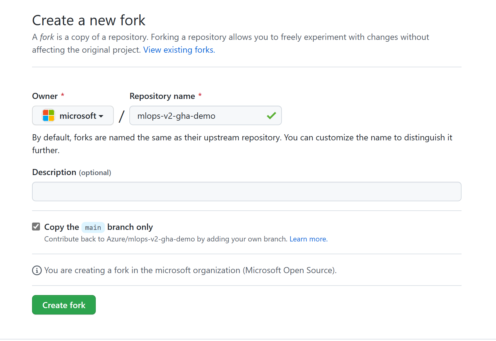
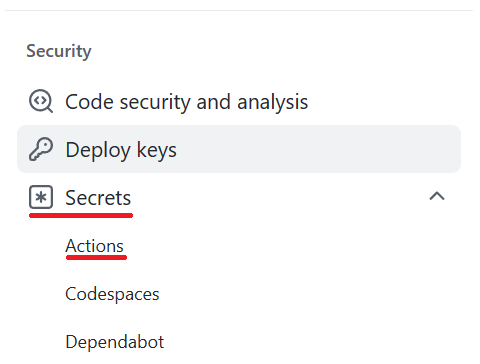
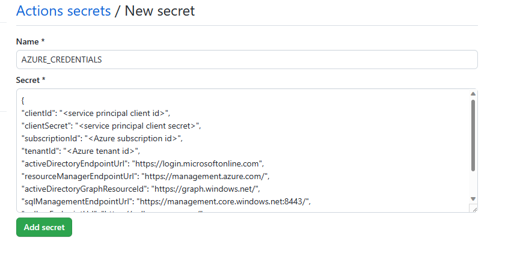
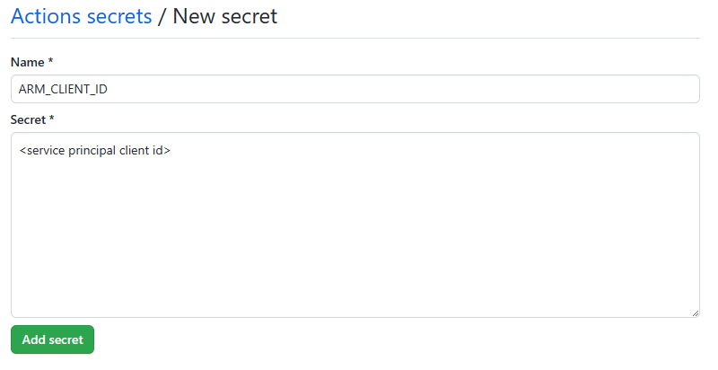
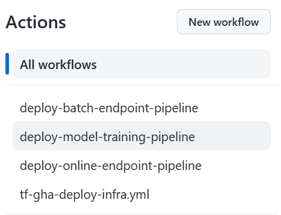
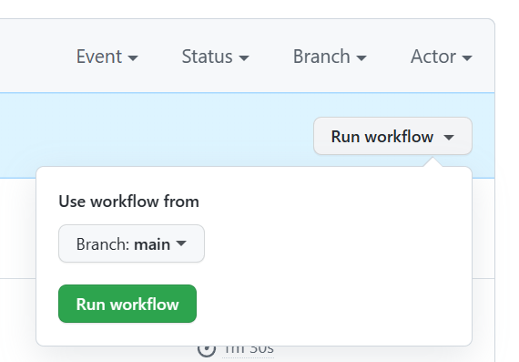
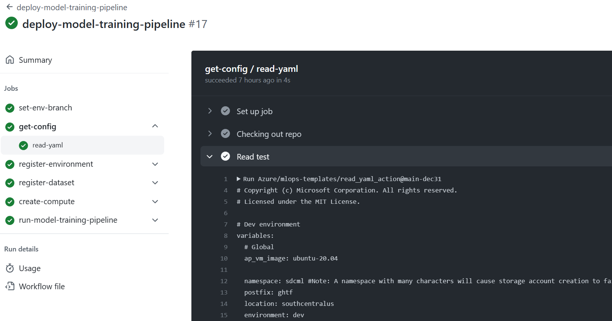
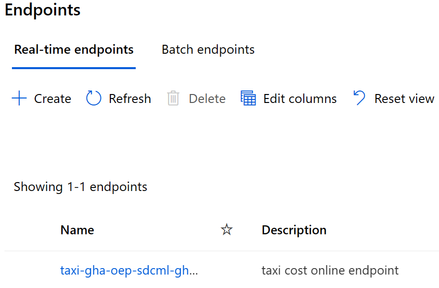
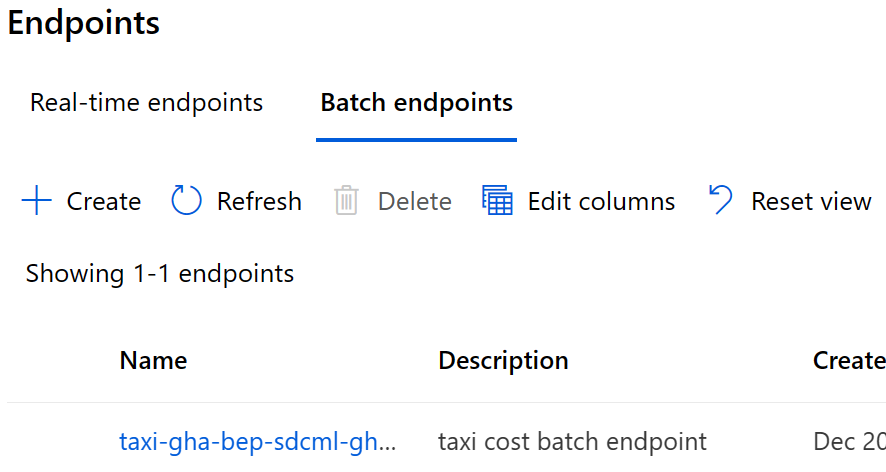

# Set up MLOps with GitHub

[!INCLUDE [dev v2](../../includes/machine-learning-dev-v2.md)]

Azure Machine Learning allows you to integrate with [GitHub Actions](https://docs.github.com/actions) to automate the machine learning lifecycle. Some of the operations you can automate are:

* Deployment of Azure Machine Learning infrastructure
* Data preparation (extract, transform, load operations)
* Training machine learning models with on-demand scale-out and scale-up
* Deployment of machine learning models as public or private web services
* Monitoring deployed machine learning models (such as for performance analysis)

In this article, you learn about using Azure Machine Learning to set up an end-to-end MLOps pipeline that runs a linear regression to predict taxi fares in NYC. The pipeline is made up of components, each serving  different functions, which can be registered with the workspace, versioned, and reused with various inputs and outputs. you're going to be using the [recommended Azure architecture for MLOps](/azure/architecture/data-guide/technology-choices/machine-learning-operations-v2) and [Azure MLOps (v2) solution accelerator](https://github.com/Azure/mlops-v2) to quickly setup an MLOps project in Azure Machine Learning.

> [!TIP]
> We recommend you understand some of the [recommended Azure architectures](/azure/architecture/data-guide/technology-choices/machine-learning-operations-v2) for MLOps before implementing any solution. You'll need to pick the best architecture for your given Machine learning project.

## Prerequisites

- An Azure subscription. If you don't have an Azure subscription, create a free account before you begin. Try the [free or paid version of Machine Learning](https://azure.microsoft.com/free/).
- A Machine Learning workspace.
- Git running on your local machine.
- GitHub as the source control repository

> [!NOTE]
>
>Git version 2.27 or newer is required. For more information on installing the Git command, see https://git-scm.com/downloads and select your operating system

> [!IMPORTANT]
>The CLI commands in this article were tested using Bash. If you use a different shell, you may encounter errors.

## Set up authentication with Azure and DevOps

Before you can set up an MLOps project with Machine Learning, you need to set up authentication for Azure DevOps.

### Create service principal
   Create one Prod service principal for this demo. You can add more depending on how many environments, you want to work on (Dev or Prod or Both). Service principals can be created using one of the following methods:

# [Create from Azure Cloud Shell](#tab/azure-shell)

1. Launch the [Azure Cloud Shell](https://shell.azure.com).

    > [!TIP]
    > The first time you've launched the Cloud Shell, you'll be prompted to create a storage account for the Cloud Shell.

1. If prompted, choose **Bash** as the environment used in the Cloud Shell. You can also change environments in the drop-down on the top navigation bar

    

1. Copy the following bash commands to your computer and update the **projectName**, **subscriptionId**, and **environment** variables with the values for your project. This command will also grant the **Contributor** role to the service principal in the subscription provided. This is required for GitHub Actions to properly use resources in that subscription. 

    ``` bash
    projectName="<your project name>"
    roleName="Contributor"
    subscriptionId="<subscription Id>"
    environment="<Prod>" #First letter should be capitalized
    servicePrincipalName="Azure-ARM-${environment}-${projectName}"
    # Verify the ID of the active subscription
    echo "Using subscription ID $subscriptionID"
    echo "Creating SP for RBAC with name $servicePrincipalName, with role $roleName and in scopes     /subscriptions/$subscriptionId"
    az ad sp create-for-rbac --name $servicePrincipalName --role $roleName --scopes /subscriptions/$subscriptionId --sdk-auth 
    echo "Please ensure that the information created here is properly save for future use."
    ```

1. Copy your edited commands into the Azure Shell and run them (**Ctrl** + **Shift** + **v**).

1. After running these commands, you'll be presented with information related to the service principal. Save this information to a safe location, you'll use it later in the demo to configure Azure DevOps.

    ```json

      {
      "clientId": "<service principal client id>",  
      "clientSecret": "<service principal client secret>",
      "subscriptionId": "<Azure subscription id>",  
      "tenantId": "<Azure tenant id>",
      "activeDirectoryEndpointUrl": "https://login.microsoftonline.com",
      "resourceManagerEndpointUrl": "https://management.azure.com/", 
      "activeDirectoryGraphResourceId": "https://graph.windows.net/", 
      "sqlManagementEndpointUrl": "https://management.core.windows.net:8443/",
      "galleryEndpointUrl": "https://gallery.azure.com/",
      "managementEndpointUrl": "https://management.core.windows.net/" 
      }
    ```

1. Copy all of this output, braces included. Save this information to a safe location, it will be use later in the demo to configure GitHub Repo.

1. Close the Cloud Shell once the service principals are created. 
      

# [Create from Azure portal](#tab/azure-portal)

1. Navigate to [Azure App Registrations](https://entra.microsoft.com/#view/Microsoft_AAD_RegisteredApps/ApplicationsListBlade/quickStartType~/null/sourceTypeMicrosoft_AAD_IAM)

1. Select **New Registration**.

    

1. Go through the process of creating a Service Principal (SP) selecting **Accounts in any organizational directory (Any Azure AD directory - Multitenant)** and name it  **Azure-ARM-Prod-ProjectName**. Replace **ProjectName** with the name of your project so that the service principal can be uniquely identified. 

1. Go to **Certificates & Secrets** and add for each SP **New client secret**, then store the value and secret separately.

1. To assign the necessary permissions to these principals, select your respective [subscription](https://portal.azure.com/#view/Microsoft_Azure_BillingSubscriptionsBlade?) and go to IAM. Select **+Add** then select **Add Role Assignment**.

    

1. Select Contributor and add members selecting + Select Members. Add the member **Azure-ARM-Prod-ProjectName** as create before.

    

---

## Set up GitHub repo

1. Fork the [MLOps v2 Demo Template Repo](https://github.com/Azure/mlops-v2-gha-demo) in your GitHub organization

1. Go to https://github.com/Azure/mlops-v2-gha-demo/fork to fork the MLOps v2 demo repo into your Github org. This repo has reusable MLOps code that can be used across multiple projects. 

   

1. From your GitHub project, select **Settings**:

      

1. Then select **Secrets**, then **Actions**:

      

1. Select **New repository secret**. Name this secret **AZURE_CREDENTIALS** and paste the service principal output as the content of the secret.  Select **Add secret**.
      

1. Add each of the following additional GitHub secrets using the corresponding values from the service principal output as the content of the secret:  
      > **ARM_CLIENT_ID**  
      > **ARM_CLIENT_SECRET**  
      > **ARM_SUBSCRIPTION_ID**  
      > **ARM_TENANT_ID**  

      

> [!NOTE]
> This finishes the prerequisite section and the deployment of the solution accelerator can happen accordingly.


## Deploy machine learning project infrastructure with GitHub Actions
This step deploys the training pipeline to the Machine Learning workspace created in the previous steps. 

> [!TIP]
> Make sure you understand the [Architectural Patterns](/azure/architecture/data-guide/technology-choices/machine-learning-operations-v2) of the solution accelerator before you checkout the MLOps v2 repo and deploy the infrastructure. In examples you'll use the [classical ML project type](/azure/architecture/data-guide/technology-choices/machine-learning-operations-v2#classical-machine-learning-architecture).

### Configure Machine Learning environment parameters
 1. Go to your repository and select the `config-infra-prod.yml` file in the root. Change the following parameters to your liking, and then **commit** the changes.

    This config file uses the namespace and postfix values the names of the artifacts to ensure uniqueness. Update the following section in the config to your liking. Default values and settings in the files are show below:
  
    ```bash
      namespace: mlopslite #Note: A namespace with many characters will cause storage account creation to fail due to storage account names having a limit of 24 characters.
      postfix: ao04
      location: westus
    
      environment: prod
      enable_aml_computecluster: true
      enable_aml_secure_workspace: true
      enable_monitoring: false
    ```
    > [!NOTE]
    > If you are running a Deep Learning workload such as CV or NLP, ensure your GPU compute is available in your deployment zone.
    > The enable_monitoring flag in these files defaults to False. Enabling this flag will add additional elements to the deployment to support Azure ML monitoring based on https://github.com/microsoft/AzureML-Observability. This will include an ADX cluster and increase the deployment time and cost of the MLOps solution.
   
### Deploy Machine Learning infrastructure

1. In your GitHub project repository (ex: taxi-fare-regression), select **Actions**

   

This displays the pre-defined GitHub workflows associated with your project. For a classical machine learning project, the available workflows look similar to this:

   

1. Select would be **tf-gha-deploy-infra.yml**. This would deploy the Azure ML infrastructure using GitHub Actions and Terraform.

   

1. On the right side of the page, select **Run workflow** and select the branch to run the workflow on. This may deploy Dev Infrastructure if you've created a dev branch or Prod infrastructure if deploying from main. Monitor the workflow for successful completion.

   

1. When the pipeline has complete successfully, you can find your Azure ML Workspace and associated resources by logging in to the Azure Portal. Next, a model training and scoring pipelines will be deployed into the new Machine Learning environment.


## Sample Training and Deployment Scenario      

The solution accelerator includes code and data for a sample end-to-end machine learning pipeline which runs a linear regression to predict taxi fares in NYC. The pipeline is made up of components, each serving different functions, which can be registered with the workspace, versioned, and reused with various inputs and outputs. Sample pipelines and workflows for the Computer Vision and NLP scenarios will have different steps and deployment steps.

This training pipeline contains the following steps:

**Prepare Data**
   - This component takes multiple taxi datasets (yellow and green) and merges/filters the data, and prepare the train/val and evaluation datasets.
   - Input: Local data under `./data/` (multiple .csv files)
   - Output: Single prepared dataset (.csv) and train/val/test datasets.

**Train Model**
   - This component trains a Linear Regressor with the training set.
   - Input: Training dataset
   - Output: Trained model (pickle format)
   
**Evaluate Model**
   - This component uses the trained model to predict taxi fares on the test set.
   - Input: ML model and Test dataset
   - Output: Performance of model and a deploy flag whether to deploy or not.
   - This component compares the performance of the model with all previous deployed models on the new test dataset and decides whether to promote or not model into production. Promoting model into production happens by registering the model in AML workspace.

**Register Model**
   - This component scores the model based on how accurate the predictions are in the test set.
   - Input: Trained model and the deploy flag.
   - Output: Registered model in Machine Learning.

## Deploying the Model Training Pipeline

Next, you will deploy the model training pipeline to your new Machine Learning workspace. This pipeline will create a compute cluster instance, register a training environment defining the necessary Docker image and python packages, register a training dataset, then start the training pipeline described in the last section. When the job is complete, the trained model will be registered in the Azure ML workspace and be available for deployment.

1. In your GitHub project repository (example: taxi-fare-regression), select **Actions**  
 
   
      
1. Select the **deploy-model-training-pipeline** from the workflows listed on the left and the click **Run Workflow** to execute the model training workflow. This will take several minutes to run, depending on the compute size. 

   
   
1. Once completed, a successful run will register the model in the Machine Learning workspace. 
   
    

> [!NOTE] 
> If you want to check the output of each individual step, for example to view output of a failed run, click a job output, and then click each step in the job to view any output of that step. 

With the trained model registered in the Machine learning workspace, you are ready to deploy the model for scoring.

### Deploying the Trained Model

This scenario includes prebuilt workflows for two approaches to deploying a trained model, batch scoring or a deploying a model to an endpoint for real-time scoring. You may run either or both of these workflows to test the performance of the model in your Azure ML workspace.

1. In your GitHub project repository (ex: taxi-fare-regression), select **Actions**  
 
   

### Online Endpoint  
      
1. Select the **deploy-online-endpoint-pipeline** from the workflows listed on the left and click **Run workflow** to execute the online endpoint deployment pipeline workflow. The steps in this pipeline will create an online endpoint in your Machine Learning workspace, create a deployment of your model to this endpoint, then allocate traffic to the endpoint.

   
   
    Once completed, you will find the online endpoint deployed in the Azure ML workspace and available for testing.

   

1. To test this deployment, go to the **Endpoints** tab in your Machine Learning workspace, select the endpoint and click the **Test** Tab. You can use the sample input data located in the cloned repo at `/data/taxi-request.json` to test the endpoint.
   
    

### Batch Endpoint
      
1. Select the **deploy-batch-endpoint-pipeline** from the workflows and click **Run workflow** to execute the batch endpoint deployment pipeline workflow. The steps in this pipeline will create a new AmlCompute cluster on which to execute batch scoring, create the batch endpoint in your Machine Learning workspace, then create a deployment of your model to this endpoint.


2. Once completed, you will find the batch endpoint deployed in the Azure ML workspace and available for testing.


   
## Moving to production

Example scenarios can be trained and deployed both for Dev and Prod branches and environments. When you are satisfied with the performance of the model training pipeline, model, and deployment in Testing, Dev pipelines and models can be replicated and deployed in the Production environment.

The sample training and deployment Machine Learning pipelines and GitHub workflows can be used as a starting point to adapt your own modeling code and data.

## Clean up resources

1. If you're not going to continue to use your pipeline, delete your Azure DevOps project. 
1. In Azure portal, delete your resource group and Machine Learning instance.

## Next steps

* [Install and set up Python SDK v2](https://aka.ms/sdk-v2-install)
* [Install and set up Python CLI v2](how-to-configure-cli.md)
* [Azure MLOps (v2) solution accelerator](https://github.com/Azure/mlops-v2) on GitHub
* Learn more about [Azure Pipelines with Machine Learning](how-to-devops-machine-learning.md)
* Learn more about [GitHub Actions with Machine Learning](how-to-github-actions-machine-learning.md)
* Deploy MLOps on Azure in Less Than an Hour - [Community MLOps V2 Accelerator video](https://www.youtube.com/watch?v=5yPDkWCMmtk)
