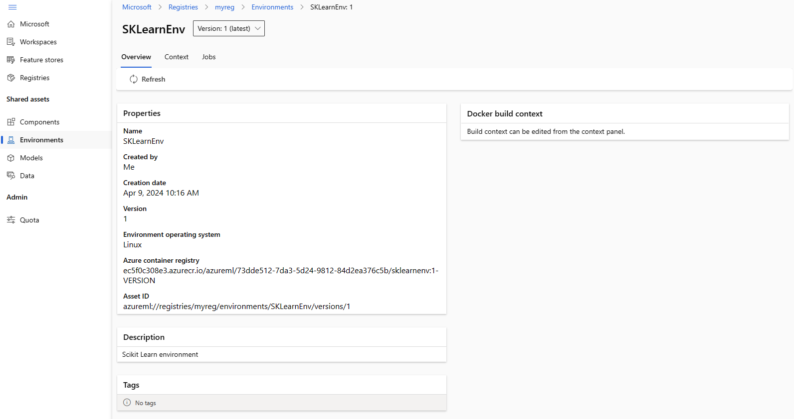
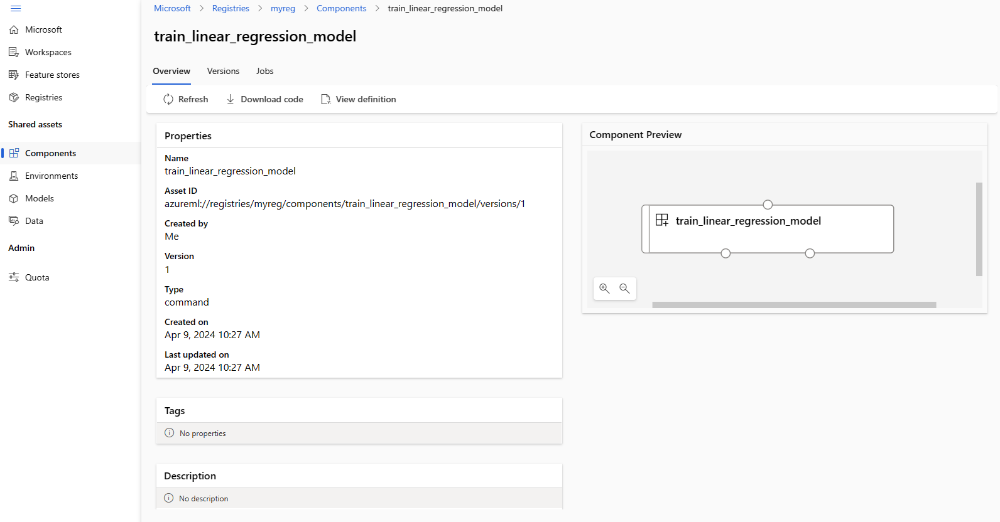
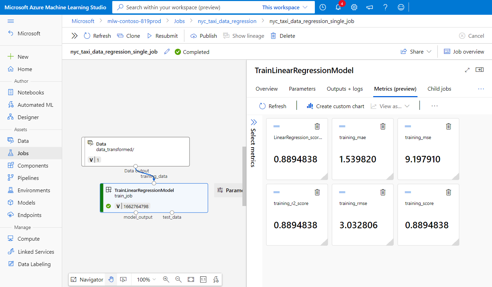

# Share models, components and environments across workspaces with registries using SDK v2 (preview)

There are two scenarios where you'd want to use the same set of models, components and environments in multiple workspaces. First is cross-workspace MLOps. You are trining a model in a `dev` workspace and need to deploy it to `test` and `prod` workspaces. In this case you want to have end-to-end lineage between endpoints to which the model is deployed in `test` or `prod` workspaces and the training job, metrics, code, data and environment that was used to train the model in the `dev` workspace. Second is to share and reuse models and pipelines across different teams in your organization that in turn improves collaboration and productivity. In this scenario, you may want to publish a trained model and the associated components and environments used to train the model to a central catalog where colleagues from other teams and search and reuse assets shared by you in their experiments. You will learn how to create models, components and environments in a Azure Machine Learning registry and use them in any workspace within your organization. 

## Prerequisites

* If you don't have an Azure subscription, create a free account before you begin. Try the [free or paid version of Azure Machine Learning](https://azure.microsoft.com/free/) today
* The Azure Machine Learning [SDK v2 for Python](https://aka.ms/sdk-v2-install)
* You need a registry to create models, components and environments. [Learn how to create a registry](todo)
* You need a workspace to run jobs and deploy models. Learn how to create a workspace using [Python SDK (v2)](todo - did not find a v2 doc for workspace create using sdk v2). Make sure that the Azure location of the workspace is in the list of supported regions of the registry. 

### Clone examples repository

We will use the `nyc_taxi_data_regression` sample from the the examples repository in this document. Clone the `github.com/Azure/azureml-examples`. The sample notebook `share-models-components-environments.ipynb` is available in the `sdk/resources/registry` folder. All the sample YAML for components, model training code, sample data for training and inference is available in `cli/jobs/pipelines-with-components/nyc_taxi_data_regression`. Change to the `sdk/resources/registry` and open the `share-models-components-environments.ipynb` notebook if you like to step through a notebook to try out the code in this document. 

```
git clone https://github.com/Azure/azureml-examples
# changing branch is temporary until samples merge to main
git checkout mabables/registry
```


## Tasks you will learn in this document

* Create and environment and components in the registry.
* Use the component from registry to submit a model training job in a workspace.
* Register the trained model in the workspace.
* Deploy the model from the registry to an online-endpoint in the workspace and submit some inference requests.
 
 To accomplish this flow, lets gets started by creating a connection to the a workspace and a registry. 

 ```python
ml_client_workspace = MLClient( credential=credential,
    subscription_id = "<workspace-subscription>",
    resource_group_name = "<workspace-resource-group",
    workspace_name = "<workspace-name>")
print(ml_client_workspace)

ml_client_registry = MLClient ( credential=credential,
        registry_name = "<registry-name>")
print(ml_client_registry)
```

## Create Environment in Registry

Environments define the docker container and python dependencies required to run training jobs or deploy models. Review [environment concepts](./concept-environments.md) and [how to create environments](./how-to-manage-environments-v2.md) to learn more. <- Need to replace this with python sdk how to for environments, did not find doc for that. 

> [!TIP]
> The same `MLClient.environments.create_or_update()` can be used to create environments in either a workspace or a registry depending on the target it has been initialized with. Since you work wth both workspace and registry in this document, you have initialized `ml_client_workspace` and `ml_client_registry` to work with workspace and registry respectively. 


We will create an environment that uses the `python:3.8` docker image and installs Python packages required to run a training job using the SciKit Learn framework. The `Dockerfile` with base image and list of Python packages to install is available in `cli/jobs/pipelines-with-components/nyc_taxi_data_regression/env_train`. Initialize the environment object and create the environment.

```python
env_docker_context = Environment(
    build=BuildContext(path="../../../cli/jobs/pipelines-with-components/nyc_taxi_data_regression/env_train/"),
    name="SKLearnEnv",
    version=str(1),
    description="Scikit Learn environment",
)
ml_client_registry.environments.create_or_update(env_docker_context)
```
> [!TIP]
> If you get an error that an environment with this name and version already exists in the registry, specify a different version for the `version` parameter.

Note down the `name` and `version` of the environment from the output and pass them to the `ml_client_registry.environments.get()` method to fetch the environment from registry. 

 You can also use `ml_client_registry.environments.list()` to list all environments in the registry or browse all environments in the AzureML Studio UI. Make sure you navigate to the global UI and look for the Registries hub.



 
## Create Component in Registry

Components are reusable building blocks of Machine Learning pipelines in AzureML. You can package the code, command, environment, input interface and output interface of an individual pipeline step into a component and then reuse it across pipelines without having to worry about porting dependencies and code each time you write a different pipeline with similar step. Creating a component in a workspace allows you to use the component in any pipeline job within that workspace. Creating a component in a registry allows you to use the component in any pipeline in any workspace within your organization. Creating components in a registry is a great way to build modular reusable utilities or shared training tasks that can be used for experimentation by different teams within your organization. Review [component concepts](./concept-component.md) and [how to use components in pipelines](./how-to-create-component-pipeline-python.md) to learn how to develop components and use them in pipelines. 

Review the component definition file `train.yml` and the Python code `train_src/train.py` to train a regression model using Scikit Learn available in the `cli/jobs/pipelines-with-components/nyc_taxi_data_regression` folder. Load the component object from the component definition file `train.yml`. 

```python
parent_dir = "../../../cli/jobs/pipelines-with-components/nyc_taxi_data_regression"
train_model = load_component(path=parent_dir + "/train.yml")
print(train_model)
```

Update the `environment` to point to the `SKLearnEnv` environment created in the previous section and create the environment. 
```
train_model.environment=env_from_registry
ml_client_registry.components.create_or_update(train_model)
```

> [!TIP]
> If you get an error that the name of the component already exists in the registry, you can either update the version with `train_model.version=<unique_version_number>` before creating the component. 

Note down the `name` and `version` of the component from the output and pass them to the `ml_client_registry.component.get()` method to fetch the component from registry. 

 You can also use `ml_client_registry.component.list()` to list all components in the registry or browse all components in the AzureML Studio UI. Make sure you navigate to the global UI and look for the Registries hub.

 

## Run a pipeline job in a workspace using component from registry

Review [running jobs with SDK (v2)](./how-to-train-sdk.md) and [pipeline jobs with components](./how-to-create-component-pipeline-python.md) to learn how to run jobs to process data, train models, evaluate models, or any utility commands.

You will run a pipeline job with the Scikit Learn training component created in the previous section to train a model. The training dataset is located in the `cli/jobs/pipelines-with-components/nyc_taxi_data_regression/data_transformed` folder. Construct the pipeline using the component created in the previous step. The key aspect note here is that the pipeline is going to run in a workspace using a component that is not in the specific workspace, but in a registry that can be used with any workspace in your orgnization. This means you can run this training job in any workspace you have access to without having worry about making the training code and environment available in that workspace. 

```Python
@pipeline()
def pipeline_with_registered_components(
    training_data
):
    train_job = train_component_from_registry(
        training_data=training_data,
    )
pipeline_job = pipeline_with_registered_components(
    training_data=Input(type="uri_folder", path=parent_dir + "/data_transformed/"),
)
pipeline_job.settings.default_compute = "cpu-cluster"
print(pipeline_job)
```  
> [!WARNING]
> Confirm that the workspace in which you will run this job is in a Azure location that is supported by the registry in which you created the component before you run the pipeline job.

> [!WARNING]
> Confirm that the workspace has a compute cluster with the name `cpu-cluster` or update it `pipeline_job.settings.default_compute=<compute-cluster-name>`.

Run the pipeline job and wait for it to complete. 
```python
pipeline_job = ml_client_workspace.jobs.create_or_update(
    pipeline_job, experiment_name="sdk_job_component_from_registry" ,  skip_validation=True
)
ml_client_workspace.jobs.stream(pipeline_job.name)
pipeline_job=ml_client_workspace.jobs.get(pipeline_job.name)
pipeline_job
```

> [!TIP]
> Notice that you are using `ml_client_workspace` to run the pipeline job whereas you had used `ml_client_registry` to use create environment and component.

You can click on the Studio UI link in the job output to view the the job in the Studio UI where you analyze training metrics, verify that the job is using component and environment from registry and review the trained model. Note down the `name` of the job from the output or find the same from the job overview in the Studio UI. You will need this to  download the trained model in the next section on creating models in registry. 



## Create a model in registry

You will learn how to create models in a registry in this section. Review [manage models](./how-to-manage-models.md) to learn more about model management in AzureML. We will look at two different ways to create a model in a registry. First is from local files. Second, is to copy a model registered in the workspace to a registry. 

In both the options, you will create model with the [MLflow format](./how-to-manage-models-mlflow.md), which will help you to [deploy this model for inference without writing any inference code](./how-to-deploy-mlflow-models-online-endpoints.md). 

### Create a model in registry from local files

Make sure you use the `pipeline_job` object from the previous section or fetch the pipeline job using `ml_client_workspace.jobs.get(name="<pipeline-job-name>")` method to get the list of child jobs in the pipeline. You will then look for the job with `display_name` as `train_job` and download the trained model from `train_job` output.The downloaded model along with MLflow metadata files should be available in the `./artifacts/model/`.

```python
jobs=ml_client_workspace.jobs.list(parent_job_name=pipeline_job.name)
for job in jobs:
    if (job.display_name == "train_job"):
        print (job.name)
        ml_client_workspace.jobs.download(job.name)
```
If you are unable to download the model, you can find sample MLflow model trained by the training job in the previous section in `sdk/resources/registry/model` folder.

Create the model in the registry.

```python
mlflow_model = Model(
    path="./artifacts/model/",
    type=AssetTypes.MLFLOW_MODEL,
    name="nyc-taxi-model",
    version=str(1), # use str(int(time.time())) if you want a random model number
    description="MLflow model created from local path",
)
ml_client_registry.model.create_or_update(mlflow_model)
```


### Copy a model from workspace to registry 

In this option, you will first create a the model in workspace and then copy it to registry. This is helpful when you want to register the model in the workspace, deploy it to endpoints, try out inference with some test data and then copy the model to a registry if everything looks good. Another scenario where this many be useful is you are developing a series of models using different techniques, frameworks or parameters and want to promote just one of them to the registry as a production candidate. 

Make sure you use the `pipeline_job` object from the previous section or fetch the pipeline job using `ml_client_workspace.jobs.get(name="<pipeline-job-name>")` method to get the list of child jobs in the pipeline. You will then look for the job with `display_name` as `train_job` and use the `name` of the `train_job` to construct the path pointing to the model output, which looks like this: `azureml://jobs/<job_name>/outputs/default/model`.

```python
jobs=ml_client_workspace.jobs.list(parent_job_name=pipeline_job.name) 
for job in jobs:
    if (job.display_name == "train_job"):
        print (job.name)
        model_path_from_job="azureml://jobs/{job_name}/outputs/default/model".format(job_name=job.name)
print(model_path_from_job)
```

Register the model from the output of the training job into the workspace using the path constructed above.

```python
mlflow_model = Model(
    path=model_path_from_job,
    type=AssetTypes.MLFLOW_MODEL,
    name="nyc-taxi-model",
    version=version_timestamp,
    description="MLflow model created from job output",
)
ml_client_workspace.model.create_or_update(mlflow_model)
```

> [!TIP]
> Notice that you are using MLClient object `ml_client_workspace` since you are creating the model in the workspace. 

Note down the model name and version. You can validate if the model is registered in the workspace by browsing it in the Studio UI or fetching it using `ml_client_workspace.model.get()` method.

Next, you will now copy the model from the workspace to the registry. Construct the path to the model with the workspace using the `azureml://subscriptions/<subscription-id-of-workspace>/resourceGroups/<resource-group-of-workspace>/workspaces/<workspace-name>/models/<model-name>/versions/<model-version>` syntax.


```python
model_path_from_workspace="azureml://subscriptions/<subscription-id-of-workspace>/resourceGroups/<resource-group-of-workspace>/workspaces/<workspace-name>/models/<model-name>/versions/<model-version>
print(model_path_from_workspace)
mlflow_model = Model(
    path=model_path_from_workspace
)
ml_client_registry.model.create_or_update(mlflow_model)
```
> [!TIP]
> Make sure to use the right model name and version if you changed it in the `ml_client_workspace.model.create_or_update()` method used to create the model in workspace. 

Note down the `name` and `version` of the model from the output and use them with `ml_client_workspace.model.get()` commands as follows. You will need the `name` and `version` in the next section when you deploy the model to an online endpoint for inference. 

```python 
mlflow_model_from_registry = ml_client_registry.models.get(name="nyc-taxi-model", version=str(1))
print(mlflow_model_from_registry)
```
 You can also use `ml_client_registry.models.list()` to list all models in the registry or browse all components in the AzureML Studio UI. Make sure you navigate to the global UI and look for the Registries hub.

Below screenshot shows a model in a registry in AzureML Studio UI. If you created a model from the job output and then copied the model from the workspace to registry, you will see that the model has a link to the job that trained the model. You can use that link to navigate to the training job to review the code, environment and data used to train the model.

 

## Deploy model from registry to online endpoint in workspace

In the last section, you will deploy a model from registry to an online endpoint in a workspace. You can choose to deploy any workspace you have access to in your orgnization, provided the location of the workspace is one of the locations supported by the registry. This capability is helpful if you trained a model in a `dev` workspace and now need to deploy the model to `test` or `prod` workspace, while preserving the lineage information around the code, environment and data used to train the model.

Online endpoints let you deploy model and submit inference requests. Review [managed endpoints](./how-to-deploy-managed-online-endpoint-sdk-v2.md) to learn more. 

Create a online endpoint. 

```python
online_endpoint_name = "endpoint-" + datetime.datetime.now().strftime("%m%d%H%M%f")
endpoint = ManagedOnlineEndpoint(
    name=online_endpoint_name,
    description="this is a sample online endpoint for mlflow model",
    auth_mode="key"
)
ml_client_workspace.begin_create_or_update(endpoint)
```

Make sure you have the `mlflow_model_from_registry` model object from the previous section or fetch the model from the registry using `ml_client_registry.models.get()` method. Pass it to the deployment configuration object and ceate the online deployment. The deployment takes several minutes to complete. Set all traffic to be routed to the new deployment. 

```python
demo_deployment = ManagedOnlineDeployment(
    name="demo",
    endpoint_name=online_endpoint_name,
    model=mlflow_model_from_registry,
    instance_type="Standard_F4s_v2",
    instance_count=1
)
ml_client_workspace.online_deployments.begin_create_or_update(demo_deployment)

endpoint.traffic = {"demo": 100}
ml_client_workspace.begin_create_or_update(endpoint)
```

Submit a sample scoring request using the sample data file `scoring-data.json` available in the `cli/jobs/pipelines-with-components/nyc_taxi_data_regression` folder to which the `parent_dir` is pointing to. 

```azurecli
# test the  deployment with some sample data
ml_client_workspace.online_endpoints.invoke(
    endpoint_name=online_endpoint_name,
    deployment_name="demo",
    request_file=parent_dir + "/scoring-data.json"
)
```
## Clean up resources

If you aren't going use the deployment, you should delete it by running the following code which deletes the endpoint and all the underlying deployments.

```python
ml_client_workspace.online_endpoints.begin_delete(name=online_endpoint_name)
```
If you aren't going use the registry, you should delete the registry. Refer to the <todo> document to delete the registry.


