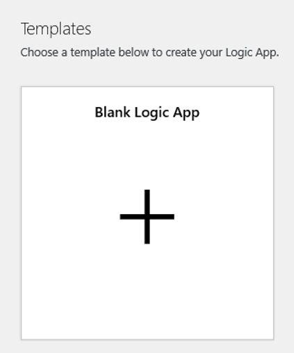
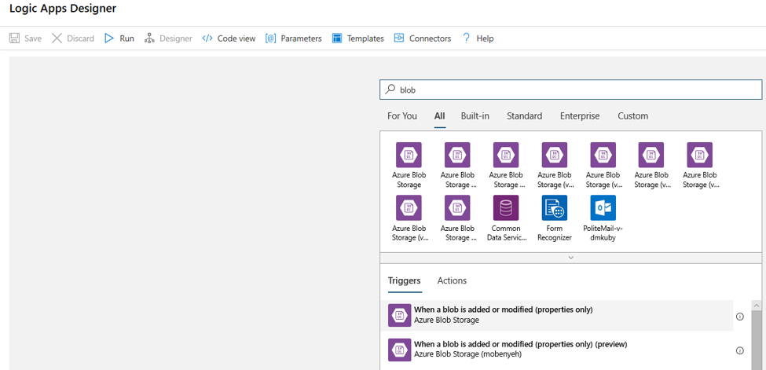
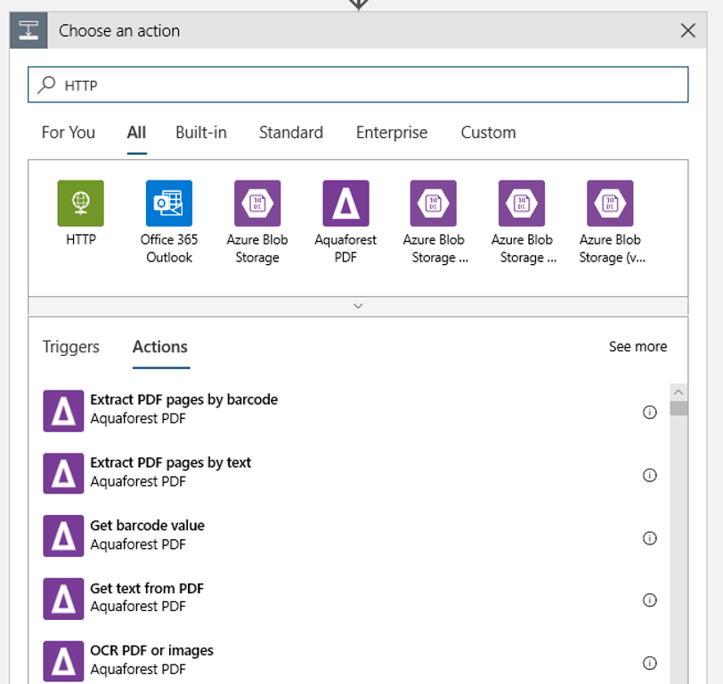

# Trigger a run of a Machine Learning pipeline from a Logic App

Trigger the run of your Azure Machine Learning Pipeline when new data appears. For example, you may want to trigger the pipeline to train a new model when new data appears the blob storage account.

You'll use:
* [A published Machine Learning pipeline](concept-ml-pipelines.md).
* [Azure blob storage](../storage/blobs/storage-blobs-overview.md) to store your data.
* [Azure Logic Apps](../logic-apps/logic-apps-overview.md).

## Create and publish the pipeline

First [create and publish your pipeline](how-to-create-your-first-pipeline.md).  Use the pipeline ID to find the REST endpoint of your PublishedPipeline.

```
# You can find the pipeline ID in Azure Machine Learning studio

published_pipeline = PublishedPipeline.get(ws, id="<pipeline-id-here")
published_pipeline.endpoint 
```

### Set up a datastore

In your Machine Learning workspace, [define a datastore](how-to-access-data.md) with the details from your blob storage account.

## Create a Logic App

Now create an [Azure Logic App](../logic-apps/logic-apps-overview.md) instance. Once your Logic App has been provisioned, use these steps to configure it:

1.  [Create a system-assigned managed identity](../logic-apps/create-managed-service-identity.md) to give the app access to your Azure Machine Learning Workspace. 

1. Navigate to the LogicApp Designer view and select the Blank Logic App template. 
    > [!div class="mx-imgBorder"]
    > 

1. In the Designer, search for **blob**. Select the **When a blob is added or modified (properties only)** trigger and add this trigger to your Logic App.
    > [!div class="mx-imgBorder"]
    > 

1. Fill in the connection info for the Blob storage account you wish to monitor for blob additions or modifications. Select the Container to monitor. This trigger will not monitor subfolders of the selected Container.
 
    Choose the **Interval** and **Frequency** to poll for updates that work for you.  

1. Add an HTTP action that will run when a new or modified blob is detected. Select **+ New Step**, then search for and select the HTTP action. Use the following settings.

    | Setting | Value | 
    |---|---|
    | HTTP action | POST |
    | URI |the endpoint that you found at the beginning of this article
    | Authentication mode | Managed Identity |

    > [!div class="mx-imgBorder"]
    > 

1. Set up your schedule to set the value of any [DataPath PipelineParameters](https://github.com/Azure/MachineLearningNotebooks/blob/master/how-to-use-azureml/machine-learning-pipelines/intro-to-pipelines/aml-pipelines-showcasing-datapath-and-pipelineparameter.ipynb) you may have:

    ```json
    "DataPathAssignments": { 
                            "input_datapath": { 
                            "DataStoreName": "<datastore-name>", 
                            "RelativePath": "@triggerBody()?['Name']" 
                            } 
                            }, 
                            "ExperimentName": "MyRestPipeline", 
                            "ParameterAssignments": { 
                                "input_string": "sample_string3" 
                            },
    ```

     Use the `DataStoreName` you added to your workspace.
     
    > [!div class="mx-imgBorder"]
    > 

1. Select **Save** and your schedule is now ready.