# Evaluate automated machine learning experiment results

In this article, learn how to evaluate and compare models trained by your automated machine learning (automated ML) experiment. Over the course of an automated ML experiment, many runs are created and each run creates a model. For each model, automated ML generates evaluation metrics and charts that help you measure the model's performance. 

For example, automated ML generates the following charts based on experiment type.

| Classification| Regression/forecasting |
| ----------------------------------------------------------- | ---------------------------------------- |
| [Confusion matrix](#confusion-matrix)                       | [Residuals histogram](#residuals)        |
| [Receiver operating characteristic (ROC) curve](#roc-curve) | [Predicted vs. true](#predicted-vs-true) |
| [Precision-recall (PR) curve](#precision-recall-curve)      |                                          |
| [Lift curve](#lift-curve)                                   |                                          |
| [Cumulative gains curve](#cumulative-gains-curve)           |                                          |
| [Calibration curve](#calibration-curve)                     |                     

## Prerequisites

- An Azure subscription. (If you don't have an Azure subscription, [create a free account](https://azure.microsoft.com/free/) before you begin)
- An Azure Machine Learning experiment created with either:
  - The [Azure Machine Learning studio](how-to-use-automated-ml-for-ml-models.md) (no code required)
  - The [Azure Machine Learning Python SDK](how-to-configure-auto-train.md)

## View run results

After your automated ML experiment completes, a history of the runs can be found via:
  - A browser with [Azure Machine Learning studio](overview-what-is-machine-learning-studio.md)
  - A Jupyter notebook using the [RunDetails Jupyter widget](/python/api/azureml-widgets/azureml.widgets.rundetails)

The following steps and video, show you how to view the run history and model evaluation metrics and charts in the studio:

1. [Sign into the studio](https://ml.azure.com/) and navigate to your workspace.
1. In the left menu, select **Experiments**.
1. Select your experiment from the list of experiments.
1. In the table at the bottom of the page, select an automated ML run.
1. In the **Models** tab, select the **Algorithm name** for the model you want to evaluate.
1. In the **Metrics** tab, use the checkboxes on the left to view metrics and charts.

## Classification metrics

Automated ML calculates performance metrics for each classification model generated for your experiment. These metrics are based on the scikit learn implementation. 

Many classification metrics are defined for binary classification on two classes, and require averaging over classes to produce one score for multi-class classification. Scikit-learn provides several averaging methods, three of which automated ML exposes: **macro**, **micro**, and **weighted**.

- **Macro** - Calculate the metric for each class and take the unweighted average
- **Micro** - Calculate the metric globally by counting the total true positives, false negatives, and false positives (independent of classes).
- **Weighted** - Calculate the metric for each class and take the weighted average based on the number of samples per class.

While each averaging method has its benefits, one common consideration when selecting the appropriate method is class imbalance. If classes have different numbers of samples, it might be more informative to use a macro average where minority classes are given equal weighting to majority classes. Learn more about [binary vs multiclass metrics in automated ML](#binary-vs-multiclass-classification-metrics). 

The following table summarizes the model performance metrics that automated ML calculates for each classification model generated for your experiment. For more detail, see the scikit-learn documentation linked in the **Calculation** field of each metric. 

> [!NOTE]
> Refer to [image metrics](#metrics-for-image-models-preview) section for additional details on metrics for image classification models.

|Metric|Description|Calculation|
|--|--|---|
|AUC | AUC is the Area under the [Receiver Operating Characteristic Curve](#roc-curve).   **Objective:** Closer to 1 the better   **Range:** [0, 1]   Supported metric names include, <li>`AUC_macro`, the arithmetic mean of the AUC for each class.<li> `AUC_micro`, computed by counting the total true positives, false negatives, and false positives. <li> `AUC_weighted`, arithmetic mean of the score for each class, weighted by the number of true instances in each class. <li> `AUC_binary`, the value of AUC by treating one specific class as `true` class and combine all other classes as `false` class.  |[Calculation](https://scikit-learn.org/0.22/modules/generated/sklearn.metrics.roc_auc_score.html) | 
|accuracy| Accuracy is the ratio of predictions that exactly match the true class labels.    **Objective:** Closer to 1 the better   **Range:** [0, 1]|[Calculation](https://scikit-learn.org/0.22/modules/generated/sklearn.metrics.accuracy_score.html)|
|average_precision|Average precision summarizes a precision-recall curve as the weighted mean of precisions achieved at each threshold, with the increase in recall from the previous threshold used as the weight.    **Objective:** Closer to 1 the better   **Range:** [0, 1]   Supported metric names include,<li>`average_precision_score_macro`, the arithmetic mean of the average precision score of each class.<li> `average_precision_score_micro`, computed by counting the total true positives, false negatives, and false positives.<li>`average_precision_score_weighted`, the arithmetic mean of the average precision score for each class, weighted by the number of true instances in each class. <li> `average_precision_score_binary`, the value of average precision by treating one specific class as `true` class and combine all other classes as `false` class.|[Calculation](https://scikit-learn.org/0.22/modules/generated/sklearn.metrics.average_precision_score.html)|
balanced_accuracy|Balanced accuracy is the arithmetic mean of recall for each class.   **Objective:** Closer to 1 the better   **Range:** [0, 1]|[Calculation](https://scikit-learn.org/0.22/modules/generated/sklearn.metrics.recall_score.html)|
f1_score|F1 score is the harmonic mean of precision and recall. It is a good balanced measure of both false positives and false negatives. However, it does not take true negatives into account.    **Objective:** Closer to 1 the better   **Range:** [0, 1]   Supported metric names include,<li>  `f1_score_macro`: the arithmetic mean of F1 score for each class. <li> `f1_score_micro`: computed by counting the total true positives, false negatives, and false positives. <li> `f1_score_weighted`: weighted mean by class frequency of F1 score for each class. <li> `f1_score_binary`, the value of f1 by treating one specific class as `true` class and combine all other classes as `false` class.|[Calculation](https://scikit-learn.org/0.22/modules/generated/sklearn.metrics.f1_score.html)|
log_loss|This is the loss function used in (multinomial) logistic regression and extensions of it such as neural networks, defined as the negative log-likelihood of the true labels given a probabilistic classifier's predictions.    **Objective:** Closer to 0 the better   **Range:** [0, inf)|[Calculation](https://scikit-learn.org/0.22/modules/generated/sklearn.metrics.log_loss.html)|
norm_macro_recall| Normalized macro recall is recall macro-averaged and normalized, so that random performance has a score of 0, and perfect performance has a score of 1.    **Objective:** Closer to 1 the better   **Range:** [0, 1] |`(recall_score_macro - R)`&nbsp;/&nbsp;`(1 - R)`   where, `R` is the expected value of `recall_score_macro` for random predictions.  `R = 0.5`&nbsp;for&nbsp; binary&nbsp;classification.  `R = (1 / C)` for C-class classification problems.|
matthews_correlation | Matthews correlation coefficient is a balanced measure of accuracy, which can be used even if one class has many more samples than another. A coefficient of 1 indicates perfect prediction, 0 random prediction, and -1 inverse prediction.   **Objective:** Closer to 1 the better   **Range:** [-1, 1]|[Calculation](https://scikit-learn.org/0.22/modules/generated/sklearn.metrics.matthews_corrcoef.html)|
precision|Precision is the ability of a model to avoid labeling negative samples as positive.    **Objective:** Closer to 1 the better   **Range:** [0, 1]   Supported metric names include, <li> `precision_score_macro`, the arithmetic mean of precision for each class. <li> `precision_score_micro`, computed globally by counting the total true positives and false positives. <li> `precision_score_weighted`, the arithmetic mean of precision for each class, weighted by number of true instances in each class. <li> `precision_score_binary`, the value of precision by treating one specific class as `true` class and combine all other classes as `false` class.|[Calculation](https://scikit-learn.org/0.22/modules/generated/sklearn.metrics.precision_score.html)|
recall| Recall is the ability of a model to detect all positive samples.    **Objective:** Closer to 1 the better   **Range:** [0, 1]   Supported metric names include, <li>`recall_score_macro`: the arithmetic mean of recall for each class. <li> `recall_score_micro`: computed globally by counting the total true positives, false negatives and false positives.<li> `recall_score_weighted`: the arithmetic mean of recall for each class, weighted by number of true instances in each class. <li> `recall_score_binary`, the value of recall by treating one specific class as `true` class and combine all other classes as `false` class.|[Calculation](https://scikit-learn.org/0.22/modules/generated/sklearn.metrics.recall_score.html)|
weighted_accuracy|Weighted accuracy is accuracy where each sample is weighted by the total number of samples belonging to the same class.   **Objective:** Closer to 1 the better  **Range:** [0, 1]|[Calculation](https://scikit-learn.org/0.22/modules/generated/sklearn.metrics.accuracy_score.html)|

### Binary vs. multiclass classification metrics

Automated ML automatically detects if the data is binary and also allows users to activate binary classification metrics even if the data is multiclass by specifying a `true` class. Multiclass classification metrics will be reported no matter if a dataset has two classes or more than two classes. Binary classification metrics will only be reported when the data is binary, or the users activate the option. 

> [!Note]
> When a binary classification task is detected, we use `numpy.unique` to find the set of labels and the later label will be used as the `true` class. Since there is a sorting procedure in `numpy.unique`, the choice of `true` class will be stable.

Note that multiclass classification metrics are intended for multiclass classification. When applied to a binary dataset, these metrics won't treat any class as the `true` class, as you might expect. Metrics that are clearly meant for multiclass are suffixed with `micro`, `macro`, or `weighted`. Examples include `average_precision_score`, `f1_score`, `precision_score`, `recall_score`, and `AUC`. For example, instead of calculating recall as `tp / (tp + fn)`, the multiclass averaged recall (`micro`, `macro`, or `weighted`) averages over both classes of a binary classification dataset. This is equivalent to calculating the recall for the `true` class and the `false` class separately, and then taking the average of the two.

Besides, although automatic detection of binary classification is supported, it is still recommended to always specify the `true` class manually to make sure the binary classification metrics are calculated for the correct class.

To activate metrics for binary classification datasets when the dataset itself is multiclass, users only need to specify the class to be treated as `true` class and these metrics will be calculated.

## Confusion matrix

Confusion matrices provide a visual for how a machine learning model is making systematic errors in its predictions for classification models. The word "confusion" in the name comes from a model "confusing" or mislabeling samples. A cell at row `i` and column `j` in a confusion matrix contains the number of samples in the evaluation dataset that belong to class `C_i` and were classified by the model as class `C_j`.

In the studio, a darker cell indicates a higher number of samples. Selecting **Normalized** view in the dropdown will normalize over each matrix row to show the percent of class `C_i` predicted to be class `C_j`. The benefit of the default **Raw** view is that you can see whether imbalance in the distribution of actual classes caused the model to misclassify samples from the minority class, a common issue in imbalanced datasets.

The confusion matrix of a good model will have most samples along the diagonal.

### Confusion matrix for a good model 
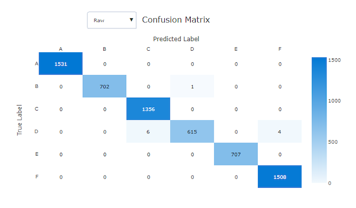

### Confusion matrix for a bad model
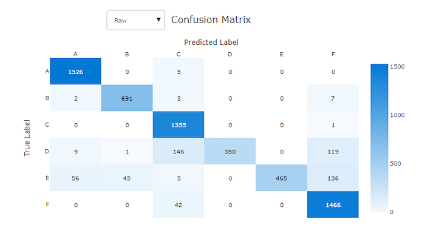

## ROC curve

The receiver operating characteristic (ROC) curve plots the relationship between true positive rate (TPR) and false positive rate (FPR) as the decision threshold changes. The ROC curve can be less informative when training models on datasets with high class imbalance, as the majority class can drown out contributions from minority classes.

The area under the curve (AUC) can be interpreted as the proportion of correctly classified samples. More precisely, the AUC is the probability that the classifier ranks a randomly chosen positive sample higher than a randomly chosen negative sample. The shape of the curve gives an intuition for relationship between TPR and FPR as a function of the classification threshold or decision boundary.

A curve that approaches the top-left corner of the chart is approaching a 100% TPR and 0% FPR, the best possible model. A random model would produce an ROC curve along the `y = x` line from the bottom-left corner to the top-right. A worse than random model would have an ROC curve that dips below the `y = x` line.
> [!TIP]
> For classification experiments, each of the line charts produced for automated ML models can be used to evaluate the model per-class or averaged over all classes. You can switch between these different views by clicking on class labels in the legend to the right of the chart.

### ROC curve for a good model
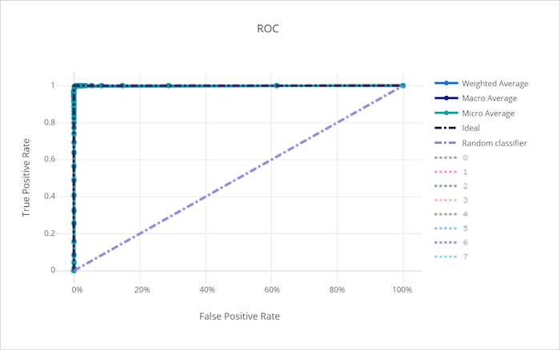

### ROC curve for a bad model
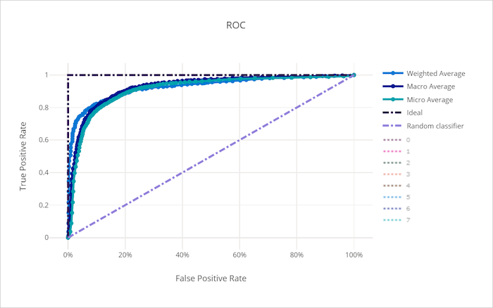

## Precision-recall curve

The precision-recall curve plots the relationship between precision and recall as the decision threshold changes. Recall is the ability of a model to detect all positive samples and precision is the ability of a model to avoid labeling negative samples as positive. Some business problems might require higher recall and some higher precision depending on the relative importance of avoiding false negatives vs false positives.
> [!TIP]
> For classification experiments, each of the line charts produced for automated ML models can be used to evaluate the model per-class or averaged over all classes. You can switch between these different views by clicking on class labels in the legend to the right of the chart.
### Precision-recall curve for a good model
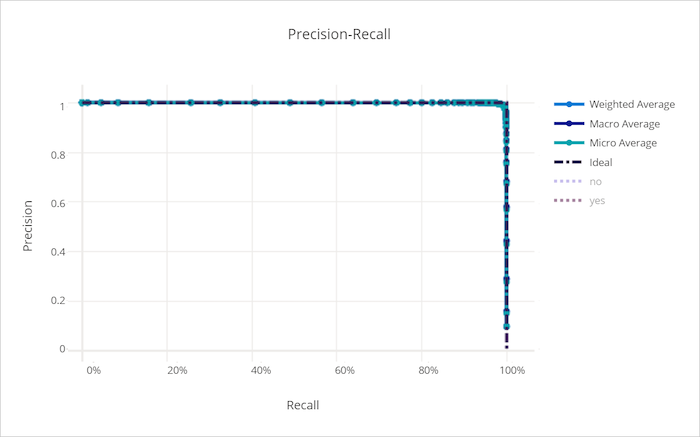

### Precision-recall curve for a bad model
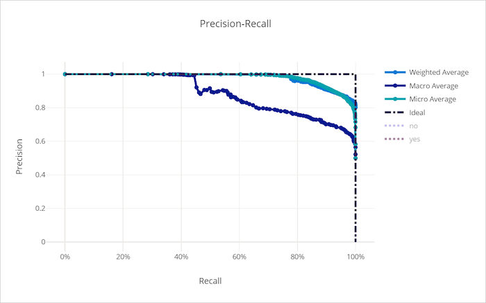

## Cumulative gains curve

The cumulative gains curve plots the percent of positive samples correctly classified as a function of the percent of samples considered where we consider samples in the order of predicted probability.

To calculate gain, first sort all samples from highest to lowest probability predicted by the model. Then take `x%` of the highest confidence predictions. Divide the number of positive samples detected in that `x%` by the total number of positive samples to get the gain. Cumulative gain is the percent of positive samples we detect when considering some percent of the data that is most likely to belong to the positive class.

A perfect model will rank all positive samples above all negative samples giving a cumulative gains curve made up of two straight segments. The first is a line with slope `1 / x` from `(0, 0)` to `(x, 1)` where `x` is the fraction of samples that belong to the positive class (`1 / num_classes` if classes are balanced). The second is a horizontal line from `(x, 1)` to `(1, 1)`. In the first segment, all positive samples are classified correctly and cumulative gain goes to `100%` within the first `x%` of samples considered.

The baseline random model will have a cumulative gains curve following `y = x` where for `x%` of samples considered only about `x%` of the total positive samples were detected. A perfect model for a balanced dataset will have a micro average curve and a macro average line that has slope `num_classes` until cumulative gain is 100% and then horizontal until the data percent is 100.
> [!TIP]
> For classification experiments, each of the line charts produced for automated ML models can be used to evaluate the model per-class or averaged over all classes. You can switch between these different views by clicking on class labels in the legend to the right of the chart.
### Cumulative gains curve for a good model
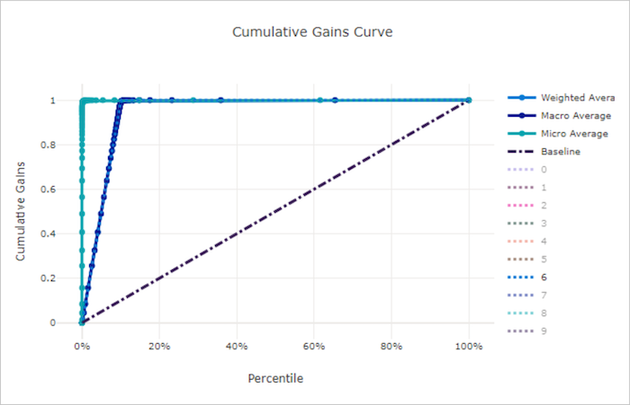

### Cumulative gains curve for a bad model
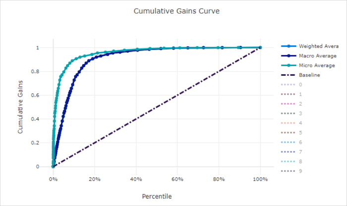

## Lift curve

The lift curve shows how many times better a model performs compared to a random model. Lift is defined as the ratio of cumulative gain to the cumulative gain of a random model (which should always be `1`).

This relative performance takes into account the fact that classification gets harder as you increase the number of classes. (A random model incorrectly predicts a higher fraction of samples from a dataset with 10 classes compared to a dataset with two classes)

The baseline lift curve is the `y = 1` line where the model performance is consistent with that of a random model. In general, the lift curve for a good model will be higher on that chart and farther from the x-axis, showing that when the model is most confident in its predictions it performs many times better than random guessing.

> [!TIP]
> For classification experiments, each of the line charts produced for automated ML models can be used to evaluate the model per-class or averaged over all classes. You can switch between these different views by clicking on class labels in the legend to the right of the chart.
### Lift curve for a good model
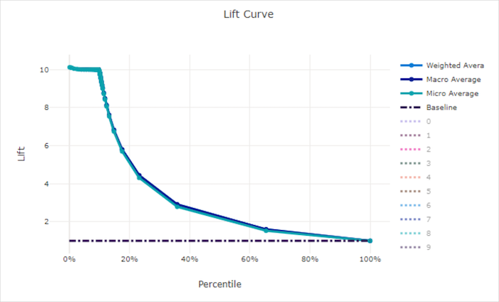
 
### Lift curve for a bad model
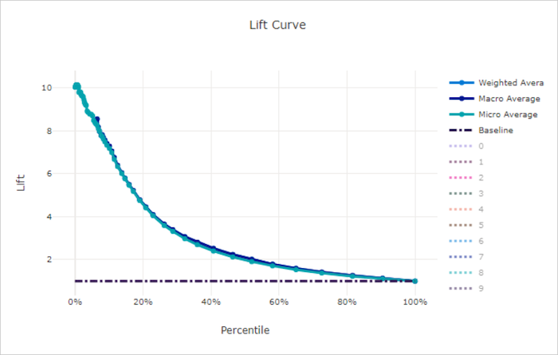

## Calibration curve

The calibration curve plots a model's confidence in its predictions against the proportion of positive samples at each confidence level. A well-calibrated model will correctly classify 100% of the predictions to which it assigns 100% confidence, 50% of the predictions it assigns 50% confidence, 20% of the predictions it assigns a 20% confidence, and so on. A perfectly calibrated model will have a calibration curve following the `y = x` line where the model perfectly predicts the probability that samples belong to each class.

An over-confident model will over-predict probabilities close to zero and one, rarely being uncertain about the class of each sample and the calibration curve will look similar to backward "S". An under-confident model will assign a lower probability on average to the class it predicts and the associated calibration curve will look similar to an "S". The calibration curve does not depict a model's ability to classify correctly, but instead its ability to correctly assign confidence to its predictions. A bad model can still have a good calibration curve if the model correctly assigns low confidence and high uncertainty.

> [!NOTE]
> The calibration curve is sensitive to the number of samples, so a small validation set can produce noisy results that can be hard to interpret. This does not necessarily mean that the model is not well-calibrated.

### Calibration curve for a good model
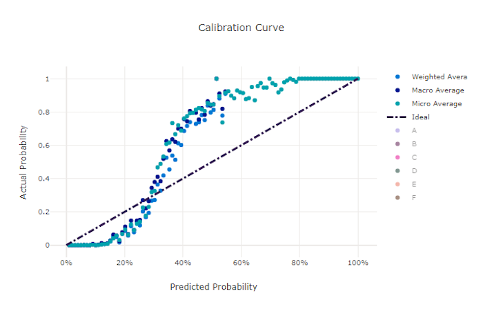

### Calibration curve for a bad model
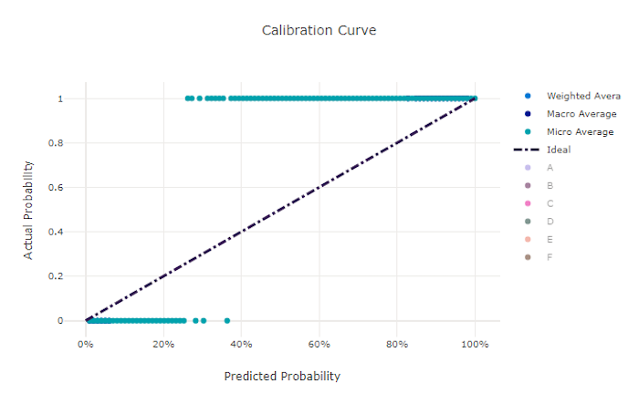

## Regression/forecasting metrics

Automated ML calculates the same performance metrics for each  model generated, regardless if it is a regression or forecasting experiment. These metrics also undergo normalization to enable comparison between models trained on data with different ranges. To learn more, see [metric normalization](#metric-normalization).  

The following table summarizes the model performance metrics generated for regression and forecasting experiments. Like classification metrics, these metrics are also based on the scikit learn implementations. The appropriate scikit learn documentation is linked accordingly, in the **Calculation** field.

|Metric|Description|Calculation|
--|--|--|
explained_variance|Explained variance measures the extent to which a model accounts for the variation in the target variable. It is the percent decrease in variance of the original data to the variance of the errors. When the mean of the errors is 0, it is equal to the coefficient of determination (see r2_score below).     **Objective:** Closer to 1 the better   **Range:** (-inf, 1]|[Calculation](https://scikit-learn.org/0.22/modules/generated/sklearn.metrics.explained_variance_score.html)|
mean_absolute_error|Mean absolute error is the expected value of absolute value of difference between the target and the prediction.   **Objective:** Closer to 0 the better   **Range:** [0, inf)    Types:  `mean_absolute_error`    `normalized_mean_absolute_error`,  the mean_absolute_error divided by the range of the data. | [Calculation](https://scikit-learn.org/0.22/modules/generated/sklearn.metrics.mean_absolute_error.html)|
mean_absolute_percentage_error|Mean absolute percentage error (MAPE) is a measure of the average difference between a predicted value and the actual value.   **Objective:** Closer to 0 the better   **Range:** [0, inf) ||
median_absolute_error|Median absolute error is the median of all absolute differences between the target and the prediction. This loss is robust to outliers.   **Objective:** Closer to 0 the better   **Range:** [0, inf)  Types:   `median_absolute_error`  `normalized_median_absolute_error`: the median_absolute_error divided by the range of the data. |[Calculation](https://scikit-learn.org/0.22/modules/generated/sklearn.metrics.median_absolute_error.html)|
r2_score|R2 (the coefficient of determination) measures the proportional reduction in mean squared error (MSE) relative to the total variance of the observed data.     **Objective:** Closer to 1 the better   **Range:** [-1, 1]  Note: R2 often has the range (-inf, 1]. The MSE can be larger than the observed variance, so R2 can have arbitrarily large negative values, depending on the data and the model predictions. Automated ML clips reported R2 scores at -1, so a value of -1 for R2 likely means that the true R2 score is less than -1. Consider the other metrics values and the properties of the data when interpreting a negative R2 score.|[Calculation](https://scikit-learn.org/0.22/modules/generated/sklearn.metrics.r2_score.html)|
root_mean_squared_error |Root mean squared error (RMSE) is the square root of the expected squared difference between the target and the prediction. For an unbiased estimator, RMSE is equal to the standard deviation.    **Objective:** Closer to 0 the better   **Range:** [0, inf)  Types:  `root_mean_squared_error`   `normalized_root_mean_squared_error`: the root_mean_squared_error divided by the range of the data. |[Calculation](https://scikit-learn.org/0.22/modules/generated/sklearn.metrics.mean_squared_error.html)|
root_mean_squared_log_error|Root mean squared log error is the square root of the expected squared logarithmic error.  **Objective:** Closer to 0 the better   **Range:** [0, inf)    Types:  `root_mean_squared_log_error`   `normalized_root_mean_squared_log_error`: the root_mean_squared_log_error divided by the range of the data.  |[Calculation](https://scikit-learn.org/0.22/modules/generated/sklearn.metrics.mean_squared_log_error.html)|
spearman_correlation| Spearman correlation is a nonparametric measure of the monotonicity of the relationship between two datasets. Unlike the Pearson correlation, the Spearman correlation does not assume that both datasets are normally distributed. Like other correlation coefficients, Spearman varies between -1 and 1 with 0 implying no correlation. Correlations of -1 or 1 imply an exact monotonic relationship.    Spearman is a rank-order correlation metric meaning that changes to predicted or actual values will not change the Spearman result if they do not change the rank order of predicted or actual values.    **Objective:** Closer to 1 the better   **Range:** [-1, 1]|[Calculation](https://docs.scipy.org/doc/scipy-1.5.2/reference/generated/scipy.stats.spearmanr.html)|

### Metric normalization

Automated ML normalizes regression and forecasting metrics which enables comparison between models trained on data with different ranges. A model trained on a data with a larger range has higher error than the same model trained on data with a smaller range, unless that error is normalized.

While there is no standard method of normalizing error metrics, automated ML takes the common approach of dividing the error by the range of the data: `normalized_error = error / (y_max - y_min)`

>[!Note]
>The range of data is not saved with the model. If you do inference with the same model on a holdout test set, `y_min` and `y_max` may change according to the test data and the normalized metrics may not be directly used to compare the model's performance on training and test sets. You can pass in the value of `y_min` and `y_max` from your training set to make the comparison fair.

When evaluating a forecasting model on time series data, automated ML takes extra steps to ensure that normalization happens per time series ID (grain), because each time series likely has a different distribution of target values.
## Residuals

The residuals chart is a histogram of the prediction errors (residuals) generated for regression and forecasting experiments. Residuals are calculated as `y_predicted - y_true` for all samples and then displayed as a histogram to show model bias.

In this example, note that both models are slightly biased to predict lower than the actual value. This is not uncommon for a dataset with a skewed distribution of actual targets, but indicates worse model performance. A good model will have a residuals distribution that peaks at zero with few residuals at the extremes. A worse model will have a spread out residuals distribution with fewer samples around zero.

### Residuals chart for a good model
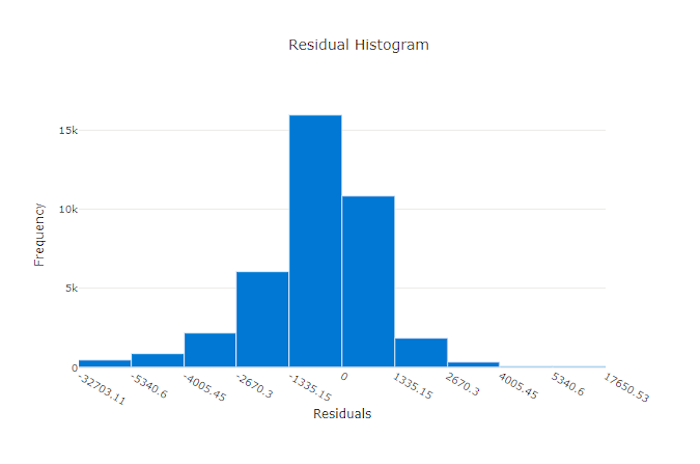

### Residuals chart for a bad model
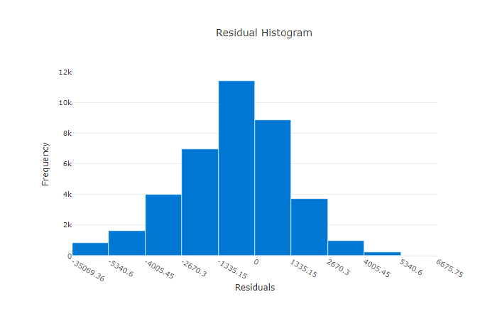

## Predicted vs. true

For regression and forecasting experiment the predicted vs. true chart plots the relationship between the target feature (true/actual values) and the model's predictions. The true values are binned along the x-axis and for each bin the mean predicted value is plotted with error bars. This allows you to see if a model is biased toward predicting certain values. The line displays the average prediction and the shaded area indicates the variance of predictions around that mean.

Often, the most common true value will have the most accurate predictions with the lowest variance. The distance of the trend line from the ideal `y = x` line where there are few true values is a good measure of model performance on outliers. You can use the histogram at the bottom of the chart to reason about the actual data distribution. Including more data samples where the distribution is sparse can improve model performance on unseen data.

In this example, note that the better model has a predicted vs. true line that is closer to the ideal `y = x` line.

### Predicted vs. true chart for a good model
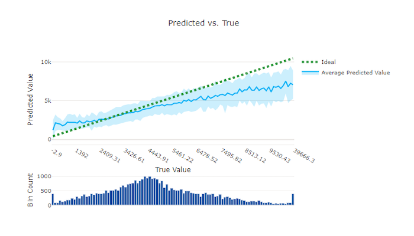

### Predicted vs. true chart for a bad model
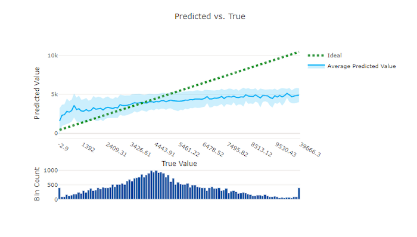

## Metrics for image models (preview)

Automated ML uses the images from the validation dataset for evaluating the performance of the model. The performance of the model is measured at an **epoch-level** to understand how the training progresses. An epoch elapses when an entire dataset is passed forward and backward through the neural network exactly once. 

### Image classification metrics

The primary metric for evaluation is **accuracy** for binary and multi-class classification models and **IoU** ([Intersection over Union](https://scikit-learn.org/stable/modules/generated/sklearn.metrics.jaccard_score.html#sklearn.metrics.jaccard_score)) for multilabel classification models.
The classification metrics for image classification models are same as those defined in the [classification metrics](#classification-metrics) section. The loss values associated with an epoch are also logged which can help monitor how the training progresses and determine if the model is over-fitting or under-fitting.

Every prediction from a classification model is associated with a confidence score, which indicates the level of confidence with which the prediction was made. Multilabel image classification models are by default evaluated with a score threshold of 0.5 which means only predictions with at least this level of confidence will be considered as a positive prediction for the associated class. Multiclass classification does not use a score threshold but instead, the class with the maximum confidence score is considered as the prediction. 

#### Epoch-level metrics for image classification
Unlike the classification metrics for tabular datasets, image classification models log all the classification metrics at an epoch-level as shown below.

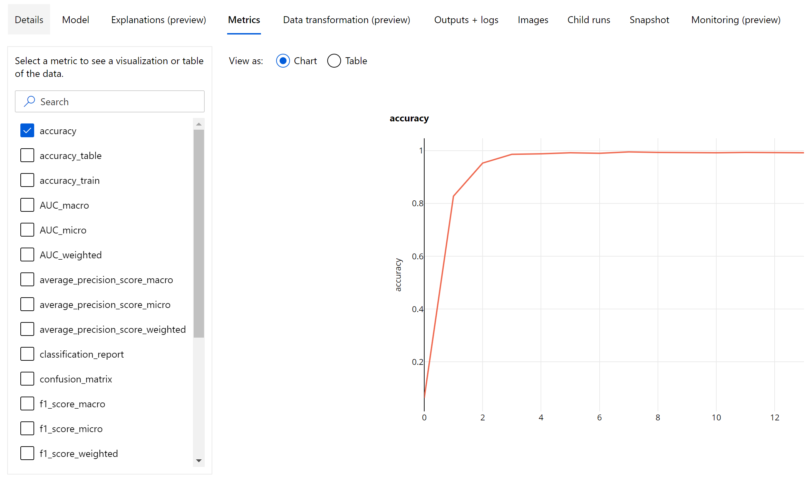

#### Summary metrics for image classification

Apart from the scalar metrics that are logged at the epoch level, image classification model also log summary metrics like [confusion matrix](#confusion-matrix), [classification charts](#roc-curve) including ROC curve, precision-recall curve and classification report for the model from the best epoch at which we get the highest primary metric (accuracy) score.

Classification report provides the class-level values for metrics like precision, recall, f1-score, support, auc and average_precision with  various level of averaging - micro, macro and weighted as shown below.
Please refer to the metrics definitions from the [classification metrics](#classification-metrics) section.

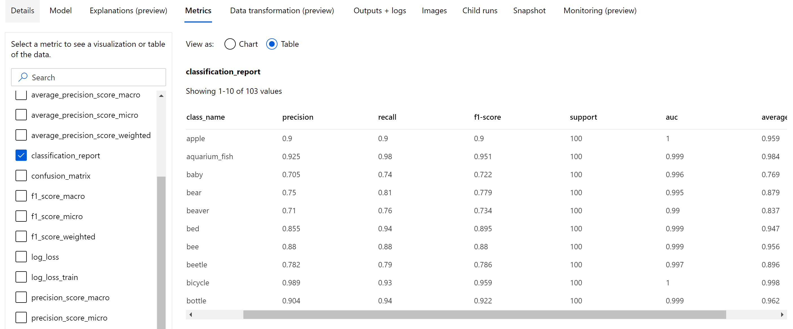

### Object detection and Instance segmentation metrics

Every prediction from an image object detection or instance segmentation  model is associated with a confidence score.
The predictions with confidence score greater than score threshold are output as predictions and used in the metric calculation, the default value of which is model specific and can be referred from the [hyperparameter tuning](how-to-auto-train-image-models.md#model-specific-hyperparameters) page(`box_score_threshold` hyperparameter).

The metric computation of an image object detection and instance segmentation model is based on an overlap measurement defined by a metric called **IoU** ([Intersection over Union](https://en.wikipedia.org/wiki/Jaccard_index)) which is computed by dividing the area of overlap between the ground-truth and the predictions by the area of union of the ground-truth and the predictions. The IoU computed from every prediction is compared with an **overlap threshold** called an IoU threshold which determines how much a prediction should overlap with a user-annotated ground-truth in order to be considered as a positive prediction. If the IoU computed from the prediction is less than the overlap threshold the prediction would not be considered as a positive prediction for the associated class.

The primary metric for the evaluation of image object detection and instance segmentation models is the **mean average precision (mAP)**. The mAP is the average value of the average precision(AP) across all the classes. Automated ML object detection models support the computation of mAP using the below two popular methods.

**Pascal VOC metrics**: 

[Pascal VOC](http://host.robots.ox.ac.uk/pascal/VOC/voc2012/htmldoc/devkit_doc.html#SECTION00044000000000000000) mAP is the default way of mAP computation for object detection/instance segmentation models. Pascal VOC style mAP method calculates the area under a version of the precision-recall curve. First p(rᵢ), which is precision at recall i is computed for all unique recall values. p(rᵢ) is then replaced with maximum precision obtained for any recall r' >= rᵢ. The precision value is monotonically decreasing in this version of the curve. Pascal VOC mAP metric is by default evaluated with an IoU threshold of 0.5. A detailed explanation of this concept is available in this [blog](https://jonathan-hui.medium.com/map-mean-average-precision-for-object-detection-45c121a31173).

**COCO metrics**: 

[COCO evaluation method](https://cocodataset.org/#detection-eval) uses a 101-point interpolated method for AP calculation along with averaging over ten IoU thresholds. AP@[.5:.95] corresponds to the average AP for IoU from 0.5 to 0.95 with a step size of 0.05. Automated ML logs all the twelve metrics defined by the COCO method including the AP and AR(average recall) at various scales in the application logs while the metrics user interface shows only the mAP  at an IoU threshold of 0.5. 

> [!TIP]
> The image object detection model evaluation can use coco metrics if the `validation_metric_type` hyperparameter is set to be 'coco' as explained in the [hyperparameter tuning](how-to-auto-train-image-models.md#task-specific-hyperparameters) section.

#### Epoch-level metrics for object detection and instance segmentation
The mAP, precision and recall values are logged at an epoch-level for image object detection/instance segmentation models. The mAP, precision and recall metrics are also logged at a class level with the name 'per_label_metrics'. The 'per_label_metrics' should be viewed as a table. 

> [!NOTE]
> Epoch-level metrics for precision, recall and per_label_metrics are not available when using the 'coco' method.

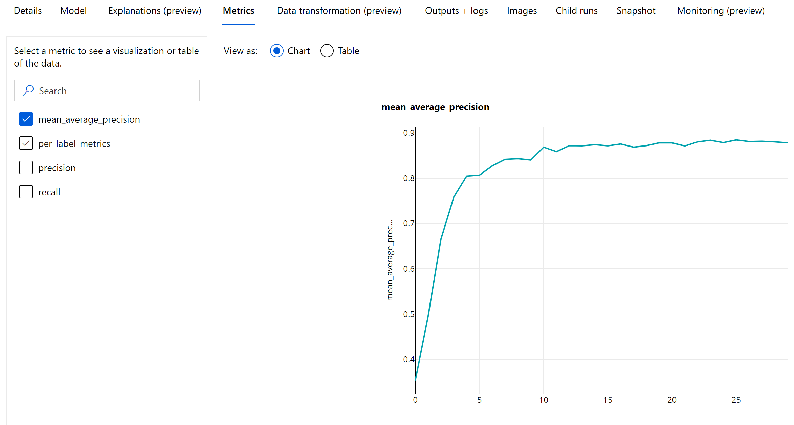

## Model explanations and feature importances

While model evaluation metrics and charts are good for measuring the general quality of a model, inspecting which dataset features a model used to make its predictions is essential when practicing responsible AI. That's why automated ML provides a model explanations dashboard to measure and report the relative contributions of dataset features. See how to [view the explanations dashboard in the Azure Machine Learning studio](how-to-use-automated-ml-for-ml-models.md#model-explanations-preview).

For a code first experience, see how to set up [model explanations for automated ML experiments with the Azure Machine Learning Python SDK](how-to-machine-learning-interpretability-automl.md).

> [!NOTE]
> Interpretability, best model explanation, is not available for automated ML forecasting experiments that recommend the following algorithms as the best model or ensemble: 
> * TCNForecaster
> * AutoArima
> * ExponentialSmoothing
> * Prophet
> * Average 
> * Naive
> * Seasonal Average 
> * Seasonal Naive

## Next steps
* Try the [automated machine learning model explanation sample notebooks](https://github.com/Azure/MachineLearningNotebooks/tree/master/how-to-use-azureml/explain-model).
* For automated ML specific questions, reach out to askautomatedml@microsoft.com.
