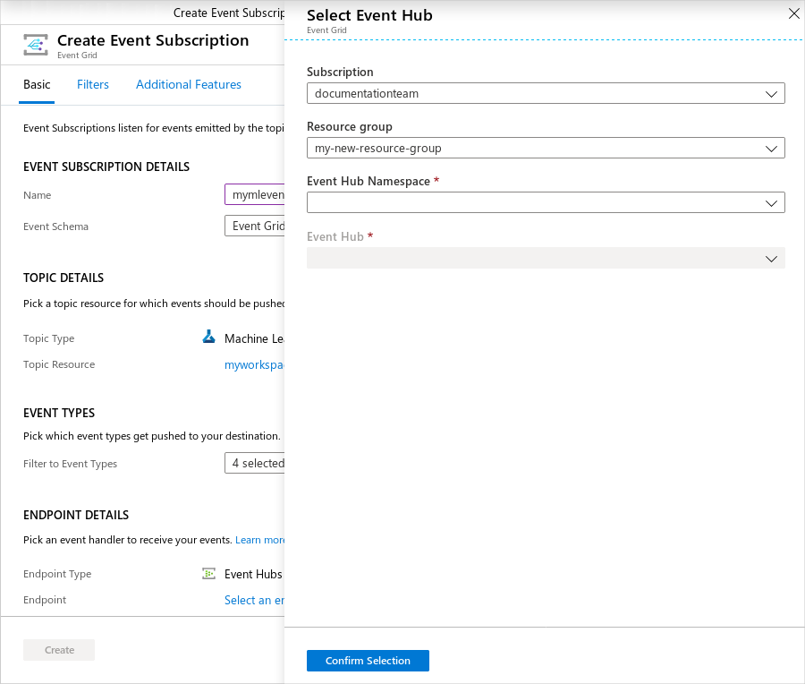
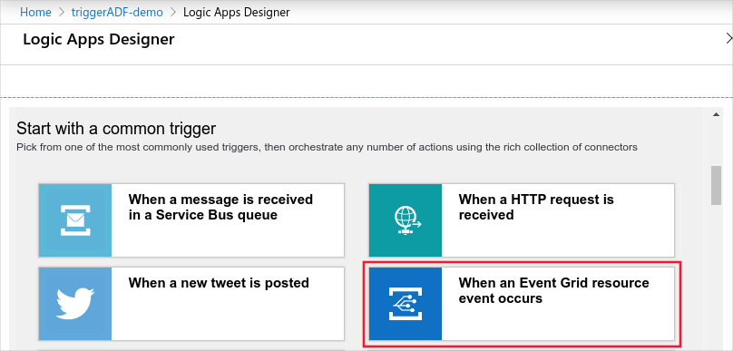
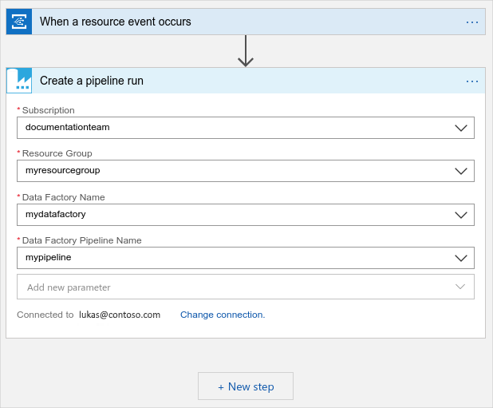

# Trigger applications, processes, or CI/CD workflows based on Azure Machine Learning events

In this article, you learn how to set up event-driven applications, processes, or CI/CD workflows based on Azure Machine Learning events, such as failure notification emails or ML pipeline runs, when certain conditions are detected by [Azure Event Grid](../event-grid/index.yml).

Azure Machine Learning manages the entire lifecycle of machine learning process, including model training, model deployment, and monitoring. You can use Event Grid to react to Azure Machine Learning events, such as the completion of training runs, the registration and deployment of models, and the detection of data drift, by using modern serverless architectures. You can then subscribe and consume events such as run status changed, run completion, model registration, model deployment, and data drift detection within a workspace.

When to use Event Grid for event driven actions:
* Send emails on run failure and run completion
* Use an Azure function after a model is registered
* Streaming events from Azure Machine Learning to various of endpoints
* Trigger an ML pipeline when drift is detected

[!INCLUDE [machine-learning-preview-generic-disclaimer](includes/machine-learning-preview-items-disclaimer.md)]

## Prerequisites

To use Event Grid, you need contributor or owner access to the Azure Machine Learning workspace you will create events for.

## The event model & types

Azure Event Grid reads events from sources, such as Azure Machine Learning and other Azure services. These events are then sent to event handlers such as Azure Event Hubs, Azure Functions, Logic Apps, and others. The following diagram shows how Event Grid connects sources and handlers, but is not a comprehensive list of supported integrations.


For more information on event sources and event handlers, see [What is Event Grid?](../event-grid/overview.md)

### Event types for Azure Machine Learning

Azure Machine Learning provides events in the various points of machine learning lifecycle: 

| Event type | Description |
| ---------- | ----------- |
| `Microsoft.MachineLearningServices.RunCompleted` | Raised when a machine learning experiment run is completed |
| `Microsoft.MachineLearningServices.ModelRegistered` (preview) | Raised when a machine learning model is registered in the workspace |
| `Microsoft.MachineLearningServices.ModelDeployed` (preview) | Raised when a deployment of inference service with one or more models is completed |
| `Microsoft.MachineLearningServices.DatasetDriftDetected` (preview) | Raised when a data drift detection job for two datasets is completed |
| `Microsoft.MachineLearningServices.RunStatusChanged` | Raised when a run status is changed |

### Filter & subscribe to events

These events are published through Azure Event Grid. Using Azure portal, PowerShell or Azure CLI, customers can easily subscribe to events by [specifying one or more event types, and filtering conditions](../event-grid/event-filtering.md). 

When setting up your events, you can apply filters to only trigger on specific event data. In the example below, for run status changed events, you can filter by run types. The event only triggers when the criteria is met. Refer to the [Azure Machine Learning Event Grid schema](../event-grid/event-schema-machine-learning.md) to learn about event data you can filter by. 

Subscriptions for Azure Machine Learning events are protected by Azure role-based access control (Azure RBAC). Only [contributor or owner](how-to-assign-roles.md#default-roles) of a workspace can create, update, and delete event subscriptions.  Filters can be applied to event subscriptions either during the [creation](/cli/azure/eventgrid/event-subscription) of the event subscription or at a later time. 


1. Go to the Azure portal, select a new subscription or an existing one.
1. Select the Events entry from the left navigation area, and then select **+ Event subscription**.
1. Select the filters tab and scroll down to Advanced filters. For the **Key** and **Value**, provide the property types you want to filter by. Here you can see the event will only trigger when the run type is a pipeline run or pipeline step run.  

    :::image type="content" source="media/how-to-use-event-grid/select-event-filters.png" alt-text="filter events":::


+ **Filter by event type:** An event subscription can specify one or more Azure Machine Learning event types.

+ **Filter by event subject:** Azure Event Grid supports subject filters based on __begins with__ and __ends with__ matches, so that events with a matching subject are delivered to the subscriber. Different machine learning events have different subject format.

  | Event type | Subject format | Sample subject |
  | ---------- | ----------- | ----------- |
  | `Microsoft.MachineLearningServices.RunCompleted` | `experiments/{ExperimentId}/runs/{RunId}` | `experiments/b1d7966c-f73a-4c68-b846-992ace89551f/runs/my_exp1_1554835758_38dbaa94` |
  | `Microsoft.MachineLearningServices.ModelRegistered` (preview) | `models/{modelName}:{modelVersion}` | `models/sklearn_regression_model:3` |
  | `Microsoft.MachineLearningServices.ModelDeployed` (preview) | `endpoints/{serviceId}` | `endpoints/my_sklearn_aks` |
  | `Microsoft.MachineLearningServices.DatasetDriftDetected` (preview) | `datadrift/{data.DataDriftId}/run/{data.RunId}` | `datadrift/4e694bf5-712e-4e40-b06a-d2a2755212d4/run/my_driftrun1_1550564444_fbbcdc0f` |
  | `Microsoft.MachineLearningServices.RunStatusChanged` | `experiments/{ExperimentId}/runs/{RunId}` | `experiments/b1d7966c-f73a-4c68-b846-992ace89551f/runs/my_exp1_1554835758_38dbaa94` | 

+ **Advanced filtering**: Azure Event Grid also supports advanced filtering based on published event schema. Azure Machine Learning event schema details can be found in [Azure Event Grid event schema for Azure Machine Learning](../event-grid/event-schema-machine-learning.md).  Some sample advanced filterings you can perform include:

  For `Microsoft.MachineLearningServices.ModelRegistered` event, to filter model's tag value:

  ```
  --advanced-filter data.ModelTags.key1 StringIn ('value1')
  ```

  To learn more about how to apply filters, see [Filter events for Event Grid](../event-grid/how-to-filter-events.md).

## Consume Machine Learning events

Applications that handle Machine Learning events should follow a few recommended practices:

> [!div class="checklist"]
> * As multiple subscriptions can be configured to route events to the same event handler, it is important not to assume events are from a particular source, but to check the topic of the message to ensure that it comes from the machine learning workspace you are expecting.
> * Similarly, check that the eventType is one you are prepared to process, and do not assume that all events you receive will be the types you expect.
> * As messages can arrive out of order and after some delay, use the etag fields to understand if your information about objects is still up-to-date.  Also, use the sequencer fields to understand the order of events on any particular object.
> * Ignore fields you don't understand. This practice will help keep you resilient to new features that might be added in the future.
> * Failed or cancelled Azure Machine Learning operations will not trigger an event. For example, if a model deployment fails Microsoft.MachineLearningServices.ModelDeployed won't be triggered. Consider such failure mode when design your applications. You can always use Azure Machine Learning SDK, CLI or portal to check the status of an operation and understand the detailed failure reasons.

Azure Event Grid allows customers to build de-coupled message handlers, which can be triggered by Azure Machine Learning events. Some notable examples of message handlers are:
* Azure Functions
* Azure Logic Apps
* Azure Event Hubs
* Azure Data Factory Pipeline
* Generic webhooks, which may be hosted on the Azure platform or elsewhere

## Set up in Azure portal

1. Open the [Azure portal](https://portal.azure.com) and go to your Azure Machine Learning workspace.

1. From the left bar, select __Events__ and then select **Event Subscriptions**. 

    :::image type="content" source="./media/how-to-use-event-grid/select-event.png" alt-text="Screenshot showing the Event Subscription selection.":::

1. Select the event type to consume. For example, the following screenshot has selected __Model registered__, __Model deployed__, __Run completed__, and __Dataset drift detected__:

    :::image type="content" source="./media/how-to-use-event-grid/add-event-type-updated.png" alt-text="Screenshot of the Create Event Subscription form.":::

1. Select the endpoint to publish the event to. In the following screenshot, __Event hub__ is the selected endpoint:

    

Once you have confirmed your selection, click __Create__. After configuration, these events will be pushed to your endpoint.


### Set up with the CLI

You can either install the latest [Azure CLI](/cli/azure/install-azure-cli), or use the Azure Cloud Shell that is provided as part of your Azure subscription.

To install the Event Grid extension, use the following command from the CLI:

```azurecli-interactive
az extension add --name eventgrid
```

The following example demonstrates how to select an Azure subscription and creates e a new event subscription for Azure Machine Learning:

```azurecli-interactive
# Select the Azure subscription that contains the workspace
az account set --subscription "<name or ID of the subscription>"

# Subscribe to the machine learning workspace. This example uses EventHub as a destination. 
az eventgrid event-subscription create --name {eventGridFilterName} \
  --source-resource-id /subscriptions/{subId}/resourceGroups/{RG}/providers/Microsoft.MachineLearningServices/workspaces/{wsName} \
  --endpoint-type eventhub \
  --endpoint /subscriptions/{SubID}/resourceGroups/TestRG/providers/Microsoft.EventHub/namespaces/n1/eventhubs/EH1 \
  --included-event-types Microsoft.MachineLearningServices.ModelRegistered \
  --subject-begins-with "models/mymodelname"
```

## Examples

### Example: Send email alerts

Use [Azure Logic Apps](../logic-apps/index.yml) to configure emails for all your events. Customize with conditions and specify recipients to enable collaboration and awareness across teams working together.

1. In the Azure portal, go to your Azure Machine Learning workspace and select the events tab from the left bar. From here, select __Logic apps__. 

    :::image type="content" source="./media/how-to-use-event-grid/select-logic-ap.png" alt-text="Screenshot showing the Logic Apps selection.":::

1. Sign into the Logic App UI and select Machine Learning service as the topic type. 

    

1. Select which event(s) to be notified for. For example, the following screenshot __RunCompleted__.

    :::image type="content" source="./media/how-to-use-event-grid/select-event-runcomplete.png" alt-text="Screenshot showing the Machine Learning service as the resource type.":::

1. Next, add a step to consume this event and search for email. There are several different mail accounts you can use to receive events. You can also configure conditions on when to send an email alert.

    :::image type="content" source="./media/how-to-use-event-grid/select-email-action.png" alt-text="Screenshot shows the Choose an action dialog box with email entered in the search line.":::

1. Select __Send an email__ and fill in the parameters. In the subject, you can include the __Event Type__ and __Topic__ to help filter events. You can also include a link to the workspace page for runs in the message body.

    To save this action, select **Save As** on the left corner of the page.

    :::image type="content" source="./media/how-to-use-event-grid/configure-email-body.png" alt-text="Screenshot shows the Send an email dialog box with Topic and Event Type added to the subject line from the list to the right.":::


:::moniker range="azureml-api-1"
### Example: Data drift triggers retraining

> [!IMPORTANT]
> This example relies on a feature (data drift) that is only available when using Azure Machine Learning SDK v1 or Azure CLI extension v1 for Azure Machine Learning. For more information, see [What is Azure Machine Learning CLI & SDK v2](concept-v2.md).

Models go stale over time, and not remain useful in the context it is running in. One way to tell if it's time to retrain the model is detecting data drift. 

This example shows how to use Event Grid with an Azure Logic App to trigger retraining. The example triggers an Azure Data Factory pipeline when data drift occurs between a model's training and serving datasets.

Before you begin, perform the following actions:

* Set up a dataset monitor to [detect data drift (SDK/CLI v1)](v1/how-to-monitor-datasets.md) in a workspace
* Create a published [Azure Data Factory pipeline](../data-factory/index.yml).

In this example, a simple Data Factory pipeline is used to copy files into a blob store and run a published Machine Learning pipeline. For more information on this scenario, see how to set up a [Machine Learning step in Azure Data Factory](../data-factory/transform-data-machine-learning-service.md)

:::image type="content" source="./media/how-to-use-event-grid/adf-mlpipeline-stage.png" alt-text="Screenshot showing the training pipeline in Azure Data Factory.":::

1. Start with creating the logic app. Go to the [Azure portal](https://portal.azure.com), search for Logic Apps, and select create.

    

1. Fill in the requested information. To simplify the experience, use the same subscription and resource group as your Azure Data Factory Pipeline and Azure Machine Learning workspace.

    

1. Once you have created the logic app, select __When an Event Grid resource event occurs__. 

    

1. Login and fill in the details for the event. Set the __Resource Name__ to the workspace name. Set the __Event Type__ to __DatasetDriftDetected__.

    :::image type="content" source="./media/how-to-use-event-grid/login-and-add-event.png" alt-text="Screenshot showing the data drift event type item.":::

1. Add a new step, and search for __Azure Data Factory__. Select __Create a pipeline run__. 

    

1. Login and specify the published Azure Data Factory pipeline to run.

    

1. Save and create the logic app using the **save** button on the top left of the page. To view your app, go to your workspace in the [Azure portal](https://portal.azure.com) and click on **Events**.

    

Now the data factory pipeline is triggered when drift occurs. View details on your data drift run and machine learning pipeline in [Azure Machine Learning studio](https://ml.azure.com). 

:::image type="content" source="./media/how-to-use-event-grid/view-in-workspace.png" alt-text="Screenshot showing pipeline endpoints.":::
:::moniker-end

## Next steps

Learn more about Event Grid and give Azure Machine Learning events a try:

- [About Event Grid](../event-grid/overview.md)

- [Event schema for Azure Machine Learning](../event-grid/event-schema-machine-learning.md)
