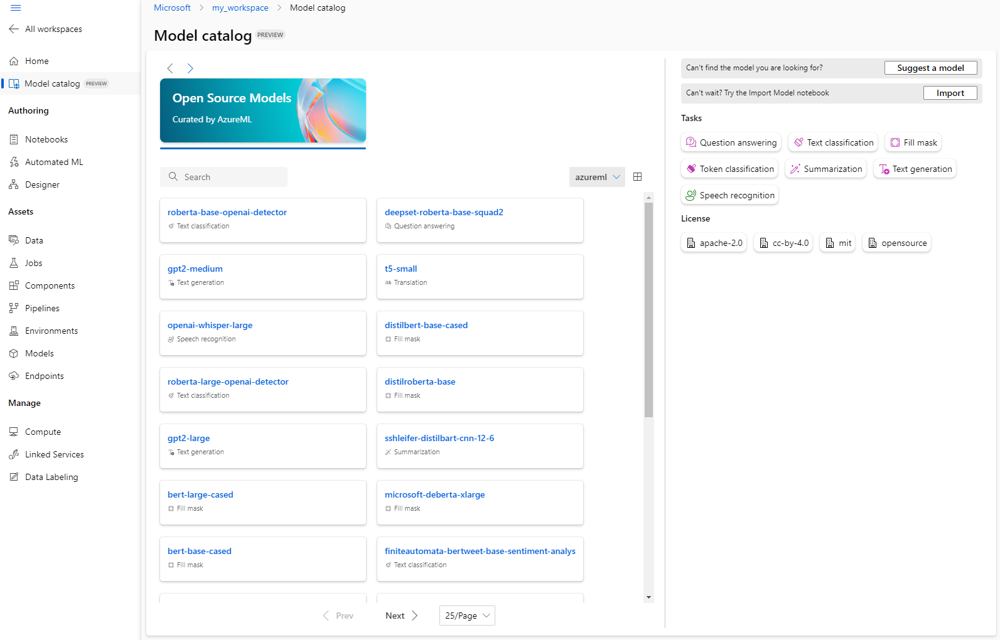
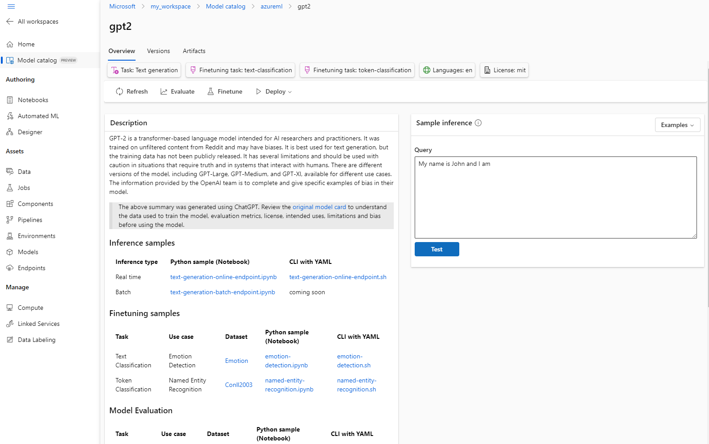
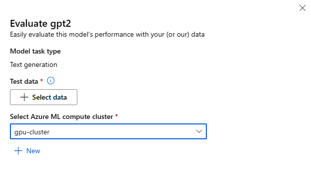
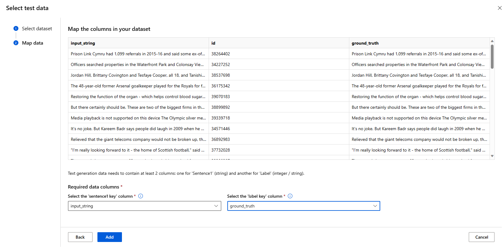
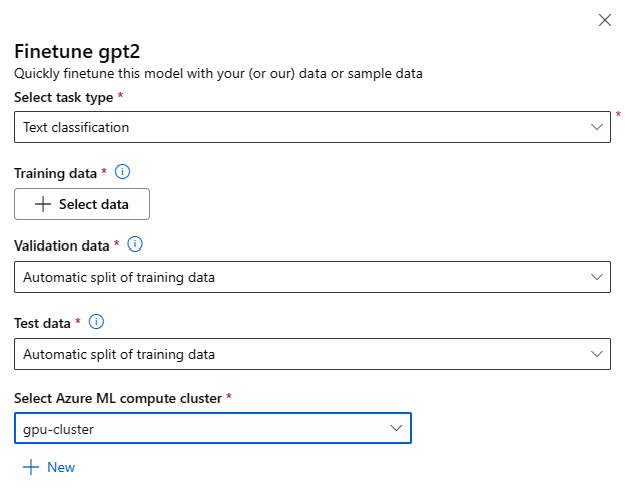
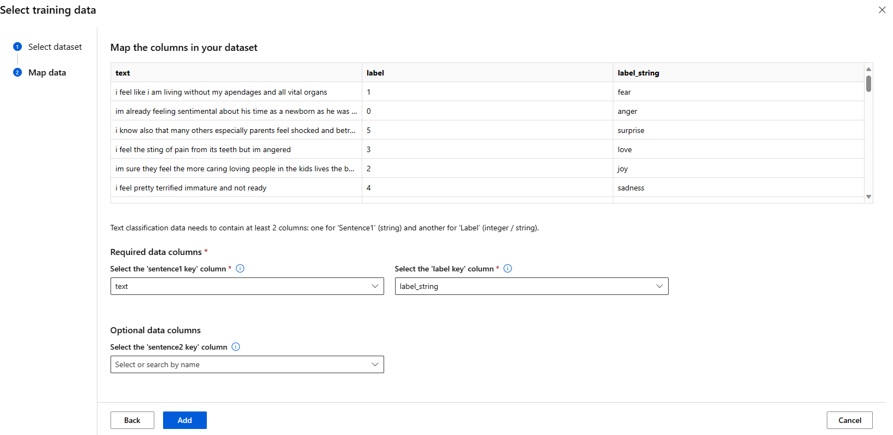

> [!IMPORTANT]
> Items marked (preview) in this article are currently in public preview.
> The preview version is provided without a service level agreement, and it's not recommended for production workloads. Certain features might not be supported or might have constrained capabilities.
> For more information, see [Supplemental Terms of Use for Microsoft Azure Previews](https://azure.microsoft.com/support/legal/preview-supplemental-terms/).

# How to use Foundation Models in AzureML (preview)

### How to access foundation models in AzureML
'Model catalog' (preview) provides a catalog view of all models that you have access to via system registries. You can view the complete list of supported open source foundation models in the [Model catalog](https://ml.azure.com/model/catalog), under the 'azureml' registry.

You can filter the list of models in the Model catalog by Task, or by license. Clicking on a specific model name will take you to the model card for that model, which lists detailed information about that specific model. For e.g. -

* The 'Task' calls out the inferencing task that this pre-trained model can be used for. 
* The 'Finetuning-tasks' list the tasks that this model can be fine tuned for. 
* The 'License' calls out the licensing info NOTE: Models from Hugging Face are subject to third party license terms available on the Hugging Face model details page. It is your responsibility to comply with the model's license terms.

Additionally, the model card for each model includes a brief description of the model and links to samples for code based inferencing, finetuning and evaluation of the model.

### How to evaluate foundation models using your own test data
You can evaluate a foundation model against your test dataset, using either the Evaluate UI wizard or by using the code based samples, linked from the model card.

#### Evaluating using UI wizard
You can invoke the Evaluate UI wizard by clicking on the 'Evaluate' button on the model card for any foundation model. 

<b>Evaluation Settings</b>

Each model can be evaluated for the specific inference task that the model can be used for.
* <b>Test Data</b> Pass in the test data you would like to use to evaluate your model. You can choose to either upload a local file (in JSONL format) or select an existing regsistered dataset from your workspace. 

	Once you've selected the dataset, you will need to map the columns from your input data, based on the schema needed for the task. For e.g. map the column names that correspond to the 'sentence' and 'label' keys for Text Classification

* <b>Compute</b> Provide the AzureML Compute cluster you would like to use for finetuning the model. Evaluation needs to run on GPU compute. Please ensure that you have sufficient compute quota for the compute SKUs you wish to use.

Clicking on 'Finish' in the Evaluate wizard will submit your evaluation job. Once the job completes, you can view evaluation metrics for the model. Based on the evaluation metrics, you might decide if you would like to finetune the model using your own training data or if you would like to register the model and deploy it to an endpoint.

<b>Advanced Evaluation Parameters</b>
The Evaluate UI wizard described above, allows you to perform basic evaluation by providing your own test data. Additionally, there are several advanced evaluation parameters described [here](https://github.com/Azure/azureml-assets/blob/main/training/model_evaluation/components/evaluate_model/README.md), such as evaluation config. Each of these settings have default values, but can be customized via code based samples, if needed.

#### Evaluating using code based samples
To enable users to quickly get started with model evaluation, we have published samples (both Python notebooks as well as CLI examples) in this git repo at [https://github.com/Azure/azureml-examples/tree/main/sdk/python/foundation-models/system](https://github.com/Azure/azureml-examples/tree/main/sdk/python/foundation-models/system). Each model card also links to Evaluation samples for corresponding tasks

### How to finetune foundation models using your own training data
In order to improve model performance in your workload, you might want to fine tune a foundation model using your own training data. You can easily finetune these foundation models by using either the Finetune UI wizard or by using the code based samples linked from the model card.
		
#### Finetuning using the UI wizard
You can invoke the Finetune UI wizard by clicking on the 'Finetune' button on the model card for any foundation model. 

<b>Finetuning Settings</b>

* <b>Finetuning task type</b> Every pre-trained model from the model catalog can be finetuned for a specific set of tasks (e.g. Text classification, Token classification, Question answering, etc). Select the task you would like to use from the drop down.
* <b>Training Data</b> Pass in the training data you would like to use to finetune your model. You can choose to either upload a local file (in JSONL, CSV or TSV format) or select an existing regsistered dataset from your workspace. 

	Once you've selected the dataset, you will need to map the columns from your input data, based on the schema needed for the task. For e.g. map the column names that correspond to the 'sentence' and 'label' keys for Text Classification

* <b>Validation data</b> Pass in the data you would like to use to validate your model. Selecting 'Automatic split' will reserve an automatic split of training data for validation. Alternatively, you can provide a different validation dataset.
* <b>Test data</b> Pass in the test data you would like to use to evaluate your finetuned model. Selecting 'Automatic split' will reserve an automatic split of training data for test. 
* <b>Compute</b> Provide the AzureML Compute cluster you would like to use for finetuning the model. Fine tuning needs to run on GPU compute. We recommend using compute SKUs with A100 / V100 GPUs for this. Please ensure that you have sufficient compute quota for the compute SKUs you wish to use.

Clicking on 'Finish' in the Finetune Wizard will submit your finetuning job. Once the job completes, you can view evaluation metrics for the finetuned model. You can then go ahead and register the finetuned model output by the finetuning job and deploy this model to an endpoint for inferencing.

<b>Advanced Finetuning Parameters</b>
The Finetuning UI wizard described above, allows you to perform basic finetuning by providing your own training data. Additionally, there are several advanced finetuning parameters, such as learning rate, epochs, batch size, etc, described in the Readme file for each task [here](https://github.com/Azure/azureml-assets/tree/main/training/finetune_acft_hf_nlp/components/finetune). Each of these settings have default values, but can be customized via code based samples, if needed.

#### Finetuning using code based samples
Currently, AzureML supports finetuning models for the following language tasks -

* Text classification 
* Token classification
* Question answering
* Summarization
* Translation

To enable users to quickly get started with fine tuning, we have published samples (both Python notebooks as well as CLI examples) for each task in this git repo at [https://github.com/Azure/azureml-examples/tree/main/sdk/python/foundation-models/system](https://github.com/Azure/azureml-examples/tree/main/sdk/python/foundation-models/system). Each model card links to Finetuning samples for supported finetuning tasks.

### Deploying foundation models to endpoints for inferencing

### Importing foundation models 
