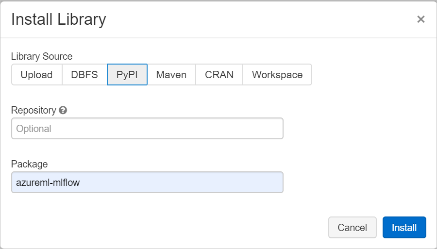
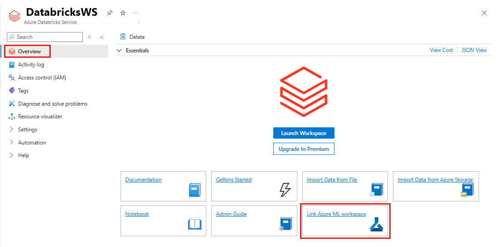

# Track Azure Databricks ML experiments with MLflow and Azure Machine Learning

[!INCLUDE [sdk v1](../../includes/machine-learning-sdk-v1.md)]
[!INCLUDE [dev v2](../../includes/machine-learning-dev-v2.md)]

In this article, learn how to enable MLflow to connect to Azure Machine Learning while working in an Azure Databricks workspace. You can leverage this configuration for tracking, model management and model deployment.

[MLflow](https://www.mlflow.org) is an open-source library for managing the life cycle of your machine learning experiments. MLFlow Tracking is a component of MLflow that logs and tracks your training run metrics and model artifacts. Learn more about [Azure Databricks and MLflow](/azure/databricks/applications/mlflow/). 

See [MLflow and Azure Machine Learning](concept-mlflow.md) for additional MLflow and Azure Machine Learning functionality integrations.

If you have an MLflow Project to train with Azure Machine Learning, see [Train ML models with MLflow Projects and Azure Machine Learning (preview)](how-to-train-mlflow-projects.md).

## Prerequisites

* Install the `azureml-mlflow` package, which handles the connectivity with Azure Machine Learning, including authentication.
* An [Azure Databricks workspace and cluster](/azure/databricks/scenarios/quickstart-create-databricks-workspace-portal).
* [Create an Azure Machine Learning Workspace](how-to-manage-workspace.md).
    * See which [access permissions you need to perform your MLflow operations with your workspace](how-to-assign-roles.md#mlflow-operations).

## Install libraries

To install libraries on your cluster, navigate to the **Libraries** tab and select **Install New**

 

In the **Package** field, type azureml-mlflow and then select install. Repeat this step as necessary to install other additional packages to your cluster for your experiment.

 


## Connect your Azure Databricks and Azure Machine Learning workspaces

Linking your ADB workspace to your Azure Machine Learning workspace enables you to track your experiment data in the Azure Machine Learning workspace.

To link your ADB workspace to a new or existing Azure Machine Learning workspace, 
1. Sign in to [Azure portal](https://portal.azure.com).
1. Navigate to your ADB workspace's **Overview** page.
1. Select the **Link Azure Machine Learning workspace** button on the bottom right. 

 
 
> [!NOTE]
> MLflow Tracking in a [private link enabled Azure Machine Learning workspace](how-to-configure-private-link.md) is not supported.

## Track Azure Databricks runs with MLflow

Azure Databricks can be configured to track experiments using MLflow in both Azure Databricks workspace and Azure Machine Learning workspace (dual-tracking), or exclusively on Azure Machine Learning. By default, dual-tracking is configured for you when you linked your Azure Databricks workspace.

### Dual-tracking on Azure Databricks and Azure Machine Learning

After you link your Azure Databricks workspace with your Azure Machine Learning workspace, MLflow Tracking is automatically set to be tracked in all of the following places:

* The linked Azure Machine Learning workspace.
* Your original ADB workspace. 

You can use then MLflow in Azure Databricks in the same way as you are used to. The following example sets the experiment name as it is usually done in Azure Databricks:

```python
import mlflow 

#Set MLflow experiment. 
experimentName = "/Users/{user_name}/{experiment_folder}/{experiment_name}" 
mlflow.set_experiment(experimentName) 
```
In your training script, import `mlflow` to use the MLflow logging APIs, and start logging your run metrics. The following example, logs the epoch loss metric. 

```python
import mlflow 
mlflow.log_metric('epoch_loss', loss.item()) 
```

> [!NOTE] 
> As opposite to tracking, model registries don't support registering models at the same time on both Azure Machine Learning and Azure Databricks. Either one or the other has to be used. Please read the section [Registering models in the registry with MLflow](#registering-models-in-the-registry-with-mlflow) for more details.

### Tracking exclusively on Azure Machine Learning workspace

If you prefer to manage your tracked experiments in a centralized location, you can set MLflow tracking  to **only** track in your Azure Machine Learning workspace. This configuration has the advantage of enabling easier path to deployment using Azure Machine Learning deployment options.

You have to configure the MLflow tracking URI to point exclusively to Azure Machine Learning, as it is demonstrated in the following example:

   # [Using the Azure ML SDK v2](#tab/sdkv2)
   
   You can get the Azure ML MLflow tracking URI using the [Azure Machine Learning SDK v2 for Python](concept-v2.md). Ensure you have the library `azure-ai-ml` installed in the cluster you are using:
   
   ```python
   from azure.ai.ml import MLClient
   from azure.identity import DeviceCodeCredential
   
   subscription_id = ""
   aml_resource_group = ""
   aml_workspace_name = ""
   
   ml_client = MLClient(credential=DeviceCodeCredential(),
                        subscription_id=subscription_id, 
                        resource_group_name=aml_resource_group)
                        
   azureml_mlflow_uri = ml_client.workspaces.get(aml_workspace_name).mlflow_tracking_uri
   mlflow.set_tracking_uri(azureml_mlflow_uri)
   ```
   
   # [Building the MLflow tracking URI](#tab/custom)
   
   The Azure Machine Learning Tracking URI can be constructed using the subscription ID, region of where the resource is deployed, resource group name and workspace name. The following code sample shows how:
   
   ```python
   import mlflow

   aml_region = ""
   subscription_id = ""
   aml_resource_group = ""
   aml_workspace_name = ""

   azureml_mlflow_uri = f"azureml://{aml_region}.api.azureml.ms/mlflow/v1.0/subscriptions/{subscription_id}/resourceGroups/{aml_resource_group}/providers/Microsoft.MachineLearningServices/workspaces/{aml_workspace_name}"
   mlflow.set_tracking_uri(azureml_mlflow_uri)
   ```
   
   > [!NOTE]
   > You can also get this URL by: Navigate to the [Azure ML Studio web portal](https://ml.azure.com) -> Clic on the uper-right corner of the page -> View all properties in Azure Portal -> MLflow tracking URI.

   ---

#### Experiment's names in Azure Machine Learning

When MLflow is configured to exclusively track experiments in Azure Machine Learning workspace, the experiment's naming convention has to follow the one used by Azure Machine Learning. In Azure Databricks, experiments are named with the path to where the experiment is saved like `/Users/alice@contoso.com/iris-classifier`. However, in Azure Machine Learning, you have to provide the experiment name directly. As in the previous example, the same experiment would be named `iris-classifier` directly:

```python
mlflow.set_experiment(experiment_name="experiment-name")
```

## Logging models with MLflow

After your model is trained, you can log it to the tracking server with the `mlflow.<model_flavor>.log_model()` method. `<model_flavor>`, refers to the framework associated with the model. [Learn what model flavors are supported](https://mlflow.org/docs/latest/models.html#model-api). In the following example, a model created with the Spark library MLLib is being registered:

```python
mlflow.spark.log_model(model, artifact_path = "model")
```

It's worth to mention that the flavor `spark` doesn't correspond to the fact that we are training a model in a Spark cluster but because of the training framework it was used (you can perfectly train a model using TensorFlow with Spark and hence the flavor to use would be `tensorflow`.

Models are logged inside of the run being tracked. That means that models are available in either both Azure Databricks and Azure Machine Learning (default) or exclusively in Azure Machine Learning if you configured the tracking URI to point to it.

> [!IMPORTANT]
> Notice that here the parameter `registered_model_name` has not been specified. Read the section [Registering models in the registry with MLflow](#registering-models-in-the-registry-with-mlflow) for more details about the implications of such parameter and how the registry works.

## Registering models in the registry with MLflow

As opposite to tracking, **model registries can't operate** at the same time in Azure Databricks and Azure Machine Learning. Either one or the other has to be used. By default, the Azure Databricks workspace is used for model registries; unless you chose to [set MLflow Tracking to only track in your Azure Machine Learning workspace](#tracking-exclusively-on-azure-machine-learning-workspace), then the model registry is the Azure Machine Learning workspace.

Then, considering you are using the default configuration, the following line will log a model inside the corresponding runs of both Azure Databricks and Azure Machine Learning, but it will register it only on Azure Databricks:

```python
mlflow.spark.log_model(model, artifact_path = "model", 
                       registered_model_name = 'model_name')  
```

* **If a registered model with the name doesn’t exist**, the method registers a new model, creates version 1, and returns a ModelVersion MLflow object. 

* **If a registered model with the name already exists**, the method creates a new model version and returns the version object. 

### Using Azure Machine Learning Registry with MLflow

If you want to use Azure Machine Learning Model Registry instead of Azure Databricks, we recommend you to [set MLflow Tracking to only track in your Azure Machine Learning workspace](#tracking-exclusively-on-azure-machine-learning-workspace). This will remove the ambiguity of where models are being registered and usually simplifiest complexity.

However, if you want to continue using the dual-tracking capabilities but register models in Azure Machine Learning, you can instruct MLflow to use Azure ML for model registries by configuring the MLflow Model Registry URI. This URI has the exact same format and value that the MLflow tracking URI.

```python
mlflow.set_registry_uri(azureml_mlflow_uri)
```

> [!NOTE]
> The value of `azureml_mlflow_uri` was obtained in the same way it was demostrated in [Set MLflow Tracking to only track in your Azure Machine Learning workspace](#tracking-exclusively-on-azure-machine-learning-workspace)

For a complete example about this scenario please check the example [Training models in Azure Databricks and deploying them on Azure ML](https://github.com/Azure/azureml-examples/blob/main/notebooks/using-mlflow/no-code-deployment/track_with_databricks_deploy_aml.ipynb).

## Deploying and consuming models registered in Azure Machine Learning

Models registered in Azure Machine Learning Service using MLflow can be consumed as: 

* An Azure Machine Learning endpoint (real-time and batch): This deployment allows you to leverage Azure Machine Learning deployment capabilities for both real-time and batch inference in Azure Container Instances (ACI), Azure Kubernetes (AKS) or our Managed Inference Endpoints. 

* MLFlow model objects or Pandas UDFs, which can be used in Azure Databricks notebooks in streaming or batch pipelines.

### Deploy models to Azure Machine Learning endpoints 
You can leverage the `azureml-mlflow` plugin to deploy a model to your Azure Machine Learning workspace. Check [How to deploy MLflow models](how-to-deploy-mlflow-models.md) page for a complete detail about how to deploy models to the different targets.

> [!IMPORTANT]
> Models need to be registered in Azure Machine Learning registry in order to deploy them. If your models happen to be registered in the MLflow instance inside Azure Databricks, you will have to register them again in Azure Machine Learning. If this is you case, please check the example [Training models in Azure Databricks and deploying them on Azure ML](https://github.com/Azure/azureml-examples/blob/main/notebooks/using-mlflow/no-code-deployment/track_with_databricks_deploy_aml.ipynb)

### Deploy models to ADB for batch scoring using UDFs

You can choose Azure Databricks clusters for batch scoring. The MLFlow model is loaded and used as a Spark Pandas UDF to score new data. 

```python
from pyspark.sql.types import ArrayType, FloatType 

model_uri = "runs:/"+last_run_id+ {model_path} 

#Create a Spark UDF for the MLFlow model 
pyfunc_udf = mlflow.pyfunc.spark_udf(spark, model_uri) 

#Load Scoring Data into Spark Dataframe 
scoreDf = spark.table({table_name}).where({required_conditions}) 

#Make Prediction 
preds = (scoreDf 
           .withColumn('target_column_name', pyfunc_udf('Input_column1', 'Input_column2', ' Input_column3', …)) 
        ) 

display(preds) 
```

## Clean up resources

If you wish to keep your Azure Databricks workspace, but no longer need the Azure ML workspace, you can delete the Azure ML workspace. This action results in unlinking your Azure Databricks workspace and the Azure ML workspace. 

If you don't plan to use the logged metrics and artifacts in your workspace, the ability to delete them individually is unavailable at this time. Instead, delete the resource group that contains the storage account and workspace, so you don't incur any charges:

1. In the Azure portal, select **Resource groups** on the far left.

   

1. From the list, select the resource group you created.

1. Select **Delete resource group**.

1. Enter the resource group name. Then select **Delete**.

## Example notebooks

The [Training models in Azure Databricks and deploying them on Azure ML](https://github.com/Azure/azureml-examples/blob/main/notebooks/using-mlflow/no-code-deployment/track_with_databricks_deploy_aml.ipynb) demonstrates how to train models in Azure Databricks and deploy them in Azure ML. It also includes how to handle cases where you also want to track the experiments and models with the MLflow instance in Azure Databricks and leverage Azure ML for deployment.

## Next steps
* [Deploy MLflow models as an Azure web service](how-to-deploy-mlflow-models.md). 
* [Manage your models](concept-model-management-and-deployment.md).
* [Track experiment runs with MLflow and Azure Machine Learning](how-to-use-mlflow.md). 
* Learn more about [Azure Databricks and MLflow](/azure/databricks/applications/mlflow/).
