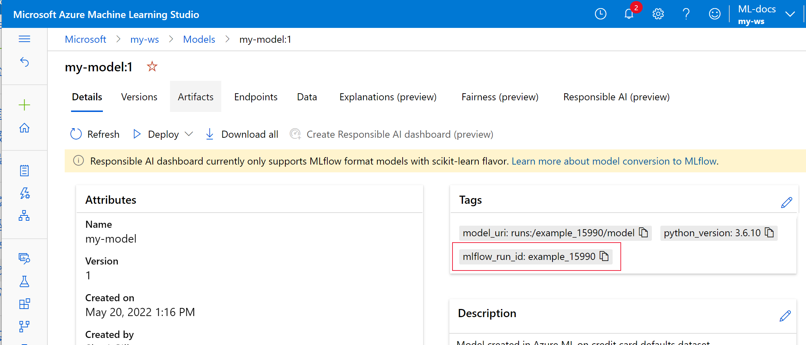
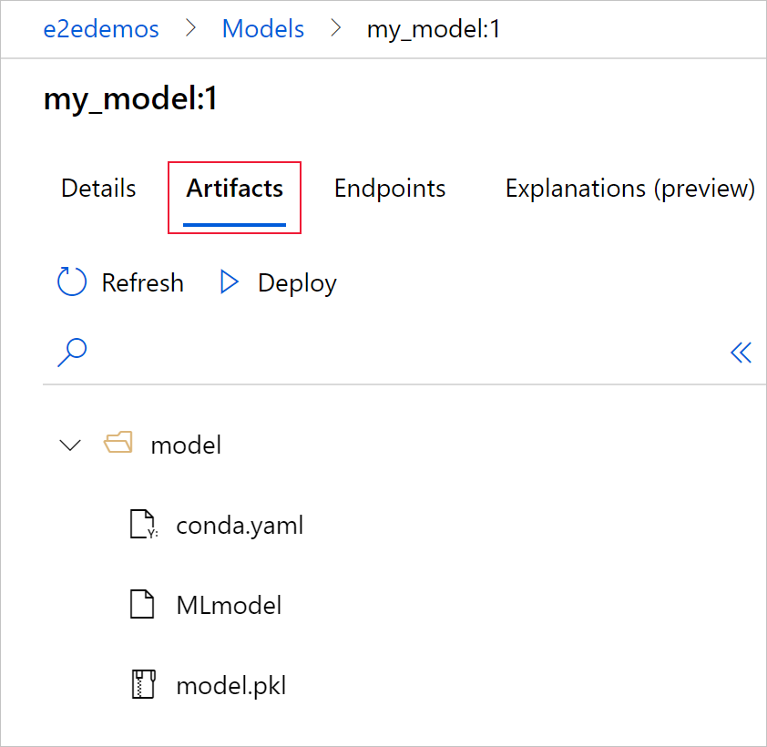

# Track ML experiments and models with MLflow or the Azure Machine Learning CLI (v2)


In this article, learn how to enable MLflow's tracking URI and logging API, collectively known as [MLflow Tracking](https://mlflow.org/docs/latest/quickstart.html#using-the-tracking-api), to connect Azure Machine Learning as the backend of your MLflow experiments. You can accomplish this connection with either the MLflow Python API or the [Azure Machine Learning CLI v2](how-to-train-cli.md) in your terminal. You also learn how to use [MLflow's Model Registry](https://mlflow.org/docs/latest/model-registry.html) capabilities with Azure Machine Learning.

[MLflow](https://www.mlflow.org) is an open-source library for managing the lifecycle of your machine learning experiments. MLflow Tracking is a component of MLflow that logs and tracks your training run metrics and model artifacts, no matter your experiment's environment--locally on your computer, on a remote compute target, a virtual machine, or an [Azure Databricks cluster](how-to-use-mlflow-azure-databricks.md).

See [MLflow and Azure Machine Learning](concept-mlflow.md) for all supported MLflow and Azure Machine Learning functionality including MLflow Project support (preview) and model deployment.
 
> [!TIP]
> The information in this document is primarily for data scientists and developers who want to monitor the model training process. If you are an administrator interested in monitoring resource usage and events from Azure Machine Learning, such as quotas, completed training runs, or completed model deployments, see [Monitoring Azure Machine Learning](monitor-azure-machine-learning.md).

> [!NOTE] 
> You can use the [MLflow Skinny client](https://github.com/mlflow/mlflow/blob/master/README_SKINNY.rst) which is a lightweight MLflow package without SQL storage, server, UI, or data science dependencies. This is recommended for users who primarily need the tracking and logging capabilities without importing the full suite of MLflow features including deployments.

## Prerequisites

* Install the `azureml-mlflow` package. 
    * This package automatically brings in `azureml-core` of the [The Azure Machine Learning Python SDK](/python/api/overview/azure/ml/install), which provides the connectivity for MLflow to access your workspace.

* [Create an Azure Machine Learning Workspace](how-to-manage-workspace.md).
    * See which [access permissions you need to perform your MLflow operations with your workspace](how-to-assign-roles.md#mlflow-operations).

* Install and [set up CLI (v2)](how-to-configure-cli.md#prerequisites) and make sure you install the ml extension.


## Track runs from your local machine

MLflow Tracking with Azure Machine Learning lets you store the logged metrics and artifacts runs that were executed on your local machine into your Azure Machine Learning workspace. 

### Set up tracking environment

To track a local run, you need to point your local machine to the Azure Machine Learning MLflow Tracking URI. 

>[!IMPORTANT]
> Make sure you are logged in to your Azure account, otherwise the tracking URI returns an empty string.

# [MLflow SDK](#tab/mlflow)

The following code uses `mlflow` and your Azure Machine Learning workspace details to construct the unique MLFLow tracking URI associated with your workspace. Then the method [`set_tracking_uri()`](https://mlflow.org/docs/latest/python_api/mlflow.html#mlflow.set_tracking_uri) points the MLflow tracking URI to that URI.

```Python
import mlflow

## Construct AzureML MLFLOW TRACKING URI
def get_azureml_mlflow_tracking_uri(region, subscription_id, resource_group, workspace):
    return "azureml://{}.api.azureml.ms/mlflow/v1.0/subscriptions/{}/resourceGroups/{}/providers/Microsoft.MachineLearningServices/workspaces/{}".format(region, subscription_id, resource_group, workspace)

region='<REGION>' ## example: westus
subscription_id = '<SUBSCRIPTION_ID>' ## example: 11111111-1111-1111-1111-111111111111
resource_group = '<RESOURCE_GROUP>' ## example: myresourcegroup
workspace = '<AML_WORKSPACE_NAME>' ## example: myworkspacename

MLFLOW_TRACKING_URI = get_azureml_mlflow_tracking_uri(region, subscription_id, resource_group, workspace)

## Set the MLFLOW TRACKING URI
mlflow.set_tracking_uri(MLFLOW_TRACKING_URI)

## Make sure the MLflow URI looks something like this: 
## azureml://<REGION>.api.azureml.ms/mlflow/v1.0/subscriptions/<SUBSCRIPTION_ID>/resourceGroups/<RESOURCE_GROUP>/providers/Microsoft.MachineLearningServices/workspaces/<AML_WORKSPACE_NAME>

print("MLFlow Tracking URI:", MLFLOW_TRACKING_URI)
```

# [Terminal](#tab/terminal)

Another option is to set one of the MLflow environment variables [MLFLOW_TRACKING_URI](https://mlflow.org/docs/latest/tracking.html#logging-to-a-tracking-server) directly in your terminal. 

```Azure CLI
# Configure MLflow to communicate with a Azure Machine Learning-hosted tracking server

export MLFLOW_TRACKING_URI=$(az ml workspace show --query mlflow_tracking_uri | sed 's/"//g') 
```
---


### Set experiment name

All MLflow runs are logged to the active experiment, which can be set with the MLflow SDK or Azure CLI. 

# [MLflow SDK](#tab/mlflow)

With MLflow you can use the [`mlflow.set_experiment()`](https://mlflow.org/docs/latest/python_api/mlflow.html#mlflow.set_experiment) command.
    
```Python
experiment_name = 'experiment_with_mlflow'
mlflow.set_experiment(experiment_name)
```

# [Terminal](#tab/terminal)

You can set one of the MLflow environment variables [MLFLOW_EXPERIMENT_NAME or MLFLOW_EXPERIMENT_ID](https://mlflow.org/docs/latest/cli.html#cmdoption-mlflow-run-arg-uri) with the experiment name.

```Azure CLI 
# Configure MLflow to communicate with a Azure Machine Learning-hosted tracking server
export MLFLOW_EXPERIMENT_NAME="experiment_with_mlflow"
```
---

### Start training run

After you set the MLflow experiment name, you can start your training run with `start_run()`. Then use `log_metric()` to activate the MLflow logging API and begin logging your training run metrics.

```Python
import os
from random import random

with mlflow.start_run() as mlflow_run:
    mlflow.log_param("hello_param", "world")
    mlflow.log_metric("hello_metric", random())
    os.system(f"echo 'hello world' > helloworld.txt")
    mlflow.log_artifact("helloworld.txt")
```

## Track remote runs with Azure Machine Learning CLI (v2)

[!INCLUDE [cli v2](../../includes/machine-learning-cli-v2.md)]

Remote runs (jobs) let you train your models on more powerful computes, such as GPU enabled virtual machines, or Machine Learning Compute clusters. See [Use compute targets for model training](how-to-set-up-training-targets.md) to learn about different compute options.

MLflow Tracking with Azure Machine Learning lets you store the logged metrics and artifacts from your remote runs into your Azure Machine Learning workspace. Any run with MLflow Tracking code in it logs metrics automatically to the workspace. 

First, you should create a `src` subdirectory and create a file with your training code in a `hello_world.py` file in the `src` subdirectory. All your training code will go into the `src` subdirectory, including `train.py`.

The training code is taken from this [MLfLow example](https://github.com/Azure/azureml-examples/blob/main/cli/jobs/basics/src/hello-mlflow.py) in the Azure Machine Learning example repo. 

Copy this code into the file:

:::code language="python" source="~/azureml-examples-main/cli/jobs/basics/src/hello-mlflow.py":::

Use the [Azure Machine Learning CLI (v2)](how-to-train-cli.md) to submit a remote run. When using the Azure Machine Learning CLI (v2), the MLflow tracking URI and experiment name are set automatically and directs the logging from MLflow to your workspace. Learn more about [logging Azure Machine Learning CLI (v2) experiments with MLflow](how-to-train-cli.md#model-tracking-with-mlflow) 

Create a YAML file with your job definition in a `job.yml` file. This file should be created outside the `src` directory. Copy this code into the file:

:::code language="azurecli" source="~/azureml-examples-main/cli/jobs/basics/hello-mlflow.yml":::

Open your terminal and use the following to submit the job.

```Azure CLI
az ml job create -f job.yml --web
```

## View metrics and artifacts in your workspace

The metrics and artifacts from MLflow logging are tracked in your workspace. To view them anytime, navigate to your workspace and find the experiment by name in your workspace in [Azure Machine Learning studio](https://ml.azure.com).  Or run the below code. 

Retrieve run metric using MLflow [get_run()](https://mlflow.org/docs/latest/python_api/mlflow.html#mlflow.get_run).

```Python
from mlflow.tracking import MlflowClient

# Use MlFlow to retrieve the run that was just completed
client = MlflowClient()
run_id = mlflow_run.info.run_id
finished_mlflow_run = MlflowClient().get_run(run_id)

metrics = finished_mlflow_run.data.metrics
tags = finished_mlflow_run.data.tags
params = finished_mlflow_run.data.params

print(metrics,tags,params)
```

### Retrieve artifacts with MLFLow

To view the artifacts of a run, you can use [MlFlowClient.list_artifacts()](https://mlflow.org/docs/latest/python_api/mlflow.tracking.html#mlflow.tracking.MlflowClient.list_artifacts)

```Python
client.list_artifacts(run_id)
```

To download an artifact to the current directory, you can use [MLFlowClient.download_artifacts()](https://www.mlflow.org/docs/latest/python_api/mlflow.tracking.html#mlflow.tracking.MlflowClient.download_artifacts)

```Python
client.download_artifacts(run_id, "helloworld.txt", ".")
```

### Compare and query

Compare and query all MLflow runs in your Azure Machine Learning workspace with the following code. 
[Learn more about how to query runs with MLflow](https://mlflow.org/docs/latest/search-syntax.html#programmatically-searching-runs). 

```Python
from mlflow.entities import ViewType

all_experiments = [exp.experiment_id for exp in MlflowClient().list_experiments()]
query = "metrics.hello_metric > 0"
runs = mlflow.search_runs(experiment_ids=all_experiments, filter_string=query, run_view_type=ViewType.ALL)

runs.head(10)
```

## Automatic logging
With Azure Machine Learning and MLFlow, users can log metrics, model parameters and model artifacts automatically when training a model.  A [variety of popular machine learning libraries](https://mlflow.org/docs/latest/tracking.html#automatic-logging) are supported. 

To enable [automatic logging](https://mlflow.org/docs/latest/tracking.html#automatic-logging) insert the following code before your training code:

```Python
mlflow.autolog()
```

[Learn more about Automatic logging with MLflow](https://mlflow.org/docs/latest/python_api/mlflow.html#mlflow.autolog). 

## Manage models

Register and track your models with the [Azure Machine Learning model registry](concept-model-management-and-deployment.md#register-package-and-deploy-models-from-anywhere), which supports the MLflow model registry. Azure Machine Learning models are aligned with the MLflow model schema making it easy to export and import these models across different workflows. The MLflow-related metadata, such as run ID, is also tracked with the registered model for traceability. Users can submit training runs, register, and deploy models produced from MLflow runs.

If you want to deploy and register your production ready model in one step, see [Deploy and register MLflow models](how-to-deploy-mlflow-models.md).

To register and view a model from a run, use the following steps:

1. Once a run is complete, call the [`register_model()`](https://mlflow.org/docs/latest/python_api/mlflow.html#mlflow.register_model) method.

    ```Python
    # the model folder produced from a run is registered. This includes the MLmodel file, model.pkl and the conda.yaml.
    model_path = "model"
    model_uri = 'runs:/{}/{}'.format(run_id, model_path) 
    mlflow.register_model(model_uri,"registered_model_name")
    ```

1. View the registered model in your workspace with [Azure Machine Learning studio](overview-what-is-machine-learning-studio.md).

    In the following example the registered model, `my-model` has MLflow tracking metadata tagged. 

    

1. Select the **Artifacts** tab to see all the model files that align with the MLflow model schema (conda.yaml, MLmodel, model.pkl).

    

1. Select MLmodel to see the MLmodel file generated by the run.

    


## Example notebooks

[Use MLflow and CLI (v2)](https://github.com/Azure/azureml-examples/blob/main/cli/jobs/basics/hello-mlflow.yml)

## Next steps

* [Deploy MLflow models to managed online endpoint (preview)](how-to-deploy-mlflow-models-online-endpoints.md).
* [Manage your models](concept-model-management-and-deployment.md).
