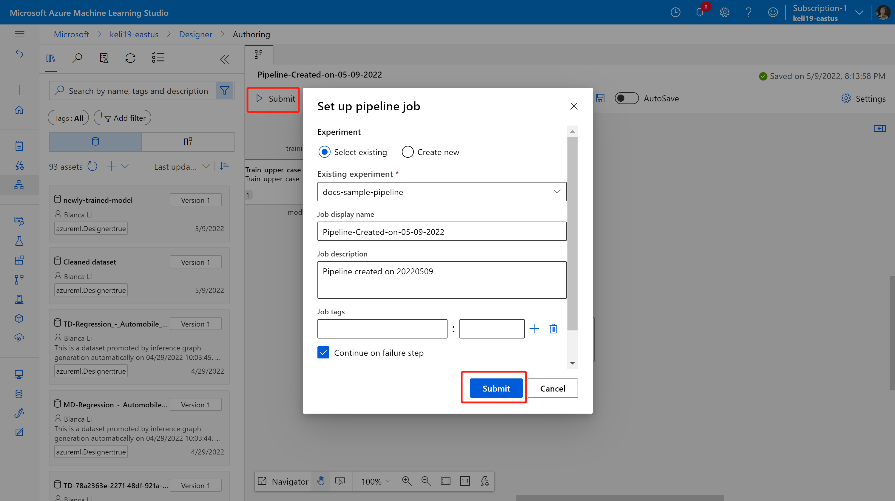
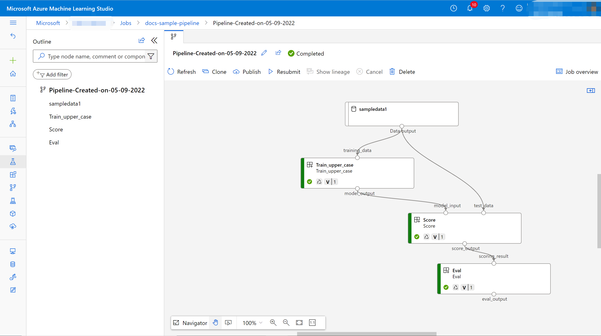
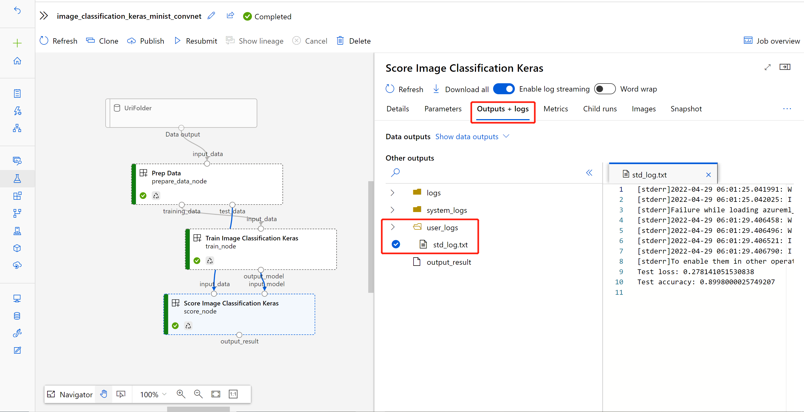
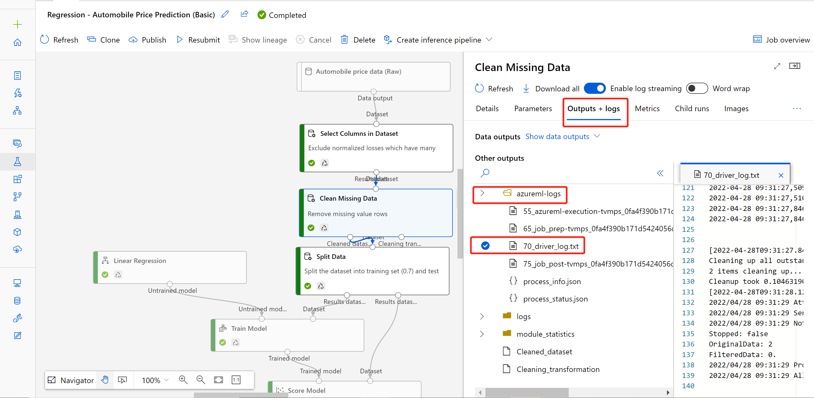
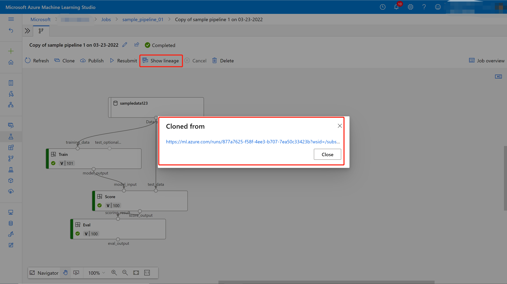
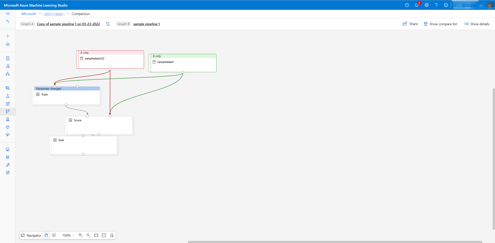
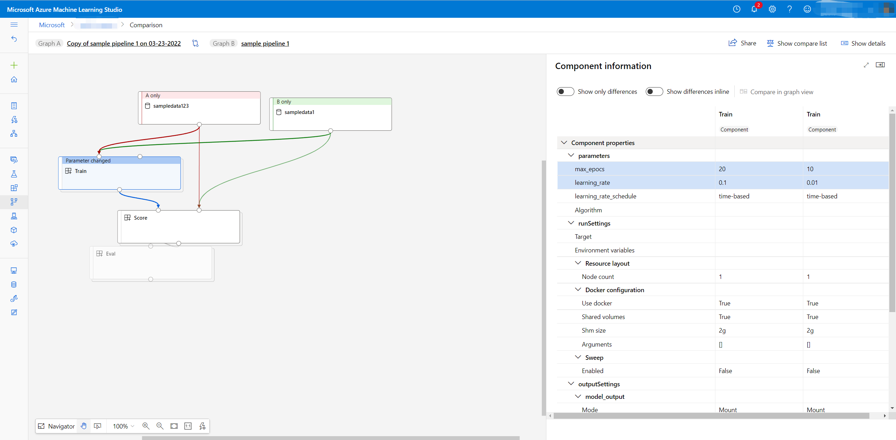
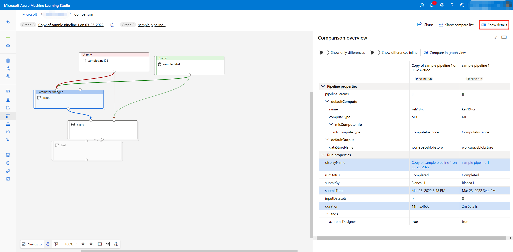
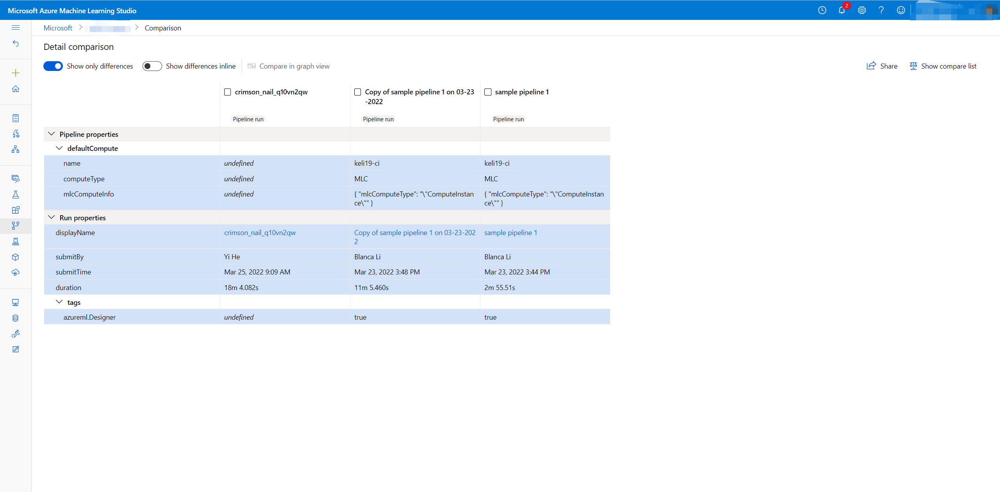
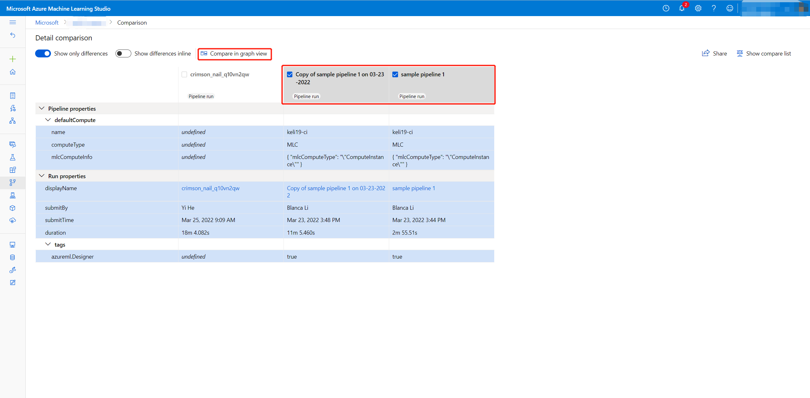

# How to use studio UI to build and debug Azure Machine Learning pipelines

Azure Machine Learning studio provides UI to build and debug your pipeline. You can use components to author a pipeline in the designer, and you can debug your pipeline in the job detail page.

This article will introduce how to use the studio UI to build and debug machine learning pipelines.

## Build machine learning pipeline

<!-- *************
Custom component
Asset library
Subgraph actions/Tab view (Post GA)
Right pane
************* -->

### Drag and drop components to build pipeline

In the designer homepage, you can select "New" to open a blank pipeline draft.

In the asset library left of the canvas, there are **Data assets** and **Components** tabs, which contains components and data registered to the workspace. For what is component and how to create custom component, you can refer to the [component concept article](concept-component.md).

You can quickly filter **My assets** or **Designer built-in assets**.

Then you can drag and drop either built-in components or custom components to the canvas. You can construct your pipeline or configure your components in any order. Just hide the right pane to construct your pipeline first, and open the right pane to configure your component.

> [!NOTE]
> Currently built-in components and custom components cannot be used together.
>

<!-- #### Pipeline component - Post GA

If your pipeline contains too many components, you can multi-select some components for the same purpose like a bunch of components for data preprocessing, and group them into a pipeline component.

 -->

### Submit pipeline

<!-- *************
submission list
************* -->

Now you've built your pipeline. Select **Submit** button above the canvas, and configure your pipeline job.

After you submit your pipeline job, you'll see a submitted job list in the left pane, which shows all the pipeline job you create from the current pipeline draft in the same session. There's also notification popping up from the notification center. You can select through the pipeline job link in the submission list or the notification to check pipeline job status or debugging.

> [!NOTE]
> Pipeline job status and results will not be filled back to the authoring page.

If you want to try a few different parameter values for the same pipeline, you can change values and submit for multiple times, without having to waiting for the running status.

> [!NOTE]
> The submission list only contains jobs submitted in the same session.
> If you refresh current page, it will not preserve the previous submitted job list.

On the pipeline job detail page, you can check the status of the overall job and each node inside, as well as logs of each node.

## Debug your pipeline in job detail page

<!-- *************
Outline
Quick filter, sort (for step view users)
Profiling (Tuning pipeline performance)
************* -->

### Using outline to quickly find node

In pipeline job detail page, there's an outline left to the canvas, which shows the overall structure of your pipeline job. Hovering on any row, you can select the "Locate" button to locate that node in the canvas.

You can filter failed or completed nodes, as well as filter by only components or dataset for further search. The left pane will show the matched nodes with more information including status, duration, and created time.

You can also sort the filter nodes.

### Check logs and outputs of component

If your pipeline fails or gets stuck on a node, first view the logs.

1. You can select the specific node and open the right pane.

1. Select **Outputs+logs** tab and you can explore all the outputs and logs of this node.

    The **user_logs folder** contains information about user code generated logs. This folder is open by default, and the **std_log.txt** log is selected. The **std_log.txt** is where your code's logs (for example, print statements) show up.
    
    The **system_logs folder** contains logs generated by Azure Machine Learning. Learn more about [how to view and download log files for a run](how-to-log-view-metrics.md#view-and-download-log-files-for-a-run).

    
    

    If you don't see those folders, this is due to the compute run time update isn't released to the compute cluster yet, and you can look at **70_driver_log.txt** under **azureml-logs** folder first.

    

<!-- ### Understand your pipeline job performance

If you would like to optimize your pipeline performance, you might need to firstly understand which part of pipeline cost compute time most. 

In pipeline UI, you can understand youe pipeline job performance leveraging "Profiling".

You can click "Profiling" button above canvas. Then you can check the detailed perfomance analysis of your pipeline job.

By default it will show the critical path of your whole pipeline job. Critical path is a series of child jobs (or sometimes only a single job) that controls the calculated start or complete time of the pipeline. The child jobs that make up the critical path are typically interrelated by job dependencies. When the last job in the critical path is completed, the pipeline is also completed. -->

## Clone a pipeline job to continue editing

<!-- *************
Find and replace (Post GA)
Show lineage
************* -->

If you would like to work based on an existing pipeline job in the workspace, you can easily clone it into a new pipeline draft to continue editing.

After cloning, you can also know which pipeline job it's cloned from by clicking **Showing lineage**.

You can edit your pipeline and then submit again. After submitting, you can see the lineage between the job you submit and the original job by selecting **Show lineage** in the job detail page.

<!-- ## Compare pipelines: not release for build

When you have multiple pipeline jobs for the same project but with different settings, you can easily compare the graph structure, pipeline configurations, component configurations, and pipeline job properties in the studio portal.

1. On each detail page of pipeline jobs you would like to compare, select **Add to compare**.

    Select **Show compare list** and you'll see all the selected pipeline jobs. You can also remove jobs, which you don't need to compare anymore.
    

1. In the compare list, if you want to see the pipeline graph structure comparison result first, you can select the two pipeline jobs you want to compare, and then select **Compare graph** to compare graph structure and components in the graph.
    > [!NOTE]
    > Currently **Compare graph** only supports comparing **2** pipeline jobs.
    >  **Compare detail** supports multiple pipelines comparison.

    

    In the screenshot above, you can see the detailed difference of each node in the two pipelines your compare.
    - The **red** node means this node only exists in Copy of sample pipeline1. 
    - The **green** node means this node only exists in sample pipeline 1.
    - The **blue** node means this node exists in both pipelines but have configuration changed. 

        For example, the `Train` node shows that it has parameter changed. You can select that node to see which parameters are changed. In the right pane of **Component information**, the blue lines are different values for same parameters.
        

    On the comparison page, select **Show details** to see the difference of the two pipeline job properties.

    By default, in the comparison table, it will only show difference and show difference inline, and you can uncheck on the top of comparison table.

    

1. If you want to directly see the difference between pipeline job properties, in the compare list, select **Compare detail**. 

    

    Then it will show job property comparison detail.

    

    From the detail comparison list, you can also select two pipeline jobs to compare the graph.

    
 -->

## Next steps

In this article, you learned the key features in how to create, explore, and debug a pipeline in UI. To learn more about how you can use the pipeline, see the following articles:

+ [How to train a model in the designer](tutorial-designer-automobile-price-train-score.md)
+ [How to deploy model to real-time endpoint in the designer](tutorial-designer-automobile-price-deploy.md)
+ [What is machine learning component](concept-component.md)
