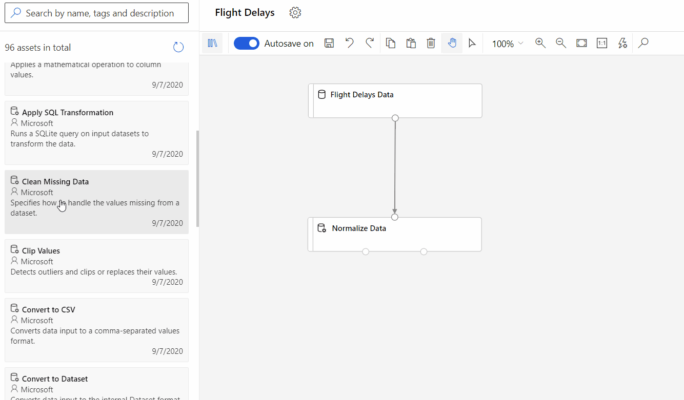

 
# What is Azure Machine Learning studio?

In this article, you learn about Azure Machine Learning studio, the web portal for data scientist developers in [Azure Machine Learning](overview-what-is-azure-machine-learning.md). The studio combines no-code and code-first experiences for an inclusive data science platform.

In this article you learn:
>[!div class="checklist"]
> - How to [author machine learning projects](#author-machine-learning-projects) in the studio.
> - How to [manage assets and resources](#manage-assets-and-resources) in the studio.
> - The differences between [Azure Machine Learning studio and ML Studio (classic)](#ml-studio-classic-vs-azure-machine-learning-studio).

We recommend that you use the most up-to-date browser that's compatible with your operating system. The following browsers are supported:
  * Microsoft Edge (latest version)
  * Safari (latest version, Mac only)
  * Chrome (latest version)
  * Firefox (latest version)

## Author machine learning projects

The studio offers multiple authoring experiences depending on the type project and the level of user experience.

+ **Notebooks**

  Write and run your own code in managed [Jupyter Notebook servers](how-to-run-jupyter-notebooks.md) that are directly integrated in the studio. 

:::image type="content" source="media/overview-what-is-azure-ml-studio/notebooks.gif" alt-text="Screenshot: write and run code in a notebook":::

+ **Azure Machine Learning designer**

  Use the designer to train and deploy machine learning models without writing any code. Drag and drop datasets and components to create ML pipelines. Try out the [designer tutorial](tutorial-designer-automobile-price-train-score.md).

    

+ **Automated machine learning UI**

  Learn how to create [automated ML experiments](tutorial-first-experiment-automated-ml.md) with an easy-to-use interface. 

  

+ **Data labeling**

    Use [Azure Machine Learning data labeling](how-to-create-labeling-projects.md) to efficiently coordinate data labeling projects.

## Manage assets and resources

Manage your machine learning assets directly in your browser. Assets are shared in the same workspace between the SDK and the studio for a seamless experience. Use the studio to manage:

- Models
- Datasets
- Datastores
- Compute resources
- Notebooks
- Experiments
- Run logs
- Pipelines 
- Pipeline endpoints

Even if you're an experienced developer, the studio can simplify how you manage workspace resources.

## ML Studio (classic) vs Azure Machine Learning studio

[!INCLUDE [ML Studio (classic) retirement](../../includes/machine-learning-studio-classic-deprecation.md)]

Released in 2015, **ML Studio (classic)** was the first drag-and-drop machine learning model builder in Azure. **ML Studio (classic)** is a standalone service that only offers a visual experience. Studio (classic) does not interoperate with Azure Machine Learning.

**Azure Machine Learning** is a separate, and modernized, service that delivers a complete data science platform. It supports both code-first and low-code experiences.

**Azure Machine Learning studio** is a web portal *in* Azure Machine Learning that contains low-code and no-code options for project authoring and asset management. 

If you're a new user, choose **Azure Machine Learning**, instead of ML Studio (classic). As a complete ML platform, Azure Machine Learning offers:

- Scalable compute clusters for large-scale training.
- Enterprise security and governance.
- Interoperable with popular open-source tools.
- End-to-end MLOps.

### Feature comparison

[!INCLUDE [aml-compare-classic](../../includes/machine-learning-compare-classic-aml.md)]

## Troubleshooting

* **Missing user interface items in studio** Azure role-based access control can be used to restrict actions that you can perform with Azure Machine Learning. These restrictions can prevent user interface items from appearing in the Azure Machine Learning studio. For example, if you are assigned a role that cannot create a compute instance, the option to create a compute instance will not appear in the studio. For more information, see [Manage users and roles](how-to-assign-roles.md).

## Next steps

Visit the [studio](https://ml.azure.com), or explore the different authoring options with these tutorials:  

Start with [Quickstart: Get started with Azure Machine Learning](quickstart-create-resources.md).  Then use these resources to create your first experiment with your preferred method:

  + [Run a "Hello world!" Python script (part 1 of 3)](tutorial-1st-experiment-hello-world.md)
  + [Use a Jupyter notebook to train image classification models](tutorial-train-models-with-aml.md)
  + [Use automated machine learning to train & deploy models](tutorial-first-experiment-automated-ml.md)  
  + [Use the designer to train & deploy models](tutorial-designer-automobile-price-train-score.md)
  + [Use studio in a secured virtual network](how-to-enable-studio-virtual-network.md)