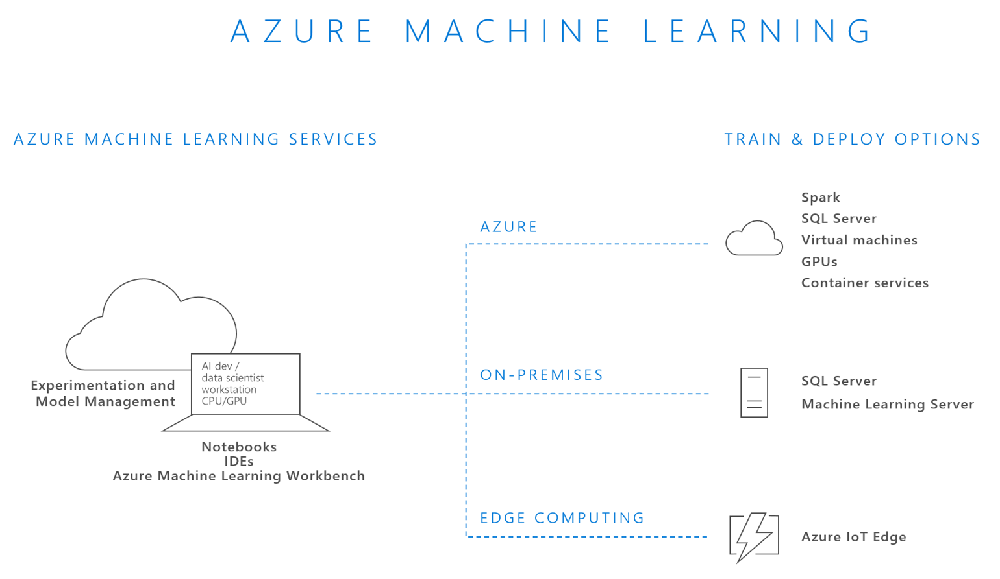

# What is Azure Machine Learning

Welcome to the new Azure Machine Learning. Our new release includes the Experimentation Service, the Model Management Service, and our Workbench application. We've also released an update to MMLSpark and a new plug-in for Visual Studio Code. Together, these applications and services have been designed to increase your rate of experimentation and allow you to build, deploy, and manage machine learning models in a wide range of environments. 

Our new release has been designed as a code-first, extensible machine learning platform. Workbench, available as a download for Windows and Mac, is the companion application for the Experimentation and Model Management services. With it you can manage your machine learning experiments from start to finish, including:
- Data connection, import, preparation, and wrangling 
- Notebook and IDE integration
- Collaboration and sharing
- Model creation, lineage, and version control
- Model scoring, statistics, and comparison
- Registration, deployment, monitoring and retraining of production models
 

The Experimentation Service is a managed Azure service that allows you to build, test, and compare machine learning models locally or in the cloud. The service supports all machine learning Python libraries, whether proprietary to your business or open-source. (The installation of Workbench includes a wide range of the most popular open source machine learning libraries, including Spark, CNTK, TensorFlow, and scikit-learn.)  The service is also integrated by default with Visual Studio and Github. This integration enables collaboration, data and model history, lineage, and back-ups. Lastly, the Experimentation Service is deeply integrated with Docker and uses industry standard Docker containers to enable model portability and reproducibility across environments. 

The Model Management Service is a managed Azure service that allows data scientists and dev-ops teams to deploy predictive models reliably into a wide variety of environments. The service uses the same GIT repository designated by the Experimentation Service. Using Git, models are versioned and model lineage is tracked. The Model Management Service uses Docker to manage and deploy models reliably to local machines, Azure, or IoT edge devices. Models are deployed via Linux-based Docker containers that include the model and all encompassing dependencies. Containers are registered with Azure Container Registry and in the case of cloud deployments, pushed to Azure Container Service. For cluster deployments, Kubernetes is used to manage and load balance across containers. 

