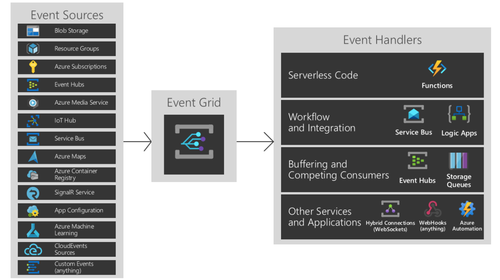

# Consume Azure Machine Learning events
Azure Machine Learning manages the entire lifecycle of machine learning process, including model training, model deployment, and monitoring. Azure Machine Learning events allow applications to react to events during the machine learning lifecycle, such as the completion of training runs, the registration and deployment of models, and the detection of data drift, by using modern serverless architectures. 

These events are published through [Azure Event Grid](https://azure.microsoft.com/services/event-grid/). Using Azure portal, Powershell or Azure CLI, customers can easily subscribe events by [specifying one or more event types, and filtering conditions](/azure/event-grid/event-filtering). Customers also have choice to build a wide range of event handlers such as Azure Functions, Azure Logic Apps, or generic webhooks. Azure Machine Learning, along with Azure Event Grid, provides a high available, reliable, and fault-tolerant event delivery platform for you to build event driven applications.

## The event model 

Azure Event Grid reads events from sources, such as Azure Machine Learning and other Azure services. These events are then sent to event handlers such as Azure Event Hubs, Azure Functions, Logic Apps, and others. The following diagram shows how Event Grid connects sources and handlers, but is not a comprehensive list of supported integrations.



For more information on event sources and event handlers, see [What is Event Grid?](/azure/event-grid/overview).

## Azure Machine Learning event types

Azure Machine Learning provides events in the various points of machine learning lifecycle: 

| Event type | Description |
| ---------- | ----------- |
| `Microsoft.MachineLearningServices.RunCompleted` | Raised when a machine learning experiment run is completed |
| `Microsoft.MachineLearningServices.ModelRegistered` | Raised when a machine learning model is registered in the workspace |
| `Microsoft.MachineLearningServices.ModelDeployed` | Raised when a deployment of inference service with one or more models is completed |
| `Microsoft.MachineLearningServices.DatasetDriftDetected` | Raised when a data drift detection job for two datasets is completed |

## Subscribe to Machine Learning events

Subscriptions for Azure Machine Learning events are protected by role-based access control (RBAC). Only [contributor or owner](how-to-assign-roles.md#default-roles) of a workspace can create, update, and delete event subscriptions.

Event subscriptions can be filtered based on a variety of conditions. Filters can be applied to event subscriptions either during the [creation](/cli/azure/eventgrid/event-subscription?view=azure-cli-latest) of the event subscription or [at a later time](/cli/azure/eventgrid/event-subscription?view=azure-cli-latest). 

### Filter by event type
An event subscription can specify one or more Azure Machine Learning event types.

### Filter by event subject
Azure Event Grid supports subject filters based on __begins with__ and __ends with__ matches, so that events with a matching subject are delivered to the subscriber. Different machine learning events have different subject format.

| Event type | Subject format | Sample subject |
| ---------- | ----------- | ----------- |
| `Microsoft.MachineLearningServices.RunCompleted` | `experiments/{ExperimentId}/runs/{RunId}` | `experiments/b1d7966c-f73a-4c68-b846-992ace89551f/runs/my_exp1_1554835758_38dbaa94` |
| `Microsoft.MachineLearningServices.ModelRegistered` | `models/{modelName}:{modelVersion}` | `models/sklearn_regression_model:3` |
| `Microsoft.MachineLearningServices.ModelDeployed` | `endpoints/{serviceId}` | `endpoints/my_sklearn_aks` |
| `Microsoft.MachineLearningServices.DatasetDriftDetected` | `datadrift/{data.DataDriftId}/run/{data.RunId}` | `datadrift/4e694bf5-712e-4e40-b06a-d2a2755212d4/run/my_driftrun1_1550564444_fbbcdc0f` |

### Advanced filtering

Azure Event Grid also supports advanced filtering based on published event schema. Azure Machine Learning event schema details can be found in [Azure Event Grid event schema for Azure Machine Learning](../../event-grid/event-schema-machine-learning.md).

Some sample advanced filterings you can perform include:

* For `Microsoft.MachineLearningServices.ModelRegistered` event, to filter model's tag value

```
--advanced-filter data.ModelTags.key1 StringIn ('value1')
```

To learn more about how to apply filters, see [Filter events for Event Grid](https://docs.microsoft.com/azure/event-grid/how-to-filter-events).

## Consume Machine Learning events

Applications that handle Machine Learning events should follow a few recommended practices:
> [!div class="checklist"]
> * As multiple subscriptions can be configured to route events to the same event handler, it is important not to assume events are from a particular source, but to check the topic of the message to ensure that it comes from the storage account you are expecting.
> * Similarly, check that the eventType is one you are prepared to process, and do not assume that all events you receive will be the types you expect.
> * As messages can arrive out of order and after some delay, use the etag fields to understand if your information about objects is still up-to-date.  Also, use the sequencer fields to understand the order of events on any particular object.
> * Ignore fields you don't understand. This practice will help keep you resilient to new features that might be added in the future.
> * Failed or cancelled Azure Machine Learning operations will not trigger an event. For example, if a model deployment fails Microsoft.MachineLearningServices.ModelDeployed won't be triggered. Consider such failure mode when design your applications. You can always use Azure Machine Learning SDK, CLI or portal to check the status of an operation and understand the detailed failure reasons.

Azure Event Grid allows customers to build de-coupled message handlers, which can be triggered by Azure Machine Learning events. Some notable examples of message handlers are:
* Azure Functions
* Azure Logic Apps
* Azure Event Hubs
* Azure Data Factory Pipeline
* Generic webhooks, which may be hosted on the Azure platform or elsewhere

## Next steps

Learn more about Event Grid and give Azure Machine Learning events a try:

- [About Event Grid](../../event-grid/overview.md)
- [Azure Event Grid event schema for Azure Machine Learning](../../event-grid/event-schema-machine-learning.md)
