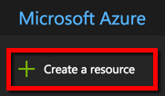

# Use the Azure portal to create an Azure Machine Learning Workspace

Get started with Azure Machine Learning Services by creating an Azure Machine Learning Workspace. In this article, you will create your workspace using the Azure portal.

## Prerequisites

If you don't have an Azure subscription, create a [free account](https://azure.microsoft.com/free/?WT.mc_id=A261C142F) before you begin.

## Create a Workspace 

1. Sign in to the [Azure portal](https://portal.azure.com/) using the credentials for the Azure subscription you'll use. If you don't have an Azure subscription, create a [free account](https://azure.microsoft.com/free/?WT.mc_id=A261C142F) now.

   

1. Select the **Create a resource** button (+) in the upper-left corner of the portal.

   

1. Enter **Machine Learning** in the search bar. Select the search result named **Machine Learning Workspace**.

    

1. In the **Machine Learning Workspace** pane, scroll to the bottom and select **Create** to begin.

    

1. In the **ML Workspace** pane, configure your workspace. 
    + Name the workspace that will be created. In this example, let's name it _MyWorkspace_.
    + Select a subscription.
    + Either create a new resource group or use an existing one. In this example, let's use an existing resource group called _Group_.
    + Select the geographical region where the workspace will be created.

    

1. Select **Create** to begin the creation process.

     It can take a few moments to create the workspace. You can check on the status of the deployment process by clicking the Notifications icon (bell) on the Azure portal toolbar.

    

1. When finished, you'll see a message that the deployment has succeeded.

    

## View a workspace

1. Check your newly created workspace with the  **All services** link in top left corner of the portal.  

    

2. Type **Machine Learning Workspace** in the search field.  Select **Machine Learning Workspace** to view all your Machine Learning Workspaces. You can filter based on subscription, resource groups, and locations.  In this example, you can see the MyWorkspace you created in the previous step.

    

3. You can select and click on a workspace to display its complete properties.

## Clean up resources 

[!INCLUDE [aml-delete-resource-group](../../../includes/aml-delete-resource-group.md)]

## Next steps

You can also use the [Quickstart: Create a project and get started with Azure Machine Learning Services SDK for Python](quickstart-set-up-in-python.md) or the [Quickstart: Create a project and get started with Azure Machine Learning Services CLI](quickstart-set-up-in-cli.md) to create workspaces and projects.