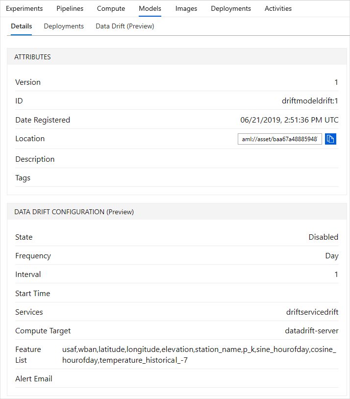
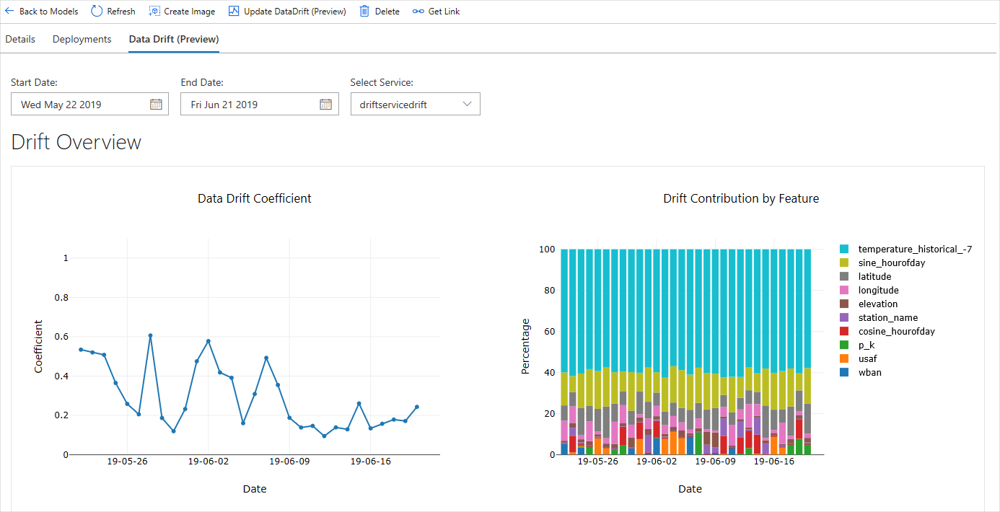

# How to detect data drift on models deployed to Azure Kubernetes Service (Preview)
In this article, you will learn how to monitor for [data drift](concept-data-drift.md) between the training dataset and inference data from Azure Kubernetes Service (AKS) for a deployed model. Data drift is one of the top reasons where model accuracy degrades over time. It happens when data served to model in production is different from the data that the model was trained on. The Azure Machine Learning service Data Drift Detector helps to monitor for data drift and send an alert when it is detected.  

> [!Note]
> This service is in (Preview) and limited in configuration options. Please see our [API Documentation](https://docs.microsoft.com/python/api/azureml-contrib-datadrift/?view=azure-ml-py) and [Release Notes](azure-machine-learning-release-notes) for details and updates. 

With Azure Machine Learning service, you can monitor  the inputs to a model deployed on AKS and compare this data to the training dataset for the model. At regular intervals, the inference data is [snapshot and profiled](how-to-explore-prepare-data.md), then computed against the baseline dataset to produce a data drift analysis that: 

+ Measures the magnitude of data drift, called the drift coefficient.
+ Measures the data drift contribution by feature, informing which features caused data drift.
+ Measures distance metrics. Currently Wasserstein and Energy Distance are computed.
+ Measures distributions of features. Currently kernel density estimation and histograms.
+ Send alerts to data drift by email.

For details on how these metrics are computed, see the [data drift concept](concept-data-drift.md) article.

## Prerequisites

- If you don’t have an Azure subscription, create a free account before you begin. Try the [free or paid version of Azure Machine Learning service](https://aka.ms/AMLFree) today.

- An Azure Machine Learning service workspace and the Azure Machine Learning SDK for Python installed. Learn how to get these prerequisites using the [How to configure a development environment](how-to-configure-environment.md) document.

- [Set up your environment](how-to-configure-environment.md), and then install the data drift SDK using the following command:

    ```
    pip install azureml-contrib-datadrift
    ```

- Create a [dataset](how-to-create-register-datasets.md) from your model's training data.

- Specify the training dataset when [registering](concept-model-management-and-deployment.md) the model. The following example demonstrates using the `datasets` parameter to specify the training dataset:

    ```python
    model = Model.register(model_path=model_file,
                        model_name=model_name,
                        workspace=ws,
                        datasets=datasets)

    print(model_name, image_name, service_name, model)
    ```

- Set up the [model data collector](how-to-enable-data-collection.md) to collect data from the AKS deployment of the model and confirm data is being collected in the `modeldata` blob container.

## Import Dependencies 
Import dependencies used in this guide:

```python
# Azure ML service packages 
from azureml.core import Experiment, Run, RunDetails
from azureml.contrib.datadrift import DataDriftDetector, AlertConfiguration
``` 

## Configure data drift 

The following Python example demonstrates configuring the `DataDriftDetector` object:

```python
# if email address is specified, setup AlertConfiguration
alert_config = AlertConfiguration('your_email@contoso.com')

# create a new DatadriftDetector object
datadrift = DataDriftDetector.create(ws, model.name, model.version, services, frequency="Day", alert_config=alert_config)
    
print('Details of Datadrift Object:\n{}'.format(datadrift))
```

For more information, see the [DataDrift](https://docs.microsoft.com/python/api/azureml-contrib-datadrift/?view=azure-ml-py) reference.

## Submit a DataDriftDetector run

With the DataDriftDetector configured, you can submit a [data drift run](https://docs.microsoft.com/python/api/azureml-contrib-datadrift/azureml.contrib.datadrift.datadriftdetector%28class%29?view=azure-ml-py#run-target-date--services--compute-target-name-none--create-compute-target-false--feature-list-none--drift-threshold-none-) on a given date for the model. 

```python
# adhoc run today
target_date = datetime.today()

# create a new compute - creates datadrift-server
run = datadrift.run(target_date, services, feature_list=feature_list, create_compute_target=True)

# or specify existing compute cluster
run = datadrift.run(target_date, services, feature_list=feature_list, compute_target='cpu-cluster')

# show details of the data drift run
exp = Experiment(ws, datadrift._id)
dd_run = Run(experiment=exp, run_id=run)
RunDetails(dd_run).show()
```

## Get data drift analysis results

The following Python example demonstrates how to plot relevant data drift metrics. You can use the returned metrics to build custom visualizations:

```python
# start and end are datetime objects 
drift_metrics = datadrift.get_output(start_time=start, end_time=end)

# Show all data drift result figures, one per serivice.
# If setting with_details is False (by default), only the data drift magnitude will be shown; if it's True, all details will be shown.
drift_figures = datadrift.show(with_details=True)
```


For details on the metrics that are computed, see the [data drift concept](concept-data-drift.md) article.

## Enable data drift schedule 

Enabling a data drift schedule performs a DataDriftDetector run at the specified frequency. If the drift coefficient is above the given threshold, an email is sent. 

```python
datadrift.enable_schedule()
datadrift.disable_schedule()
```

The configuration of the data drift detector can be seen on the model details page in the Azure portal.



## View Results in Azure ML Workspace UI

To view results in the Azure ML Workspace UI, navigate to the model page. On the details tab of the model, the data drift configuration is shown. A 'Data Drift (Preview)' tab is now available visualizing the data drift metrics. 



## Setting up alerts 

By setting the drift coefficient alerting threshold and giving an email address, an [Azure Monitor](https://docs.microsoft.com/azure/azure-monitor/overview) email alert is sent if the drift coefficient is above the threshold. All data drift metrics are stored in the app insights resource associated with the Azure Machine Learning service workspace for you to set up custom alerting or actions. You can follow the link in the email alert to the app insights query.


## Next steps

* For a full example of using data drift, see the [Azure ML data drift notebook](https://github.com/Azure/MachineLearningNotebooks/blob/master/how-to-use-azureml/data-drift/azure-ml-datadrift.ipynb). This Jupyter Notebook demonstrates using an [Azure Open Dataset](https://docs.microsoft.com/azure/open-datasets/overview-what-are-open-datasets) to train a model to predict the weather, deploy it to AKS, and monitor for data drift. 

* We would greatly appreciate your questions, comments, or suggestions as data drift moves toward general availability. Use the product feedback button below! 