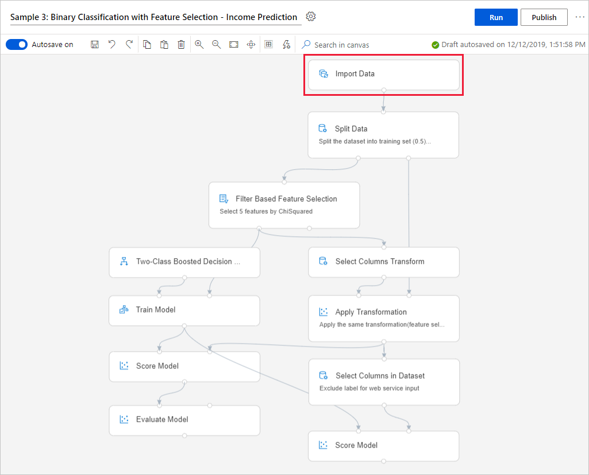
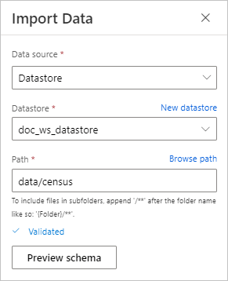
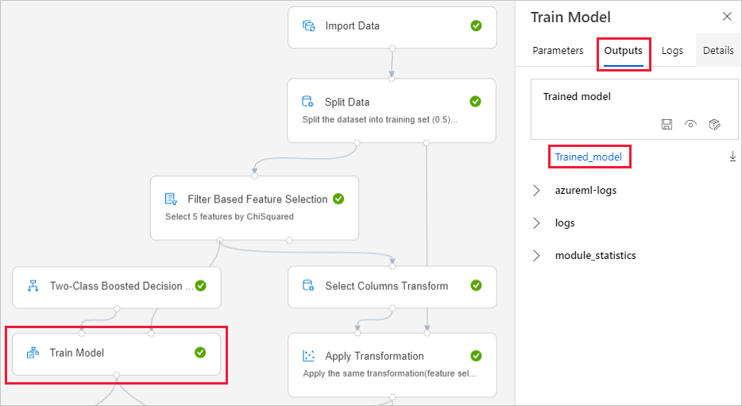
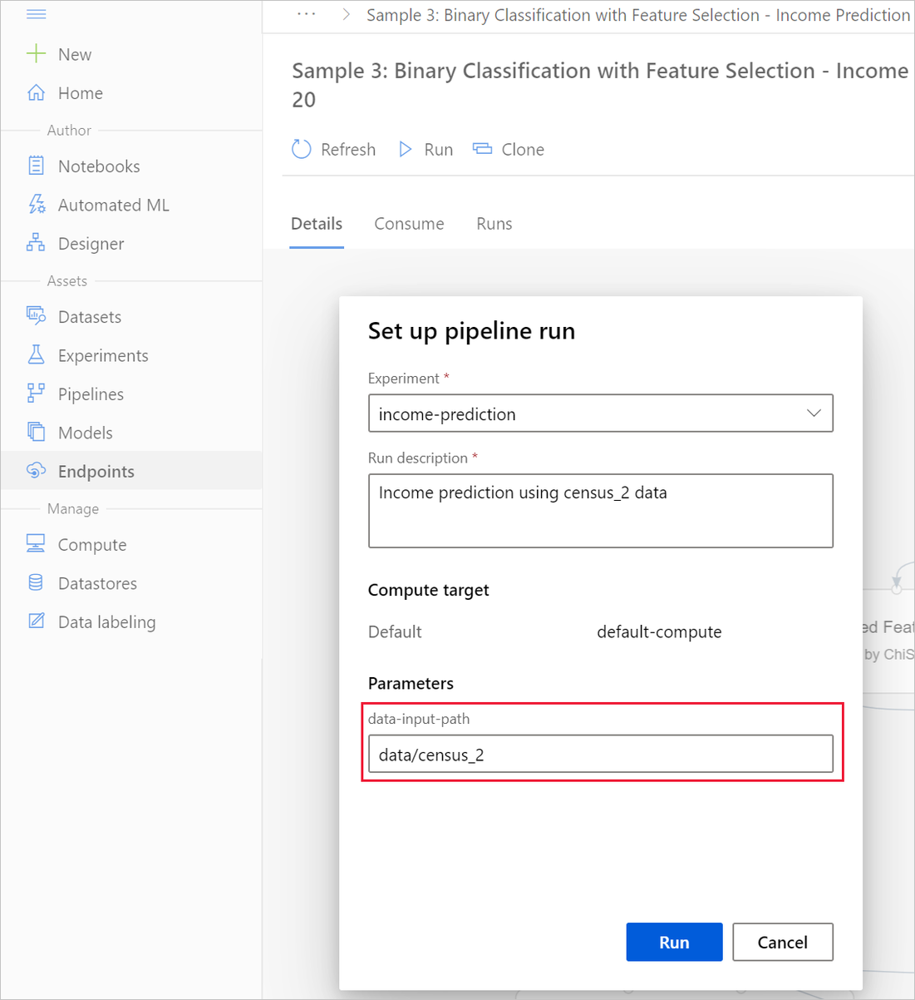

# Retrain models with Azure Machine Learning designer (preview)
[!INCLUDE [applies-to-skus](../../../includes/aml-applies-to-basic-enterprise-sku.md)]

In this how-to, you learn how to use Azure Machine Learning designer to retrain a machine learning model. Find out how to use published pipelines to automate machine learning workflows for retraining.

In this article you learn how to:

> [!div class="checklist"]
> * Train a machine learning model.
> * Create a pipeline parameter.
> * Publish your training pipeline.
> * Retrain your model.

## Prerequisites

* An Azure subscription. If you don’t have an Azure subscription, create a [free account](https://aka.ms/AMLFree).

* An Azure Machine Learning workspace with the Enterprise SKU.

This how-to assumes you have basic knowledge of building pipelines in the designer. For a guided introduction to the designer, complete the [tutorial](tutorial-designer-automobile-price-train-score.md). 

### Sample pipeline

The pipeline used in this article is an altered version of the one found in [Sample 3 - Income Prediction](../how-to-designer-sample-classification-predict-income.md). It uses the [Import Data](../algorithm-module-reference/import-data.md) module instead of the sample dataset to show you how to train a model using your own data.

## Train a machine learning model

To retrain a model, you need an initial model. In this section, you learn how to train a model and access the saved model using the designer.

1. Select the **Import Data** module.
1. In the properties pane, specify a data source.

    

    For this example, the data is stored in an [Azure datastore](../how-to-access-data.md). If you don't already have a datastore, you can create one now by selecting **New datastore**.

1. Specify the path to your data. You can also select **Browse path** to visually navigate your datastore. 

1. Select **Run** at the top of the canvas to run the pipeline.
    
    > [!NOTE]
    > If you have already set a default compute for this pipeline draft, the pipeline will run automatically. Otherwise, you can follow the prompts in the settings pane that appears to set one now.

### Locate your trained model

The designer saves all pipeline outputs, including trained models, to the default storage account. You can also access the trained model directly in the designer:

1. Wait for the pipeline to finish running.

1. Select the **Train Model** module.

1. In the settings pane, select **Outputs**.

1. Select **Trained_model** to download the model.

## Create a pipeline parameter

You can add pipeline parameters to dynamically set variables at runtime. For this pipeline, add a pipeline parameter for the training data path so that you can retrain your model on new datasets.

1. Select the **Import Data** module.
1. In the settings pane, select the ellipses above the **Path** field.
1. Select  **Add to pipeline parameter**.
1. Provide a parameter name and default value.

    > [!NOTE]
    > You can inspect and edit your pipeline parameters by selecting the **Settings gear icon** next to the title of your pipeline draft. 

[Screenshot showing how to create a pipeline parameter](./media/how-to-retrain-designer/add-pipeline-parameter.png)

## Publish a training pipeline

When you publish a pipeline, it creates a pipeline endpoint. Pipeline endpoints let you reuse and manage your pipelines for repeatability and automation. For this scenario, publish your training pipeline to reuse it for retraining.

1. Select **Publish** above the designer canvas.
1. Select, or create, a new pipeline endpoint.

    > [!NOTE]
    > You can publish multiple pipelines to a single endpoint. Each pipeline in the endpoint is given a version number, which you can specify when you call the pipeline endpoint.

1. Select **Publish**.

## Retrain your model

Now that you have a published training pipeline, you can use it to retrain your model using new data. You can submit runs from a pipeline endpoint from either portal or programatically.

### Submit runs with the designer

Use the following steps to submit a pipeline endpoint run from the designer:

1. Go to the **Endpoints** page.

1. Select the **Pipeline endpoints** tab.

1. Select your pipeline endpoint.

1. Select the **Published pipelines** tab.

1. Select the pipeline you want to run.

1. Select **Run**.

1. In the setup dialog, you can specify a new input data path value, which points to your new dataset.

### Submit runs with code

There are multiple ways to access your REST endpoint programatically depending on your development environment. You can find code samples that show you how to submit pipeline runs with parameters in the **Consume** tab of your pipeline.

## Next steps

Follow the designer [tutorial](tutorial-designer-automobile-price-train-score.md) to train and deploy a regression model.