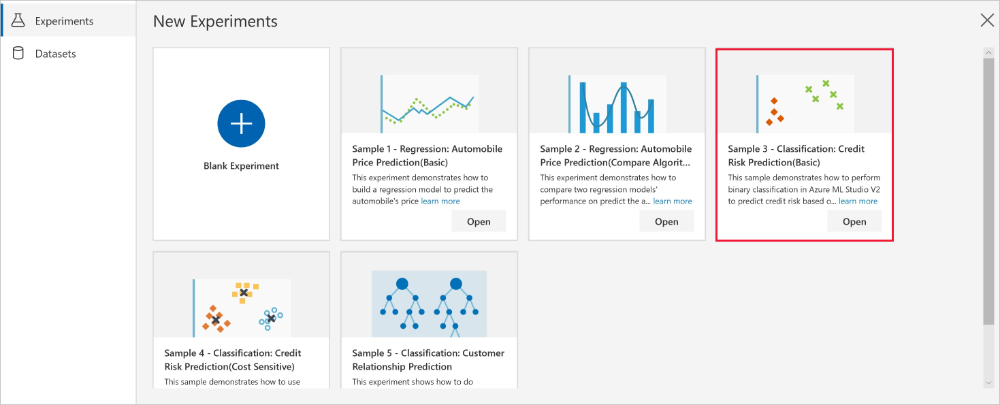
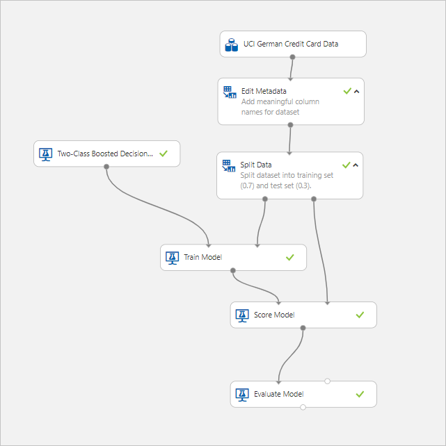
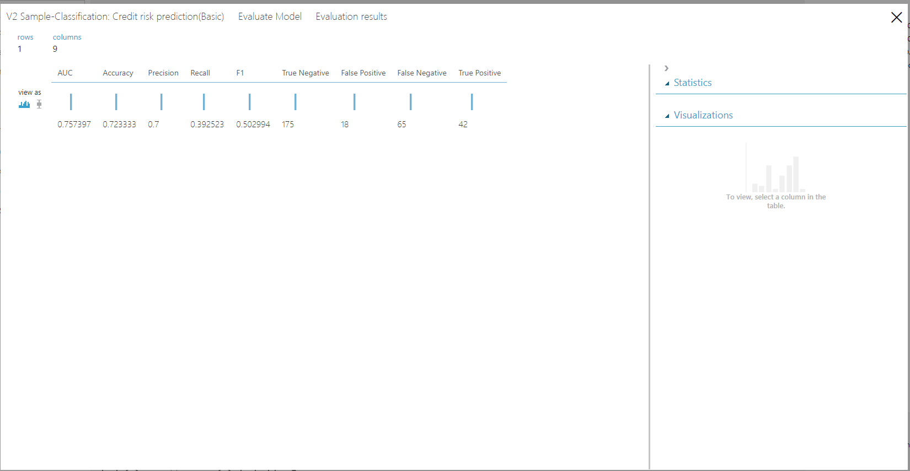

# Sample 3 - Classification: Predict credit risk

This visual interface sample experiment demonstrates how to perform binary classification to predict credit risk based on information given on a credit application. It shows how you can perform basic classification including data processing operations, split the dataset into training and test sets, train the model, score the test dataset, and evaluate the predictions.

## Prerequisites

[!INCLUDE [aml-delete-resource-group](../../../includes/aml-ui-prereq.md)]

Select **+ New** at the bottom-left to open the Sample 3 experiment.

## Related Sample

[Sample 4 - Classification: Credit risk prediction (cost sensitive)](sample-classification-predict-credit-risk-cost-sensitive.md)
provides an advanced experiment solving the same problem. It demonstrates how to perform _cost sensitive_ classification using an **Execute Python Script** module and compare the performance of two binary classification algorithms. Refer to it if you want to learn more about how to build classification experiment.

## Data

We use the German Credit Card data set from the UC Irvine repository.

The data set contains 1000 samples with 20 features and 1 label. Each sample represents a person. The 20 features include both numerical and categorical features. See the [UCI Site](https://archive.ics.uci.edu/ml/datasets/Statlog+%28German+Credit+Data%29) for the meaning of the categorical features. The last column is the label, which denotes the credit risk and has only two possible values: high credit risk = 2, and low credit risk = 1. 

## Experiment summary

The following steps were used to create the experiment.

1. Drag and drop the German Credit Card UCI Data dataset module into your experiment's canvas.
1. Add an **Edit Metadata** to add meaningful names for each column.
1. Add a **Split Data** module to create the testing and test sets. Set the Fraction of rows in the first output dataset to 0.7. This means that 70% of the data will be output to the left port and the rest to the right port of this module. We will use the left dataset for training and the right one for testing.
1. Add a Two-Class Boosted Decision Tree module to initialize a boosted decision tree classifier.
1. Add a Train Model module and connect the classifier (step 4) and the training set (left output port of the Split module) to the left and right input ports respectively. This module will perform the training of the classifier.
1. Add a Score Model module and connect the trained model and the test set (right port of the Split module). This module will make the predictions. You can click on its output port to see the actual predictions and the positive class probabilities.
1. Add an Evaluate Model module and connect the scored dataset to the left input port. To see the evaluation results, click on the output port of the Evaluate Model module and select Visualize.

## Results

From the evaluation result, we can see the AUC of the model is 0.757. At threshold 0.5, the precision is 0.7, recall is 0.393, and F1 score is 0.503. 

## Clean up resources

[!INCLUDE [aml-ui-cleanup](../../../includes/aml-ui-cleanup.md)]

## Next steps

Explore the other samples available for the visual interface:

- [Sample 1 - Regression: predict automobile price](sample-regression-predict-automobile-price-basic.md)
- [Sample 2 - Regression: Compare algorithms for automobile price prediction](sample-regression-predict-automobile-price-compare-algorithms.md)
- [Sample 4 - Classification: Predict credit risk (cost sensitive)](sample-classification-predict-credit-risk-cost-sensitive.md)
- [Sample 5 - Classification: Predict churn](sample-classification-predict-churn.md)