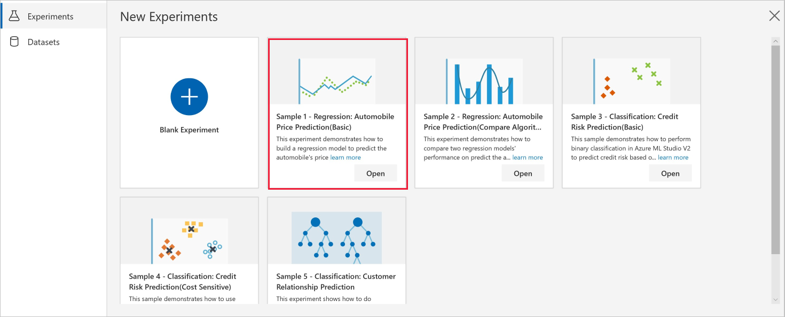
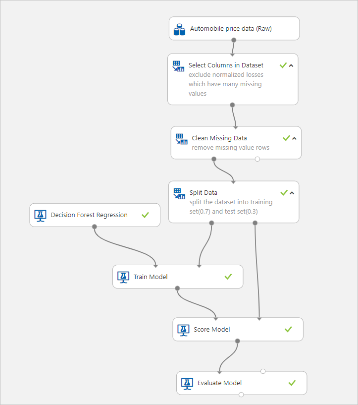
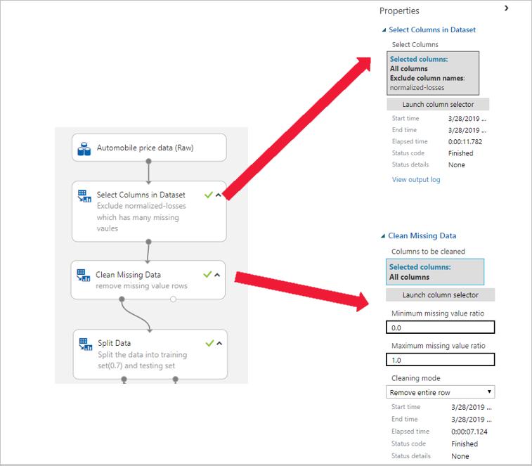
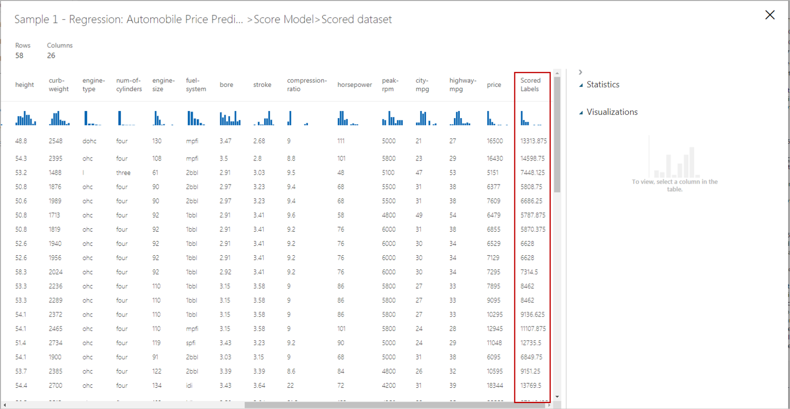
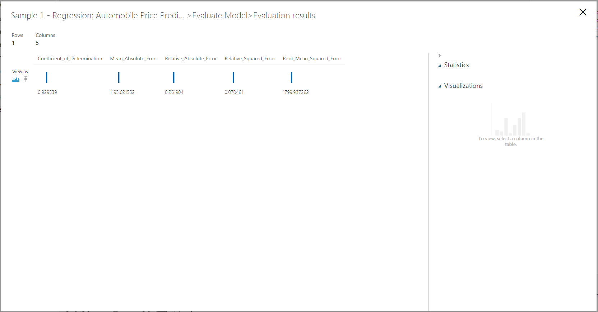

# Sample 1 - Regression: Predict automobile price

This visual interface sample experiment demonstrates how to build a regression model to predict the automobile's price. The process includes training, testing and evaluating the model on the **Auto Imports** dataset.

## Prerequisites

[!INCLUDE [aml-delete-resource-group](../../../includes/aml-ui-prereq.md)]

Select **+ New** at the bottom-left to open the Sample 1 experiment.

## Related sample

[Sample 2 - Regression: Predict automobile(compare algorithms)](sample-regression-predict-automobile-price-compare-algorithms.md) provides a more complicated sample experiment solving the same problem using two different regression model. It shows how to quick compare different algorithms with Studio V2. Please check it if you are looking for a more advanced sample.

## Data

In this experiment, we used the **Automobile price data (Raw)** which is sourced from the UCI Machine Learning repository. This dataset contains 26 columns which includes information about automobiles by make, model, price, vehicle features like the number of cylinders, MPG, as well as an insurance risk score. Here the goal is to predict the price of the car.

## Experiment summary

Build the experiment in four steps.

1. Get data
1. Data pre-processing
1. Train the model
1. Test, evaluate and compare the model

## Get data

The input data is  available as a sample dataset, **Automobile price data(Raw)**.

## Data pre-precessing

The major data preparation tasks include data cleaning, integration, transformation, reduction, and discretization or quantization. In Azure ML studio, you can find modules to perform these operations and other data pre-processing tasks in the **Data Transformation** group in the left panel.

We use **Select Columns in Dataset** to exclude normalized-losses that has many missing values. Then we use **Clean Missing Data** to remove the rows with missing values. This helps create a clean set of training data.

## Train the model
Machine learning problems vary in nature. Common machine learning tasks include classification, clustering, regression, recommender system, each of which might require a different algorithm. Choosing an algorithm often depends on the requirements of the actual use case. After picking an algorithm, the parameters of the algorithm must be tuned in order to train a more accurate model. All models must then be evaluated based on metrics such as accuracy, intelligibility and efficiency.

In this experiment, the goal is to predict automobile prices. Since the label column (price) contains real numbers, a regression model is a good choice. Considering that the number of features is relatively small (less than 100) and these features are not sparse, the decision boundary is likely to be nonlinear. So we choose **Decision Forest Regression** in this experiment.

Using the **Split Data** module, we randomly divide the input data such that the training and testing datasets contains 70% and 30% of the original data respectively.

## Test, evaluate, and compare

 By splitting the dataset and using different datasets to train and test the model, the result of model evaluation is more objective.

After the model is trained, use the **Score Model** and **Evaluate Model** modules to generate predicted results and to evaluate the models. 

**Score Model** generates predictions for the test dataset using the trained model. To check the result, click the output port of **Score Model** and select **Visualize**.

The scores are then passed to **Evaluate Model** to generate evaluation metrics. To check the result, click the output port of **Evaluate Model** and select **Visualize**.

## Clean up resources

[!INCLUDE [aml-ui-cleanup](../../../includes/aml-ui-cleanup.md)]

## Next steps

Explore the other samples available for the visual interface:

- [Sample 2 - Regression: Compare algorithms for automobile price prediction](sample-regression-predict-automobile-price-compare-algorithms.md)
- [Sample 3 - Classification: Predict credit risk](sample-classification-predict-credit-risk-basic.md)
- [Sample 4 - Classification: Predict credit risk (cost sensitive)](sample-classification-predict-credit-risk-cost-sensitive.md)
- [Sample 5 - Classification: Predict churn](sample-classification-predict-churn.md)
