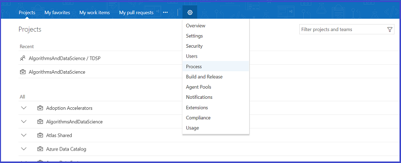
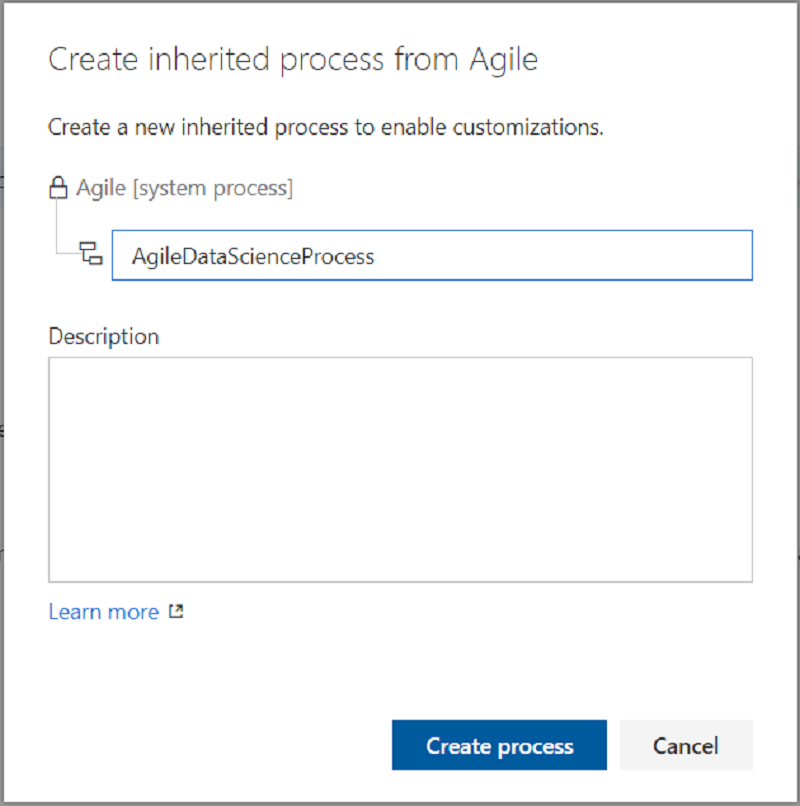
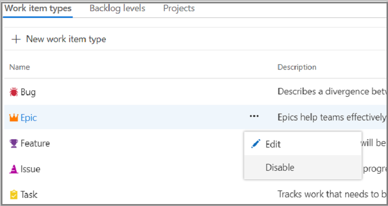
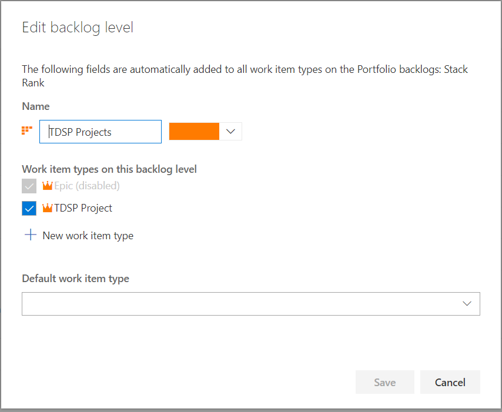
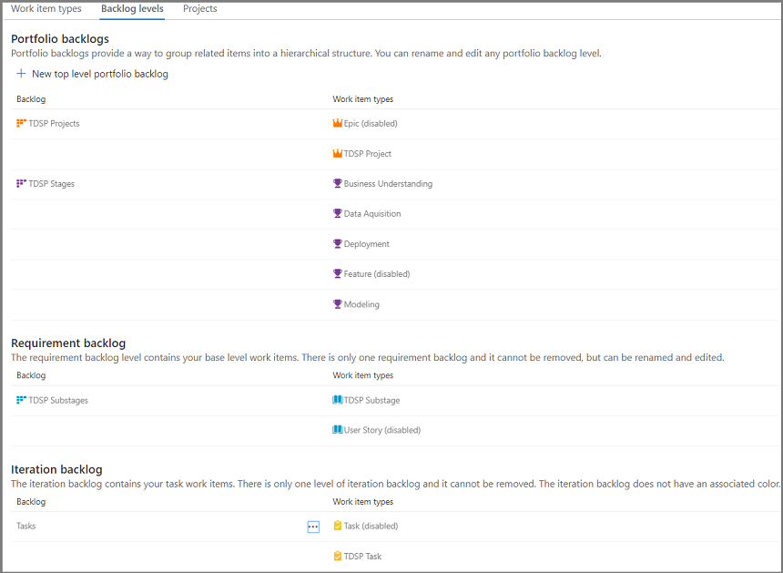
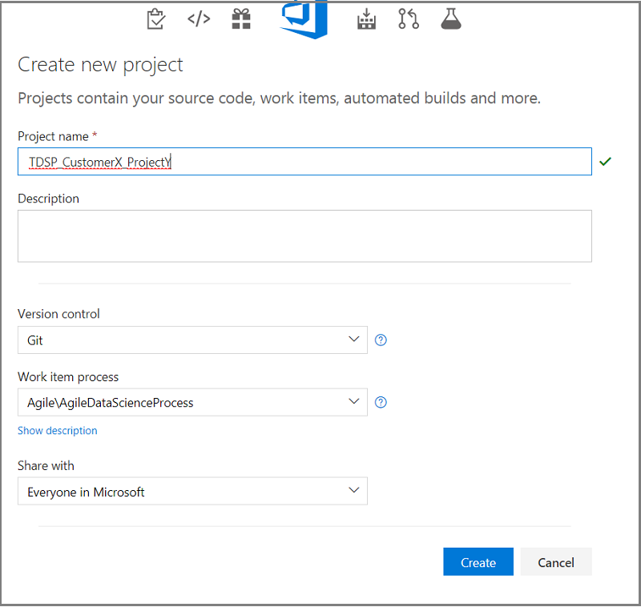

# Set up agile data science process in Visual Studio Online

This article explains how to set up an agile data science process template that uses the TDSP data science lifecycle stages and tracks work items with Visual Studio Online (vso). The steps below walk through an example of setting up the data science-specific agile process template *AgileDataScienceProcess* and show how to create data science work items based on the template.

## Agile Data Science Process Template Setup

1. Navigate to server homepage,  **Configure** -> **Process**.

	 

2. Navigate to **All processes** -> **Processes**, under **Agile** and click on **Create inherited process**. Then put the process name "AgileDataScienceProcess" and click **Create process**.

	

3. Under the **AgileDataScienceProcess** -> **Work item types** tab, disable **Epic**, **Feature**, **User Story**, and **Task** work item types by **Configure -> Disable**

	

4. Navigate to **AgileDataScienceProcess** -> **Backlog levels** tab. Rename "Epics" to "TDSP Projects" by  clicking on the **Configure** -> **Edit/Rename**. In the same dialog box, click **+New work item type** in "Data Science Project" and set the value of **Default work item type** to "TDSP Project" 

	  

5. Similarly, change Backlog name "Features" to "TDSP Stages" and add the following to the **New work item type**:

	- Business Understanding
	- Data Acquisition
	- Modeling
	- Deployment

6. Rename "User Story" to "TDSP Substages" with default work item type set to newly created "TDSP Substage" type.

7. Set the "Tasks" to newly created Work item type "TDSP Task" 

8. After these steps, the Backlog levels should look like this:

	  

 
## Create Data Science Work Items

After the data science process template is created, you can create and track your data science work items that correspond to the TDSP lifecycle.

1. When you create a new team project, select "Agile\AgileDataScienceProcess" as the **Work item process**:

	

2. Navigate to the newly created team project, and click on **Work** -> **Backlogs**.

3. Make "TDSP Projects" visible by clicking on **Configure team settings** and check "TDSP Projects"; then save.

	

4. Now you can start creating the data science-specific work items.

	

5. Here is an example of how the data science project work items should appear:

	

## Next steps
Here are links to some useful resources on agile processes.

- Agile process
	[https://www.visualstudio.com/en-us/docs/work/guidance/agile-process](https://www.visualstudio.com/en-us/docs/work/guidance/agile-process)
- Agile process work item types and workflow
	[https://www.visualstudio.com/en-us/docs/work/guidance/agile-process-workflow](https://www.visualstudio.com/en-us/docs/work/guidance/agile-process-workflow)