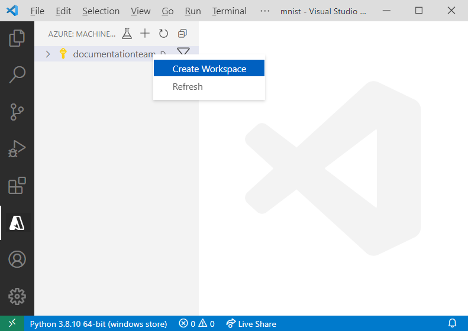
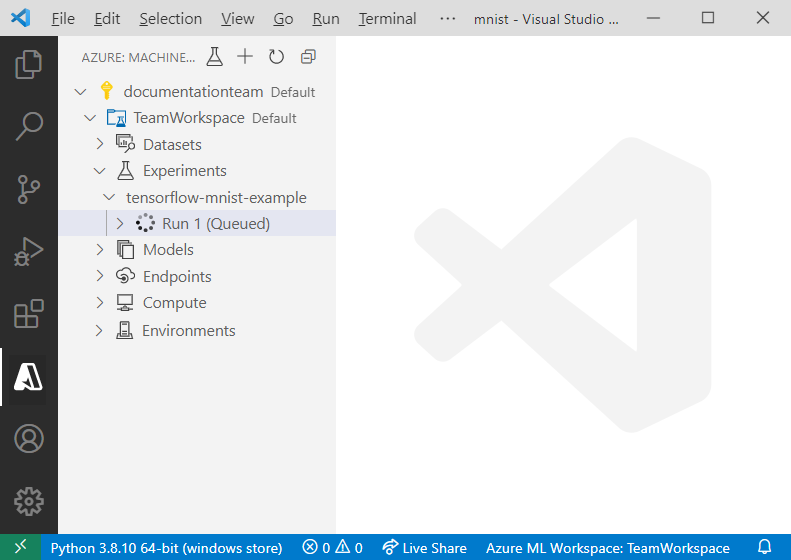

# Train and deploy an image classification TensorFlow model using the Azure Machine Learning Visual Studio Code Extension

Learn how to train an image classification model to recognize hand-written numbers using TensorFlow and the Azure Machine Learning Visual Studio Code Extension.

In this tutorial, you learn the following tasks:

> [!div class="checklist"]
> * Understand the code
> * Create a workspace
> * Create an experiment
> * Configure Computer Targets
> * Run a configuration file
> * Train a model
> * Register a model
> * Deploy a model

## Prerequisites

- Azure subscription. If you don't have one, sign up to try the [free or paid version of Azure Machine Learning](https://aka.ms/AMLFree).
- Install [Visual Studio Code](https://code.visualstudio.com/docs/setup/setup-overview), a lightweight, cross-platform code editor.
- Azure Machine Learning Studio Visual Studio Code extension. For install instructions see the [Setup Azure Machine Learning Visual Studio Code extension tutorial](./tutorial-setup-vscode-extension.md)

## Understand the code

The code for this tutorial uses TensorFlow to train an image classification machine learning model that categorizes handwritten digits from 0-9. It does so by creating a neural network that takes the pixel values of 28 px x 28 px image as input and outputs a list of 10 probabilities, one for each of the digits being classified. Below is a sample of what the data looks like.  


Get the code for this tutorial by downloading and unzipping the [VS Code Tools for AI repository](https://github.com/microsoft/vscode-tools-for-ai/archive/master.zip) anywhere on your computer.

## Create a workspace

The first thing you have to do to build an application in Azure Machine Learning is to create a workspace. A workspace contains the resources to train models as well as the trained models themselves. For more information, see [what is a workspace](./concept-workspace.md). 

1. On the Visual Studio Code activity bar, select the **Azure** icon to open the Azure Machine Learning view.
1. Right-click your Azure subscription and select **Create Workspace**. 

    

1. By default a name is generated containing the date and time of creation. In the command palette, change the name to "TeamWorkspace" and press **Enter**.
1. Select **Create a new resource group** in the command palette. 
1. Enter "TeamWorkspace-rg" in the command palette text box and press **Enter**. 
1. In the command palette, choose a location for your workspace. It's recommended to choose a location that is closest to the location you plan to deploy your model. In this case, choose **West US 2**.
1. When prompted to select a workspace SKU, select **Basic** to create a basic workspace. For more information on different workspace offerings, see [Azure Machine Learning overview](./overview-what-is-azure-ml.md#sku).

At this point, a request to Azure is made to create a new workspace in your account. After a few minutes, the new workspace appears in your subscription node. 

## Create an experiment

One or more experiments can be created in your workspace to track and analyze individual model training runs. Runs can be done in the Azure cloud or on your local machine.

1. On the Visual Studio Code activity bar, select the **Azure** icon. The Azure Machine Learning view appears.
1. Expand your subscription node.
1. Expand the **TeamWorkspace** node. 
1. Right-click the **Experiments** node.
1. Select **Create Experiment** from the context menu.

    

1. In the command palette prompt, name your experiment "MNIST" and press **Enter** to create the new experiment. 

Like workspaces, a request is sent to Azure to create an experiment with the provided configurations. After a few minutes, the new experiment appears in the *Experiments* node of your workspace. 

## Configure Compute Targets

A compute target is the computing resource or environment where you run scripts and deploy trained models. For more information, see the [Azure Machine Learning compute targets documentation](./concept-compute-target.md).

To create a compute target:

1. On the Visual Studio Code activity bar, select the **Azure** icon. The Azure Machine Learning view appears. 
1. Expand your subscription node. 
1. Expand the **TeamWorkspace** node. 
1. Under the workspace node, right-click the **Compute** node and choose **Create Compute**. 

    

1. Select **Azure Machine Learning Compute (AmlCompute)**. Azure Machine Learning Compute is a managed-compute infrastructure that allows the user to easily create a single or multi-node compute that can be used with other users in your workspace.
1. Choose a VM size. In the command palette prompt, select **Standard_F2s_v2**. The size of your VM has an impact on the amount of time it takes to train your models. For more information on VM sizes, see [sizes for Linux virtual machines in Azure](https://docs.microsoft.com/en-us/azure/virtual-machines/linux/sizes).
1. In the command palette prompt, name your compute "TeamWkspc-com" and press **Enter** to create your compute.

After a few minutes, the new compute target appears in the *Compute* node of your workspace.

## Create a run configuration

When you submit a training run to a compute target, you also submit the configuration needed to run the training job. For example, the script that contains the training code and the Python dependencies needed to run it.

To create a run configuration:

1. On the Visual Studio Code activity bar, select the **Azure** icon. The Azure Machine Learning view appears. 
1. Expand your subscription node. 
1. Expand the **TeamWorkspace** node. 
1. Under the workspace node, right-click the **TeamWkspc-com** compute node and choose **Create Run Configuration**.

    

1. In the command palette prompt, name your run configuration "MNIST-rc" and press **Enter** to create your compute.
1. Then, select **TensorFlow Single-Node Training** as the training job type.
1. Press **Enter** to browse the script file to run on the compute. In this case, the script to train the model is the `train.py` file inside the `vscode-tools-for-ai/mnist-vscode-docs-sample` directory.
1. Enter the following into the command palette prompt to specify the required packages.
    
    ```text
    pip: azureml-defaults; conda: python=3.6.2, tensorflow=1.15.0
    ```
    
    A file called `MNIST-rc.runconfig` appears in VS Code with content similar to the one below:

    ```json
    {
        "script": "train.py",
        "framework": "Python",
        "communicator": "None",
        "target": "TeamWkspc-com",
        "environment": {
            "python": {
                "userManagedDependencies": false,
                "condaDependencies": {
                    "dependencies": [
                        "python=3.6.2",
                        "tensorflow=1.15.0",
                        {
                            "pip": [
                                "azureml-defaults"
                            ]
                        }
                    ]
                }
            },
            "docker": {
                "baseImage": "mcr.microsoft.com/azureml/base:0.2.4",
                "enabled": true,
                "baseImageRegistry": {
                    "address": null,
                    "username": null,
                    "password": null
                }
            }
        },
        "nodeCount": 1,
        "history": {
            "outputCollection": true,
            "snapshotProject": false,
            "directoriesToWatch": [
                "logs"
            ]
        }
    }
    ```

1. When satisfied with the configuration, open the command palette by selecting **View > Command Palette**.
1. Enter the following command into the command palette to save your run configuration file.

    ```text
    Azure ML: Save and Continue
    ```

The `MNIST-rc` run configuration is added under the *TeamWkspc-com* compute node.

## Train the model

During the training process, a TensorFlow model is created by processing the training data and learning patterns embedded within it for each of the respective digits being classified. 

To run an Azure Machine Learning experiment:

1. On the Visual Studio Code activity bar, select the **Azure** icon. The Azure Machine Learning view appears. 
1. Expand your subscription node. 
1. Expand the **TeamWorkspace > Experiments** node. 
1. Right-click the **MNIST** experiment.
1. Select **Run Experiment**.

    

1. In the command palette, select the **TeamWkspc-com** compute target.
1. Then, select the **MNIST-rc** run configuration.
1. At this point, a request is sent to Azure to run your experiment on the selected compute target in your workspace. This process takes several minutes. The amount of time to run the training job is impacted by several factors like the compute type and training data size. To track the progress of your experiment, right-click the current run node and select **View Run in Azure portal**.
1. When the dialog requesting to open an external website appears, select **Open**.

    

When the model is done training, the status label next to the run node updates to "Completed".

## Register the model

Now that you've trained your model, you can register it in your workspace. 

To register your model:

1. On the Visual Studio Code activity bar, select the **Azure** icon. The Azure Machine Learning view appears.
1. Expand your subscription node. 
1. Expand the **TeamWorkspace > Experiments > MNIST** node.
1. Get the model outputs generated from training the model. Right-click the **Run 1** run node and select **Download outputs**. 

    

1. Choose the directory to save the downloaded outputs to. By default, the outputs are placed in the directory currently opened in Visual Studio Code.
1. Right-click the **Models** node and choose **Register Model**.

    

1. On the command palette, name your model "MNIST-TensorFlow-model" and press **Enter**.
1. A TensorFlow model is made up of several files. Select **Model folder** as the model path format in the command palette. 
1. Select the `azureml_outputs/Run_1/outputs/Run_1/outputs/outputs/model` directory.

    A file containing your model configurations appears in Visual Studio Code with similar content to the one below:

    ```json
    {
        "modelName": "MNIST-TensorFlow-model",
        "tags": {
            "": ""
        },
        "modelPath": "c:\\Dev\\vscode-tools-for-ai\\mnist-vscode-docs-sample\\azureml_outputs\\Run_1\\outputs\\Run_1\\outputs\\outputs\\model",
        "description": ""
    }
    ```

1. Once you're satisfied with your configuration, save it by opening the command palette and entering the following command:

    ```text
    Azure ML: Save and Continue
    ```

After a few minutes, the model appears under the *Models* node.

## Deploy the model

In Visual Studio Code, you can deploy your model as a web service to:

+ Azure Container Instances (ACI).
+ Azure Kubernetes Service (AKS).

You don't need to create an ACI container to test in advance, because ACI containers are created as needed. However, you do need to configure AKS clusters in advance. For more information on deployment options, see [deploy models with Azure Machine Learning](how-to-deploy-and-where.md) .

To deploy a web service as an ACI :

1. On the Visual Studio Code activity bar, select the **Azure** icon. The Azure Machine Learning view appears.
1. Expand your subscription node. 
1. Expand the **TeamWorkspace > Models** node. 
1. Right-click the **MNIST-TensorFlow-model** and select **Deploy Service from Registered Model**.

    

1. On the command palette, select **Azure Container Instances**.
1. Name your service "mnist-tensorflow-svc" and press **Enter** in the command palette.
1. Choose the script to run in the container by pressing **Enter** in the command palette and browsing for the `score.py` file in the `mnist-vscode-docs-sample` directory.
1. Provide the dependencies needed to run the script by pressing **Enter** in the command palette and browsing for the `env.yml` file in the `mnist-vscode-docs-sample` directory.

    A file containing your model configurations appears in Visual Studio Code with similar content to the one below:

    ```json
    {
        "name": "mnist-tensorflow-svc",
        "imageConfig": {
            "runtime": "python",
            "executionScript": "score.py",
            "dockerFile": null,
            "condaFile": "env.yml",
            "dependencies": [],
            "schemaFile": null,
            "enableGpu": false,
            "description": ""
        },
        "deploymentConfig": {
            "cpu_cores": 1,
            "memory_gb": 10,
            "tags": {
                "": ""
            },
            "description": ""
        },
        "deploymentType": "ACI",
        "modelIds": [
            "MNIST-TensorFlow-model:1"
        ]
    }
    ```
1. Once you're satisfied with your configuration, save it by opening the command palette and entering the following command:

    ```text
    Azure ML: Save and Continue
    ```

At this point, a request is sent to Azure to deploy your web service. This process takes several minutes. Once deployed, the new service appears under the *Endpoints* node.

## Next steps

* For a walkthrough of how to train with Azure Machine Learning outside of Visual Studio Code, see [Tutorial: Train models with Azure Machine Learning](tutorial-train-models-with-aml.md).
* For a walkthrough of how to edit, run, and debug code locally, see the [Python hello-world tutorial](https://code.visualstudio.com/docs/Python/Python-tutorial).

