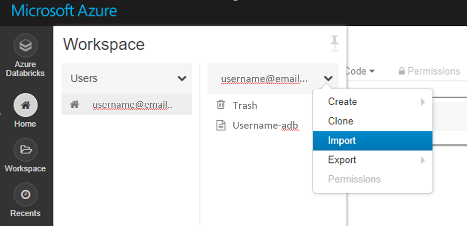
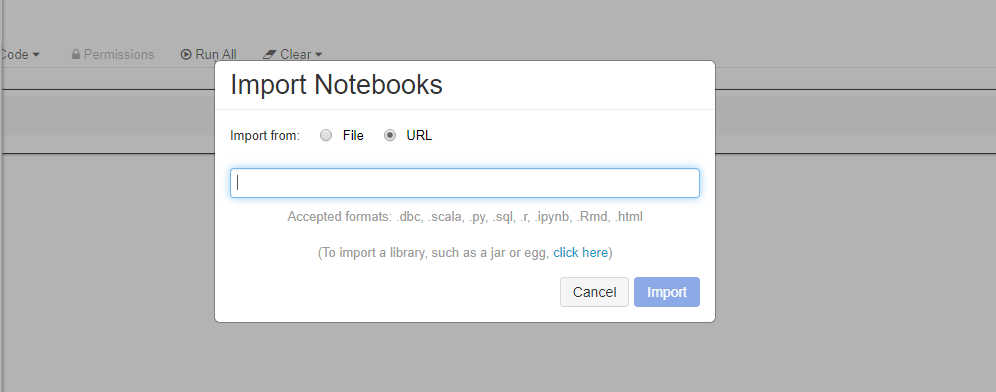

# Set up a development environment with Azure Databricks and AutoML in Azure Machine Learning 

Learn how to configure a development environment in Azure Machine Learning that uses Azure Databricks and automated ML.

Azure Databricks is ideal for running large-scale intensive machine learning workflows on the scalable Apache Spark platform in the Azure cloud. It provides a collaborative Notebook-based environment with a CPU or GPU-based compute cluster.

For information on other machine learning development environments, see [Set up Python development environment](how-to-configure-environment-v1.md).


## Prerequisite

Azure Machine Learning workspace. To create one, use the steps in the [Create workspace resources](../quickstart-create-resources.md) article.


## Azure Databricks with Azure Machine Learning and AutoML

Azure Databricks integrates with Azure Machine Learning and its AutoML capabilities. 

You can use Azure Databricks:

+ To train a model using Spark MLlib and deploy the model to ACI/AKS.
+ With [automated machine learning](concept-automated-ml-v1.md) capabilities using an Azure Machine Learning SDK.
+ As a compute target from an [Azure Machine Learning pipeline](../concept-ml-pipelines.md).

## Set up a Databricks cluster

Create a [Databricks cluster](/azure/databricks/scenarios/quickstart-create-databricks-workspace-portal). Some settings apply only if you install the SDK for automated machine learning on Databricks.

**It takes few minutes to create the cluster.**

Use these settings:

| Setting |Applies to| Value |
|----|---|---|
| Cluster Name |always| yourclustername |
| Databricks Runtime Version |always| 9.1 LTS|
| Python version |always| 3 |
| Worker Type <br>(determines max # of concurrent iterations) |Automated ML<br>only| Memory optimized VM preferred |
| Workers |always| 2 or higher |
| Enable Autoscaling |Automated ML<br>only| Uncheck |

Wait until the cluster is running before proceeding further.

## Add the Azure Machine Learning SDK to Databricks

Once the cluster is running, [create a library](https://docs.databricks.com/user-guide/libraries.html#create-a-library) to attach the appropriate Azure Machine Learning SDK package to your cluster. 

To use automated ML, skip to [Add the Azure Machine Learning SDK with AutoML](#add-the-azure-machine-learning-sdk-with-automl-to-databricks).


1. Right-click the current Workspace folder where you want to store the library. Select **Create** > **Library**.
    
    > [!TIP]
    > If you have an old SDK version, deselect it from cluster's installed libraries and move to trash. Install the new SDK version and restart the cluster. If there is an issue after the restart, detach and reattach your cluster.

1. Choose the following option (no other SDK installations are supported)

   |SDK&nbsp;package&nbsp;extras|Source|PyPi&nbsp;Name&nbsp;&nbsp;&nbsp;&nbsp;&nbsp;&nbsp;|
   |----|---|---|
   |For Databricks| Upload Python Egg or PyPI | azureml-sdk[databricks]|

   > [!WARNING]
   > No other SDK extras can be installed. Choose only the [`databricks`] option .

   * Do not select **Attach automatically to all clusters**.
   * Select  **Attach** next to your cluster name.

1. Monitor for errors until status changes to **Attached**, which may take several minutes.  If this step fails:

   Try restarting your cluster by:
   1. In the left pane, select **Clusters**.
   1. In the table, select your cluster name.
   1. On the **Libraries** tab, select **Restart**.

   A successful install looks like the following: 

   

## Add the Azure Machine Learning SDK with AutoML to Databricks
If the cluster was created with Databricks Runtime 7.3 LTS (*not* ML), run the following command in the first cell of your notebook to install the Azure Machine Learning SDK.

```
%pip install --upgrade --force-reinstall -r https://aka.ms/automl_linux_requirements.txt
```

### AutoML config settings

In AutoML config, when using Azure Databricks add the following parameters:

- ```max_concurrent_iterations``` is based on number of worker nodes in your cluster.
- ```spark_context=sc``` is based on the default spark context.

## ML notebooks that work with Azure Databricks

Try it out:
+ While many sample notebooks are available, **only [these sample notebooks](https://github.com/Azure/azureml-examples/tree/main/v1/python-sdk/tutorials/automl-with-databricks) work with Azure Databricks.**

+ Import these samples directly from your workspace. See below:



+ Learn how to [create a pipeline with Databricks as the training compute](how-to-create-machine-learning-pipelines.md).

## Troubleshooting

* **Databricks cancel an automated machine learning run**: When you use automated machine learning capabilities on Azure Databricks, to cancel a run and start a new experiment run, restart your Azure Databricks cluster.

* **Databricks >10 iterations for automated machine learning**: In automated machine learning settings, if you have more than 10 iterations, set `show_output` to `False` when you submit the run.

* **Databricks widget for the Azure Machine Learning SDK and automated machine learning**: The Azure Machine Learning SDK widget isn't supported in a Databricks notebook because the notebooks can't parse HTML widgets. You can view the widget in the portal by using this Python code in your Azure Databricks notebook cell:

    ```
    displayHTML("<a href={} target='_blank'>Azure Portal: {}</a>".format(local_run.get_portal_url(), local_run.id))
    ```

* **Failure when installing packages**

    Azure Machine Learning SDK installation fails on Azure Databricks when more packages are installed. Some packages, such as `psutil`, can cause conflicts. To avoid installation errors, install packages by freezing the library version. This issue is related to Databricks and not to the Azure Machine Learning SDK. You might experience this issue with other libraries, too. Example:
    
    ```python
    psutil cryptography==1.5 pyopenssl==16.0.0 ipython==2.2.0
    ```

    Alternatively, you can use init scripts if you keep facing install issues with Python libraries. This approach isn't officially supported. For more information, see [Cluster-scoped init scripts](/azure/databricks/clusters/init-scripts#cluster-scoped-init-scripts).

* **Import error: cannot import name `Timedelta` from `pandas._libs.tslibs`**: If you see this error when you use automated machine learning, run the two following lines in your notebook:
    ```
    %sh rm -rf /databricks/python/lib/python3.7/site-packages/pandas-0.23.4.dist-info /databricks/python/lib/python3.7/site-packages/pandas
    %sh /databricks/python/bin/pip install pandas==0.23.4
    ```

* **Import error: No module named 'pandas.core.indexes'**: If you see this error when you use automated machine learning:

    1. Run this command to install two packages in your Azure Databricks cluster:
    
       ```bash
       scikit-learn==0.19.1
       pandas==0.22.0
       ```
    
    1. Detach and then reattach the cluster to your notebook.
    
    If these steps don't solve the issue, try restarting the cluster.

* **FailToSendFeather**: If you see a `FailToSendFeather` error when reading data on Azure Databricks cluster, refer to the following solutions:
    
    * Upgrade `azureml-sdk[automl]` package to the latest version.
    * Add `azureml-dataprep` version 1.1.8 or above.
    * Add `pyarrow` version 0.11 or above.
  

## Next steps

- [Train and deploy a model](../tutorial-train-deploy-notebook.md) on Azure Machine Learning with the MNIST dataset.
- See the [Azure Machine Learning SDK for Python reference](/python/api/overview/azure/ml/intro).
