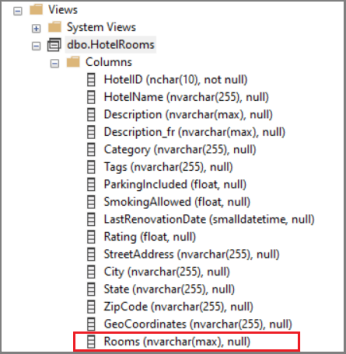
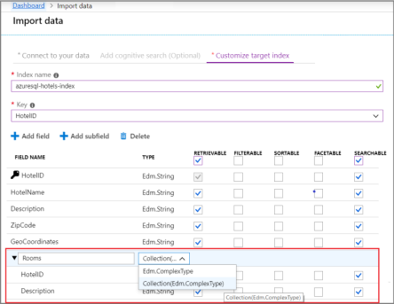

# How to model relational SQL data for import and indexing in Azure Search

Azure Search accepts a flat rowset as input to the [indexing pipeline](search-what-is-an-index.md). If your source data is structured, originating from joined tables in a SQL Server relational database, this article explains how to work with denormalized data, and how to model a one-to-many relationship in an Azure Search index.

As an illustration, we'll refer to the hotels demo data set, consisting of a Hotels$ table with 50 hotels, and a Rooms$ table with rooms of varying types, rates, and amenities, for a total of 750 rooms, with both tables in a one-to-many relationship. A view will provide the query that returns 50 rows, one row per hotel, with associated room information embedded into each row.

   


## The problem of denormalized data

One of the challenges in working with one-to-many relationships is that standard queries built on joined tables will return denormalized data, which doesn't work well in an Azure Search scenario. Consider the following example that joins hotels and rooms.

```sql
SELECT * FROM Hotels$
INNER JOIN Rooms$
ON Rooms$.HotelID = Hotels$.HotelID
```
Results from this query return all of the Hotel fields, followed by all Room fields, with preliminary hotel information repeating for each room value.

   


While this query succeeds in providing all of the data in a flat row set, it fails in delivering the right document structure for the expected search experience. During indexing, Azure Search will create one search document for each row ingested. If your search documents looked like the above results, you would have seven separate documents for the Twin Dome hotel, and a query on "hotels in Florida" would return seven results for just the Twin Dome hotel alone, pushing other relevant hotels deep into the search results.

To get the expected experience of one document per hotel, you should provide a rowset with all of the necessary data, but at the right granularity. Fortunately, you can do this easily by adopting the techniques in this article.

## Define a query that returns embedded JSON

To deliver the expected search experience, your data set should consist of one row for each search document in Azure Search. In our example, we want one row for each hotel, but we also want our users to be able to search on other room-related fields they care about, such as the nightly rate, size and number of beds, or a view of the beach, all of which are part of a room detail.

The solution is to capture the room information as a JSON collection, and then insert that collection into a field in a view. An in-field JSON collection provides the data in the JSON format required by Azure Search, but also preserves the context of rooms, which is its many-to-one relationship with the parent hotel. The view has a nested query that returns the Rooms$ fields as a Rooms object, and a **FOR JSON AUTO** clause that outputs the object in JSON.

1. Assume you have two joined tables, Hotels$ and Rooms$, that contain details for 50 hotels and 750 rooms, and are joined on the HotelID field. Individually, these tables contain 50 hotels and 750 related rooms.

    ```sql
    CREATE TABLE [dbo].[Hotels$](
      [HotelID] [nchar](10) NOT NULL,
      [HotelName] [nvarchar](255) NULL,
      [Description] [nvarchar](max) NULL,
      [Description_fr] [nvarchar](max) NULL,
      [Category] [nvarchar](255) NULL,
      [Tags] [nvarchar](255) NULL,
      [ParkingIncluded] [float] NULL,
      [SmokingAllowed] [float] NULL,
      [LastRenovationDate] [smalldatetime] NULL,
      [Rating] [float] NULL,
      [StreetAddress] [nvarchar](255) NULL,
      [City] [nvarchar](255) NULL,
      [State] [nvarchar](255) NULL,
      [ZipCode] [nvarchar](255) NULL,
      [GeoCoordinates] [nvarchar](255) NULL
    ) ON [PRIMARY] TEXTIMAGE_ON [PRIMARY]
    GO

    CREATE TABLE [dbo].[Rooms$](
      [HotelID] [nchar](10) NULL,
      [Description] [nvarchar](255) NULL,
      [Description_fr] [nvarchar](255) NULL,
      [Type] [nvarchar](255) NULL,
      [BaseRate] [float] NULL,
      [BedOptions] [nvarchar](255) NULL,
      [SleepsCount] [float] NULL,
      [SmokingAllowed] [float] NULL,
      [Tags] [nvarchar](255) NULL
    ) ON [PRIMARY]
    GO
    ```

2. Create a view composed of all fields in Hotels$, plus a new *Rooms* field built from the Rooms$ table. The *Rooms* data structure exists only in the HotelRooms view.

   ```sql
   CREATE VIEW [dbo].[HotelRooms]
   AS
   SELECT *, (SELECT *
              FROM dbo.Rooms$
              WHERE dbo.Rooms$.HotelID = dbo.Hotels$.HotelID FOR JSON AUTO) AS Rooms
   FROM dbo.Hotels$
   GO
   ```

   The following screenshot shows the view structure with the *Rooms* nvarchar field.

   

1. Run `SELECT * FROM dbo.HotelRooms` to retrieve the row set. This query returns 50 rows, one per hotel, with associated room information as a JSON collection. 

   

This rowset is now ready for import into Azure Search.

 ## Use a complex collection for the "many" side of a one-to-many relationship

On the Azure Search side, create an index schema that models the one-to-many relationship using nested JSON. 

The following example is from [How to model complex data types](search-howto-complex-data-types.md#creating-complex-fields). The *Rooms* structure, which has been the focus of this article, is in the fields collection of an index named *hotels*. This example also shows a complex type for *Address, which differs from *Rooms* in that it is composed of a fixed set of items, as opposed to the arbitrary number of items allowed in a collection.

```json
{
  "name": "hotels",
  "fields": [
    { "name": "HotelId", "type": "Edm.String", "key": true, "filterable": true },
    { "name": "HotelName", "type": "Edm.String", "searchable": true, "filterable": false },
    { "name": "Description", "type": "Edm.String", "searchable": true, "analyzer": "en.lucene" },
    { "name": "Address", "type": "Edm.ComplexType",
      "fields": [
        { "name": "StreetAddress", "type": "Edm.String", "filterable": false, "sortable": false, "facetable": false, "searchable": true },
        { "name": "City", "type": "Edm.String", "searchable": true, "filterable": true, "sortable": true, "facetable": true },
        { "name": "StateProvince", "type": "Edm.String", "searchable": true, "filterable": true, "sortable": true, "facetable": true }
      ]
    },
    { "name": "Rooms", "type": "Collection(Edm.ComplexType)",
      "fields": [
        { "name": "Description", "type": "Edm.String", "searchable": true, "analyzer": "en.lucene" },
        { "name": "Type", "type": "Edm.String", "searchable": true },
        { "name": "BaseRate", "type": "Edm.Double", "filterable": true, "facetable": true }
      ]
    }
  ]
}
```

## Next steps

You can use the Import data wizard to index a rowset similar to the one described in this article. The wizard detects the embedded JSON collection in *Rooms* and infers an index schema that provides the appropriate complex type collection. 

  

To complete the import and create a usable index, you would have to select the key and set attributes yourself. If you are unfamiliar with this wizard, try the following quickstart to learn the basic steps.

> [!div class="nextstepaction"]
> [Quickstart: Create a search index using Azure portal](search-get-started-portal.md)


<!-- 1. Use the following connection information to connect to the hotels demo database.

   ```sql
   Server=tcp:azs-playground.database.windows.net,1433;Initial Catalog=Hotels;Persist Security Info=False;User ID=findable;Password=azsRocks4U;MultipleActiveResultSets=False;Encrypt=True;TrustServerCertificate=False;Connection Timeout=30;
   ``` -->


<!-- ## About AdventureWorks

If you have a SQL Server instance, you might be familiar with the [AdventureWorks sample database](https://docs.microsoft.com/sql/samples/adventureworks-install-configure?view=sql-server-2017). Among the tables included in this database are five tables that expose product information.

+ **ProductModel**: name
+ **Product**: name, color, cost, size, weight, image, category (each row joins to a specific ProductModel)
+ **ProductDescription**: description
+ **ProductModelProductDescription**: locale (each row joins a ProductModel to a specific ProductDescription for a specific language)
+ **ProductCategory**: name, parent category

Combining all of this data into a flattened rowset that can be ingested into a search index is the objective of this example. 

## Considering our options

The naïve approach would be to index all rows from the Product table (joined where appropriate) since the Product table has the most specific information. However, that approach would expose the search index to perceived duplicates in a resultset. For example, the Road-650 model is available in two colors and six sizes. A query for "road bikes" would then be dominated by twelve instances of the same model, differentiated only by size and color. The other six road-specific models would all be relegated to the nether world of search: page two.

  
 
Notice that the Road-650 model has twelve options. One-to-many entity rows are best represented as multi-value fields or pre-aggregated-value fields in the search index.

Resolving this issue is not as simple as moving the target index to the ProductModel table. Doing so would ignore the important data in the Product table that should still be represented in search results.

## Use a Collection data type

The "correct approach" is to utilize a search-schema feature that does not have a direct parallel in the database model: **Collection(Edm.String)**. This construct is defined in the Azure Search index schema. A Collection data type is used when you need to represent a list of individual strings, rather than a very long (single) string. If you have tags or keywords, you would use a Collection data type for this field.

By defining multi-value index fields of **Collection(Edm.String)** for "color", "size", and "image", the ancillary information is retained for faceting and filtering without polluting the index with duplicate entries. Similarly, apply aggregate functions to the numeric Product fields, indexing **minListPrice** instead of every single product **listPrice**.

Given an index with these structures, a search for "mountain bikes" would show discrete bicycle models, while preserving important metadata like color, size, and lowest price. The following screenshot provides an illustration.

  

## Use script for data manipulation

Unfortunately, this type of modeling cannot be easily achieved through SQL statements alone. Instead, use a simple NodeJS script to load the data and then map it into search-friendly JSON entities.

The final database-search mapping looks like this:

+ model (Edm.String: searchable, filterable, retrievable) from "ProductModel.Name"
+ description_en (Edm.String: searchable) from "ProductDescription" for the model where culture=’en’
+ color (Collection(Edm.String): searchable, filterable, facetable, retrievable): unique values from "Product.Color" for the model
+ size (Collection(Edm.String): searchable, filterable, facetable, retrievable): unique values from "Product.Size" for the model
+ image (Collection(Edm.String): retrievable): unique values from "Product.ThumbnailPhoto" for the model
+ minStandardCost (Edm.Double: filterable, facetable, sortable, retrievable): aggregate minimum of all "Product.StandardCost" for the model
+ minListPrice (Edm.Double: filterable, facetable, sortable, retrievable): aggregate minimum of all "Product.ListPrice" for the model
+ minWeight (Edm.Double: filterable, facetable, sortable, retrievable): aggregate minimum of all "Product.Weight" for the model
+ products (Collection(Edm.String): searchable, filterable, retrievable): unique values from "Product.Name" for the model

After joining the ProductModel table with Product, and ProductDescription, use [lodash](https://lodash.com/) (or Linq in C#) to quickly transform the resultset:

```javascript
var records = queryYourDatabase();
var models = _(records)
  .groupBy('ModelName')
  .values()
  .map(function(d) {
    return {
      model: _.first(d).ModelName,
      description: _.first(d).Description,
      colors: _(d).pluck('Color').uniq().compact().value(),
      products: _(d).pluck('ProductName').uniq().compact().value(),
      sizes: _(d).pluck('Size').uniq().compact().value(),
      images: _(d).pluck('ThumbnailPhotoFilename').uniq().compact().value(),
      minStandardCost: _(d).pluck('StandardCost').min(),
      maxStandardCost: _(d).pluck('StandardCost').max(),
      minListPrice: _(d).pluck('ListPrice').min(),
      maxListPrice: _(d).pluck('ListPrice').max(),
      minWeight: _(d).pluck('Weight').min(),
      maxWeight: _(d).pluck('Weight').max(),
    };
  })
  .value();
```

The resulting JSON looks like this:

```json
[
  {
    "model": "HL Road Frame",
    "colors": [
      "Black",
      "Red"
    ],
    "products": [
      "HL Road Frame - Black, 58",
      "HL Road Frame - Red, 58",
      "HL Road Frame - Red, 62",
      "HL Road Frame - Red, 44",
      "HL Road Frame - Red, 48",
      "HL Road Frame - Red, 52",
      "HL Road Frame - Red, 56",
      "HL Road Frame - Black, 62",
      "HL Road Frame - Black, 44",
      "HL Road Frame - Black, 48",
      "HL Road Frame - Black, 52"
    ],
    "sizes": [
      "58",
      "62",
      "44",
      "48",
      "52",
      "56"
    ],
    "images": [
      "no_image_available_small.gif"
    ],
    "minStandardCost": 868.6342,
    "maxStandardCost": 1059.31,
    "minListPrice": 1431.5,
    "maxListPrice": 1431.5,
    "minWeight": 961.61,
    "maxWeight": 1043.26
  }
]
```

Finally, here is the SQL query to return the initial recordset. I used the [mssql](https://www.npmjs.com/package/mssql) npm module to load the data into my NodeJS app.

```T-SQL
SELECT
  m.Name as ModelName,
  d.Description,
  p.Name as ProductName,
  p.*
FROM 
  SalesLT.ProductModel m
INNER JOIN 
  SalesLT.ProductModelProductDescription md
  ON m.ProductModelId = md.ProductModelId
INNER JOIN 
  SalesLT.ProductDescription d
  ON md.ProductDescriptionId = d.ProductDescriptionId
LEFT JOIN 
  SalesLT.product p
  ON m.ProductModelId = p.ProductModelId
WHERE
  md.Culture='en'
``` -->

## Next steps

> [!div class="nextstepaction"]
> [Example: Multi-level facet taxonomies in Azure Search](search-example-adventureworks-multilevel-faceting.md)