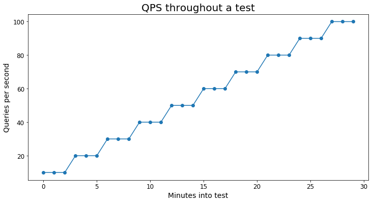
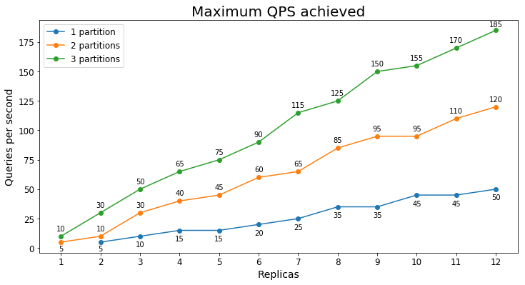
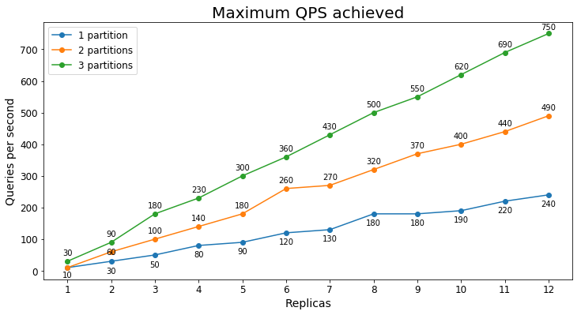
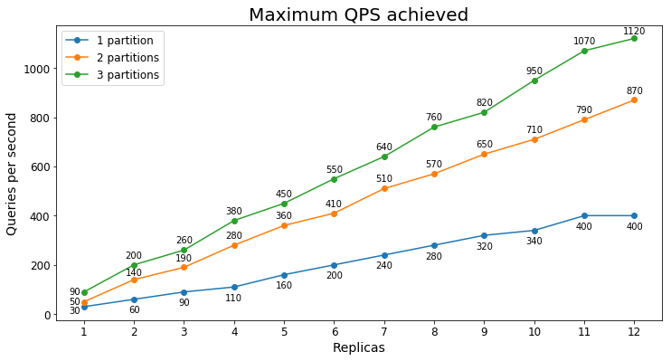

# Azure Cognitive Search performance benchmarks

Azure Cognitive Search's performance depends on a variety of factors including the size of your search service and the types of queries you're sending. In order to help estimate the size of search service needed for your workload, we've run several benchmarks to document the performance for different search services and configurations. These benchmarks in no way guarantee a certain level of performance from your service but can give you an idea of the level of performance you can expect.

To cover a range of different use cases we ran benchmarks for three main scenarios:

* **E-commerce search** - This benchmark emulates a real e-commerce scenario and is based on the nordic e-commerce company [CDON](https://cdon.com).
* **Document search** - This scenario is comprised of keyword search over full text documents representing typical document search.
* **Application search** - Simpler than the e-commerce scenario, this benchmark emulates searching over SQL or Cosmos DB data from within an application.

While these scenarios reflect different use cases, every scenario is different so we always recommend performance testing your individual workload. We've published a [performance testing solution using JMeter](https://github.com/Azure-Samples/azure-search-performance-testing) so you can run similar tests against your own service. You can follow this tutorial

## Testing methodology

To benchmark Azure Cognitive Search's performance, we ran tests for three different scenarios at a variety of SKUs and replica/partition combinations.

To create these benchmarks, the following methodolgy was used:

1. The test begins at `X` QPS (usually 5 or 10 QPS) for 180 seconds 
2. QPS then increased by `X` and ran for another 180 seconds
3. Every 180 seconds, the test increated by `X` QPS until average latency increased above 1000ms or less than 99% of queries succeeded.

The graph below gives a visual example of what the test's query load looks like:

Each scenario used at least 10,000 unique queries to avoid tests being overly skewed by caching.

Note that these tests only include query workloads so when planning you'll also need to consider how high your indexing load will be. 

### Definitions

- **Maximum QPS** -  the maximum QPS numbers below are based on the highest QPS achieved in a test where 99% of queries completed successfuly without throttling and average latency stayed under 1000ms.

- **Percentage of max QPS** - A percentage of the maximum QPS achieved for a particular test. For example, if a given test reached a maximum of 100 QPS, 20% of max QPS would be 20 QPS.

- **Latency** - The server's latency for a query; these numbers do not include [RTT](https://en.wikipedia.org/wiki/Round-trip_delay). Values below are in milliseconds (ms). 

### Disclaimer

The code we used to run these benchmarks is available [here]() (*link not yet available*). It's worth noting that we observed slightly lower QPS levels with the [JMeter performance testing solution](https://github.com/Azure-Samples/azure-search-performance-testing) than in the benchmarks below. The differences can be attributed to differences in the style of the tests. This speaks to the importance of making your performance tests as similar to your production workload as possible.

These benchmarks in no way guarantee a certain level of performance from your service but can give you an idea of the level of performance you can expect based on your scenario.

If you have any questions or concerns, please reach out to us at azuresearch_contact@microsoft.com.

## Benchmark 1: E-commerce search

This benchmark was created in partnership with the e-commerce company, [CDON](https://cdon.com), the Nordic region's largest online marketplace with operations in Sweden, Finland, Norway and Denmark. They offers a wide range assortment that includes over 8 millions of products. In 2019, CDON had over 100 million visitors and 2 million active customers.

To run these tests, we used a snapshot of CDON's production search index and thousands of unique queries from their [website](https://cdon.com).

### Scenario Details

- **Document Count**: 6,000,000 
- **Index Size**: 20 GB
- **Index Schema**: a wide index with 250 fields total, 25 searchable fields, and 200 facetable/filterable fields
- **Query Types**: full text search queries including facets, filters, ordering, and scoring profiles

### S1 Performance

#### Queries per second

The chart below shows the highest query load a service could handle for an extended period of time in terms of queries per second (QPS).

#### Query latency

Query latency varies based on the load of the service and services under higher stress will have a higher average query latency. The table below show the 25th, 50th, 75th, 90th, 95th, and 99th percentiles of query latency for three different usage levels.

| Percentage of max QPS  | Average latency | 25% | 75% | 90% | 95% | 99%|
|---|---|---|---| --- | --- | --- | 
| 20%  | 106ms  | 36ms  | 115ms   | 181ms | 273ms | 757ms |
| 50%  | 144ms  | 47ms  | 148ms   | 254ms | 412ms | 1200ms |
| 80%  | 259ms  | 82ms  | 263ms   | 505ms | 840ms | 2012ms | 

### S2 Performance

#### Queries per second

The chart below shows the highest query load a service could handle for an extended period of time in terms of queries per second (QPS).

#### Query latency

Query latency varies based on the load of the service and services under higher stress will have a higher average query latency. The table below show the 25th, 50th, 75th, 90th, 95th, and 99th percentiles of query latency for three different usage levels.

| Percentage of max QPS  | Average latency | 25% | 75% | 90% | 95% | 99%|
|---|---|---|---| --- | --- | --- | 
| 20%  | 56ms | 21ms | 68ms  | 106ms  | 132ms | 210ms | 
| 50%  | 71ms  | 26ms  | 83ms   | 132ms | 177ms | 329ms |
| 80%  | 140ms  | 47ms  | 153ms   | 293ms | 452ms | 924ms | 

### S3 Performance

#### Queries per second

The chart below shows the highest query load a service could handle for an extended period of time in terms of queries per second (QPS).

In this case, we see that adding a second partition signficantly increases the maximum QPS but adding a third partition provides diminishing marginal returns.

#### Query latency

Query latency varies based on the load of the service and services under higher stress will have a higher average query latency. The table below show the 25th, 50th, 75th, 90th, 95th, and 99th percentiles of query latency for three different usage levels.

| Percentage of max QPS  | Average latency | 25% | 75% | 90% | 95% | 99%|
|---|---|---|---| --- | --- | --- | 
| 20%  | 50ms  | 20ms  | 64ms   | 83ms | 98ms | 160ms |
| 50%  | 62ms  | 24ms  | 80ms   | 107ms | 130ms | 253ms |
| 80%  | 115ms  | 38ms  | 121ms   | 218ms | 352ms | 828ms | 

## Benchmark 2: Document search

### Scenario Details

- **Document Count**: 
- **Index Size**: 
- **Index Schema**: 
- **Query Types**: 

## Benchmark 3: Application search

### Scenario Details

- **Document Count**: 
- **Index Size**: 
- **Index Schema**: 
- **Query Types**: 