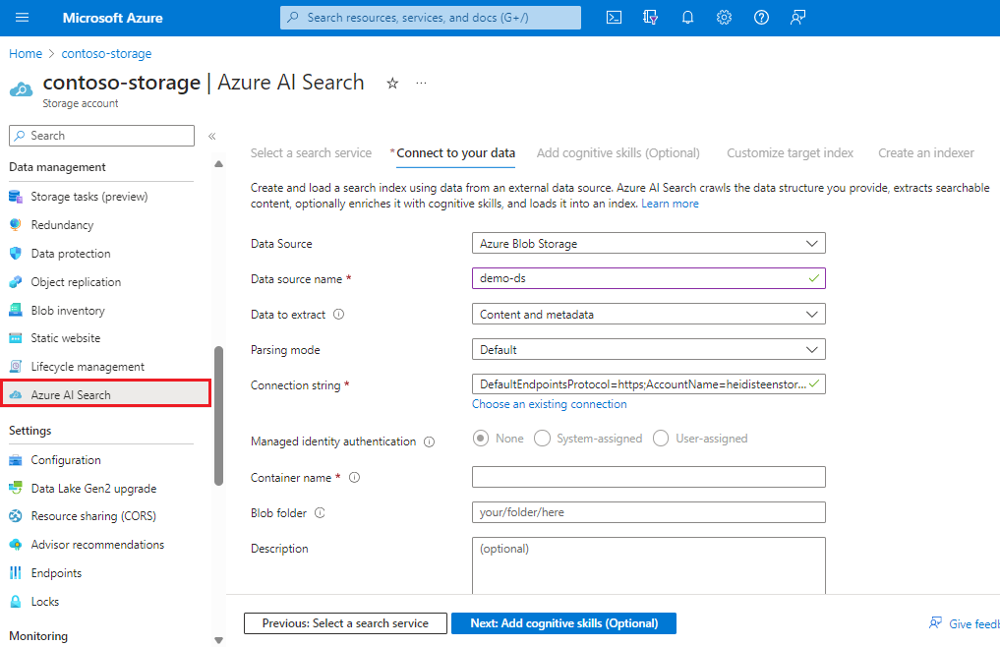

# Searching Blob storage with Azure Cognitive Search

Searching across the variety of content types stored in Azure Blob storage can be a difficult problem to solve. However, you can index and search the content of your Blobs in just a few clicks by using Azure Cognitive Search. Searching over Blob storage requires provisioning an Azure Cognitive Search service. The various service limits and pricing tiers of Azure Cognitive Search can be found on the [pricing page](https://aka.ms/azspricing).

## What is Azure Cognitive Search?
[Azure Cognitive Search](https://aka.ms/whatisazsearch) is a search service that makes it easy for developers to add robust full-text search  experiences to web and mobile applications. As a service, Azure Cognitive Search removes the need to manage any search infrastructure while offering a [99.9% uptime SLA](https://aka.ms/azuresearchsla).
=======
titleSuffix: Azure Search
description: Extract content and add structure to Azure blobs when building a full text search index in Azure Search.

manager: nitinme
author: HeidiSteen
ms.author: heidist
ms.service: search
ms.topic: conceptual
ms.date: 10/09/2019
---

# Add full text search to Azure blob data using Azure Search

Searching across the variety of content types stored in Azure Blob storage can be a difficult problem to solve. However, you can index and search the content of your Blobs in just a few clicks by using [Azure Search](search-what-is-azure-search.md). Azure Search has built-in integration for indexing out of Blob storage through a [*Blob indexer*](search-howto-indexing-azure-blob-storage.md) that adds data-source-aware capabilities to indexing.

## Supported content types
>>>>>>> 2f12c8e00edb5a57a01b6e5d8be77e35dca136da

By running a Blob indexer over a container, you can extract text and metadata from the following content types with a single query:

[!INCLUDE [search-blob-data-sources](../../includes/search-blob-data-sources.md)]

Optionally, you can attach [AI enrichment](search-blob-ai-integration.md) in the form of a *skillset* to create new information and structure from blobs, including text representations of image files. The addition of AI enrichment expands the content type list to include JPEG and PNG. It adds image processing skills such as [Optical Character Recognition (OCR)](cognitive-search-skill-ocr.md) and identification of [visual features](cognitive-search-skill-image-analysis.md) that make it possible to index the visual content found in each image.

## Search through your blob metadata
A common scenario that makes it easy to sort through blobs of any content type is to index both custom  metadata and system properties for each blob. In this way, information for all blobs is indexed regardless of document type, stored in an index on Azure Search. Using your new index, you can then proceed to sort, filter, and facet across all Blob storage content.

### Indexing JSON blobs
Azure Search can be configured to extract structured content found in blobs that contain JSON. Azure Search can read JSON blobs and parse the structured content into the appropriate fields of an Azure Search document. Azure Search can also take blobs that contain an array of JSON objects and map each element to a separate Azure Search document. You can set a parsing mode to affect the type of JSON object created by the indexer.

<<<<<<< HEAD
## Image search
Azure Cognitive Search’s full-text search, faceted navigation, and sorting capabilities can now be applied to the metadata of images stored in blobs.
=======
## How to get started
>>>>>>> 2f12c8e00edb5a57a01b6e5d8be77e35dca136da

You can start directly in your storage account portal page. Click **Add Azure Search** to launch a flow where you can select an existing Azure Search service or create a new service. If you create a new service, you are navigated out of your Storage account's portal experience. You can navigate back to the Storage portal page and re-select the **Add Azure Search** option, where you can select the existing service. 

<<<<<<< HEAD
## Index and search through JSON blobs
Azure Cognitive Search can be configured to extract structured content found in blobs that contain JSON. Azure Cognitive Search can read JSON blobs and parse the structured content into the appropriate fields of an Azure Cognitive Search document. Azure Cognitive Search can also take blobs that contain an array of JSON objects and map each element to a separate Azure Cognitive Search document.

JSON parsing is not currently configurable through the portal. [Learn more about JSON parsing in Azure Cognitive Search.](https://aka.ms/azsjsonblobindexing)

## Quick start
Azure Cognitive Search can be added to blobs directly from the Blob storage portal page.
=======

If you already have an existing search service in the same subscription, clicking **Add Azure Search** opens the Import data wizard so that you can immediately step through indexing, enrichment, and index definition.

You can also [create an Azure Search service](search-create-index-portal.md) and define Blob indexers that pull content from blob containers.
>>>>>>> 2f12c8e00edb5a57a01b6e5d8be77e35dca136da

The following quickstarts and tutorials use Blob data:

+ [Index semi-structured blobs using REST APIs](search-semi-structured-data.md)
+ [Create an AI enrichment pipeline in the portal](cognitive-search-quickstart-blob.md)
+ [Create an AI enrichment pipeline in C#](cognitive-search-tutorial-blob-dotnet.md)

<<<<<<< HEAD
Click **Add Azure Cognitive Search** to launch a flow where you can select an existing Azure Cognitive Search service or create a new service. If you create a new service, you are navigated out of your Storage account's portal experience. You can navigate back to the Storage portal page and re-select the **Add Azure Cognitive Search** option, where you can select the existing service.

## Next Steps
Learn more about the Azure Cognitive Search Blob Indexer in the full [documentation](https://aka.ms/azsblobindexer).
=======
## Next steps

> [!div class="nextstepaction"]
> [Set up a blob indexer](search-howto-indexing-azure-blob-storage.md) 
>>>>>>> 2f12c8e00edb5a57a01b6e5d8be77e35dca136da
