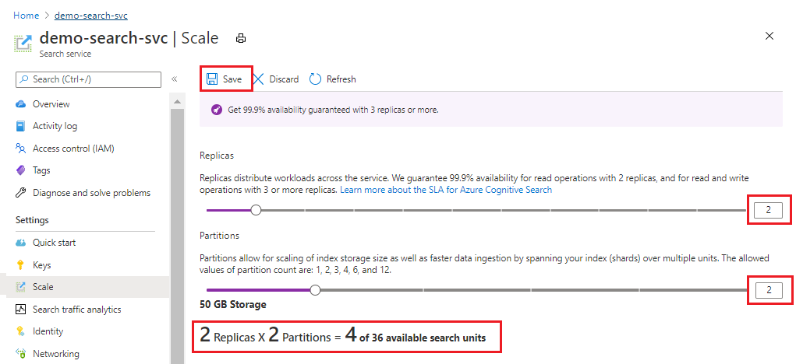
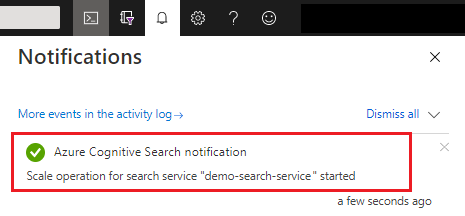

# Plan for capacity in Azure Cognitive Search

Before [provisioning a search service](search-create-service-portal.md) and locking in a specific pricing tier, take a few minutes to understand the role of replicas and partitions in a service, whether you need proportionally larger or faster partitions, and how you might configure the service for expected load.

Capacity is a function of the [tier you choose](search-sku-tier.md) (tiers determine hardware characteristics), and the replica and partition combination necessary for projected workloads. This article focuses on replica and partition combinations and interactions.

## Terminology: replicas and partitions

|||
|-|-|
|*Partitions* | Provides index storage and I/O for read/write operations (for example, when rebuilding or refreshing an index). Each partition has a share of the total index. If you allocate three partitions, your index is divided into thirds. |
|*Replicas* | Instances of the search service, used primarily to load balance query operations. Each replica is one copy of an index. If you allocate three replicas, you'll have three copies of an index available for servicing query requests.|

## How to allocate replicas and partitions

Initially, a service is allocated a minimal level of resources consisting of one partition and one replica. 

A single service must have sufficient resources to handle all workloads (indexing and queries). Neither workload runs in the background. You can schedule indexing for times when query requests are naturally less frequent, but the service will not otherwise prioritize one task over another.

When modifying the allocation of replicas and partitions, we recommend using the Azure portal. The portal enforces limits on allowable combinations that stay below maximum limits of a tier. However, if you require a script-based or code-based provisioning approach, the [Azure PowerShell](search-manage-powershell.md) or the [Management REST API](https://docs.microsoft.com/rest/api/searchmanagement/services) are alternative solutions.

As a general rule, search applications tend to need more replicas than partitions, particularly when the service operations are biased toward query workloads. The section on [high availability](#HA) explains why.

1. Sign in to the [Azure portal](https://portal.azure.com/) and select the search service.

1. In **Settings**, open the **Scale** page to modify replicas and partitions. 

   The following screenshot shows a standard service provisioned with one replica and partition. The formula at the bottom indicates how many search units are being used (1). If the unit price was $100 (not a real price), the monthly cost of running this service would be $100 on average.

   

1. Use the slider to increase or decrease the number of partitions. The formula at the bottom indicates how many search units are being used.

   This example doubles capacity, with two replicas and partitions each. Notice the search unit count; it is now four because the billing formula is replicas multiplied by partitions (2 x 2). Doubling capacity more than doubles the cost of running the service. If the search unit cost was $100, the new monthly bill would now be $400.

   For the current per unit costs of each tier, visit the [Pricing page](https://azure.microsoft.com/pricing/details/search/).

   

1. Click **Save** to confirm the changes.

   

   Changes in capacity take several hours to complete. You cannot cancel once the process has started and there is no real-time monitoring for replica and partition adjustments. However, the following message remains visible while changes are underway.

   

> [!NOTE]
> After a service is provisioned, it cannot be upgraded to a higher tier. You must create a search service at the new tier and reload your indexes. See [Create an Azure Cognitive Search service in the portal](search-create-service-portal.md) for help with service provisioning.
>
> Additionally, partitions and replicas are managed exclusively and internally by the service. There is no concept of processor affinity, or assigning a workload to a specific node.
>

## Partition and replica combinations

A Basic service can have exactly one partition and up to three replicas, for a maximum limit of three SUs. The only adjustable resource is replicas. You need a minimum of two replicas for high availability on queries.

All Standard and Storage Optimized search services can assume the following combinations of replicas and partitions, subject to the 36-SU limit. 

|   | **1 partition** | **2 partitions** | **3 partitions** | **4 partitions** | **6 partitions** | **12 partitions** |
| --- | --- | --- | --- | --- | --- | --- |
| **1 replica** |1 SU |2 SU |3 SU |4 SU |6 SU |12 SU |
| **2 replicas** |2 SU |4 SU |6 SU |8 SU |12 SU |24 SU |
| **3 replicas** |3 SU |6 SU |9 SU |12 SU |18 SU |36 SU |
| **4 replicas** |4 SU |8 SU |12 SU |16 SU |24 SU |N/A |
| **5 replicas** |5 SU |10 SU |15 SU |20 SU |30 SU |N/A |
| **6 replicas** |6 SU |12 SU |18 SU |24 SU |36 SU |N/A |
| **12 replicas** |12 SU |24 SU |36 SU |N/A |N/A |N/A |

SUs, pricing, and capacity are explained in detail on the Azure website. For more information, see [Pricing Details](https://azure.microsoft.com/pricing/details/search/).

> [!NOTE]
> The number of replicas and partitions divides evenly into 12 (specifically, 1, 2, 3, 4, 6, 12). This is because Azure Cognitive Search pre-divides each index into 12 shards so that it can be spread in equal portions across all partitions. For example, if your service has three partitions and you create an index, each partition will contain four shards of the index. How Azure Cognitive Search shards an index is an implementation detail, subject to change in future releases. Although the number is 12 today, you shouldn't expect that number to always be 12 in the future.
>

## High availability

Because it's easy and relatively fast to scale up, we generally recommend that you start with one partition and one or two replicas, and then scale up as query volumes build. Query workloads run primarily on replicas. If you need more throughput or high availability, you will probably require additional replicas.

General recommendations for high availability are:

* Two replicas for high availability of read-only workloads (queries)

* Three or more replicas for high availability of read/write workloads (queries plus indexing as individual documents are added, updated, or deleted)

Service level agreements (SLA) for Azure Cognitive Search are targeted at query operations and at index updates that consist of adding, updating, or deleting documents.

Basic tier tops out at one partition and three replicas. If you want the flexibility to immediately respond to fluctuations in demand for both indexing and query throughput, consider one of the Standard tiers.  If you find your storage requirements are growing much more rapidly than your query throughput, consider one of the Storage Optimized tiers.

## Disaster recovery

Currently, there is no built-in mechanism for disaster recovery. Adding partitions or replicas would be the wrong strategy for meeting disaster recovery objectives. The most common approach is to add redundancy at the service level by setting up a second search service in another region. As with availability during an index rebuild, the redirection or failover logic must come from your code.

## Estimate replicas

On a production service, you should allocate three replicas for SLA purposes. If you experience slow query performance, one remedy is to add replicas so that additional copies of the index are brought online to support bigger query workloads and to load balance the requests over the multiple replicas.

We do not provide guidelines on how many replicas are needed to accommodate query loads. Query performance depends on the complexity of the query and competing workloads. Although adding replicas clearly results in better performance, the result is not strictly linear: adding three replicas does not guarantee triple throughput.

For guidance in estimating QPS for your solution, see [Scale for performance](search-performance-optimization.md)and [Monitor queries](search-monitor-queries.md)

## Estimate partitions

The [tier you choose](search-sku-tier.md) determines partition size and speed, and each tier is optimized around a set of characteristics that fit various scenarios. If you choose a higher-end tier, you might need fewer partitions than if you go with S1.

Search applications that require near real-time data refresh will need proportionally more partitions than replicas. Adding partitions spreads read/write operations across a larger number of compute resources. It also gives you more disk space for storing additional indexes and documents.

Larger indexes take longer to query. As such, you might find that every incremental increase in partitions requires a smaller but proportional increase in replicas. The complexity of your queries and query volume will factor into how quickly query execution is turned around.

## Next steps

> [!div class="nextstepaction"]
> [Choose a pricing tier for Azure Cognitive Search](search-sku-tier.md)