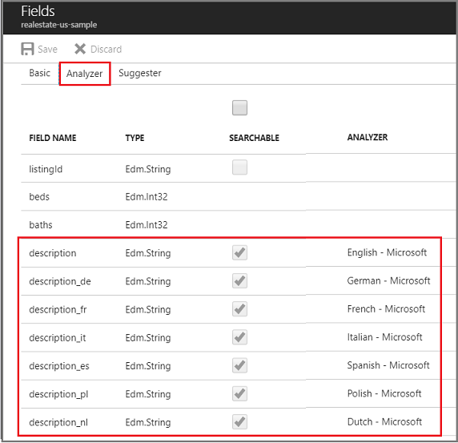

# How to filter by language  in Azure Search 

A key requirement in a multilingual search application is presenting retrievable results in the user's own language. In Azure Search, you can return translated strings from your index by using a combination of query parameters for search, along with selection of specific fields to show to the user.

| Parameters | Purpose |
|-----------|--------------|
| searchField | Limits full text search to the list of named fields. |
| $Select | Trims the response to include just the named fields. By default, all retrievable fields are returned. You cna use the $Select parameter to returns just the fields with translated strings. |

> [!Note]
> This approach is not technically a filter in that there is no $filter argument or OData expression. However, since the scenario is strongly affiliated with filter concepts, we present it as a filter use case.

## Field definitions for string translations

In Azure Search, queries target a single index. For this reason, we assume one index with fields for each set of translation strings. In our samples, including the [real-estate sample](search-get-started-portal.md) shown below, you might have seen field definitions similar to the following screenshot. 

This example shows the language analyzer assignments for the fields in this index. Fields that contain translated strings perform better in full text search when using an analyzer that has ben engineered to handle the linguistic rules of the target language.

  

> [!Note]
> For code examples showing field definitions with languages analyzers, see [Define an index (.NET)](https://docs.microsoft.com/azure/search/search-create-index-dotnet#define-your-azure-search-index) and [Define an index (REST)](https://docs.microsoft.com/azure/search/search-create-index-rest-api#define-your-azure-search-index-using-well-formed-json).

## Build and load an index

An intermediate (and perhaps obvious) step is that you have to [build and populate the index](https://docs.microsoft.com/azure/search/search-create-index-dotnet#create-the-index) on your Azure Search service as a prerequisite to submitting the query. We mention this step here for completeness. If you can see your index in the [Azure portal](https://portal.azure.com) and view the index definition, you can accept that as proof this step is complete.

## Scope queries and trim results

Assuming your application logic includes language detection and you are providing UI pages in a given language, use **searchFields** to target the query at fields containing strings in that language. To limit results to just the translated strings, use **Select**. As noted before, all fields marked as Retrievable are included in the response. Using the **Select** query parameter gives you control over which ones are returned to the calling application.

```csharp
parameters =
    new SearchParameters()
    {
        searchFields = "description_de" 
        Select = new[] { "description_de"  }
    };
```

## See also

+ [Filters in Azure Search](search-filters.md)
+ [Language analyzers](https://docs.microsoft.com/rest/api/searchservice/language-support)
+ [How full text search works in Azure Search](search-lucene-query-architecture.md)
+ [Search Documents REST API](https://docs.microsoft.com/rest/api/searchservice/search-documents)

