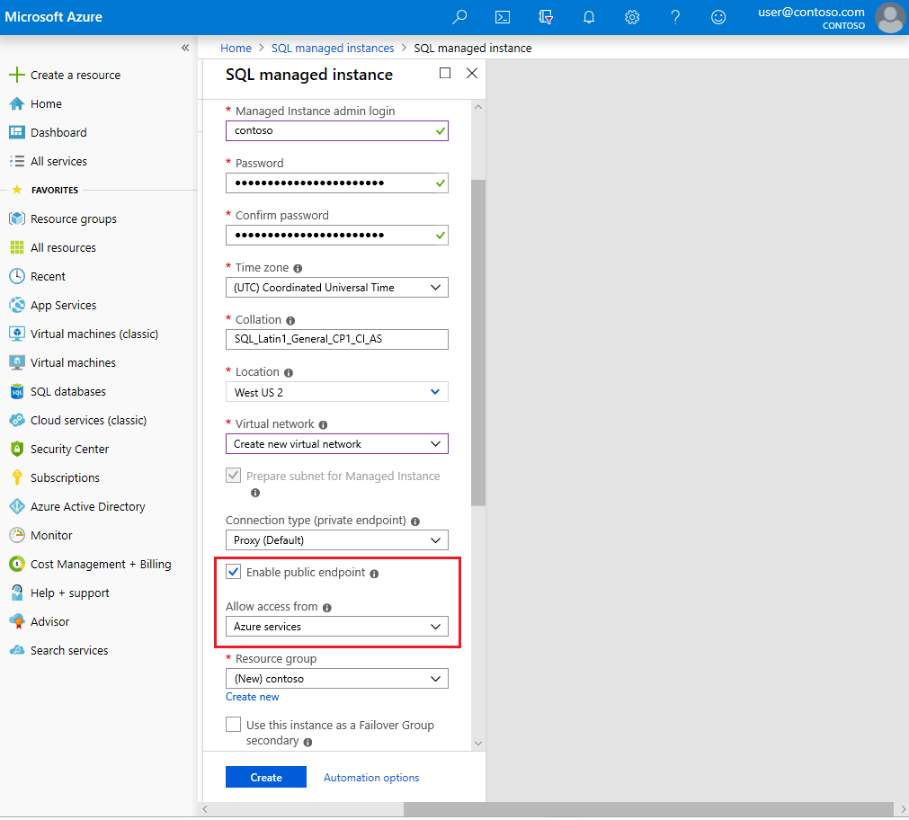
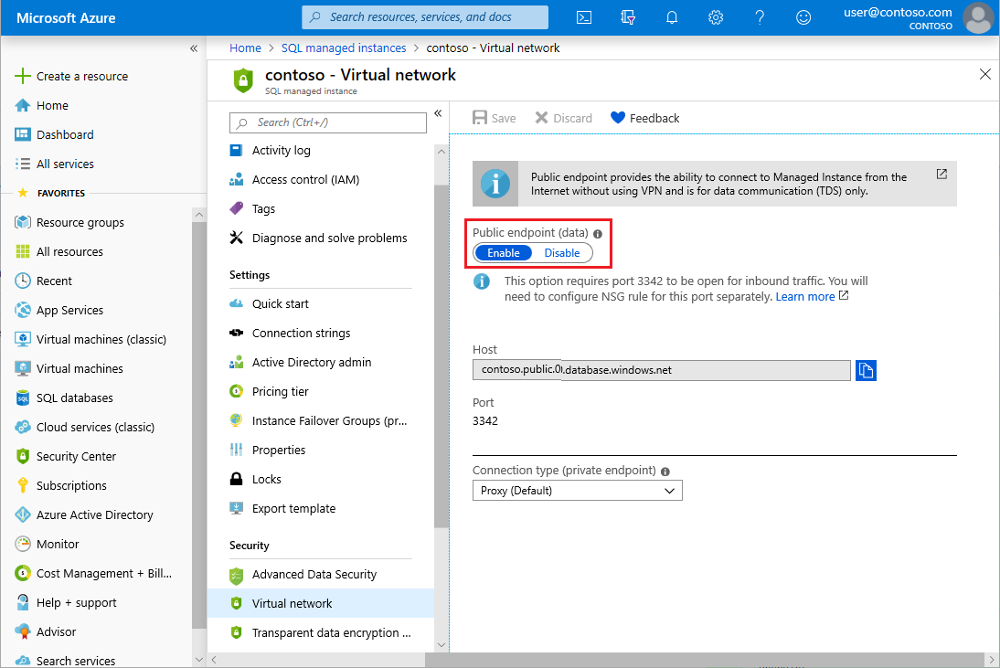
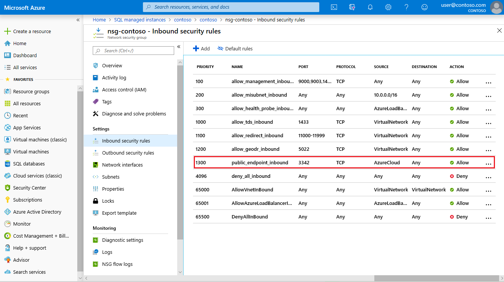

# Indexer connections to Azure SQL Managed Instance through a public endpoint

If you are setting up an Azure Cognitive Search indexer that connects to an Azure SQL managed instance, you will need to enable a public endpoint on the managed instance as a prerequisite. An indexer connects to a managed instance over a public endpoint.

## Enable a public endpoint

For a new SQL Managed Instance, create the resource with the **Enable public endpoint** option selected.

   

Alternatively, if the instance already exists, you can enable public endpoint on an existing SQL Managed Instance under **Security** > **Virtual network** > **Public endpoint** > **Enable**.

   

## Verify NSG rules

Check the Network Security Group has the correct **Inbound security rules** that allow connections from Azure services.

   

## Restrict inbound access to the endpoint

You can restrict inbound access to the public endpoint by replacing the current rule (`public_endpoint_inbound`) with the following two rules:

* Allowing inbound access from the `AzureCognitiveSearch` [service tag](../virtual-network/service-tags-overview.md#available-service-tags) ("SOURCE" = `AzureCognitiveSearch`, "NAME" = `cognitive_search_inbound`)

* Allowing inbound access from the IP address of the search service, which can be obtained by pinging its fully qualified domain name (eg., `<your-search-service-name>.search.windows.net`). ("SOURCE" = `IP address`, "NAME" = `search_service_inbound`)

For each rule, set "PORT" = `3342`, "PROTOCOL" = `TCP`, "DESTINATION" = `Any`, "ACTION" = `Allow`.

## Get public endpoint connection string

Copy the connection string to use in the search indexer's data source connection. Be sure to copy the connection string for the **public endpoint** (port 3342, not port 1433).

   

## Next steps

With configuration out of the way, you can now specify a [SQL Managed Instance as an indexer data source](search-howto-connecting-azure-sql-database-to-azure-search-using-indexers.md).