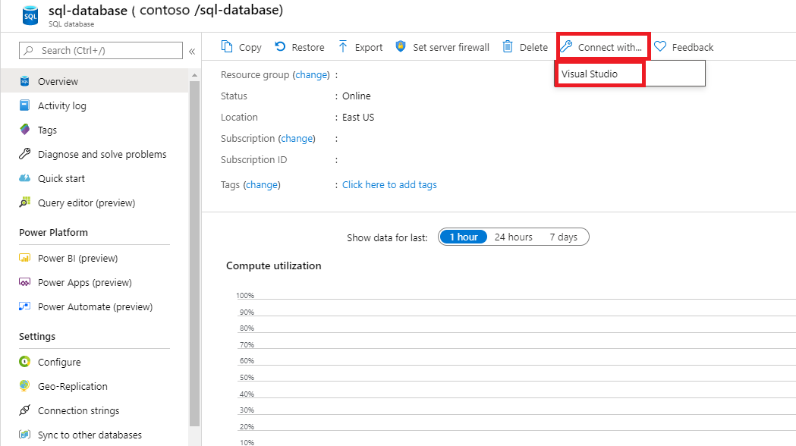
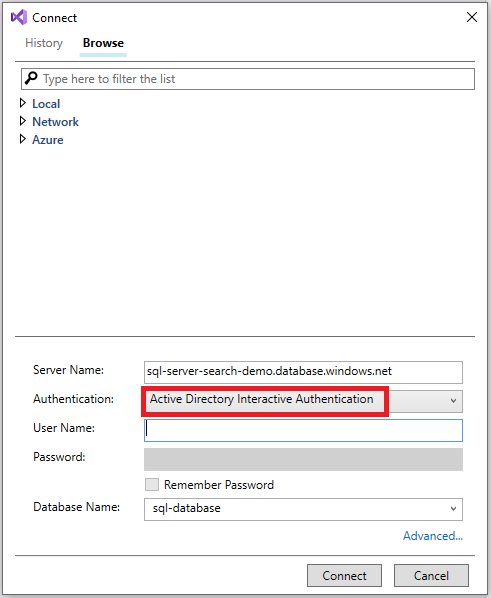
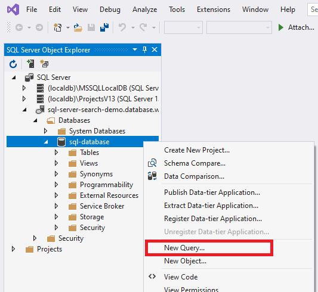

# Set up an indexer connection to Azure SQL Database using a managed identity

This page describes how to set up an indexer connection to Azure SQL Database using a managed identity instead of providing credentials in the data source object connection string.

You can use a system-assigned managed identity or a user-assigned managed identity (preview).

Before learning more about this feature, it is recommended that you have an understanding of what an indexer is and how to set up an indexer for your data source. More information can be found at the following links:

* [Indexer overview](search-indexer-overview.md)
* [Azure SQL indexer](search-howto-connecting-azure-sql-database-to-azure-search-using-indexers.md)

## 1 - Set up a managed identity

Set up the [managed identity](../active-directory/managed-identities-azure-resources/overview.md) using one of the following options.

### Option 1 - Turn on system-assigned managed identity

When a system-assigned managed identity is enabled, Azure creates an identity for your search service that can be used to authenticate to other Azure services within the same tenant and subscription. You can then use this identity in Azure role-based access control (Azure RBAC) assignments that allow access to data during indexing.


After selecting **Save** you will see an Object ID that has been assigned to your search service.


 
### Option 2 - Assign a user-assigned managed identity to the search service (preview)

If you don't already have a user-assigned managed identity created, you'll need to create one. A user-assigned managed identity is a resource on Azure.

1. Sign into the [Azure portal](https://portal.azure.com/).
1. Select **+ Create a resource**.
1. In the "Search services and marketplace" search bar, search for "User Assigned Managed Identity" and then select **Create**.
1. Give the identity a descriptive name.

Next, assign the user-assigned managed identity to the search service. This can be done using the [2021-04-01-preview management API](/rest/api/searchmanagement/2021-04-01-preview/services/create-or-update).

The identity property takes a type and one or more fully-qualified user-assigned identities:

* **type** is the type of identity. Valid values are "SystemAssigned", "UserAssigned", or "SystemAssigned, UserAssigned" if you want to use both. A value of "None" will clear any previously assigned identities from the search service.
* **userAssignedIdentities** includes the details of the user assigned managed identity.
    * User-assigned managed identity format: 
        * /subscriptions/**subscription ID**/resourcegroups/**resource group name**/providers/Microsoft.ManagedIdentity/userAssignedIdentities/**name of managed identity**

Example of how to assign a user-assigned managed identity to a search service:

```http
PUT https://management.azure.com/subscriptions/[subscription ID]/resourceGroups/[resource group name]/providers/Microsoft.Search/searchServices/[search service name]?api-version=2021-04-01-preview
Content-Type: application/json

{
  "location": "[region]",
  "sku": {
    "name": "[sku]"
  },
  "properties": {
    "replicaCount": [replica count],
    "partitionCount": [partition count],
    "hostingMode": "default"
  },
  "identity": {
    "type": "UserAssigned",
    "userAssignedIdentities": {
      "/subscriptions/[subscription ID]/resourcegroups/[resource group name]/providers/Microsoft.ManagedIdentity/userAssignedIdentities/[name of managed identity]": {}
    }
  }
} 
```

## 2 - Provision Azure Active Directory Admin for SQL Server

When connecting to the database in the next step, you will need to connect with an Azure Active Directory (Azure AD) account that has admin access to the database in order to give your search service permission to access the database.

Look at [Configure and manage Azure AD authentication with Azure SQL](../azure-sql/database/authentication-aad-configure.md?tabs=azure-powershell) to give your Azure AD account admin access to the database.

## 3 - Assign permissions to read the database

Follow the below steps to assign the search service or user-assigned managed identity permission to read the database.

1. Connect to Visual Studio

    

2. Authenticate with your Azure AD account

    

3. Execute the following commands:

    Include the brackets around your search service name or user-assigned managed identity name.
    
    ```
    CREATE USER [insert your search service name here or user-assigned managed identity name] FROM EXTERNAL PROVIDER;
    EXEC sp_addrolemember 'db_datareader', [insert your search service name here or user-assigned managed identity name];
    ```

    

    

>[!NOTE]
> If the search service identity or user-assigned identity from step 1 is changed after completing this step, then you must remove the role membership and remove the user in the SQL database, then add the permissions again by completing step 3 again.
> Removing the role membership and user can be accomplished by running the following commands:
> ```
> sp_droprolemember 'db_datareader', [insert your search service name or user-assigned managed identity name];
> DROP USER IF EXISTS [insert your search service name or user-assigned managed identity name];
> ```

## 4 - Add a role assignment

In this step you will give your Azure Cognitive Search service permission to read data from your SQL Server.

1. In the Azure portal navigate to your Azure SQL Server page.
2. Select **Access control (IAM)**
3. Select **Add** then **Add role assignment**

    

4. Select the appropriate **Reader** role.
5. Leave **Assign access to** as **Azure AD user, group or service principal**
6. If you're using a system-assigned managed identity, search for your search service, then select it. If you're using a user-assigned managed identity, search for the name of the user-assigned managed identity, then select it. Select **Save**.

    Example for Azure SQL using a system-assigned managed identity:

    

## 5 - Create the data source

Create the data source and provide either a system-assigned managed identity or a user-assigned managed identity (preview). Note that you are no longer using the Management REST API in the below steps.

### Option 1 - Create the data source with a system-assigned managed identity

The [REST API](/rest/api/searchservice/create-data-source), Azure portal, and the [.NET SDK](/dotnet/api/azure.search.documents.indexes.models.searchindexerdatasourceconnection) support system-assigned managed identity. Below is an example of how to create a data source to index data from an Azure SQL Database using the [REST API](/rest/api/searchservice/create-data-source) and a managed identity connection string. The managed identity connection string format is the same for the REST API, .NET SDK, and the Azure portal.

When creating a data source using the [REST API](/rest/api/searchservice/create-data-source), the data source must have the following required properties:

* **name** is the unique name of the data source within your search service.
* **type** is `azuresql`
* **credentials**
    * When using a managed identity to authenticate, the **credentials** format is different than when not using a manged identity. Here you will provide an Initial Catalog or Database name and a ResourceId that has no account key or password. The ResourceId must include the subscription ID of Azure SQL Database, the resource group of SQL Database, and the name of the SQL database. 
    * Managed identity connection string format:
        * *Initial Catalog|Database=**database name**;ResourceId=/subscriptions/**your subscription ID**/resourceGroups/**your resource group name**/providers/Microsoft.Sql/servers/**your SQL Server name**/;Connection Timeout=**connection timeout length**;*
* **container** specifies the name of the table or view that you would like to index.

Example of how to create an Azure SQL data source object using the [REST API](/rest/api/searchservice/create-data-source):

```
POST https://[service name].search.windows.net/datasources?api-version=2020-06-30
Content-Type: application/json
api-key: [admin key]

{
    "name" : "sql-datasource",
    "type" : "azuresql",
    "credentials" : { 
        "connectionString" : "Database=[SQL database name];ResourceId=/subscriptions/[subscription ID]/resourceGroups/[resource group name]/providers/Microsoft.Sql/servers/[SQL Server name];Connection Timeout=30;"
    },
    "container" : { 
        "name" : "my-table" 
    }
} 
```

### Option 2 - Create the data source with a user-assigned managed identity

The 2021-04-30-preview REST API support the user-assigned managed identity. Below is an example of how to create a data source to index data from a storage account using the [REST API](/rest/api/searchservice/create-data-source), a managed identity connection string, and the user-assigned managed identity.

The data source must have the following required properties:

* **name** is the unique name of the data source within your search service.
* **type** is `azuresql`
* **credentials**
    * When using a managed identity to authenticate, the **credentials** format is different than when not using a manged identity. Here you will provide an Initial Catalog or Database name and a ResourceId that has no account key or password. The ResourceId must include the subscription ID of Azure SQL Database, the resource group of SQL Database, and the name of the SQL database. 
    * Managed identity connection string format:
        * *Initial Catalog|Database=**database name**;ResourceId=/subscriptions/**your subscription ID**/resourceGroups/**your resource group name**/providers/Microsoft.Sql/servers/**your SQL Server name**/;Connection Timeout=**connection timeout length**;*
* **container** specifies the name of the table or view that you would like to index.
* **identity** contains the collection of user-assigned managed identities. Only one user-assigned managed identity should be provided when creating the data source.
    * **userAssignedIdentities** includes the details of the user assigned managed identity.
        * User-assigned managed identity format: 
            * /subscriptions/**subscription ID**/resourcegroups/**resource group name**/providers/Microsoft.ManagedIdentity/userAssignedIdentities/**name of managed identity**

Example of how to create a blob data source object using the [REST API](/rest/api/searchservice/create-data-source):

```http
POST https://[service name].search.windows.net/datasources?api-version=2021-04-30-preview
Content-Type: application/json
api-key: [admin key]

{
    "name" : "sql-datasource",
    "type" : "azuresql",
    "credentials" : { 
        "connectionString" : "Database=[SQL database name];ResourceId=/subscriptions/[subscription ID]/resourceGroups/[resource group name]/providers/Microsoft.Sql/servers/[SQL Server name];Connection Timeout=30;"
    },
    "container" : { 
        "name" : "my-table" 
    },
    "identity" : { 
        "@odata.type": "#Microsoft.Azure.Search.DataUserAssignedIdentity",
        "userAssignedIdentity" : "/subscriptions/[subscription ID]/resourcegroups/[resource group name]/providers/Microsoft.ManagedIdentity/userAssignedIdentities/[managed identity name]"
    }
}   
```

## 6 - Create the index

The index specifies the fields in a document, attributes, and other constructs that shape the search experience.

Here's how to create an index with a searchable `booktitle` field:   

```
POST https://[service name].search.windows.net/indexes?api-version=2020-06-30
Content-Type: application/json
api-key: [admin key]

{
    "name" : "my-target-index",
    "fields": [
        { "name": "id", "type": "Edm.String", "key": true, "searchable": false },
        { "name": "booktitle", "type": "Edm.String", "searchable": true, "filterable": false, "sortable": false, "facetable": false }
    ]
}
```

For more on creating indexes, see [Create Index](/rest/api/searchservice/create-index)

## 7 - Create the indexer

An indexer connects a data source with a target search index, and provides a schedule to automate the data refresh.

Once the index and data source have been created, you're ready to create the indexer.

Example indexer definition for an Azure SQL indexer:

```
POST https://[service name].search.windows.net/indexers?api-version=2020-06-30
Content-Type: application/json
api-key: [admin key]

{
    "name" : "sql-indexer",
    "dataSourceName" : "sql-datasource",
    "targetIndexName" : "my-target-index",
    "schedule" : { "interval" : "PT2H" }
}
```    

This indexer will run every two hours (schedule interval is set to "PT2H"). To run an indexer every 30 minutes, set the interval to "PT30M". The shortest supported interval is 5 minutes. The schedule is optional - if omitted, an indexer runs only once when it's created. However, you can run an indexer on-demand at any time.   

For more details on the Create Indexer API, check out [Create Indexer](/rest/api/searchservice/create-indexer).

For more information about defining indexer schedules see [How to schedule indexers for Azure Cognitive Search](search-howto-schedule-indexers.md).

## Troubleshooting

If you get an error when the indexer tries to connect to the data source that says that the client is not allowed to access the server, take a look at [common indexer errors](./search-indexer-troubleshooting.md).

## See also

Learn more about the Azure SQL indexer:
* [Azure SQL indexer](search-howto-connecting-azure-sql-database-to-azure-search-using-indexers.md)