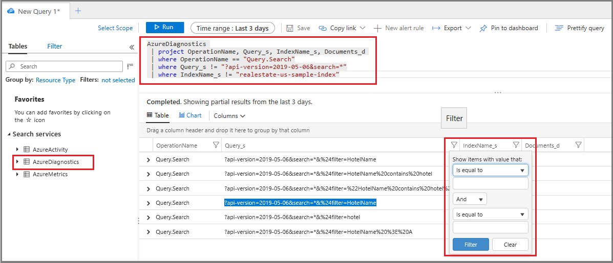
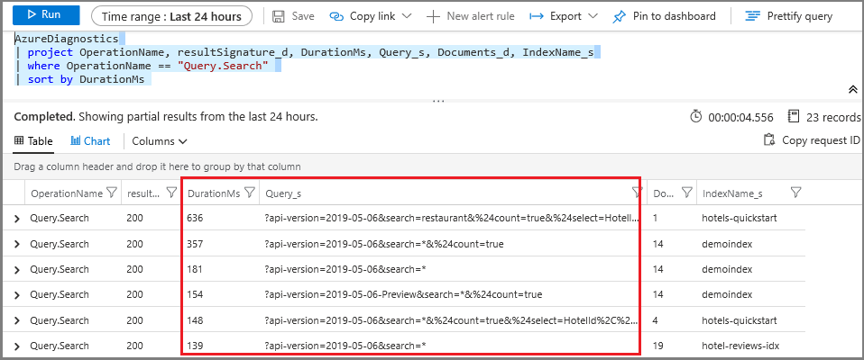

# Monitor query requests in Azure Cognitive Search

This article explains how to measure query performance and volume using metrics and resource logging. It also explains how to collect the input terms used in queries - necessary information when you need to assess the utility and effectiveness of your search corpus.

The Azure portal shows basic metrics about query latency, query load (QPS), and throttling. Historical data that feeds into these metrics is preserved for 30 days. For longer retention, or to report on operational data and query strings, you must enable a [diagnostic setting](search-monitor-logs.md) that specifies a storage option for persisting logged events and metrics.

Conditions that maximize the integrity of data measurement include:

+ Use a billable service (a service created at either the Basic or a Standard tier). The free service is shared by multiple subscribers, which introduces a certain amount of volatility as loads shift.

+ Use a single replica and partition, if possible, to create a contained and isolated environment. If you use multiple replicas, query metrics are averaged across multiple nodes, which can lower the precision of results. Similarly, multiple partitions mean that data is divided, with the potential that some partitions might have different data if indexing is also underway. When tuning query performance, a single node and partition gives a more stable environment for testing.

> [!Tip]
> With additional client-side code and Application Insights, you can also capture clickthrough data for deeper insight into what attracts the interest of your application users. For more information, see [Search traffic analytics](search-traffic-analytics.md).

## Query volume (QPS)

Volume is measured as **Search Queries Per Second** (QPS), a built-in metric that can be reported as an average, count, minimum, or maximum values of queries that execute within a one-minute window. One-minute intervals (TimeGrain = "PT1M") for metrics is fixed within the system.

It's common for queries to execute in milliseconds, so only queries that measure as seconds will appear in metrics.

| Aggregation Type | Description |
|------------------|-------------|
| Average | The average number of seconds within a minute during which query execution occurred.|
| Count | The number of metrics emitted to the log within the one-minute interval. |
| Maximum | The highest number of search queries per second registered during a minute. |
| Minimum | The lowest number of search queries per second registered during a minute.  |
| Sum | The sum of all queries executed within the minute.  |

For example, within one minute, you might have a pattern like this: one second of high load that is the maximum for SearchQueriesPerSecond, followed by 58 seconds of average load, and finally one second with only one query, which is the minimum.

Another example: if a node emits 100 metrics, where the value of each metric is 40, then "Count" is 100, "Sum" is 4000, "Average" is 40, and "Max" is 40.

## Query performance

Service-wide, query performance is measured as search latency (how long a query takes to complete) and throttled queries that were dropped as a result of resource contention.

### Search latency

| Aggregation Type | Latency | 
|------------------|---------|
| Average | Average query duration in milliseconds. | 
| Count | The number of metrics emitted to the log within the one-minute interval. |
| Maximum | Longest running query in the sample. | 
| Minimum | Shortest running query in the sample.  | 
| Total | Total execution time of all queries in the sample, executing within the interval (one minute).  |

Consider the following example of **Search Latency** metrics: 86 queries were sampled, with an average duration of 23.26 milliseconds. A minimum of 0 indicates some queries were dropped. The longest running query took 1000 milliseconds to complete. Total execution time was 2 seconds.


### Throttled queries

Throttled queries refers to queries that are dropped instead of process. In most cases, throttling is a normal part of running the service.  It is not necessarily an indication that there is something wrong.

Throttling occurs when the number of requests currently processed exceed the available resources. You might see an increase in throttled requests when a replica is taken out of rotation or during indexing. Both query and indexing requests are handled by the same set of resources.

The service determines whether to drop requests based on resource consumption. The percentage of resources consumed across memory, CPU, and disk IO are averaged over a period of time. If this percentage exceeds a threshold, all requests to the index are throttled until the volume of requests is reduced. 

Depending on your client, a throttled request can be indicated in these ways:

+ A service returns an error "You are sending too many requests. Please try again later." 
+ A service returns a 503 error code indicating the service is currently unavailable. 
+ If you are using the portal (for example, Search Explorer), the query is dropped silently and you will need to click Search again.

To confirm throttled queries, use **Throttled search queries** metric. You can explore metrics in the portal or create an alert metric as described in this article. For queries that were dropped within the sampling interval, use *Total* to get the percentage of queries that did not execute.

| Aggregation Type | Throttling |
|------------------|-----------|
| Average | Percentage of queries dropped within the interval. |
| Count | The number of metrics emitted to the log within the one-minute interval. |
| Maximum | Percentage of queries dropped within the interval.|
| Minimum | Percentage of queries dropped within the interval. |
| Total | Percentage of queries dropped within the interval. |

For **Throttled Search Queries Percentage**, minimum, maximum, average and total, all have the same value: the percentage of search queries that were throttled, from the total number of search queries during one minute.

In the following screenshot, the first number is the count (or number of metrics sent to the log). Additional aggregations, which appear at the top or when hovering over the metric, include average, maximum, and total. In this sample, no requests were dropped.


## Explore metrics in the portal

For a quick look at the current numbers, the **Monitoring** tab on the service Overview page shows three metrics (**Search latency**, **Search queries per second (per search unit)**, **Throttled Search Queries Percentage**) over fixed intervals measured in hours, days, and weeks, with the option of changing the aggregation type.

For deeper exploration, open metrics explorer from the **Monitoring** menu so that you can layer, zoom in, and visualize data to explore trends or anomalies. Learn more about metrics explorer by completing this [tutorial on creating a metrics chart](../azure-monitor/learn/tutorial-metrics-explorer.md).

1. Under the Monitoring section, select **Metrics** to open the metrics explorer with the scope set to your search service.

1. Under Metric, choose one from the dropdown list and review the list of available aggregations for a preferred type. The aggregation defines how the collected values will be sampled over each time interval.

   

1. In the top-right corner, set the time interval.

1. Choose a visualization. The default is a line chart.

1. Layer additional aggregations by choosing **Add metric** and selecting different aggregations.

1. Zoom into an area of interest on the line chart. Put the mouse pointer at the beginning of the area, click and hold the left mouse button, drag to the other side of area, and release the button. The chart will zoom in on that time range.

## Return query strings entered by users

When you enable resource logging, the system captures query requests in the **AzureDiagnostics** table. As a prerequisite, you must have already enabled [resource logging](search-monitor-logs.md), specifying a log analytics workspace or another storage option.

1. Under the Monitoring section, select **Logs** to open up an empty query window in Log Analytics.

1. Run the following expression to search Query.Search operations, returning a tabular result set consisting of the operation name, query string, the index queried, and the number of documents found. The last two statements exclude query strings consisting of an empty or unspecified search, over a sample index, which cuts down the noise in your results.

   ```kusto
      AzureDiagnostics
   | project OperationName, Query_s, IndexName_s, Documents_d
   | where OperationName == "Query.Search"
   | where Query_s != "?api-version=2020-06-30&search=*"
   | where IndexName_s != "realestate-us-sample-index"
   ```

1. Optionally, set a Column filter on *Query_s* to search over a specific syntax or string. For example, you could filter over *is equal to* `?api-version=2020-06-30&search=*&%24filter=HotelName`).

   

While this technique works for ad hoc investigation, building a report lets you consolidate and present the query strings in a layout more conducive to analysis.

## Identify long-running queries

Add the duration column to get the numbers for all queries, not just those that are picked up as a metric. Sorting this data shows you which queries take the longest to complete.

1. Under the Monitoring section, select **Logs** to query for log information.

1. Run the following basic query to return queries, sorted by duration in milliseconds. The longest-running queries are at the top.

   ```Kusto
   AzureDiagnostics
   | project OperationName, resultSignature_d, DurationMs, Query_s, Documents_d, IndexName_s
   | where OperationName == "Query.Search"
   | sort by DurationMs
   ```

   

<!-- 1. Advance to this more complex version if you want the full set of query operations, a time range, and other selection criteria.

   ```kusto
   let ['_startTime']=datetime('2021-01-26T22:28:00Z');
   let ['_endTime']=datetime('2021-01-26T22:28:00Z');
    
   AzureDiagnostics
   | where TimeGenerated between(['_startTime'] .. ['_endTime']) // Time range filtering
   | where OperationName in ("Query.Search", "Query.Suggest", "Query.Lookup", "Query.Autocomplete")
   | where DurationMs > 250
   | order by DurationMs desc 
   | take 100 -->
   ```

## Create a metric alert

A  metric alert establishes a threshold at which you will either receive a notification or trigger a corrective action that you define in advance. 

For a search service, it's common to create a metric alert for search latency and throttled queries. If you know when queries are dropped, you can look for remedies that reduce load or increase capacity. For example, if throttled queries increase during indexing, you could postpone it until query activity subsides.

When pushing the limits of a particular replica-partition configuration, setting up alerts for query volume thresholds (QPS) is also helpful.

1. Under the Monitoring section, select **Alerts** and then click **+ New alert rule**. Make sure your search service is selected as the resource.

1. Under Condition, click **Add**.

1. Configure signal logic. For signal type, choose **metrics** and then select the signal.

1. After selecting the signal, you can use a chart to visualize historical data for an informed decision on how to proceed with setting up conditions.

1. Next, scroll down to Alert logic. For proof-of-concept, you could specify an artificially low value for testing purposes.

   

1. Next, specify or create an Action Group. This is the response to invoke when the threshold is met. It might be a push notification or an automated response.

1. Last, specify Alert details. Name and describe the alert, assign a severity value, and specify whether to create the rule in an enabled or disabled state.

   

If you specified an email notification, you will receive an email from "Microsoft Azure" with a subject line of "Azure: Activated Severity: 3 `<your rule name>`".

## Next steps

If you haven't done so already, review the fundamentals of search service monitoring to learn about the full range of oversight capabilities.

> [!div class="nextstepaction"]
> [Monitor operations and activity in Azure Cognitive Search](search-monitor-usage.md)